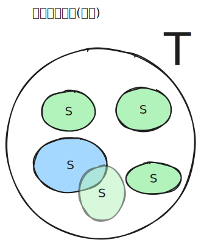
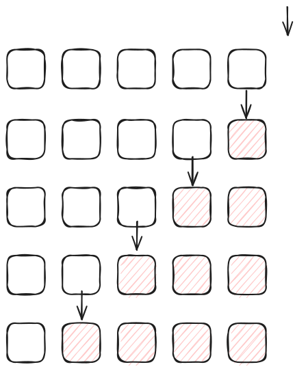
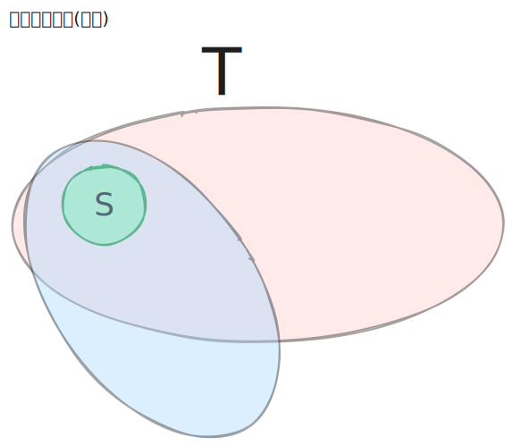

[[TOC]]


本质: 前缀和问题（在布尔格上统计子集贡献）。


## 统计子集

!!! definition 子集的定义

$S$ 是 $T$ 的子集，当且仅当 $S$ 中的所有元素都在 $T$ 中。

$$
S \subseteq T \iff \forall i \in S, i \in T
$$

- 子集的个数: $2^n$
- 人话 : $S$ 只能由 $T$ 中的元素构成，且 $S$ 中的元素个数不超过 $T$ 中的元素个数。


!!!



**SOS DP 的魔法在于：我们不一次性把所有位都变掉，而是一个比特一个比特地去允许变化。**

我们定义状态 $DP[i][mask]$：
表示我们在计算 $mask$ 的子集和，但是我们**只允许**子集的**前 $i$ 个比特**（第 $0$ 位到第 $i$ 位）与 $mask$ 不同（即可以是 $0$ 也可以是 $1$），而**剩余的比特**（第 $i+1$ 位到 $N-1$ 位）必须与 $mask$ **严格保持一致**。

#### 状态转移方程推导

考虑 $DP[i][mask]$，我们需要看第 $i$ 个比特（假设是最低位为第 0 位）：

1.  **情况 A：如果 $mask$ 的第 $i$ 位是 $0$**
    那么它的子集在这一位上**只能**是 $0$。这意味着第 $i$ 位的变化权利被“浪费”了（因为它本来就被限制为 0，变不变都得是 0）。
    所以，这等价于只允许前 $i-1$ 位变化的情况：
    $$DP[i][mask] = DP[i-1][mask]$$

2.  **情况 B：如果 $mask$ 的第 $i$ 位是 $1$**
    那么它的子集在这一位上可以是 $0$，也可以是 $1$。根据加法原理，我们将其拆分为两部分：

      * **取 $0$ 的部分**：这部分子集的第 $i$ 位固定为 $0$，其余高位与 $mask$ 相同，低位（$0$ 到 $i-1$）随意。这正好对应 $DP[i-1][mask \setminus \{2^i\}]$（即把 $mask$ 第 $i$ 位变为 0 后的那个状态）。
      * **取 $1$ 的部分**：这部分子集的第 $i$ 位固定为 $1$，其余高位与 $mask$ 相同，低位（$0$ 到 $i-1$）随意。这正好对应 $DP[i-1][mask]$。
      * 综上:
        $$DP[i][mask] = DP[i-1][mask] + DP[i-1][mask \oplus 2^i]$$




对应的题目: CF383E, CF165E

```cpp
vector<int> F(limit);
for (int i = 0; i < limit; ++i) {
    cin >> F[i];
}

// SOS DP 核心代码
// i 代表我们当前正在处理第 i 个比特位
for (int i = 0; i < n; ++i) {
    // 遍历所有的 mask
    for (int mask = 0; mask < limit; ++mask) {
        // 只有当 mask 的第 i 位是 1 时，才存在 "子集取 0" 和 "子集取 1" 的求和关系
        // 如果 mask 第 i 位是 0，它只能取 0，值就是上一轮的值，无需操作
        if (mask & (1 << i)) {
            // F[mask] 目前包含的是 "第 i 位取 1" 的子集和 (来自上一轮)
            // F[mask ^ (1 << i)] 包含的是 "第 i 位取 0" 的子集和
            F[mask] += F[mask ^ (1 << i)];
        }
    }
}

// 输出结果
// 此时 F[mask] 已经是 Sum over Subsets 了
for (int i = 0; i < limit; ++i) {
    cout << "Sum of subsets for mask " << i << ": " << F[i] << endl;
}

```

## 统计超集

!!! definition 超集的定义

$T$ 是 $S$ 的超集，当且仅当 $S$ 中的所有元素都在 $T$ 中。

$$
T \supseteq S \iff \forall i \in S, i \in T
$$

- 人话 : $T$ 必须包含 $S$ 中的所有元素，且 $T$ 中的元素个数不小于 $S$ 中的元素个数。
!!!




我们定义状态 $DP[i][mask]$：
表示我们在计算 $mask$ 的超集和，但是我们**只允许**子集的**前 $i$ 个比特**（第 $0$ 位到第 $i$ 位）与 $mask$ 不同（即可以是 $0$ 也可以是 $1$），而**剩余的比特**（第 $i+1$ 位到 $N-1$ 位）必须与 $mask$ **严格保持一致**。

#### 状态转移方程推导

考虑 $DP[i][mask]$，我们需要看第 $i$ 个比特（假设是最低位为第 0 位）：

1.  **情况 A：如果 $mask$ 的第 $i$ 位是 $1$**
    那么它的**超集**在这一位上**只能**是 $1$。这意味着第 $i$ 位的变化权利被“浪费”了（超集的第 $i$ 位置 一定也是 $1$）。
    所以，这等价于只允许前 $i-1$ 位变化的情况：
    $$DP[i][mask] = DP[i-1][mask]$$

2.  **情况 B：如果 $mask$ 的第 $i$ 位是 $0$**
    那么它的**超集**在这一位上可以是 $0$，也可以是 $1$。根据加法原理，我们将其拆分为两部分：

      * **取 $0$ 的部分**：这部分子集的第 $i$ 位固定为 $0$，其余高位与 $mask$ 相同，低位（$0$ 到 $i-1$）随意。这正好对应 $DP[i-1][mask]$（即把 $mask$ 第 $i$ 位保持 0 后的那个状态）。
      * **取 $1$ 的部分**：这部分子集的第 $i$ 位固定为 $1$，其余高位与 $mask$ 相同，低位（$0$ 到 $i-1$）随意。这正好对应 $DP[i-1][mask \cup \{2^i\}]$（即把 $mask$ 第 $i$ 位变成 1 后的那个状态）。
      * 综上:
        $$DP[i][mask] = DP[i-1][mask] + DP[i-1][mask \oplus 2^i]$$


举例子:

TODO


对应的题目: CF449D