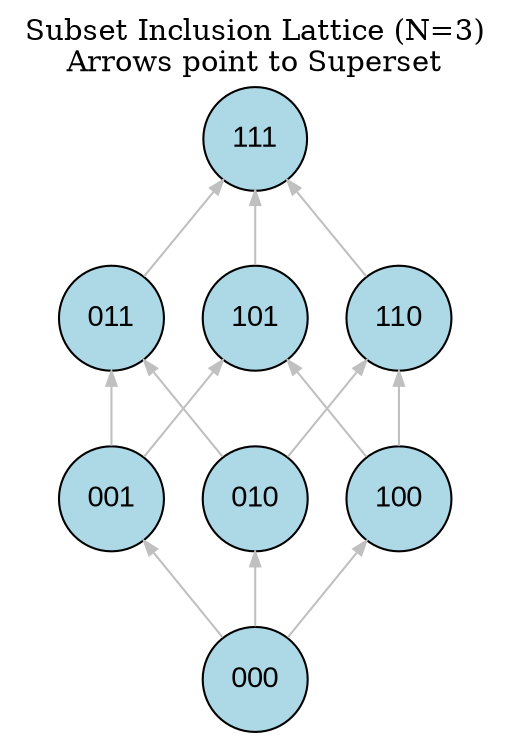
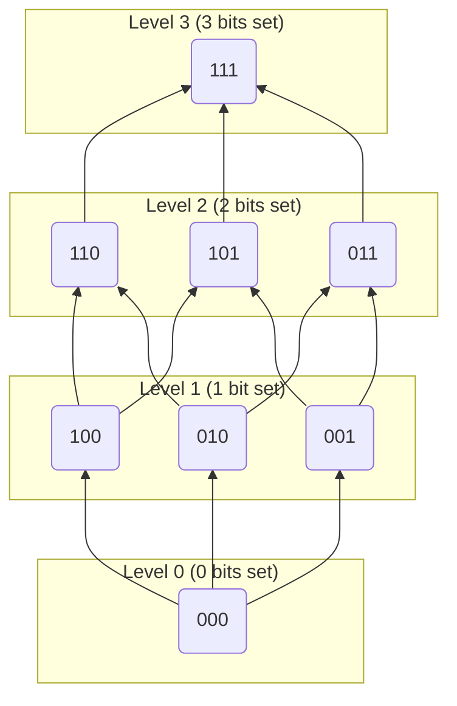
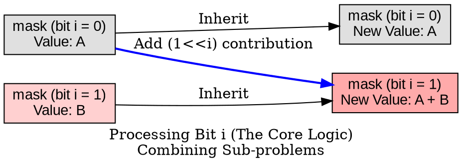
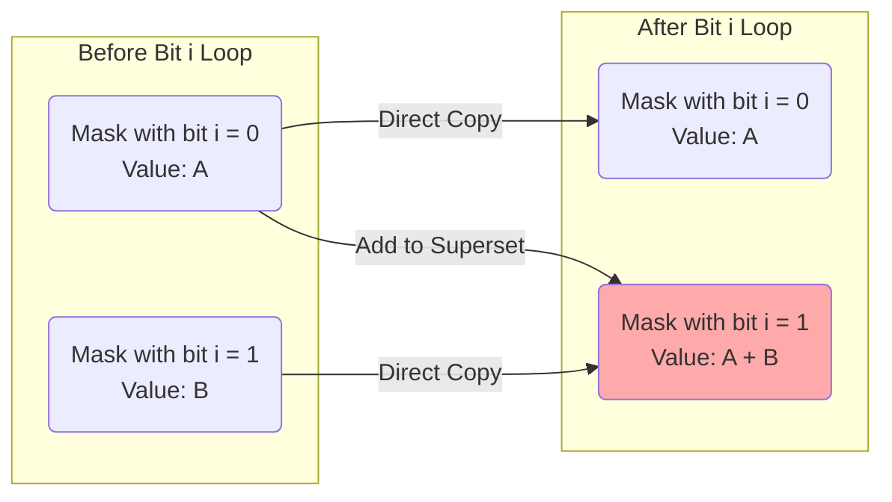
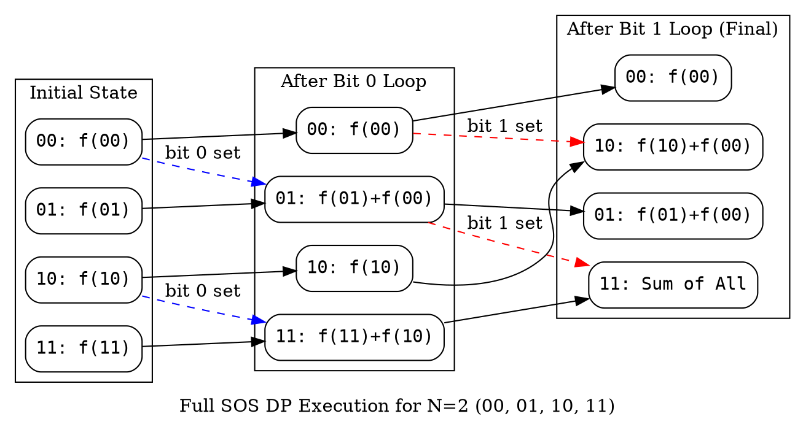
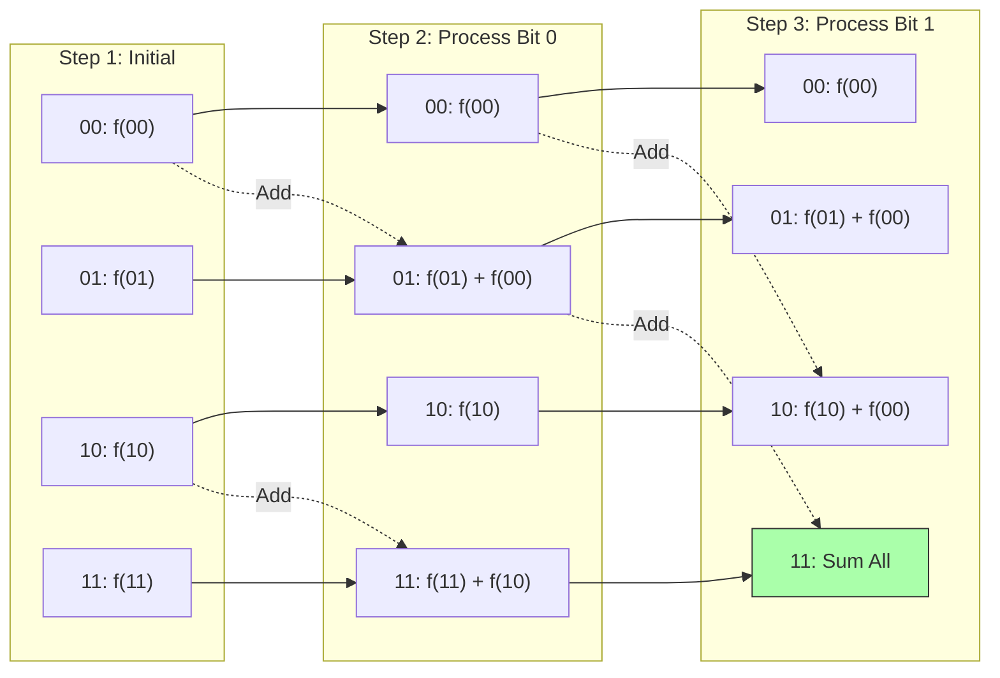

好的，作为你的老师，我将采用**层层递进**的方式教你 **SOS DP (Sum over Subsets DP)**。这个技巧在竞赛中非常有用，尤其是处理与子集相关的问题。由于你已学过离散数学，我们可以从抽象概念过渡到具体实现。

---

### **第一步：理解 SOS DP 的基本概念**
#### **1.1 SOS DP 是什么？**
SOS DP 解决的核心问题是：
> 给定一个数组 `f[0..(1<<N)-1]`，其中每个 `f[i]` 表示集合 `i` 的某个属性（例如权重、个数等）。
> 对于每一个子集 `i`，求出其所有子集的 `f` 值之和，即：
> $$ F[i] = \sum_{j \subseteq i} f[j] $$

如果直接暴力枚举每个 `i` 的所有子集 `j`，时间复杂度是 O(3^N)，这在 N 较大时无法接受。
SOS DP 将这个复杂度优化到 O(N × 2^N)。

---

#### **1.2 为什么需要 SOS DP？**
常见应用场景：
- 给定一个集合的权重，查询任意子集的所有子集的总权重（如 CF 165E）。
- 统计满足某种性质的子集数量（如子集的 AND/OR 值满足条件）。
- 处理数位 DP 或状压 DP 中的子集问题。

---

### **第二步：分治的视角理解 SOS DP**
#### **2.1 基础：枚举子集**
已知集合 `i`，其所有子集可以通过逐步减少被选中的元素来枚举。例如：
```python
for mask in range(1 << N):
    for subset in range(mask, -1, -1):
        subset = (subset - 1) & mask  # 关键技巧，枚举 mask 的所有子集
```
但这个过程的复杂度是 O(3^N)，优化需要更聪明的方法。

#### **2.2 SOS DP 的核心思想**
SOS DP 的核心是**动态规划 + 分治**：
- 定义 `dp[mask][i]` 表示 mask 中，**前 i 个二进制位**在子集中的 "贡献" 之和。
- 每个步骤聚焦于一个特定的二进制位，将 mask 分成两类：
  1. `mask` 中该位为 1：贪心地考虑该位是否被选中。
  2. 递归处理更低的位。

---

### **第三步：SOS DP 的递推公式**
#### **3.1 正向 SOS DP（子集和）**
定义 `F[mask]` 为所有子集的 `f[mask]` 之和：
$$ F[mask] = \sum_{sub \subseteq mask} f[sub] $$

递推过程：
1. 初始化 `F[mask] = f[mask]`。
2. 对于从 0 到 N-1 的每一位 `i`：
   - 对所有 `mask`，如果 `mask` 的第 `i` 位为 1，则更新：
     $$ F[mask] += F[mask \oplus (1 << i)] $$

**代码实现**：
```python
N = 20  # 通常 N 是元素数量的上限
F = [0] * (1 << N)  # 初始化
for mask in range(1 << N):
    F[mask] = f[mask]  # f 是原始数组

for i in range(N):
    for mask in range(1 << N):
        if mask & (1 << i):  # 如果 mask 的第 i 位为 1
            F[mask] += F[mask ^ (1 << i)]
```
时间复杂度：O(N × 2^N)。

#### **3.2 反向 SOS DP（超集和）**
定义 `F[mask]` 为所有超集的 `f[mask]` 之和：
$$ F[mask] = \sum_{sup \supseteq mask} f[sup] $$

递推过程：
1. 初始化 `F[mask] = f[mask]`。
2. 对于从 0 到 N-1 的每一位 `i`：
   - 对所有 `mask`，如果 `mask` 的第 `i` 位为 0，则更新：
     $$ F[mask] += F[mask \oplus (1 << i)] $$

**代码实现**：
```python
F = [0] * (1 << N)
for mask in range(1 << N):
    F[mask] = f[mask]

for i in range(N):
    for mask in range((1 << N) - 1, -1, -1):  # 需要倒序枚举
        if not (mask & (1 << i)):
            F[mask] += F[mask ^ (1 << i)]
```

---

### **第四步：应用例题**
#### **例题 1：子集求和 (CF 165E)**
题目：给定一个长度为 `n` 的数组 `a`，对于每个元素 `a[i]`，求是否存在数组中的另一个元素 `a[j]`，使得 `a[i] & a[j] == 0`。
如果存在，输出 `a[j]`，否则输出 `-1`。

**思路**：
1. 用一个 SOS DP 数组 `dp` 存储每个 mask 出现的次数（或任意满足 `val & mask == 0` 的值）。
2. 对于每个 `val`，查询满足 `val & mask == 0` 的最强 mask（即 mask 的补集包含 val 的所有位），从 SOS 中查找。

**核心代码**：
```python
dp = [0] * (1 << 22)  # 假设最大 22 位
for num in arr:
    dp[num] = num  # 存储 num 而不是计数

# SOS DP: 正向子集和
for i in range(22):
    for mask in range(1 << 22):
        if mask & (1 << i):
            dp[mask] = max(dp[mask], dp[mask ^ (1 << i)])

# 对于每个 val，查询 ~val 的补集是否有值
for val in arr:
    comp = (1 << 22) - 1 - val
    print(dp[comp] if dp[comp] else -1)
```

#### **例题 2：统计子集（AtCoder ABC152F）**
题目：给定一棵树的边集，求有多少方法选择子集 S，使得树的节点 1 到节点 n 的路径被 S 完全覆盖。

**思路**：
1. 对于 `1` 到 `n` 的路径 `P`，枚举边的子集。
2. 用 SOS DP 统计每个边集的覆盖路径信息。

---

### **第五步：总结与扩展**
#### **5.1 关键技巧**
- **正向 SOS DP**：通常用于查询子集的和（`j ⊆ i`）。
- **反向 SOS DP**：用于查询超集的和（`j ⊇ i`）。
- **枚举顺序**：正向 SOS 需顺序枚举，反向 SOS 需倒序枚举。

#### **5.2 扩展**
- **带权 SOS DP**：如果 `f[sub]` 需要乘以某个系数，可以用张量 SOS DP。
- **局限性**：SOS DP 处理的 mask 空间是 2^N，因此 N 通常不超过 20。

---

### **练习题推荐**
1. [CF 383E](https://codeforces.com/problemset/problem/383/E)（正向 SOS DP）
2. [CF 165E](https://codeforces.com/contest/165/problem/E)（反向 SOS DP）
3. [AtCoder ABC152F](https://atcoder.jp/contests/abc152/tasks/abc152_f)（路径覆盖统计）

---

### **你的任务**
现在，请尝试以下步骤：
1. 用 SOS DP 实现一个版本的 `F[mask] = sum_{j ⊆ mask} f[j]`。
2. 在 `f[j] = j` 时，观察输出，理解 SOS DP 的含义。
3. 尝试理解反向 SOS DP 与正向的区别。

有任何问题，请随时提问！


你好！我是你的助教。为了帮助你更直观地理解 **SOS DP (Sum over Subsets)**，我根据老师给出的解析，为你绘制了三组关键的图形。

SOS DP 的难点在于理解状态是如何通过二进制位“逐层”累加的。我们将通过可视化来拆解这个过程。

---

### 图形 1：理解子集结构 (Boolean Lattice)
**目的**：直观展示 $N=3$ 时，集合之间的包含关系。
**解析**：如果我们想求 `111` 的子集和，实际上就是求下图所有节点的值之和。暴力做法是遍历图中的所有路径，而 SOS DP 是通过特定顺序高效计算。

#### 1. Graphviz (Dot)


#### 2. Mermaid


---

### 图形 2：SOS DP 的核心转移逻辑 (单步迭代)
**目的**：解释代码 `if mask & (1 << i): F[mask] += F[mask ^ (1 << i)]` 发生了什么。
**解析**：
这是算法最核心的一步。假设我们正在处理 **第 `i` 位**。
- 如果一个数字的第 `i` 位是 `0`（例如 `...0...`），它不需要加上别人的值（在这个阶段）。
- 如果一个数字的第 `i` 位是 `1`（例如 `...1...`），它需要加上那个“把第 `i` 位变成 0”的兄弟节点的值。
- 这就像把立方体按维度压缩。

#### 1. Graphviz (Dot)


#### 2. Mermaid


---

### 图形 3：完整执行流程 (N=2 示例)
**目的**：演示当 $N=2$ 时，数据是如何流动的。
**解析**：
1. **初始状态**：每个 `F[mask]` 只有它自己 `f[mask]`。
2. **i=0 (处理第0位)**：`00` 加到 `01` 上，`10` 加到 `11` 上。
3. **i=1 (处理第1位)**：`00` 加到 `10` 上；此时 `01`（已包含 `00+01`）加到 `11` 上。
4. **结果**：`F[11]` 最终包含了 `f[00]+f[01]+f[10]+f[11]`。

#### 1. Graphviz (Dot)


#### 2. Mermaid


这三个图形分别从**集合论视角**（图1）、**微观代码逻辑视角**（图2）和**宏观数据流视角**（图3）展示了 SOS DP 的工作原理。希望这些图能辅助你理解老师的文字解析！