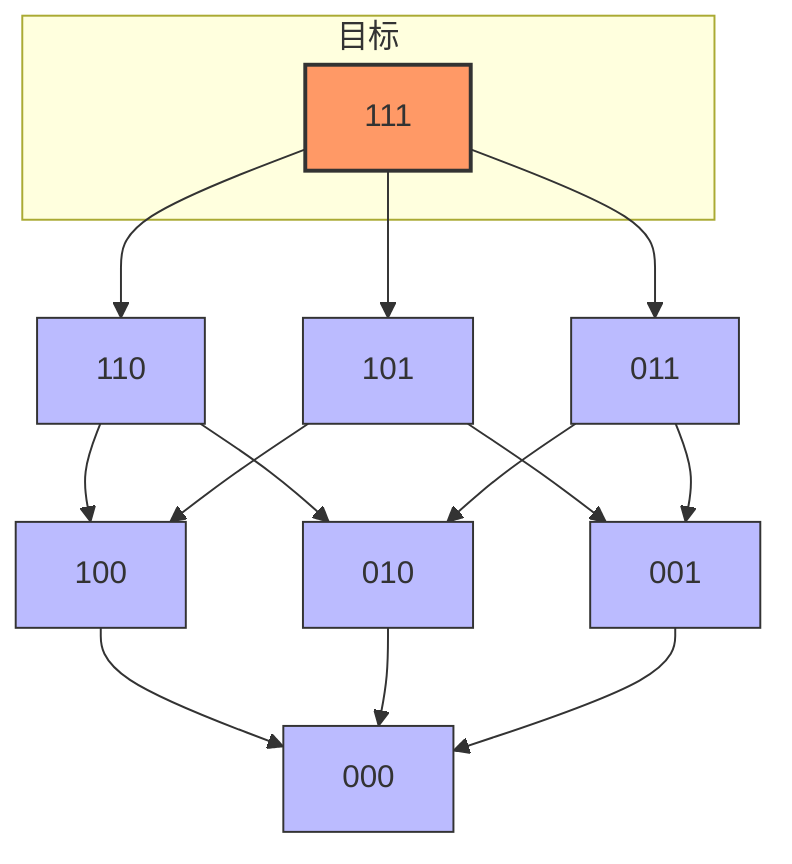
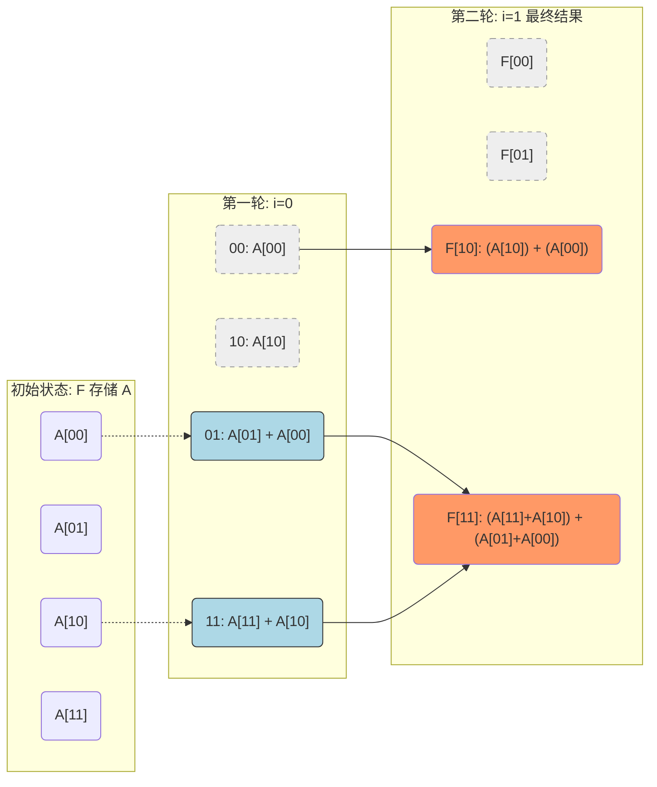
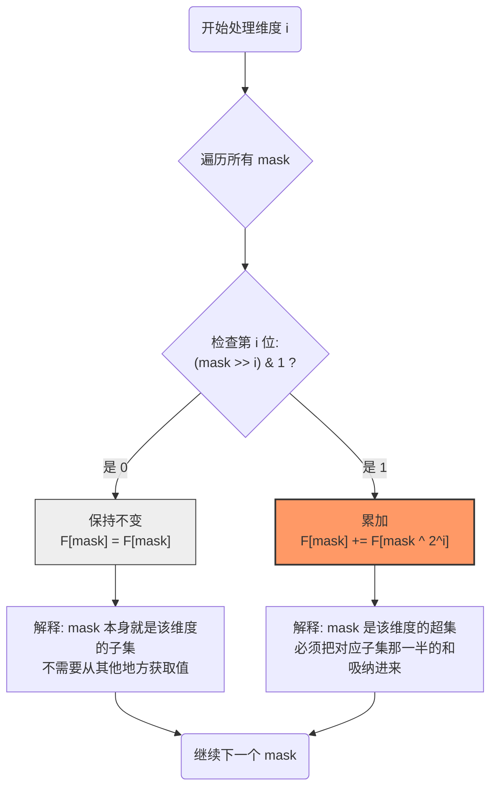
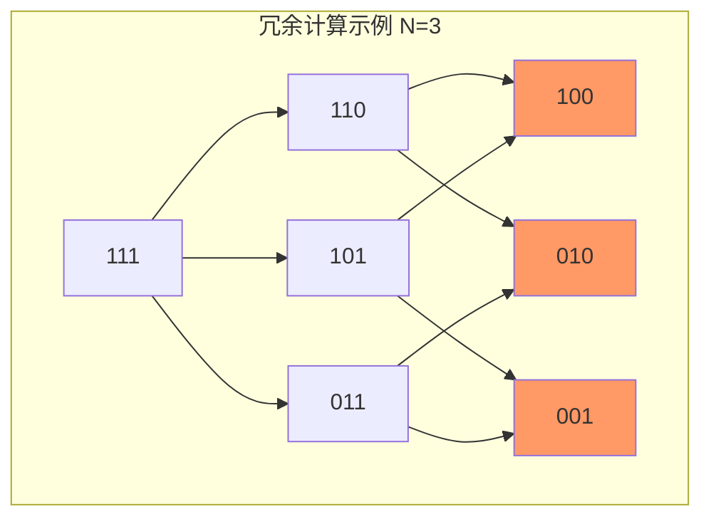
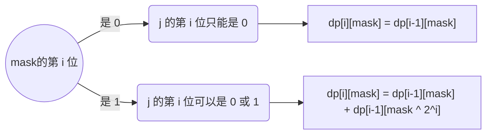
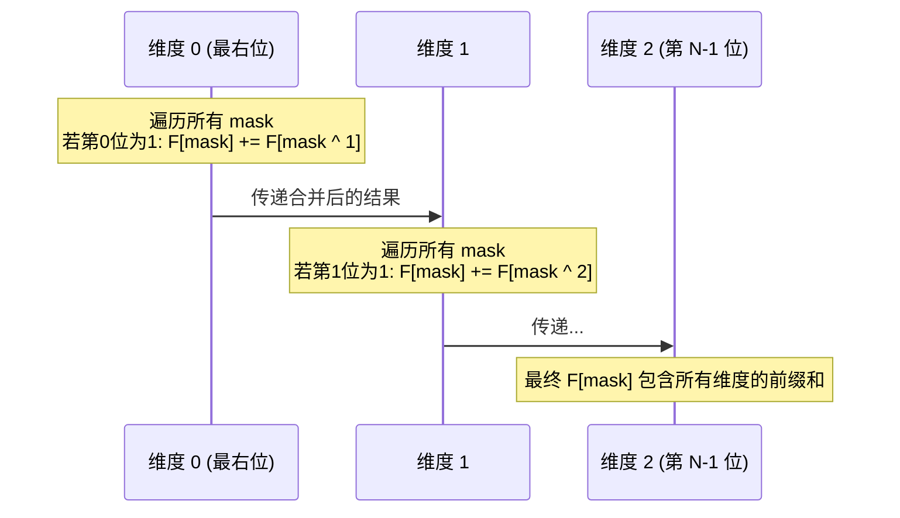

# You Asked:

我在codeforce 上写代码, 我想要学习SOS DP ,你作为一个老师, 使用层层递进的方式教会我(我会离散数学)

# Gemini Responded:

很高兴看到像你这样对算法有深入追求的 Codeforces 选手。既然你熟悉**离散数学**（特别是集合论和布尔代数）以及**基础动态规划**，我们就可以跳过简单的背景铺垫，直接从\*\*布尔格（Boolean Lattice）\*\*的结构切入。

SOS DP（Sum Over Subsets Dynamic Programming）的核心在于解决一类特定的**集合覆盖求和**问题。通常情况下，我们处理这类问题的时间复杂度是 $O(3^N)$，而 SOS DP 能将其优化到 $O(N \cdot 2^N)$。

我们将分四个层级来攻克它。

-----

### 第一层：问题定义的数学抽象

假设我们要解决的问题如下：

给定一个长度为 $2^N$ 的数组 $A$（下标从 $0$ 到 $2^N - 1$）。我们需要计算另一个数组 $F$，其中 $F[mask]$ 的定义为：所有是 $mask$ **子集** 的下标 $i$ 对应的 $A[i]$ 之和。

用集合论的语言描述：
$$F[mask] = \sum_{i \subseteq mask} A[i]$$

在计算机中，我们用二进制位操作来表示集合关系：
$i \subseteq mask \iff (i \ \& \ mask) == i$

### 第二层：暴力解法的瓶颈

利用你的离散数学直觉，首先会想到两种直观的解法：

1.  **完全暴力法**：
    遍历所有的掩码 $mask$，再遍历所有可能的 $i$ 检查是否为子集。

      * 复杂度：$O(2^N \cdot 2^N) = O(4^N)$。这在 $N=20$ 时显然不可接受。

2.  **子集遍历优化**：
    你可能知道在 CP 中有一个经典的技巧遍历子集：`for (int s=m; s; s=(s-1)&m)`。
    利用这个技巧，我们只遍历有效的子集。

      * 复杂度：这是一个二项式展开求和 $\sum_{k=0}^{N} \binom{N}{k} 2^k = (1+2)^N = 3^N$。
      * 当 $N=20$ 时，$3^{20} \approx 3.5 \times 10^9$，通常也会 TLE（Codeforces 一般限制 $10^8$ 左右的操作数）。

**瓶颈在哪里？**
这两种方法都存在大量的**重复计算**。
比如计算 $F[1101_2]$ 和 $F[1001_2]$ 时，它们都包含了 $A[1000_2]$、$A[0001_2]$ 等公共子集。$O(3^N)$ 的算法完全忽略了这种重叠结构。

-----

### 第三层：利用状态空间结构（SOS DP 的核心）

为了利用重叠结构，我们需要重新定义 DP 状态。

在离散数学中，所有 $N$ 位的二进制数构成了一个 $N$ 维的**超立方体（Hypercube）**。如果是 $1$ 维（0, 1），就是一条线；$2$ 维（00, 01, 10, 11）是一个正方形，以此类推。

**SOS DP 的魔法在于：我们不一次性把所有位都变掉，而是一个比特一个比特地去允许变化。**

我们定义状态 $DP[i][mask]$：
表示我们在计算 $mask$ 的子集和，但是我们**只允许**子集的**前 $i$ 个比特**（第 $0$ 位到第 $i$ 位）与 $mask$ 不同（即可以是 $0$ 也可以是 $1$），而**剩余的比特**（第 $i+1$ 位到 $N-1$ 位）必须与 $mask$ **严格保持一致**。

#### 状态转移方程推导

考虑 $DP[i][mask]$，我们需要看第 $i$ 个比特（假设是最低位为第 0 位）：

1.  **情况 A：如果 $mask$ 的第 $i$ 位是 $0$**
    那么它的子集在这一位上**只能**是 $0$。这意味着第 $i$ 位的变化权利被“浪费”了（因为它本来就被限制为 0，变不变都得是 0）。
    所以，这等价于只允许前 $i-1$ 位变化的情况：
    $$DP[i][mask] = DP[i-1][mask]$$

2.  **情况 B：如果 $mask$ 的第 $i$ 位是 $1$**
    那么它的子集在这一位上可以是 $0$，也可以是 $1$。根据加法原理，我们将其拆分为两部分：

      * **取 $0$ 的部分**：这部分子集的第 $i$ 位固定为 $0$，其余高位与 $mask$ 相同，低位（$0$ 到 $i-1$）随意。这正好对应 $DP[i-1][mask \setminus \{2^i\}]$（即把 $mask$ 第 $i$ 位变为 0 后的那个状态）。
      * **取 $1$ 的部分**：这部分子集的第 $i$ 位固定为 $1$，其余高位与 $mask$ 相同，低位（$0$ 到 $i-1$）随意。这正好对应 $DP[i-1][mask]$。
        $$DP[i][mask] = DP[i-1][mask] + DP[i-1][mask \oplus 2^i]$$

-----

### 第四层：代码实现与空间优化

如果我们直接开二维数组 $DP[N][2^N]$，空间复杂度是 $O(N \cdot 2^N)$，可能会 MLE。
观察方程发现，$DP[i]$ 只依赖于 $DP[i-1]$。就像**0/1 背包问题**一样，我们可以使用滚动数组或者直接在原数组上迭代来优化掉第一维。

由于我们是从 $i=0$ 到 $N-1$ 依次放开限制，我们可以直接在 $F$ 数组上迭代。

#### C++ 实现（Codeforces 风格）

```cpp
#include <iostream>
#include <vector>

using namespace std;

const int MAXN = 20; // 假设 N 最大为 20

int main() {
    // 假设 F 数组初始存储的是 A[i]
    // 也就是只允许前 -1 位变化（都不许变）的情况
    int n; 
    cin >> n; // 比特位数
    int limit = 1 << n;
    
    vector<int> F(limit);
    for (int i = 0; i < limit; ++i) {
        cin >> F[i];
    }

    // SOS DP 核心代码
    // i 代表我们当前正在处理第 i 个比特位
    for (int i = 0; i < n; ++i) {
        // 遍历所有的 mask
        for (int mask = 0; mask < limit; ++mask) {
            // 只有当 mask 的第 i 位是 1 时，才存在 "子集取 0" 和 "子集取 1" 的求和关系
            // 如果 mask 第 i 位是 0，它只能取 0，值就是上一轮的值，无需操作
            if (mask & (1 << i)) {
                // F[mask] 目前包含的是 "第 i 位取 1" 的子集和 (来自上一轮)
                // F[mask ^ (1 << i)] 包含的是 "第 i 位取 0" 的子集和
                F[mask] += F[mask ^ (1 << i)];
            }
        }
    }

    // 输出结果
    // 此时 F[mask] 已经是 Sum over Subsets 了
    for (int i = 0; i < limit; ++i) {
        cout << "Sum of subsets for mask " << i << ": " << F[i] << endl;
    }

    return 0;
}
```

#### 复杂度分析

  * **外层循环**：遍历 $N$ 个比特位 ($0$ 到 $N-1$)。
  * **内层循环**：遍历 $2^N$ 个掩码。
  * **总复杂度**：$O(N \cdot 2^N)$。

当 $N=20$ 时，$20 \times 10^6 \approx 2 \times 10^7$，这在 Codeforces 上跑进 1 秒是轻轻松松的。

-----

### 进阶思考（留给你的作业）

既然你擅长 C++ 和算法，试着思考一下 SOS DP 的逆过程：
**高维前缀和的逆运算（Inverse SOS DP）**。

如果给了你计算好的 $F[mask]$（子集和），让你还原出原始的 $A[mask]$，代码该怎么改？
*(提示：利用容斥原理，或者直接观察 $A+B=C \implies A = C-B$ 的逆操作)*

你可以先在脑海里模拟一下这个过程，这对理解高维空间的容斥原理非常有帮助。如果你想确认答案，随时可以问我。

---

# You Asked:

来一些 mermaid 图片, 辅助我理解

# Gemini Responded:

好极了。对于很多通过图形思维理解算法的人来说，SOS DP 的过程其实就是**在高维超立方体上进行维度扫描**。

既然你熟悉离散数学，最适合你的可视化方式是**布尔格（Boolean Lattice）和分层传导**。

这里有三张图，分别从**结构**、**过程**和**原理**三个角度帮助你理解。

-----

### 图 1：结构视角 —— $N=3$ 的布尔格 (Boolean Lattice)

首先，我们要明确我们在求什么。对于 $N=3$（即 $000$ 到 $111$），所有的子集关系构成了一个立方体。

在 SOS DP 中，计算 $F[111]$ 意味着要把**所有箭头指向它**（直接或间接）的节点值加起来。



**离散数学视角：**
暴力做法相当于对每个节点，都去遍历其下方的整个子图。
SOS DP 的做法相当于：**不要每次重新遍历**，而是利用中间节点的计算结果。

-----

### 图 2：核心过程 —— 维度的逐层累加 (最重要的一张图)

这是 SOS DP 的灵魂。我们以 $N=2$ 为例（只有 00, 01, 10, 11）。
看我们是如何通过两次迭代（$i=0$ 和 $i=1$），把 $A[00]$ 的值一步步“传导”给 $F[11]$ 的。

**注意观察 `01` 节点在第一轮变成了什么，然后它又是如何在第二轮被利用的。**



**图解说明：**

1.  **第一轮 ($i=0$)**：所有的**横向**（最低位变化）合并完成了。`01` 此时已经吸收了 `00` 的能量。
2.  **第二轮 ($i=1$)**：所有的**纵向**（次低位变化）合并。
3.  **关键点**：当计算 `11` 时，我们加上了 `01` 节点的值。注意！此时 `01` 节点里**已经**包含了 `A[00] + A[01]`。
      * 我们不需要单独去加 `A[00]`。
      * 这就是为什么它避免了重复计算，把 $3^N$ 降到了 $2^N$。

-----

### 图 3：代码逻辑流 —— 为什么要做 `if (mask & (1<<i))`

这段代码逻辑其实就是一个**选择性过滤器**。对于当前处理的维度 $i$，我们将状态空间一分为二。



### 总结给 Codeforces 选手的你

  * **图 1** 告诉你：我们在图上求和。
  * **图 2** 告诉你：我们不是在一个点一个点地爬，而是**切片式**地合并。先合并所有“左右”相邻的，再合并所有“上下”相邻的，最后合并所有“前后”相邻的（对于三维）。
  * **数学本质**：这实际上是\*\*张量积（Tensor Product）\*\*在算法上的体现。我们在每一个维度上分别做变换，最终组合成整体的变换。

现在配合着代码和这些图，是不是对 `F[mask] += F[mask ^ (1<<i)]` 这一行有了更物理的实感？

---

# You Asked:

你从新来教会我SOS DP, 使用 mermaid 穿插

# Gemini Responded:

既然你活跃在 Codeforces，且具备**离散数学**功底，那我们直接绕开表象，从**高维空间前缀和**的本质入手。

SOS DP (Sum Over Subsets) 的本质是将一个 $N$ 维的超立方体求和问题，分解为 $N$ 个一维前缀和的组合。

-----

## 第一阶段：问题的数学本质

给定数组 $A$，我们要计算：
$$F[mask] = \sum_{i \subseteq mask} A[i]$$

在离散数学中，这实际上是在**布尔格 (Boolean Lattice)** 上做偏序关系的求和。

### 为什么 $O(3^N)$ 遍历子集不够快？

通常我们遍历子集会用：`for(int s=m; s; s=(s-1)&m)`。
这个过程在 $N=20$ 时大约需要 $3.5 \times 10^9$ 次运算，在 CF 常见的 1s 或 2s 时限下极易 TLE。



> **痛点**：如上图，计算 `111` 的时候，`100`、`010`、`001` 这些项被重复加了多次。我们需要一种方式，让底层的贡献“一次性”向上层传递。

-----

## 第二阶段：定义状态——分维度扫描

SOS DP 的精髓在于定义一个中间状态 $dp[i][mask]$：

  * **$mask$**：当前的集合状态。
  * **$i$**：考虑前 $i$ 位（从 $0$ 到 $N-1$）。
  * **含义**：$dp[i][mask]$ 表示所有满足以下条件的 $j$ 的 $A[j]$ 之和：
    1.  在第 $i+1$ 位到 $N-1$ 位上，$j$ 与 $mask$ **完全一致**。
    2.  在第 $0$ 位到 $i$ 位上，$j$ 是 $mask$ 的**子集**。

### 递推逻辑的 Mermaid 演示

当我们要从 $dp[i-1]$ 推导到 $dp[i]$ 时，我们只关注 **第 $i$ 位**：



-----

## 第三阶段：空间压缩与代码实现

由于 $dp[i]$ 只依赖于 $dp[i-1]$，我们可以像优化背包问题一样，直接在原数组 $F$ 上进行操作。

### 算法流程可视化

想象一个 $2^N$ 的线性数组。我们进行 $N$ 轮迭代，每轮处理一个比特位：



### C++ 实现

```cpp
// 假设 f[mask] 初始值为 A[mask]
for (int i = 0; i < n; ++i) { // 依次放开第 i 位的限制
    for (int mask = 0; mask < (1 << n); ++mask) {
        if (mask & (1 << i)) {
            // 如果当前位是 1，则它可以包含“当前位是 0”的子集贡献
            f[mask] += f[mask ^ (1 << i)];
        }
    }
}
```

-----

## 第四阶段：更广阔的视野——Inverse SOS DP

既然你会离散数学，你一定想到了：如果这是“高维前缀和”，那有没有“高维差分”？
当我们已知 $F[mask]$，想求原数组 $A[mask]$ 时，只需要把加法变减法：

```cpp
for (int i = 0; i < n; ++i) {
    for (int mask = 0; mask < (1 << n); ++mask) {
        if (mask & (1 << i)) {
            f[mask] -= f[mask ^ (1 << i)];
        }
    }
}
```

### 总结对比

| 维度         | 普通前缀和 (1D)        | SOS DP (ND)                     |
| :----------- | :--------------------- | :------------------------------ |
| **基础操作** | `f[i] = f[i-1] + a[i]` | 沿 $N$ 个正交轴分别做 1D 前缀和 |
| **复杂度**   | $O(N)$                 | $O(N \cdot 2^N)$                |
| **数学结构** | 线性序                 | 布尔格 (超立方体)               |

-----

### 下一步建议

SOS DP 不仅可以求和，还可以求**最大值、最小值、甚至位运算卷积**。

在 Codeforces 中，很多题目会将 SOS DP 隐藏在“计算满足 $a_i \ \& \ a_j = 0$ 的对数”这类问题中。

**你想尝试写一个利用 SOS DP 解决 “计算数组中互补对（AND 为 0）数量” 的具体题目思路吗？**

---