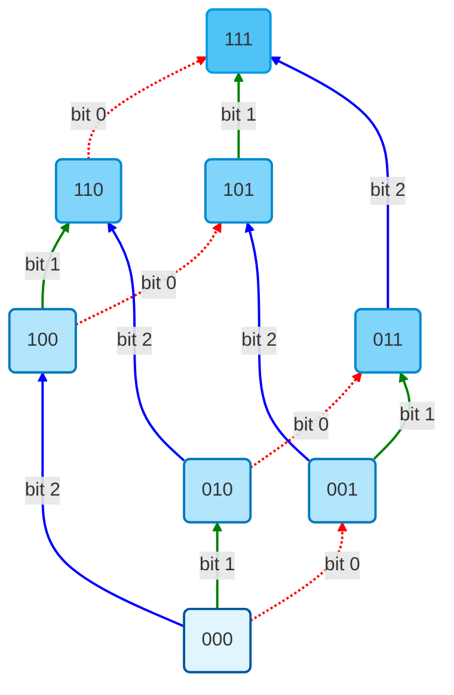
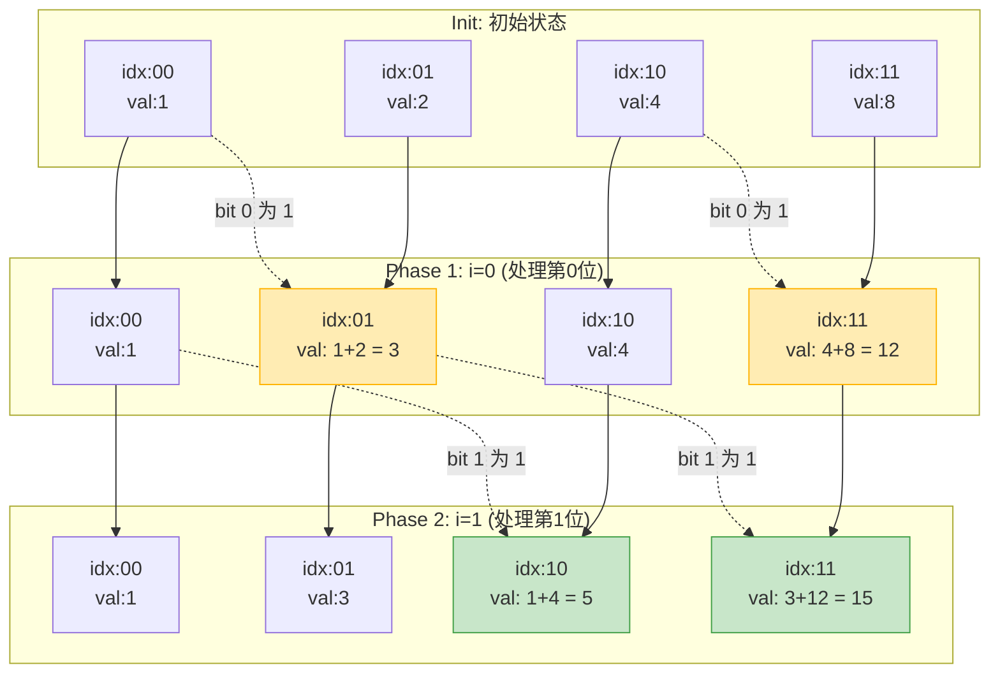

你好！很高兴你对 **SOS DP (Sum Over Subsets Dynamic Programming)** 感兴趣。既然你在 Codeforces 上刷题并且有离散数学基础，这会让你学得非常快。

SOS DP 其实本质上就是 **高维前缀和（High-Dimensional Prefix Sums）**。

我们分四个阶段来攻克它：
1.  **定义问题与暴力解法的瓶颈**
2.  **从离散数学/几何角度理解（核心直觉）**
3.  **状态定义与转移方程**
4.  **代码实现与空间优化**

---

### 第一阶段：定义问题

假设我们有一个数组 $A$，下标范围是 $0$ 到 $2^N - 1$。
我们的目标是求一个新的数组 $F$，其中 $F[mask]$ 是所有 $mask$ 的**子集**的 $A$ 值之和。

用数学符号表示：
$$ F[mask] = \sum_{i \subseteq mask} A[i] $$

这里 $i \subseteq mask$ 是指：在二进制表示下，如果 $i$ 的某一位是 1，那么 $mask$ 对应的位置也必须是 1（即 `(i & mask) == i`）。

#### 暴力解法 (Brute Force)
最直接的方法是遍历所有可能的 $i$：
```cpp
// O(4^N) - 无法接受
for (int mask = 0; mask < (1<<N); ++mask) {
    for (int i = 0; i < (1<<N); ++i) {
        if ((i & mask) == i) {
            F[mask] += A[i];
        }
    }
}
```

#### 稍微聪明一点的暴力 (Submask Iteration)
利用离散数学知识，我们只枚举子集：
```cpp
// O(3^N) - N=20 时约为 3.5 * 10^9，还是太慢
for (int mask = 0; mask < (1<<N); ++mask) {
    F[mask] = A[0]; // 空集总是子集
    for (int i = mask; i > 0; i = (i-1) & mask) {
        F[mask] += A[i];
    }
}
```
**目标：** 我们需要一个 $O(N \cdot 2^N)$ 的算法。当 $N=20$ 时，运算量约为 $2 \times 10^7$，非常快。

---

### 第二阶段：核心直觉（高维前缀和）

既然你懂离散数学，我们可以把 $N$ 个比特看作 **$N$ 维空间（Hypercube，超立方体）**。

*   **1维前缀和** ($N=1$)：
    $F[0] = A[0]$
    $F[1] = A[0] + A[1]$
    这就像是我们先处理了第 0 位。

*   **2维前缀和** ($N=2$)：
    想象一个二维平面，$mask$ 是坐标 $(x, y)$。$i \subseteq mask$ 意味着 $x_i \le x_{mask}$ 且 $y_i \le y_{mask}$。这完全就是二维矩阵的前缀和！
    通常我们怎么做二维前缀和？
    1. 先对每一行做一维前缀和。
    2. 再对每一列做一维前缀和。

**SOS DP 的核心思想：**
我们要计算 $N$ 维的前缀和，只需要**逐个维度**进行累加。
先处理第 0 个 bit 的变化，再处理第 1 个 bit 的变化……直到第 $N-1$ 个 bit。

---

### 第三阶段：状态定义与转移

为了逐个维度处理，我们需要引入一个新的状态参数 $i$（代表我们正在处理第几个 bit）。

定义 $dp[mask][i]$ 为：
满足以下条件的 $x$ 的 $A[x]$ 之和：
1.  $x \subseteq mask$
2.  $x$ 与 $mask$ **只有**在最低的 $i+1$ 个比特位（第 $0$ 位到第 $i$ 位）上可能不同。
3.  $x$ 在高于 $i$ 的比特位上必须与 $mask$ 完全一致。

#### 边界条件
$dp[mask][-1] = A[mask]$ （还没允许任何位不同，只能是自己）

#### 状态转移
现在我们要从 $i-1$ 推广到 $i$。看看 $mask$ 的第 $i$ 位：

1.  **如果 $mask$ 的第 $i$ 位是 0**：
    由于 $x$ 必须是 $mask$ 的子集，且高位必须一致，那么 $x$ 的第 $i$ 位也必须是 0。
    这意味着第 $i$ 位没有产生新的变数。
    $$ dp[mask][i] = dp[mask][i-1] $$

2.  **如果 $mask$ 的第 $i$ 位是 1**：
    $x$ 的第 $i$ 位可以是 **1**，也可以是 **0**。
    *   **取 1**：这部分集合不仅第 $i$ 位和 $mask$ 相同，且根据定义，前面的位已经处理过了。这部分就是 $dp[mask][i-1]$。
    *   **取 0**：这部分集合第 $i$ 位是 0。这相当于我们要找另一个状态，那个状态的第 $i$ 位是 0，其他高位和 $mask$ 一样。那个状态就是 $mask \oplus 2^i$。这部分就是 $dp[mask \oplus 2^i][i-1]$。
  
    $$ dp[mask][i] = dp[mask][i-1] + dp[mask \oplus 2^i][i-1] $$

---

### 第四阶段：代码实现（从二维到一维）

#### 原始二维实现 (内存开销大)
```cpp
// dp[mask][i] 
// i 表示处理到了第 i 个 bit (0 到 N-1)
for (int mask = 0; mask < (1<<N); ++mask) {
    // 初始状态：只包含自己
    dp[mask][-1] = A[mask]; 
}

for (int i = 0; i < N; ++i) {
    for (int mask = 0; mask < (1<<N); ++mask) {
        if (mask & (1<<i)) {
            // 如果第 i 位是 1，则累加第 i 位是 0 的那些子集
            dp[mask][i] = dp[mask][i-1] + dp[mask ^ (1<<i)][i-1];
        } else {
            // 如果第 i 位是 0，只能继承
            dp[mask][i] = dp[mask][i-1];
        }
    }
}
// 最终答案是 dp[mask][N-1]
```

#### 空间优化 (滚动数组/原地更新)
这就像 0/1 背包问题一样，我们不需要保留上一层 $i-1$ 的所有数据，直接在原数组上更新即可。
**注意循环顺序**：这里与背包不同，因为我们用到的是更新后的值还是旧值？
其实这里更像“分层图”，每一层 $i$ 只依赖于上一层的结果。

```cpp
// 初始化 F 数组为 A
for (int i = 0; i < (1<<N); ++i) F[i] = A[i];

// 逐个维度遍历 (O(N))
for (int i = 0; i < N; ++i) {
    // 遍历所有掩码 (O(2^N))
    for (int mask = 0; mask < (1<<N); ++mask) {
        // 核心转移：如果 mask 包含当前的 bit i
        if (mask & (1<<i)) {
            // F[mask] 目前包含 "第i位是1，低位已处理" 的和
            // F[mask ^ (1<<i)] 包含 "第i位是0，低位已处理" 的和
            // 把它们加起来，F[mask] 就变成了 "第i位是0或1，低位已处理" 的和
            F[mask] += F[mask ^ (1<<i)];
        }
    }
}
```

这就是最终的 **SOS DP** 模板！
时间复杂度：$O(N \cdot 2^N)$。

---

### 举一反三：超集和 (Sum Over Supersets)

如果问题变成求 $F[mask] = \sum_{mask \subseteq i} A[i]$ 呢？
也就是求所有包含 $mask$ 的父集的和。

逻辑完全对称：
1. 从高位向低位还是低位向高位遍历都可以（通常习惯还是从 $i=0$ 到 $N-1$）。
2. 如果 $mask$ 的第 $i$ 位是 **0**，那么父集 $x$ 的第 $i$ 位可以是 0，也可以是 1。
   所以要加上 $mask \oplus 2^i$ (即第 $i$ 位变成 1 的那个数) 的值。

```cpp
for (int i = 0; i < N; ++i) {
    for (int mask = 0; mask < (1<<N); ++mask) {
        // 如果当前位是 0，加上当前位是 1 的那个对应的父集状态
        if (!(mask & (1<<i))) {
            F[mask] += F[mask ^ (1<<i)];
        }
    }
}
```

### 总结

1.  SOS DP 解决了求子集和/超集和的问题。
2.  本质是**多维空间的前缀和**。
3.  通过循环 $N$ 个 bit，每一轮把该 bit 的贡献累加进去。
4.  代码极短，只需两个嵌套循环。

你可以去尝试一下 Codeforces 上的经典题目：**Codeforces 165E - Compatible Numbers**。
(提示：这题需要求 $x$ 使得 $a_i \ \& \ x = 0$。这个条件等价于 $x$ 是 $(\sim a_i)$ 的子集)。

懂了吗？如果哪里觉得抽象，我可以画个图或者举具体的数字例子！


没问题！图解是理解 SOS DP 最直观的方式。我们利用 Mermaid 来画两张图。

第一张图从 **离散数学/集合论** 的角度展示数据的流向（谁是谁的子集）。
第二张图从 **算法执行流程** 的角度，展示代码中 `i` (bit) 循环时发生了什么。

### 图解一：布尔格 (Boolean Lattice) - 静态结构

这是一个 $N=3$ 的例子。箭头表示 **"子集 -> 父集"** 的关系。
SOS DP 的本质就是：数据顺着箭头的方向，像水流一样汇聚到最上方。

*   `000` 的值会流向 `001`, `010`, `100`。
*   `011` 最终会收集到 `000`, `001`, `010`, `011` 的所有值。



**怎么看这张图？**
*   **红色虚线**：对应代码中 `i=0` 的循环。此时只处理最后一位的变化。
*   **绿色实线**：对应代码中 `i=1` 的循环。此时处理中间位的变化。
*   **蓝色粗线**：对应代码中 `i=2` 的循环。此时处理最高位的变化。
*   **例子**：看顶部的 `111`。它先在 `i=0` 时拿到了 `110` 的值；然后在 `i=1` 时拿到了 `101`（此时 `101` 已经包含了 `100`）的值；最后在 `i=2` 时拿到了 `011`（此时 `011` 已经包含了 `010`, `001`, `000`）的值。完美闭环！

---

### 图解二：状态演变流 (State Evolution) - 动态过程

这是 SOS DP 最核心的图。我们以 $N=2$ 为例，展示数组 `F` 在内存中是如何一步步变化的。
初始数组为 `A = [1, 2, 4, 8]` (对应下标 0, 1, 2, 3)。

**逻辑回顾**：
`if (mask & (1<<i)) F[mask] += F[mask ^ (1<<i)]`



**深度解析 Phase 2 中的 `idx:11` (即节点 C3)：**
1.  **它的值是 15**。这是怎么来的？
2.  代码逻辑：`F[11] += F[01]`。
3.  看上一层 (Phase 1)：`F[11]` 当时是 12 (自身8 + 邻居4)，`F[01]` 当时是 3 (自身2 + 邻居1)。
4.  相加：$12 + 3 = 15$。
5.  **验证**：$15 = 8+4+2+1 = A[11]+A[10]+A[01]+A[00]$。
6.  这就是 SOS DP 的魔力：**它利用了上一轮计算好的“部分前缀和”，避免了重复计算。**

希望这两张图能帮你彻底打通任督二脉！有感觉了吗？