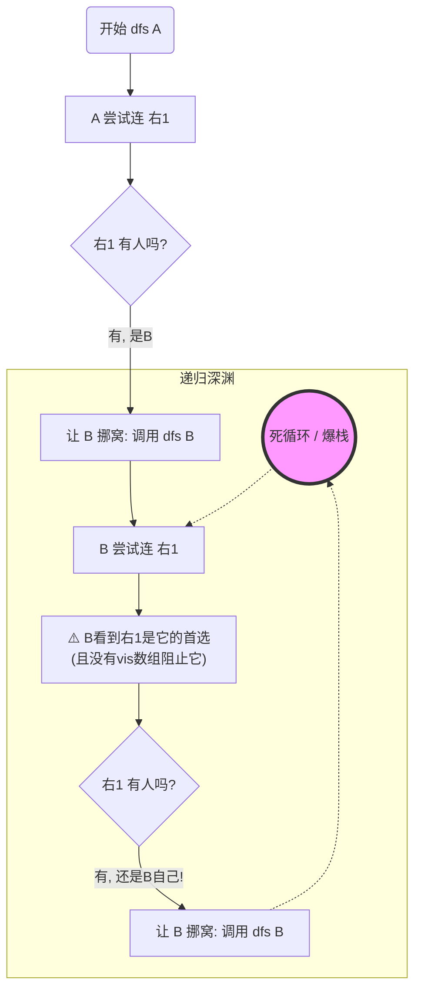
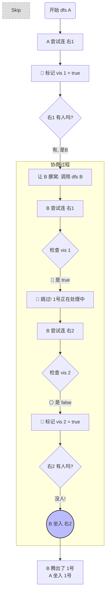
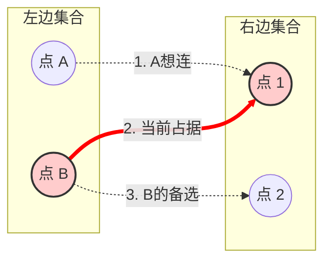
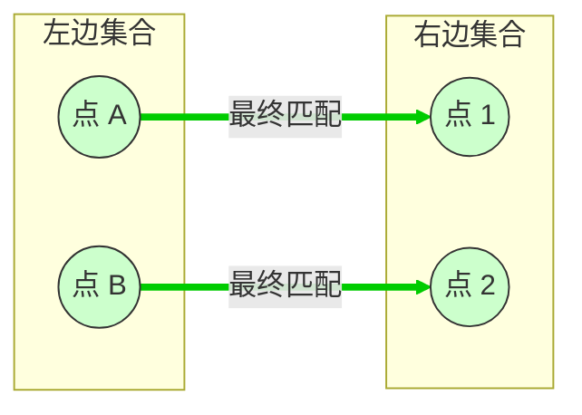

没问题！用图解来演示 **“如果没有 `vis` 会发生什么恐怖的事情”** 是最直观的。

我们要演示的场景是：**著名的“死循环三角恋”**。

### 🎭 场景设置

假设现在的图是这样的：

1. **左边点 A**：想连右边点 1。
2. **左边点 B**：想连右边点 1，也想连右边点 2。
3. **现状**：**点 B 已经占据了点 1** (`match[1] = B`)。

现在，**点 A** 登场了，执行 `dfs(A)` 试图找对象。

------

### ❌ 场景一：如果没有 `vis` 数组 (无限递归)

如果没有 `vis`，程序就是个只会照章办事的傻瓜。**点 B 被要求挪窝时，它会忘记自己刚刚就在点 1 上。**

代码段

**解析：**

1. A看中1号，1号里坐着B。
2. A 对 B 说：“哥们，你去别处看看？” (`dfs(B)`)。
3. B 站起来开始找座。B 的列表里第一个也是 1号。
4. **关键点**：B 看到 1号，虽然 B 刚从这站起来，但 B **不记得** 1号已经在这一轮被 A 预定（或者被访问过）了。
5. B 发现 1号 还是被占用的（逻辑上），于是程序愚蠢地再次尝试 `dfs(match[1])`，也就是再次调用 `dfs(B)`。
6. **Boom! Stack Overflow.**

------

### ✅ 场景二：拥有 `vis` 数组 (智能跳过)

加上 `vis` 数组后，就相当于在这一轮协商中，给访问过的座位贴了条子：**“正在处理中，勿扰”**。

代码段

**解析：**

1. **A 访问 1号**：贴上封条 `vis[1] = true`。发现 B 在这，进入递归 `dfs(B)`。
2. **B 访问 1号**：
   - B 想回 1号座位。
   - **看到封条 `vis[1] == true`**。
   - B 明白了：“哦，这个座位正在这一轮的争议中心，我不能选它，否则就死循环了。”
   - **B 直接 `continue`，去看下一个备选（2号）。**
3. **B 访问 2号**：
   - `vis[2]` 没封条。
   - 2号 是空的。
   - B 坐下！(`match[2] = B`)。
4. **回溯**：B 既然去了 2号，1号 就空出来了，A 成功坐入 1号。

### 💡 总结

你可以把 `vis` 想象成 **“案发现场警戒线”**。

- 当 `dfs` 走到某个点时，拉起警戒线 (`vis = true`)。
- 后续的递归如果又绕回这里，看到警戒线就知道：**“此路不通（或者已经有人在处理了），换条路走”**。
- 这就是 `vis` 防止死循环、强制程序去探索**新路径**（增广路）的原理。

----------------------

没问题，图解是理解二分图最直观的方式。

这是你描述的场景：**A 是新来的挑战者，B 和 1 号目前是“热恋”（匹配）状态，但 B 其实还有一个备胎 2 号。**

### 1. 初始状态图 (Current State)

图中 **粗红线** 表示当前的匹配关系 (`match[1] = B`)，虚线表示潜在的连接关系（边）。

代码段

------

### 2. 为什么需要 `vis`？(结合图解)

现在我们执行 `dfs(A)`，来看看 `vis` 数组是如何在图中充当“交警”的。

#### 第一步：A 发起挑战

- A 只有一条路，指向 **点 1**。
- **动作**：A 访问点 1。
- **状态**：`vis[1] = true` (**警告：点 1 正在处理中**)。
- **冲突**：点 1 被 B 占了（红线）。
- **策略**：程序执行 `dfs(B)`，试图让 B 换个地方。

#### 第二步：B 被迫找新位置 (关键时刻！)

现在程序进入了 `dfs(B)` 的递归层。B 开始查看自己的连线（如上图，B 有两条线）：

1. **B 看向 点 1 (旧爱)**：
   - 如果没有 `vis`：B 会发现自己能连点 1，于是尝试去连... 陷入死循环。
   - **有 `vis`**：B 发现 `vis[1]` 是 `true`。
   - **心理活动**：“点 1 正在被 A 申请中（或者已经被锁定了），现在的争端就是因它而起，我不能再选它了，否则就没完没了了。”
   - **结果**：B **跳过** 点 1。
2. **B 看向 点 2 (新欢)**：
   - 检查 `vis[2]`：是 `false`（还没人碰过）。
   - 检查状态：点 2 没人坐。
   - **结果**：B 成功匹配点 2！(`match[2] = B`)。

#### 第三步：大团圆 (回溯)

- B 既然去了点 2，它和点 1 的红线就断开了。
- A 终于可以接管点 1 了。
- **最终匹配**：A-1，B-2。

代码段

这就是 `vis` 的作用：**强迫 B 去看“备选”路 (点 2)，而不是回头看“老”路 (点 1)。**