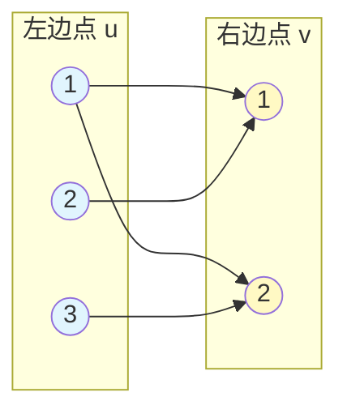
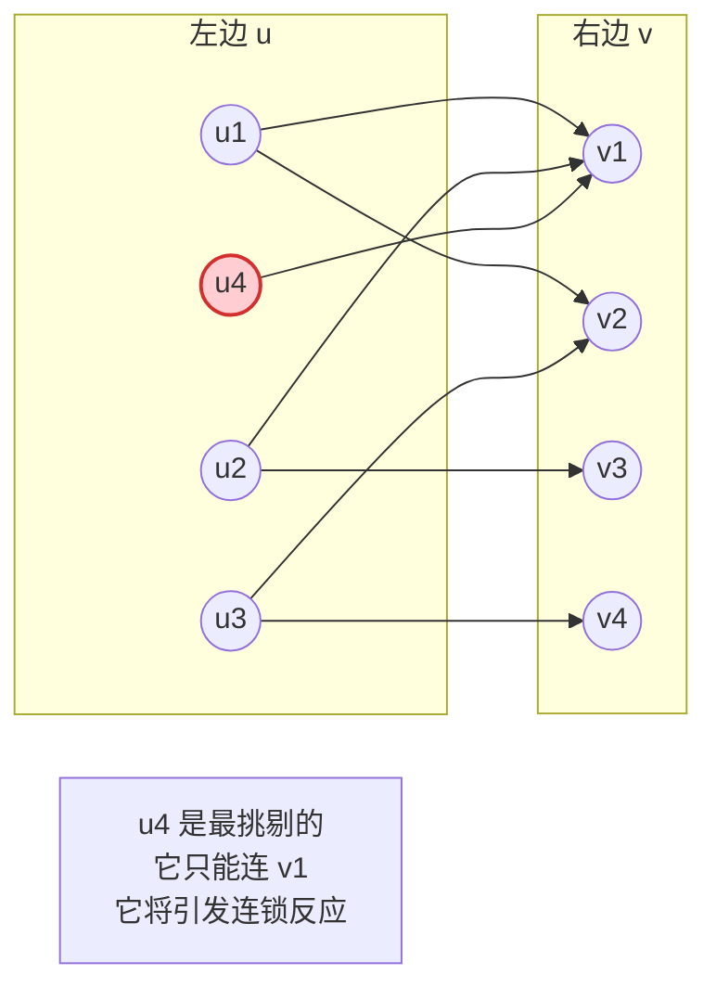
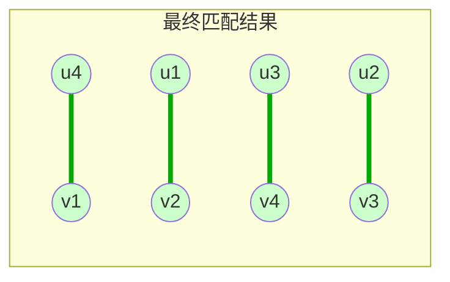

我大概知道 我为什么不理解hungarian 的代码了 :　没有数据让我尝试，导致我对代码不熟悉


现在你来生成一些具有特点的二分图数据,来辅助我理解 

```
bool dfs(int u) {

    for (int v : adj[u]) {

        if (vis[v]) continue;

        vis[v] = true;        

        if (match[v] == 0 || dfs(match[v])) {

            match[v] = u;

            return true;

        }

    }

    return false;

}


int hungarian(int n) {

    int ans = 0;

    memset(match, 0, sizeof(match));

    for (int i = 1; i <= n; i++) {

        memset(vis, 0, sizeof(vis));

        if (dfs(i)) ans++;

    }

    return ans;

}

// --- 匈牙利算法模板 End ---
```


1.  每个数据
   1. 先有文字版本
   2. 然后mermaid 描述
   3. 你来一步一步描述(模拟算法的运行)如何dfs 每个点,辅助我的理解


这正是学习算法最有效的方法：**手动模拟（Trace Code）**。

如果不看数据跑一遍，代码永远只是冷冰冰的字符。

我为你设计了一组**非常典型**的数据。这组数据虽小，但五脏俱全，涵盖了三种情况：

1. **直接匹配**（空手套白狼）
2. **冲突但协商成功**（把别人挤走）
3. **冲突且协商失败**（死胡同）

------

### 🧪 实验数据设定

- **左边集合 (Left)**：`u` = {1, 2, 3}
- **右边集合 (Right)**：`v` = {1, 2}
- **连线关系 (Edges)**：
  - **左1** 想要 **右1** 和 **右2** `(1->1, 1->2)`
  - **左2** 只想要 **右1** `(2->1)`
  - **左3** 只想要 **右2** `(3->2)`

> **假设邻接表 `adj` 的顺序**：对于点 1，先存的 1，后存的 2。这意味着程序会先尝试连右1。

#### 📊 初始状态图 (Mermaid)

代码段



------

### 🎬 算法模拟：一步步执行 `hungarian()`

我们进入主函数 `hungarian(3)`。此时 `match` 数组全为 0。

#### 第 1 轮：给“左1”找对象 (`i=1`)

- **重置**：`memset(vis, 0)`。
- **调用**：`dfs(1)`。

**进入 `dfs(1)`**:

1. 遍历 `adj[1]`，第一个邻居是 **右1**。
2. `vis[1]` 是 false -> **标记 `vis[1] = true`**。
3. 检查 `match[1]`：
   - 当前 `match[1] == 0`（右1 单身）。
   - **判定成功！**
4. **操作**：`match[1] = 1` （右1 属于 左1）。
5. `return true`。

- **结果**：`ans++` (当前 ans = 1)。

> **当前局面**：左1 霸占了 右1。

------

#### 第 2 轮：给“左2”找对象 (`i=2`) —— 💥 关键点：协商与挤占

- **重置**：`memset(vis, 0)`。注意！上一轮的 `vis` 清空了，一切重新开始。
- **调用**：`dfs(2)`。

**进入 `dfs(2)`**:

1. 遍历 `adj[2]`，邻居只有 **右1**。

2. `vis[1]` 是 false -> **标记 `vis[1] = true`** （注意：这一轮标记的）。

3. 检查 `match[1]`：

   - `match[1]` 是 1 (左1)。**右1 有主了！**
   - 进入 `||` 后面的递归：**调用 `dfs(match[1])` 即 `dfs(1)`**。
   - *潜台词：“左2 对 左1 说：兄弟，右1 被我看上了，你能换个地儿吗？”*

   **进入递归 `dfs(1)` (左1 被迫重新找座)**:

   1. 遍历 `adj[1]`。
   2. **尝试邻居 右1**：
      - 检查 `if (vis[1])`...
      - **发现 `vis[1]` 已经是 true 了！** (是刚才 `dfs(2)` 标记的)。
      - **continue!**
      - *逻辑解释：左1 看到右1 此时是“争议焦点”，为了避免死循环，不能选它。*
   3. **尝试邻居 右2**：
      - `vis[2]` 是 false -> **标记 `vis[2] = true`**。
      - 检查 `match[2]`：
      - `match[2] == 0` (右2 单身)。
      - **判定成功！**
   4. **操作**：`match[2] = 1` (左1 换到了 右2)。
   5. `return true`。

   **回到 `dfs(2)`**:

   - 递归 `dfs(1)` 返回了 true (兄弟哪怕换个位置，也算腾出空了)。
   - **操作**：`match[1] = 2` (右1 现在归 左2 了)。
   - `return true`。

- **结果**：`ans++` (当前 ans = 2)。

> 当前局面：左1 去找了备胎 右2，左2 成功上位拿到了 右1。
>
> Match数组：match[1]=2, match[2]=1。

------

#### 第 3 轮：给“左3”找对象 (`i=3`) —— ❌ 彻底失败

- **重置**：`memset(vis, 0)`。
- **调用**：`dfs(3)`。

**进入 `dfs(3)`**:

1. 遍历 `adj[3]`，邻居只有 **右2**。

2. **标记 `vis[2] = true`**。

3. 检查 `match[2]`：

   - `match[2]` 是 1 (左1)。**右2 有主了！**
   - 进入递归：**调用 `dfs(1)`**。
   - *潜台词：“左3 对 左1 说：你能把 右2 让出来吗？”*

   **进入递归 `dfs(1)`**:

   1. 遍历 `adj[1]` (邻居是 右1, 右2)。

   2. **尝试邻居 右1**：

      - `vis[1]` 是 false -> **标记 `vis[1] = true`**。
      - 检查 `match[1]`：
      - `match[1]` 是 2 (左2)。**有主！**
      - 进入递归：**调用 `dfs(2)`**。
      - *潜台词：“左1 问 左2：有人抢我位子，我想回 右1，你能让让吗？”*

      **进入递归 `dfs(2)`**:

      1. 遍历 `adj[2]` (邻居只有 右1)。
      2. **尝试邻居 右1**：
         - 检查 `if (vis[1])`...
         - **True!** (刚才 `dfs(1)` 标记的)。
         - **continue!**
      3. 没有其他邻居了。
      4. `return false` (左2 说：我没地儿去了)。

   3. **回到 `dfs(1)`**，递归 `dfs(2)` 失败。

   4. **尝试邻居 右2**：

      - 检查 `if (vis[2])`...
      - **True!** (最外层 `dfs(3)` 标记的)。
      - **continue!**

   5. 没有其他邻居了。

   6. `return false` (左1 说：左2 不动，我自己也没别的地儿去，我不让)。

   **回到 `dfs(3)`**:

   - 递归 `dfs(1)` 返回 false。
   - 左3 没有其他邻居了。
   - `return false`。

- **结果**：`ans` 不变。

------

### 📝 最终总结

| **步骤** | **左边谁在找** | **想要谁** | **冲突对象** | **协商结果**                 | **最终 match 状态** |
| -------- | -------------- | ---------- | ------------ | ---------------------------- | ------------------- |
| **1**    | **左1**        | 右1        | 无           | ✅ 成功                       | `R1: L1`, `R2: 空`  |
| **2**    | **左2**        | 右1        | 左1          | ✅ 左1 换去右2，左2 上位      | `R1: L2`, `R2: L1`  |
| **3**    | **左3**        | 右2        | 左1          | ❌ 左1 想回右1，但被 左2 堵死 | `R1: L2`, `R2: L1`  |

最终最大匹配数：**2**。

### 🧠 通过这次模拟，你应该明白了：

1. vis 的封条作用：

   在第2轮里，当 左1 被挤走时，它试图回头看 右1，但发现 vis[1]=true。这强制 左1 只能去看 右2。这就是 vis 逼着算法去寻找 “增广路”（新路径）的关键。

2. 递归的传递性：

   “我抢你位置 -> 你抢他位置 -> 他找空位”。如果最后一个人找到了空位，整个链条全部成功（return true）；如果最后一个人走投无路，整个链条全部撤销（return false）。


----

好的！为了让你彻底领悟 `dfs` 递归找增广路的过程，我设计了一个**“多米诺骨牌效应（连锁反应）”**的数据。

这组数据的特点是：

1. **牵一发而动全身**：为了让最后一个人坐下，前面所有坐好的人都要换位置。
2. **递归深度深**：你会看到 `dfs` 一层一层钻下去，直到找到最深处的空位。

------

### 🧪 实验数据设定：多米诺骨牌

- **左边 (u)**: 1, 2, 3, 4
- **右边 (v)**: 1, 2, 3, 4
- **连线关系 (Edges)**:
  - **u1**: 连 v1, v2
  - **u2**: 连 v1, v3
  - **u3**: 连 v2, v4
  - **u4**: 只连 v1 (**引爆点**)

> 注意：
>
> adj 列表顺序假设：
>
> adj[1] = {1, 2}
>
> adj[2] = {1, 3}
>
> adj[3] = {2, 4}
>
> adj[4] = {1}

#### 📊 初始状态图 (Mermaid)

代码段



------

### 🎬 算法模拟：一步步执行 (Trace)

#### 第 1 轮：给 u1 找对象

- `dfs(1)`:
  - 看中 v1。v1 空。
  - **结果**：`match[1] = 1`。
  - **(u1 - v1)**

#### 第 2 轮：给 u2 找对象 (小挤一下)

- `dfs(2)`:
  - 看中 v1。v1 被 u1 占了。
  - **标记 `vis[1]=true`**。
  - **协商**：`dfs(u1)`。
    - `dfs(1)`:
      - 看 v1? `vis[1]`是 true -> 跳过。
      - 看 v2? 空的。
      - **成功**：`match[2] = 1`。
  - u1 挪到了 v2。u2 接管 v1。
  - **结果**：`match[1] = 2`, `match[2] = 1`。
  - **(u2 - v1), (u1 - v2)**

#### 第 3 轮：给 u3 找对象 (中等挤)

- `dfs(3)`:

  - 看中 v2。v2 被 u1 占了。
  - **标记 `vis[2]=true`**。
  - **协商**：`dfs(u1)`。
    - `dfs(1)` (u1 被 u3 逼得找座):
      - 看 v1? 被 u2 占了。
      - **标记 `vis[1]=true`**。
      - **协商**：`dfs(u2)`。
        - `dfs(2)` (u2 被 u1 逼得找座):
          - 看 v1? `vis[1]` true -> 跳过。
          - 看 v3? 空的！
          - **成功**：`match[3] = 2`。
      - u2 去了 v3。u1 拿回 v1。
  - u1 去了 v1。u3 接管 v2。
  - **结果**：`match[1]=1`, `match[2]=3`, `match[3]=2`。
  - **(u1 - v1), (u3 - v2), (u2 - v3)**

  > 注意：这一轮 u1 从 v2 换回了 v1。

------

#### 💥 第 4 轮：给 u4 找对象 (超级连锁反应)

这是最精彩的一步。目前所有人都有位置，**u4 来了，它只能坐 v1**。

- **当前状态**: `match[1]=u1`, `match[2]=u3`, `match[3]=u2`, `match[4]=0`
- `vis` 全部清零。

**进入 `dfs(4)`**:

1. u4 只有一条路：**v1**。

2. v1 被 **u1** 占了。

3. **标记 `vis[1] = true`**。

4. 呼叫 `dfs(u1)` (让 u1 挪窝)。

   > **第 2 层递归 `dfs(1)`**:

   > - u1 想去 v1? `vis[1]` true -> 跳过。
   > - u1 想去 **v2**。
   > - v2 被 **u3** 占了。
   > - **标记 `vis[2] = true`**。
   > - 呼叫 `dfs(u3)` (让 u3 挪窝)。

   > > **第 3 层递归 `dfs(3)`**:

   > > - u3 想去 v2? `vis[2]` true -> 跳过。
   > > - u3 想去 **v4**。
   > > - **v4 是空的！** (终于找到出口了)。
   > > - **操作**：`match[4] = 3` (u3 坐 v4)。
   > > - `return true`。

   > - u3 走了，v2 空出来了。
   > - **操作**：`match[2] = 1` (u1 坐 v2)。
   > - `return true`。

5. u1 走了，v1 空出来了。

6. **操作**：`match[1] = 4` (u4 坐 v1)。

7. `return true`。

------

### 🖼️ 最终结果图解

你会发现，u4 的加入，导致了一场大洗牌。

- **u3** 这里的 **v4** 是整条增广路的**终点**。
- **u4** 这里的 **v1** 是整条增广路的**起点**。
- 中间的 **u1, u3** 充当了传导压力的角色。

代码段



### 🧠 深度总结

看懂了这个例子，你就看懂了匈牙利算法的 99%：

1. **增广路其实是一条“交替路”**：
   - u4 -> v1 (未匹配边)
   - v1 -> u1 (已匹配边 - 旧)
   - u1 -> v2 (未匹配边)
   - v2 -> u3 (已匹配边 - 旧)
   - u3 -> v4 (未匹配边 - **终点**)
2. **`vis` 的作用域**：
   - 在第 4 轮的大递归中，`vis[1]` 和 `vis[2]` 都被标记为 `true`。
   - 这保证了 u1 不会回头抢 v1，u3 不会回头抢 v2，大家只能**硬着头皮往后找 (Find Next)**，直到找到那个没人要的 v4。