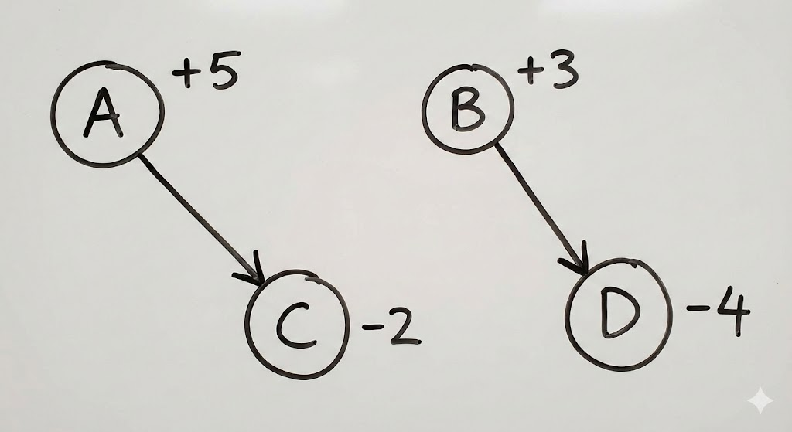
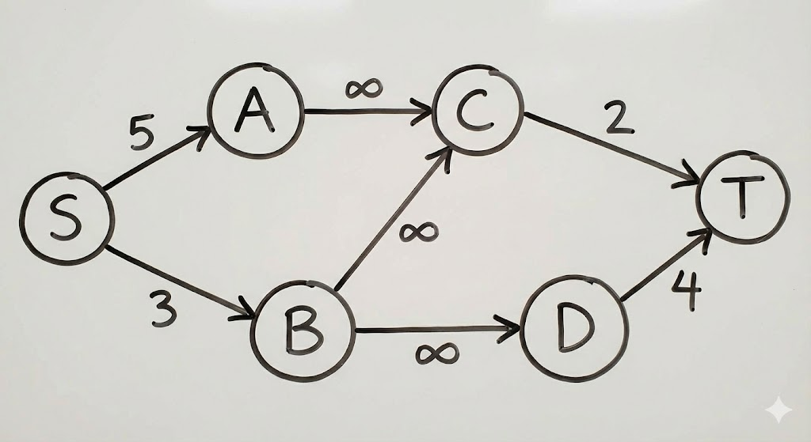
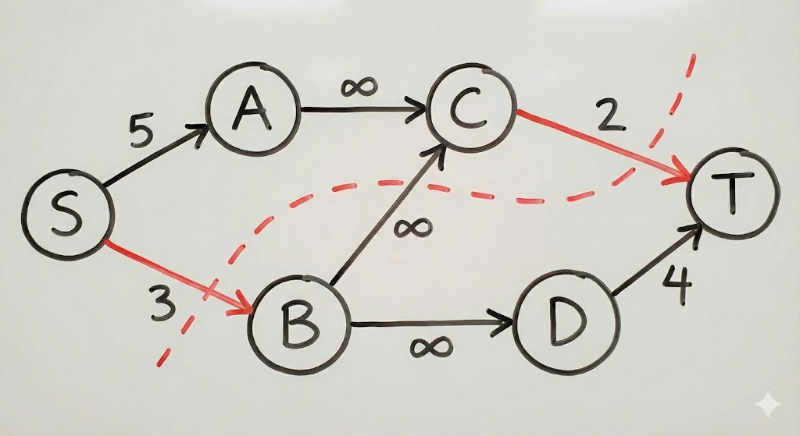

你好！作为一名算法大师，我非常高兴能为你解答这个问题。你的问题非常核心，理解了这一点，就真正掌握了“最大权闭合子图”问题的精髓。

“最大权闭合子图的权值和 = 所有正点权 - 最小割” 这个公式是正确的。要理解为什么最小割代表了“最小损失”，我们需要将问题进行一个巧妙的转化。

让我们一步步来，通过图像来辅助理解。

### 第一步：初始问题图

首先，让我们来看一个简单的例子，这个图中有正权点也有负权点，并且点之间有依赖关系。

- **图 1** 展示了我们的原始问题。
- 我们有正权点 A(+5), B(+3) 和负权点 C(-2), D(-4)。
- 有向边 A->C 和 B->D 表示依赖关系：如果你选择了A，就必须选择C；如果你选择了B，就必须选择D。

**我们的目标是**：选择一个闭合子图，使得其中所有点的权值之和最大。

如何理解“损失”？

我们可以换一个角度思考：假设我们要拿走所有正权点的收益（+5 + 3 = +8），然后看看为了满足“闭合子图”的条件，我们不得不放弃多少收益，或者承担多少损失。我们希望这个“损失”最小。

- **损失类型 1：放弃正权点。** 如果我们决定不选正权点 B，那么我们就“损失”了它的权值 3。
- **损失类型 2：选择负权点。** 如果我们决定选择正权点 A，根据依赖关系，我们必须选择负权点 C，这就带来了 2 的“损失”。

### 第二步：构建网络流图

为了计算这个最小损失，我们构建一个网络流图，将这些“损失”转化为边的容量。

- **图 2** 展示了构建的网络流图。
- 添加一个源点 S 和一个汇点 T。
- **对于每个正权点 (如 A, B)**，从 S 连一条边到该点，容量为其权值。边 **S->B 的容量为 3**，代表如果不选 B，就会损失 3。
- **对于每个负权点 (如 C, D)**，从该点连一条边到 T，容量为其权值的绝对值。边 **C->T 的容量为 2**，代表如果选了 C，就会带来 2 的损失。
- **原图中的依赖边 (A->C, B->D)**，在网络流图中保留，容量设为无穷大 (∞)。这是为了保证如果选了 A，就必须选 C（否则如果 A 在 S 集合，C 在 T 集合，就会割断一条无穷大的边，这是不可能成为最小割的）。

### 第三步：最小割与最小损失

现在，我们在这个构建好的图上求一个最小割。一个割将图分为两个集合：S集合（包含源点 S）和 T集合（包含汇点 T）。割的容量是所有从 S集合 指向 T集合 的边的容量之和。

- **图 3** 展示了一个可能的最小割（红色虚线）。
- 这个割将节点分成了 S集合 `{S, A, C}` 和 T集合 `{B, D, T}`。
- 被割断的边（从 S集合 指向 T集合）是 **S->B** (容量 3) 和 **C->T** (容量 2)。
- 这个割的容量是 3 + 2 = 5。

**关键解释：**

1. **S集合代表我们“选择”的点，T集合代表我们“放弃”的点。**
2. **割边 S->B (容量 3)**：表示我们将正权点 B 放到了 T集合（放弃了），因此我们**损失**了它的权值 3。
3. **割边 C->T (容量 2)**：表示我们将负权点 C 放到了 S集合（选择了），因此我们要**承担**它的负权值带来的损失 2。
4. 由于无穷大的边不会被割断，这就保证了依赖关系：A 在 S集合，C 也必须在 S集合（如果 C 在 T集合，A->C 就会被割断，割的容量就变成无穷大）。

**结论：**

最小割的容量，就是我们为了满足闭合子图条件，所必须付出的**最小总损失**（包括放弃的正权值和承担的负权值）。

所以，公式就很容易理解了：

**最大权闭合子图的权值和 = (如果我们能拿走所有正权点的总和) - (为了满足条件而必须付出的最小损失)**

即：

**最大权闭合子图的权值和 = 所有正点权之和 - 最小割**

在这个例子中：

- 所有正点权之和 = 5 (A) + 3 (B) = 8
- 最小割 = 5 (放弃B损失3 + 选择C损失2)
- 最大权闭合子图的权值和 = 8 - 5 = 3。

这个最大的闭合子图就是 S集合中去掉 S 的点：`{A, C}`。其权值和为 A(+5) + C(-2) = +3。这与公式计算的结果一致。

希望这个结合图像的解释能帮助你彻底理解为什么最小割代表了“最小损失”！-

## 参考
- https://www.luogu.com.cn/article/n17g4i4x