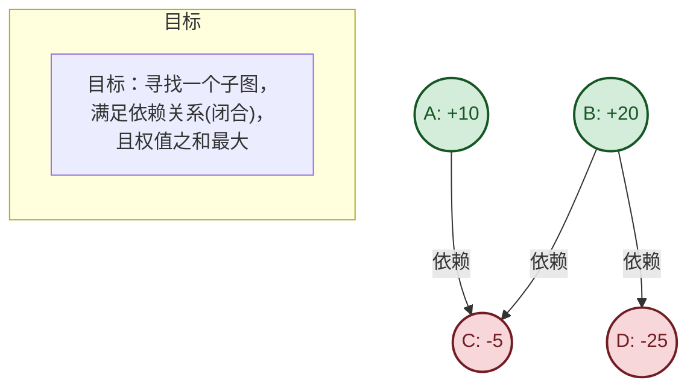
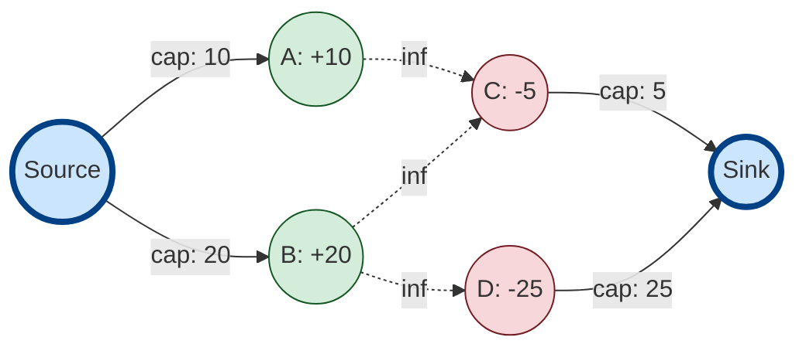
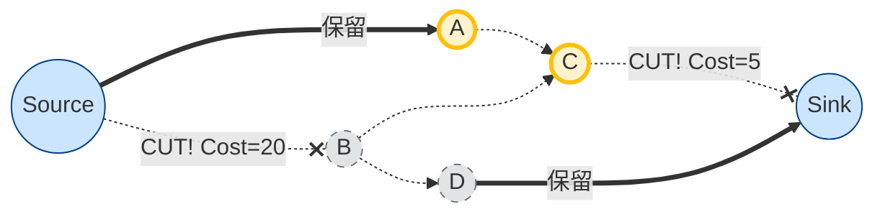

这是一个非常经典且巧妙的算法转换问题。理解“最大权闭合子图”和“最小割”的关系，核心在于理解**“我们要舍弃什么，才能使得剩下的利益最大”**。

简单来说，公式是这样的：
$$最大权闭合子图的总权值 = 所有正权点之和 - 最小割$$

为了辅助你理解，我将通过三个阶段的 Mermaid 图形来演示这个过程：

1.  **原始问题模型**：带有依赖关系的权值图。
2.  **建图过程**：如何转化为网络流图。
3.  **最小割的含义**：割掉的边代表什么。

---

### 第一阶段：原始问题 (依赖关系图)

假设我们有一个项目选择问题。

*   **节点 (Nodes)**：代表项目或资源。
*   **权值 (Weights)**：正数代表收益，负数代表成本。
*   **边 (Edges)**：代表依赖关系。如果选了 A，就必须选 A 依赖的 B（即 A -> B）。

**例子：**

*   **A (+10)**: 一个高收益项目，依赖 C。
*   **B (+20)**: 一个更高收益项目，依赖 C 和 D。
*   **C (-5)**: 一个基础组件，有成本。
*   **D (-25)**: 一个昂贵的组件，有成本。

如果选 A，必须选 C（净收益 10-5=5）。
如果选 B，必须选 C 和 D（净收益 20-5-25 = -10，亏本）。

---

### 第二阶段：构建网络流图 (转化)

为了使用最小割解决这个问题，我们需要构建一个流网络。规则如下：

1.  **源点 S**：连接所有**正权点**。容量 = 权值。
2.  **汇点 T**：所有**负权点**连接到 T。容量 = |权值| (绝对值)。
3.  **内部边**：原图中的依赖关系 $A \to B$。容量 = $\infty$ (无穷大)。
    *   *为什么要无穷大？* 因为最小割不能切断无穷大的边。这就保证了如果 S 能流到 A (选A)，且 A 依赖 B，那么 S 也一定能流到 B (选B)。**这强制满足了“闭合”的性质。**

---

### 第三阶段：最小割与其物理意义

现在我们来求最小割。**最小割 (Min-Cut)** 是指：割断一些边，使得 S 和 T 不再连通，且割断边的容量之和最小。

在这个模型中，割断一条边意味着什么？这也就是“损失”：

1.  **割断 $S \to \text{正权点}$**：
    *   意味着这个正权点归到了 T 集合（不被选中）。
    *   **损失 = 放弃了这个正收益**。
2.  **割断 $\text{负权点} \to T$**：
    *   意味着这个负权点归到了 S 集合（被选中了）。
    *   **损失 = 承担了这个负成本**。
3.  **中间的 $\infty$ 边**：
    *   永远不会被割断（因为我们求最小割）。这保证了依赖关系的完整性。

**在我们的例子中，最优解是选 {A, C}，放弃 {B, D}。我们看看图上发生了什么：**

### 总结：直观理解公式

通过上面的图，我们可以推导出这个逻辑：

1.  我们先把**所有**正收益的项目都想象成“已经拿到手了”（Total Positive Weight）。
2.  但是，因为有依赖和成本，我们必须面临抉择，会有“损失”。最小割计算的就是**最小的损失**。
3.  损失只有两种来源：
    *   **如果不选某个正收益项目**（割断 $S \to Pos$）：损失就是该项目的收益。
    *   **如果选了某个负成本项目**（割断 $Neg \to T$）：损失就是该项目的成本绝对值。
4.  因为中间的边是无穷大，所以我们不可能出现“选了A却不选C”的情况（那需要割断无穷大的边，不可能是最小割）。

所以：
$$最后的净收益 = 理想总收益 (所有正权) - 最小的损失 (最小割)$$

这就是最大权闭合子图与最小割一一对应的完美解释。