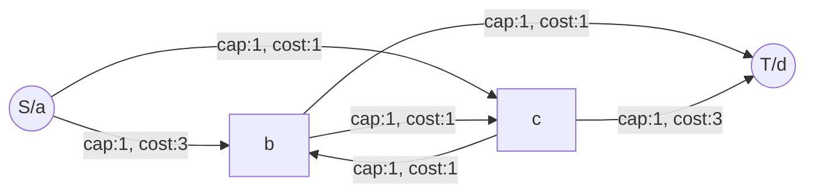
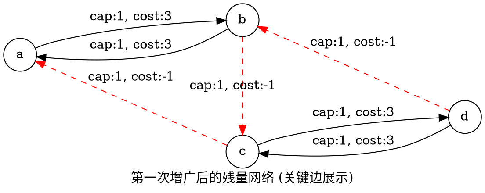
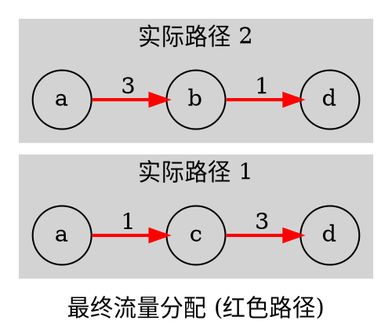

## 基本思路

## 例子

有一个图如下面所示

```
a b 3
a c 1
b c 1
b d 1
c d 3
```


这是一个非常好的问题！通过这个具体的例子，我们可以非常清晰地演示 **最小费用最大流 (Minimum Cost Maximum Flow, MCMF)** 算法是如何通过“反悔机制”（反向边）来修正之前的贪心选择，从而达到全局最优解的。

### 1. 问题建模：转化为网络流问题

首先，我们需要把“**从 a 到 d，再从 d 到 a，每条边只走一次**”这个问题转化为网络流模型。

*   **等价转换**：这个问题等价于“**从 a 到 d 找两条不重叠的路径，使得总距离最短**”。（因为是无向图，从 d 回 a 等同于从 a 去 d 的另一条路）。
*   **流量设置**：
    *   我们需要找两条路径，所以源点 $S$ (即 $a$) 的流出量设为 **2**，汇点 $T$ (即 $d$) 的流入量设为 **2**。
    *   每条边只能走一次，所以图中每条边的**容量 (Capacity)** 设为 **1**。
    *   每条边的长度即为**费用 (Cost)**。

**初始图结构 (无向边拆解为双向有向边)**：
对于原图中的 `u v w`，我们需要建立：
*   $u \to v$: 容量 1, 费用 $w$
*   $v \to u$: 容量 1, 费用 $w$


*(注：为了简洁，上图只画了部分方向，实际上每条边都是双向的)*

---

### 2. MCMF 算法核心流程：SPFA/Dijkstra 增广

MCMF 的核心思想是：**每次在“残量网络”中寻找一条从源点到汇点的“最短路径”（费用最小的路径），在这个路径上推流，直到流量达到最大。**

关键点在于**反向边**。当我们推流经过边 $u \to v$ 时，会产生一条反向边 $v \to u$，其容量为推过的流量，费用为 $-w$。这允许后续的路径“退回”这段流，相当于“反悔”。

---

### 3. 第一步：寻找第一条最短路 (a -> c -> b -> d)

虽然直观上 $a \to c \to d$ (费用1+3=4) 或者是 $a \to b \to d$ (费用3+1=4) 看起来更短，但为了演示算法的“反悔”能力，正如你所建议的，我们假设算法（可能由于SPFA的顺序或其他扰动）首先选择了这条路径：

**路径 1**: `a -> c -> b -> d`

*   $a \to c$: 费用 1
*   $c \to b$: 费用 1
*   $b \to d$: 费用 1
*   **总费用**: $1 + 1 + 1 = 3$

这看起来是一条非常棒的路径，费用极低！让我们看看选了它之后发生了什么。

#### 更新残量网络 (Residual Graph)

当我们在这条路径上推流（流量 1）后，网络发生如下变化：
1.  **正向边容量归零**：$a \to c$, $c \to b$, $b \to d$ 的剩余容量变为 0（这些路断了）。
2.  **建立反向边**：
    *   $c \to a$: 容量 1, 费用 -1
    *   $b \to c$: 容量 1, 费用 -1
    *   $d \to b$: 容量 1, 费用 -1

**此时的残量网络状态**：



*   **当前总流量**: 1
*   **当前总费用**: 3

---

### 4. 第二步：寻找第二条最短路 (利用反向边)

现在我们需要再送 1 个流量从 $a$ 到 $d$。我们来找此时残量网络里的最短路。

剩下的路有：
*   直接走 $a \to b \to \dots$ ? $b \to d$ 已经不通了（容量0）。
*   直接走 $a \to c \to \dots$ ? $a \to c$ 已经不通了（容量0）。

只能走 **$a \to b$** 开始。到了 $b$ 之后去哪？
$b \to d$ 不通。
$b$ 可以去 $c$ 吗？看图：
*   原图中 $b \to c$ 的容量还在吗？刚才走了 $c \to b$，消耗的是 $c \to b$ 的容量。原图的双向边意味着本来就有 $b \to c$ (cap:1, cost:1)。
*   **但是！** 更有趣的是刚才第一步产生的**反向边** $b \to c$ (cap:1, cost:-1)。

让我们仔细看现在的最短路寻找过程：
路径：**`a -> b -> c -> d`**

让我们计算这条路的费用：
1.  $a \to b$: 走原图边，费用 **3**。
2.  $b \to c$: **这里发生了什么？**
    *   我们要利用刚才第一步产生的**反向边**。
    *   第一步我们走了 $c \to b$。现在的逻辑是：我们通过走 $b \to c$ (反向边)，实际上是**抵消**了第一步中 $c \to b$ 的流量。
    *   这就好比说：“第一条路啊，你原本打算从 $c$ 去 $b$，现在我不让你去 $b$ 了，我让你直接从 $c$ 去 $d$；而我第二条路自己去顶替你占用的 $b$ 节点。”
    *   反向边费用是 **-1**。
3.  $c \to d$: 走原图边，费用 **3**。

**这条“新”路径的增量费用**: $3 + (-1) + 3 = 5$。

#### 具体的流量抵消过程 (非常有教育意义)

让我们把这两次选择合并起来看：

*   **路径 1 (流量 +1)**: $a \to c \to b \to d$
*   **路径 2 (流量 +1)**: $a \to b \to c \to d$ (逻辑路径)

在边 $b-c$ 之间发生了什么？
*   路径 1 贡献了 $c \to b$ 的流量。
*   路径 2 贡献了 $b \to c$ 的流量。
*   **净流量**: 0。这意味着实际上边 $b-c$ 没有流量经过！

**最终实际的流向**：
将两个路径叠加，中间的 $c \to b$ 和 $b \to c$ 互相抵消。
结果变成了：
1.  $a \to c$ (来自路径 1) $\to d$ (来自路径 2 的后半段)
2.  $a \to b$ (来自路径 2 的前半段) $\to d$ (来自路径 1 的后半段)

即最终转化为：
*   路 A: $a \to c \to d$ (费用 $1+3=4$)
*   路 B: $a \to b \to d$ (费用 $3+1=4$)

**总费用计算**:
*   第一步费用: 3
*   第二步费用: 5
*   **总费用**: $3 + 5 = 8$

---

### 5. 最终结果图示与总结

通过反向边，我们成功地修正了第一步“贪心”走 $c \to b$ 的错误选择。



#### 计算总结

1.  **第一次增广**: 找到 $a \to c \to b \to d$。
    *   Cost = $1+1+1=3$.
    *   建立了 $b \to c$ 的费用为 -1 的反向边。
2.  **第二次增广**: 找到 $a \to b \to c \to d$ (利用了 $b \to c$ 的反向边)。
    *   Cost = $3 + (-1) + 3 = 5$.
3.  **结果**:
    *   总流量 = 2 (满足条件)
    *   最小费用 = $3 + 5 = 8$.

这就是 MCMF 的魅力：**你不必在第一步就做出完美选择，只要你在残量网络中不断找最短路，反向边机制保证了你可以撤销之前的局部最优，从而达成全局最优。**

## 反向边cost

反向边的 cost(花费) 设为 负值

```cpp
  void addEdge(int u, int v, int cap, int cost) {
      e.add(u, v, cap, cost);      // 正向边
      e.add(v, u, 0, -cost);       // 反向边
  }
```

> 走反向边: 相当与反悔: 当然应该是负值

求从 a 到 d ,然后再从d到a,每条边只走一次的情况小的最短路线的值. 请使用`MCMF`的算法来演示这个解法,做一个网页动画,来辅助我理解M C M F算法

这是一个关于 **最小费用最大流 (MCMF)** 算法核心机制的问题。

在代码中，将反向边的 `cost` 设为负值是为了实现 **“反悔机制” (Regret Mechanism)**。

以下是详细解释：

1. 退流的概念

   在网络流算法中，反向边的存在是为了让我们有机会 “撤销” 之前的决策。如果你之前向 $u \to v$ 推送了 1 单位流量，反向边 $v \to u$ 就有了 1 单位的残余容量。如果你后来发现走 $u \to v$ 其实不是最优解，你可以通过走 $v \to u$ 这条反向边，把这 1 单位流量“推回去”。

2. **费用的计算**

   - 当你第一次走正向边 $u \to v$ 时，你付出了 $cost$ 的代价。
   - 当你走反向边 $v \to u$ 时，相当于你 **收回** 了之前的流量。既然流量被收回了，那么之前付出的 $cost$ 也应该被 **退还**。
   - 在数学上，“退还 $cost$” 就等于 “加上 $-cost$”。

3. 算法如何利用它

   SPFA (或 Dijkstra) 算法总是在寻找 费用最小 的路径。

   - 如果存在一条包含负权反向边的路径，且这条路径的总费用比其他路径更低，算法就会自动选择这条路。
   - 这就意味着算法自动判断出：“与其走原来的那条路，不如把原来的流量退回来，改走现在这条新路，因为这样总费用更低。”

总结：

设为 -cost 是为了让算法在计算总费用时，能够正确地减去被撤销流量所产生的费用，从而保证最终求得的是全局最小费用。