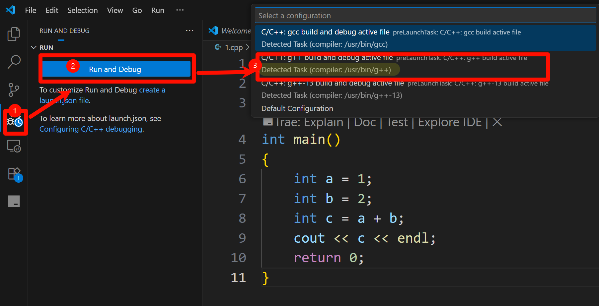
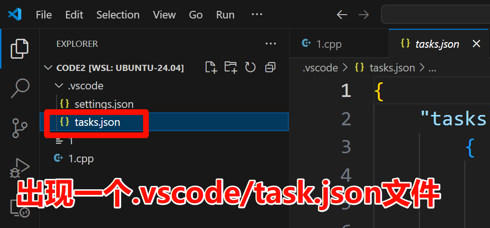

vscode 调试c++

前提条件 

1. 已经安装 vscode 官方 c++ 插件.
2. linux系统
3. linux已经 安装 g++


1. 新建立一个code2文件夹,

```bash
cd ~
mkdir code2
```

并用vscode打开这个文件夹

2. 创建一个文件`1.cpp`,写如如下代码

```cpp
#include <iostream>
using namespace std;

int main()
{
    int a = 1;
    int b = 2;
    int c = a + b;
    cout << c << endl;
    return 0;
}
```

3. 点击run and debug 按钮





出现一个.vscode/tasks.json 文件
```json
{
    "tasks": [
        {
            "type": "cppbuild",
            "label": "C/C++: g++ build active file",//注意这里
            "command": "/usr/bin/g++",
            "args": [
                "-fdiagnostics-color=always",
                "-g",
                "${file}",
                "-o",
                "${fileDirname}/${fileBasenameNoExtension}"
            ],
            "options": {
                "cwd": "${fileDirname}"
            },
            "problemMatcher": [
                "$gcc"
            ],
            "group": {
                "kind": "build",
                "isDefault": true
            },
            "detail": "Task generated by Debugger."
        }
    ],
    "version": "2.0.0"
}
```

5. 下断点

##  如何读取in文件


修改`1.cpp`如下

```cpp
#include <iostream>
using namespace std;

int main()
{
    int a,b;
    cin >>a >>b;
    int c = a + b;
    cout << c << endl;
    return 0;
}
```

`1.cpp`同目录下面创建一个`in.txt`,如下

```
12 14
```

要把 `in.txt` 作为标准输入喂给调试/运行的程序，有两种常见做法：  

1. **终端里手动重定向**（最简单）：  
   ```bash
   ./1 < in.txt
   ```
   但无法在 VS Code 的 F5 调试里直接用。

2. **让 debugger/启动器帮你重定向**：  
   在 **launch.json** 里加一行 `"args":[]`，但把输入玩转需要用到 `"redirectOutput" + "console"`，或者直接 **外部终端**。更简单的是直接配置**运行时参数实现重定向**。

快速方案：把下面内容贴到你的 `.vscode/launch.json` 里（没有就新建）。核心是 `"externalConsole": true` + `"args": [ "<", "in.txt" ]`，先调用 shell 实现重定向：

```json
{
    "version": "0.2.0",
    "configurations": [
        {
            "name": "g++ build & debug cpp",
            "type": "cppdbg",
            "request": "launch",
            "program": "${fileDirname}/${fileBasenameNoExtension}",
            "args": ["<", "${workspaceFolder}/in.txt"],
            "stopAtEntry": true, // 自动breakpoint在main的第一行
            "cwd": "${fileDirname}",
            "environment": [],
            "externalConsole": false,        // 弹一个外部终端，shell 会解析 <
            "MIMode": "gdb",
            "setupCommands": [],
            "preLaunchTask": "C/C++: g++ build active file"   // 与你的 task.json label 保持一致
        }
    ]
}
```


> **Warning**  
> 1. 在同1.cpp 同目录下面创建一个in.txt 文件  
> 2. "preLaunchTask": "C/C++: g++ build active file"   
> preLaunchTask 里面的内容 与你的 task.json label 保持一致


用法：  

1. 把 `in.txt` 放在项目根目录里。  
2. 打开 `1.cpp`，按 F5 调试。程序会自动编译，然后在弹出的小终端里从 `in.txt` 读入。

如果你 **不想弹外部黑框**，也可以把 `externalConsole` 设为 `false`，然后把 `"args"` 改为空数组，再在 `Program arguments` 输入框里 **手动输入** `< in.txt`（新版 VS Code UI 会在启动调试序列时把整条命令传给集成终端，所以也能正确重定向，但旧版不一定）。


## launch.json 与 tasks.json 有什么区别?

一句话总结  
• tasks.json：告诉 VS Code “**怎么编译/构建/预处理**” 你的代码。  
• launch.json：告诉 VS Code “**怎么运行/调试**” 已经生成的二进制。  

两者各司其职，也可以配合使用。

| 对比维度 | tasks.json | launch.json |
|----------|------------|-------------|
| 目的 | 提供“任务”：编译、清理、打包、单元测试等 | 提供“调试配置”：启动程序并附加调试器 |
| 触发方式 | 手动（Ctrl + Shift + P → Run Task）或 VS Code 在后台调用 | 调试启动（F5 或点击 Run & Debug） |
| 典型指令 | `g++ -g main.cpp -o main` | `gdb ./main` |
| 关键字段 | `label` `command` `args` `group` | `program` `args` `cwd` `MIMode` `preLaunchTask` |
| 是否必须 | 不必须（没有它仍可 CLI 编译） | 若想用 VS Code 调试就必须有 |
| 能否串联 | 可以！`launch.json` 里可以指定 `preLaunchTask` 字段，让调试前先跑某个任务（如编译） | 不能反向调用 |

示例  
```json
// tasks.json
{
    "label": "build",
    "command": "g++",
    "args": ["-g", "main.cpp", "-o", "main"]
}
```

```json
// launch.json
{
    "program": "${workspaceFolder}/main",
    "preLaunchTask": "build",
    "miDebuggerPath": "gdb"
}
```

流程  
按下 F5 → VS Code 先用 tasks.json 里名为 `build` 的任务编译 → 生成 `./main` → 再按 launch.json 的规则启动 gdb 调试。