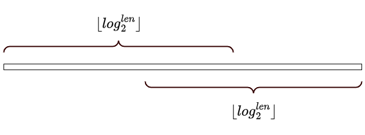

[[TOC]]

## 摘要

ST (Sparse Table, 稀疏表) 算法是一种基于倍增思想的数据结构，专门用于高效解决静态区间的可重复贡献问题（Range Query Problem），最典型的应用是区间最值查询（RMQ, Range Maximum/Minimum Query）。ST 表通过预处理，可以在 $O(n \log n)$ 的时间内构建，之后便能以 $O(1)$ 的时间复杂度回答任意区间的查询，在处理海量静态区间查询时具有极高的效率。

## 背景与动机

在算法竞赛和实际工程中，我们经常会遇到需要反复查询某个数据序列某一区间的最大值或最小值的问题。例如，在金融数据分析中，可能需要查询某只股票在任意时间段内的最高价；在传感器网络中，需要查询某一时间窗口内的最高温度。

对于这类问题，最朴素的方法是每次查询都遍历整个区间，但当查询次数非常多时，这种方法的效率会变得无法接受。ST 表算法提供了一种近乎完美的解决方案：它通过一次性的预处理，将后续每次查询的成本降至常数时间，从而极大地提升了处理静态区间查询的性能。

## 问题定义

给定一个长度为 $n$ 的静态数组 $A = [a_1, a_2, \dots, a_n]$，以及 $m$ 次查询。每次查询给定一个区间 $[l, r]$（$1 \le l \le r \le n$），要求返回该区间内的最大值，即 $\max(a_l, a_{l+1}, \dots, a_r)$。

“静态”意味着数组 $A$ 的元素在所有查询过程中都不会被修改。

## 一句话算法

利用倍增思想，预处理出所有从 $i$ 开始、长度为 $2^j$ 的区间的最值，查询时用两个预处理过的区间覆盖整个查询范围。

## 关键思路

ST 表的核心是 **倍增（Binary Lifting）** 和 **动态规划（Dynamic Programming）**。

我们定义一个二维数组 `st[i][j]`，表示从数组下标 `i` 开始，连续 $2^j$ 个元素中的最大值。换句话说，`st[i][j]` 存储的是区间 $[i, i + 2^j - 1]$ 的最大值。

这个定义具有巧妙的递推性质。一个长度为 $2^j$ 的区间，可以被看作是两个长度为 $2^{j-1}$ 的小区间拼接而成。具体来说，区间 $[i, i + 2^j - 1]$ 可以被拆分为 $[i, i + 2^{j-1} - 1]$ 和 $[i + 2^{j-1}, i + 2^j - 1]$ 这两个子区间。

因此，我们可以得到状态转移方程：
$$
st[i][j] = \max(st[i][j-1], st[i + 2^{j-1}][j-1])
$$

这个方程的含义是：从 `i` 开始长度为 $2^j$ 的区间的最大值，等于它左半部分（从 `i` 开始，长度 $2^{j-1}$）和右半部分（从 `i + 2^{j-1}` 开始，长度 $2^{j-1}$）的最大值中的较大者。


通过这个递推式，我们可以在 $O(n \log n)$ 的时间内完成整个 `st` 表的预处理。

## 得到$\lfloor log_2^n \rfloor$

这里给三种方案

### 1. 使用换底公式

```cpp
int log2(int n) {
    return log(n)/log(2);
}
```

### 2. 使用dp思想

这里使用数学思想,对于整数$n$来说,它的$\lfloor log_2^n \rfloor$等价于$b$对应的二进制$bin(n)$只保留最高位置的1,其余位置全部置为0后得到的数.

定义:
- $bin(n)$ 表示$n$的二进制表示
- $highbit(n)$ 表示$bin(n)$最高位置的1所在的位置,从0开始计数
  -  例如: $bin(12) = 1100$, $highbit(12) = 3$
  - 显然边界 $highbit(1) = 0$
  -  显然: $1 \ll highbit(n) = \lfloor log_2^n \rfloor$

那么我们可以得到 $highbit(n)$的递推关系式

$$
highbit(n) = highbit(n \gg 1) +1
$$


此公式(DP方程)的正确性,可以使用数学归纳法证明.

```cpp
// 存储每个数字对应的最高位是第几位
int  highbit[maxn]; 
void init_highbit() {
    highbit[0] = -1;
    for(int i = 1; i <= n; i++) {
        highbit[i] = highbit[i>>1] + 1;
    }
}

//得到对应的$\lfloor log_2^n \rfloor$
int log2(int n) {
    return 1 << highbit[n];
}
```

### 3 log_table 预处理
由对数运算法则 $\log_2(x/2) = \log_2(x) - \log_2(2) = \log_2(x) - 1$，且向下取整函数满足性质 $\lfloor y - 1 \rfloor = \lfloor y \rfloor - 1$，移项即得证。

```cpp
int log_table[MAXN]; 

// 预处理对数表，用于O(1)计算log2
void precompute_log(int n) {
    log_table[1] = 0;
    for (int i = 2; i <= n; i++) {
        log_table[i] = log_table[i / 2] + 1;
    }
}
```

### 4. 使用 `__builtin_clz`

`__builtin_clz()`是gcc内置的函数,可以得到数字对应的二进制左边的0的数量.


```cpp
template<typename T
T log2(T n) {
    return 1<< ( sizeof(T) *8 - 1 - __builtin_clz(n) );
}
```

## 算法步骤

### 1. 预处理 (构建 ST 表)

1.  **初始化**: `st[i][0]` 直接存储数组的第 `i` 个元素 `A[i]`，因为长度为 $2^0=1$ 的区间的最大值就是它本身。
2.  **递推**: 使用双重循环进行计算。外层循环遍历 `j` 从 1 到 $\log_2 n$，代表区间的长度 ($2^j$)。内层循环遍历 `i` 从 1 到 $n - 2^j + 1$，代表区间的起始位置。
3.  **状态转移**: 在循环中，应用状态转移方程 `st[i][j] = max(st[i][j-1], st[i + (1 << (j-1))][j-1])` 来填充整个 `st` 表。

### 2. 查询

对于任意查询区间 $[l, r]$，我们可以用两个预处理好的、长度相等的子区间来完全覆盖它。

1.  **计算长度**: 计算查询区间的长度 $len = r - l + 1$。
2.  **确定子区间大小**: 找到最大的整数 $k$，使得 $2^k \le len$。这个 $k$ 可以通过 $k = \lfloor \log_2(len) \rfloor$ 快速计算。
3.  **合并结果**: 查询区间的最大值，就等于覆盖它的两个子区间的最大值。这两个子区间分别是：
    -   从 `l` 开始，长度为 $2^k$ 的区间，即 $[l, l + 2^k - 1]$。
    -   从 `r - 2^k + 1` 开始，长度为 $2^k$ 的区间，即 $[r - 2^k + 1, r]$。

    这两个区间的并集必然覆盖了整个 $[l, r]$。因此，查询结果为:
    $$
    \text{query}(l, r) = \max(st[l][k], st[r - 2^k + 1][k])
    $$



!!! note "为什么可以重复？"
    ST 表查询时选择的两个子区间 `[l, l + 2^k - 1]` 和 `[r - 2^k + 1, r]` 可能会有重叠部分，但为什么结果仍然是正确的？关键在于所执行的区间运算是否满足 **幂等性 (Idempotence)**。

    如果一个运算 `op` 满足 `x op x = x`，我们就称该运算是幂等的。例如 `max(a, a) = a`，`min(a, a) = a`，`gcd(a, a) = a` 都是幂等运算。当运算满足幂等性时，重叠区间内的元素被计算两次不会影响最终结果。

    这类问题也被称为 **可重复贡献问题**。ST 表正是利用了这一性质来简化查询。然而，对于求和（`a + a = 2a`）、异或和（`a ^ a = 0`）这类不满足幂等性的操作，则不能直接使用 ST 表。
!!!

## 复杂度分析

-   **时间复杂度**:
    -   预处理：外层循环 $\log n$ 次，内层循环 $n$ 次，因此预处理的时间复杂度为 $O(n \log n)$。
    -   查询：每次查询只需要计算 $k$ 并访问两次 `st` 表，时间复杂度为 $O(1)$。
-   **空间复杂度**:
    -   需要一个大小为 $n \times (\log n + 1)$ 的二维数组来存储 `st` 表，因此空间复杂度为 $O(n \log n)$。

## 代码实现

```cpp
#include <iostream>
#include <vector>
#include <cmath>
#include <algorithm>

using namespace std;

const int MAXN = 100005;
const int LOGN = 17; // ceil(log2(100005))

int st[MAXN][LOGN];
int log_table[MAXN];

// 预处理对数表，用于O(1)计算log2
void precompute_log(int n) {
    log_table[1] = 0;
    for (int i = 2; i <= n; i++) {
        log_table[i] = log_table[i / 2] + 1;
    }
}

// 构建ST表
void build_st(const vector<int>& arr) {
    int n = arr.size();
    precompute_log(n);

    // 初始化长度为 2^0 = 1 的区间
    for (int i = 0; i < n; i++) {
        st[i][0] = arr[i];
    }

    // 递推构建
    for (int j = 1; (1 << j) <= n; j++) {
        for (int i = 0; i + (1 << j) <= n; i++) {
            st[i][j] = max(st[i][j - 1], st[i + (1 << (j - 1))][j - 1]);
        }
    }
}

// 查询区间 [l, r] 的最大值 (0-indexed)
int query(int l, int r) {
    int k = log_table[r - l + 1];
    return max(st[l][k], st[r - (1 << k) + 1][k]);
}

int main() {
    // --- 测试用例 ---
    vector<int> arr = {3, 1, 4, 1, 5, 9, 2, 6};
    int n = arr.size();

    build_st(arr);

    cout << "Array: ";
    for (int x : arr) {
        cout << x << " ";
    }
    cout << endl << endl;

    // 测试查询
    int l1 = 0, r1 = 4; // 区间 [3, 1, 4, 1, 5], 期望最大值: 5
    cout << "Query [" << l1 << ", " << r1 << "]: " << query(l1, r1) << endl;

    int l2 = 3, r2 = 7; // 区间 [1, 5, 9, 2, 6], 期望最大值: 9
    cout << "Query [" << l2 << ", " << r2 << "]: " << query(l2, r2) << endl;

    int l3 = 2, r3 = 2; // 区间 [4], 期望最大值: 4
    cout << "Query [" << l3 << ", " << r3 << "]: " << query(l3, r3) << endl;

    return 0;
}
```

## 测试用例

假设我们有数组 `A = {3, 1, 4, 1, 5, 9, 2, 6}`。

**预处理过程**:
`st` 表的一部分如下：
-   `st[0][0] = 3`, `st[1][0] = 1`, `st[2][0] = 4`, ...
-   `st[0][1] = max(st[0][0], st[1][0]) = max(3, 1) = 3`
-   `st[1][1] = max(st[1][0], st[2][0]) = max(1, 4) = 4`
-   `st[0][2] = max(st[0][1], st[2][1]) = max(3, max(4,1)) = 4` (st[2][1]=max(st[2][0],st[3][0])=max(4,1)=4)
-   ...

**查询区间 `[0, 4]`**:
1.  查询区间为 `[0, 4]`，长度 $len = 5$。
2.  计算 $k = \lfloor \log_2(5) \rfloor = 2$。
3.  结果为 $\max(st[0][2], st[4 - 2^2 + 1][2]) = \max(st[0][2], st[1][2])$。
    -   `st[0][2]` 代表区间 `[0, 3]` (即 {3, 1, 4, 1}) 的最大值，为 4。
    -   `st[1][2]` 代表区间 `[1, 4]` (即 {1, 4, 1, 5}) 的最大值，为 5。
4.  最终结果为 $\max(4, 5) = 5$。

**代码运行结果**:
```
Array: 3 1 4 1 5 9 2 6

Query [0, 4]: 5
Query [3, 7]: 9
Query [2, 2]: 4
```

## 实践思考与扩展

-   **其他可重复贡献问题**: 除了最大/最小值，ST 表同样适用于求解区间的最大公约数 (GCD)、最小公倍数 (LCM)、按位与 (AND)、按位或 (OR) 等。
-   **二维 ST 表**: ST 表可以扩展到二维，用于查询矩阵子区域的最值，但时空复杂度会相应增加。
-   **动态区间查询**: ST 表的局限性在于它是一个静态数据结构。如果数组元素需要频繁更新，那么每次更新后都需要重新预处理，成本很高。在这种情况下，线段树（Segment Tree）或树状数组（Fenwick Tree）是更好的选择。
-   **$O(1)$ 计算 $\log_2$**: 在代码实现中，我们通过 `log_table` 数组预处理了所有可能长度的对数值，从而将查询中的 `log` 计算也优化到了 $O(1)$。也可以使用 `__builtin_clz` (GCC/Clang) 等内置函数来高效计算。

## 经典例题

<%- include("./经典例题.md") %>

## 参考

-   倍增思想
-   动态规划
