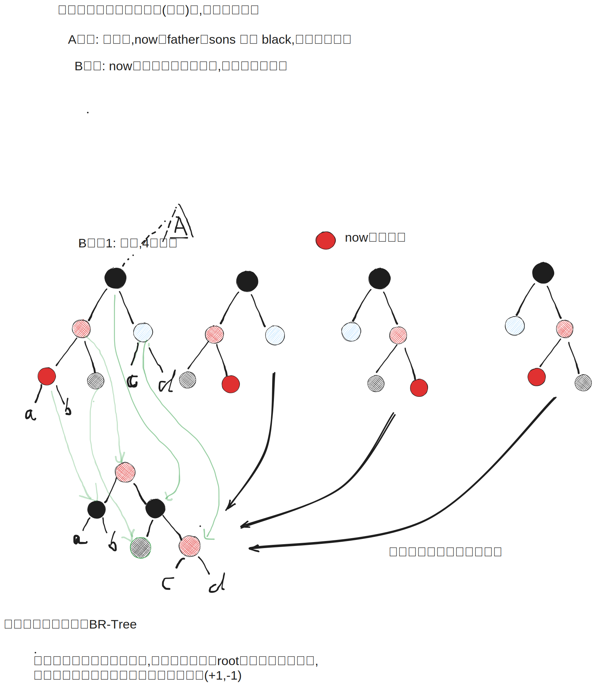

[[TOC]]

## 红黑树的数据结构定义

首先，我们需要定义红黑树的数据结构，包括颜色和节点的定义：

```haskell
-- | 定义颜色
data Color = R | B deriving (Eq, Show)

-- | 定义红黑树节点
-- | 'Empty' 代表空叶子节点（NIL），在红黑树中视为黑色
-- | 'Node c l k r' 代表一个节点，c 是颜色，k 是键值，l 和 r 分别是左右子树
data RBTree a = Empty
              | Node Color (RBTree a) a (RBTree a)
              deriving (Eq)

-- | 自定义 Show 实例
instance (Show a) => Show (RBTree a) where
    show Empty = "NIL"
    show (Node c l k r) = 
        let colorStr = case c of R -> "R" ; B -> "B"
        in "(" ++ colorStr ++ ":" ++ show k ++ " " ++ show l ++ " " ++ show r ++ ")"
```

## 旋转操作

旋转是红黑树维护平衡的基本操作。旋转不会破坏二叉搜索树的性质，但会改变树的结构，用于在插入和删除后重新平衡树。




### 左旋 (Left Rotation)

左旋将某个节点向左旋转，使其右子节点成为新的子树根：

```haskell
-- | 左旋操作
-- | rotateLeft (Node c l k (Node rc rl rk rr)) = Node c (Node c l k rl) rk rr
rotateLeft :: RBTree a -> RBTree a
rotateLeft Empty = Empty  -- 空树无法旋转
rotateLeft (Node c l k r) =
    case r of
        Empty -> Node c l k r  -- 右子树为空，无法旋转
        Node rc rl rk rr -> 
            Node c (Node c l k rl) rk rr  -- 新的根节点是原来的右子节点
```

### 右旋 (Right Rotation)

右旋是左旋的镜像操作，将某个节点向右旋转：

```haskell
-- | 右旋操作
-- | rotateRight (Node c (Node lc ll lk lr) k r) = Node c ll lk (Node c lr k r)
rotateRight :: RBTree a -> RBTree a
rotateRight Empty = Empty  -- 空树无法旋转
rotateRight (Node c l k r) =
    case l of
        Empty -> Node c l k r  -- 左子树为空，无法旋转
        Node lc ll lk lr -> 
            Node c ll lk (Node c lr k r)  -- 新的根节点是原来的左子节点
```

### 数学表示

旋转操作的数学表示（如你所提供的公式）：

$$
\begin{array}{rcl}
\text{rotate\_left}(a, x, (b, y, c)) & = & ((a, x, b), y, c) \\
\text{rotate\_right}((a, x, b), y, c) & = & (a, x, (b, y, c))
\end{array}
$$

其中：
- `rotate_left(a, x, (b, y, c))` 表示对以 `x` 为根，左子树为 `a`，右子树为 `(b, y, c)` 的树进行左旋
- `rotate_right((a, x, b), y, c)` 表示对以 `y` 为根，左子树为 `(a, x, b)`，右子树为 `c` 的树进行右旋

### 旋转的性质

1. **保持BST性质**：旋转操作不会破坏二叉搜索树的有序性质
2. **改变树高**：旋转可以改变子树的高度，用于平衡
3. **可逆性**：左旋和右旋互为逆操作
4. **局部操作**：旋转只影响涉及的节点及其直接子节点

### 测试旋转操作

```haskell
-- | 测试旋转操作
testRotations :: IO ()
testRotations = do
    putStrLn "--- 旋转操作测试 ---"
    
    -- 构建一个简单的树用于测试
    let tree = Node B (Node B Empty 1 Empty) 2 (Node B Empty 3 Empty)
    putStrLn $ "原始树: " ++ show tree
    
    -- 测试左旋
    let leftRotated = rotateLeft tree
    putStrLn $ "左旋后: " ++ show leftRotated
    
    -- 构建另一个树用于测试右旋
    let tree2 = Node B (Node B Empty 1 (Node B Empty 2 Empty)) 3 Empty
    putStrLn $ "原始树2: " ++ show tree2
    
    -- 测试右旋
    let rightRotated = rotateRight tree2
    putStrLn $ "右旋后: " ++ show rightRotated
    
    -- 测试旋转的可逆性
    let doubleLeft = rotateLeft (rotateLeft tree)
    putStrLn $ "连续左旋两次: " ++ show doubleLeft
    
    let leftThenRight = rotateRight (rotateLeft tree)
    putStrLn $ "左旋后右旋: " ++ show leftThenRight
```

### 旋转在红黑树中的应用

旋转通常与重新着色结合使用，用于：
1. **插入修复**：当插入新节点破坏红黑树性质时
2. **删除修复**：当删除节点破坏黑高平衡时
3. **调整结构**：将红色节点上移或下移

旋转是红黑树自平衡机制的核心，理解旋转对于掌握红黑树的插入和删除操作至关重要。

## 完整的旋转实现示例

下面是一个更详细的 Haskell 实现，包含测试用例：

```haskell
-- | 从列表构建红黑树（简单的BST插入，不考虑红黑性质）
insert :: (Ord a) => a -> RBTree a -> RBTree a
insert x Empty = Node B Empty x Empty  -- 新节点默认为黑色
insert x (Node c l k r)
    | x < k     = Node c (insert x l) k r
    | x > k     = Node c l k (insert x r)
    | otherwise = Node c l k r  -- 重复值不插入

-- | 中序遍历（验证旋转不破坏BST性质）
inorder :: RBTree a -> [a]
inorder Empty = []
inorder (Node _ l k r) = inorder l ++ [k] ++ inorder r

-- | 计算树的高度（验证旋转改变树高）
height :: RBTree a -> Int
height Empty = 0
height (Node _ l k r) = 1 + max (height l) (height r)

-- | 测试旋转操作
testRotations :: IO ()
testRotations = do
    let tree = Node B (Node B Empty 1 Empty) 2 (Node B Empty 3 Empty)
    putStrLn $ "原始树: " ++ show tree
    putStrLn $ "中序遍历: " ++ show (inorder tree)
    
    let leftRotated = rotateLeft tree
    putStrLn $ "左旋后: " ++ show leftRotated
    putStrLn $ "中序遍历: " ++ show (inorder leftRotated)
    putStrLn $ "遍历顺序保持: " ++ show (inorder tree == inorder leftRotated)
```

## 旋转操作的数学性质

### 1. 保持二叉搜索树性质

旋转操作保持中序遍历的结果不变：

**定理**：对于任何树 `T`，`inorder T = inorder (rotateLeft T) = inorder (rotateRight T)`

**证明**：
以左旋为例，设 `T = Node c l k (Node rc rl rk rr)`：
- `inorder T = inorder l ++ [k] ++ inorder rl ++ [rk] ++ inorder rr`
- `rotateLeft T = Node c (Node c l k rl) rk rr`
- `inorder (rotateLeft T) = inorder (Node c l k rl) ++ [rk] ++ inorder rr`
- `= inorder l ++ [k] ++ inorder rl ++ [rk] ++ inorder rr`
- 因此 `inorder T = inorder (rotateLeft T)`

### 2. 可逆性

左旋和右旋互为逆操作：

**定理**：对于可以旋转的树 `T`：
- `rotateRight (rotateLeft T) = T`
- `rotateLeft (rotateRight T) = T`

### 3. 高度变化

旋转可以改变子树的高度：

- **左旋**：右子树高度可能减少，左子树高度可能增加
- **右旋**：左子树高度可能减少，右子树高度可能增加

这个性质使得旋转成为平衡树的有效工具。

## 旋转在平衡操作中的作用

在红黑树中，旋转通常与重新着色结合使用：

1. **LL情况**：右旋解决左子树过重
2. **RR情况**：左旋解决右子树过重  
3. **LR情况**：先左旋子树，再右旋根节点
4. **RL情况**：先右旋子树，再左旋根节点

这些模式在AVL树和红黑树的插入/删除修复中都会出现。

## 红黑树的定义

好的，这是红黑树（Red-Black Tree）的定义和规则。

红黑树是一种自平衡的二叉查找树（BST）。它在二叉查找树的基础上，在每个节点上增加了一个存储位来表示节点的颜色（红色或黑色），并通过约束任何一条从根到叶子的路径上的节点颜色，来确保树保持大致平衡，从而保证在最坏情况下的查找、插入和删除操作的时间复杂度均为 O(log n)。

红黑树必须满足的五条性质：

1. 节点颜色特性：每个节点要么是红色，要么是黑色。
2. 根节点特性：根节点必须是黑色的。
3. 叶子节点（NIL）特性：所有叶子节点（NIL 节点，即空节点）都是黑色的。
4. 红色节点特性：红色节点的两个子节点都必须是黑色的。（即不能有两个连续的红色节点出现在一条路径上）。
5. 路径特性：从任意一个节点到其每个后代叶子节点（NIL）的所有简单路径上，包含相同数量的黑色节点。这个数量称为该节点的黑高（black height）。

关键理解点：

· 为何能平衡：性质4和性质5共同作用，确保了从根到最远叶子的路径（可能红黑相间）不会比从根到最近叶子的路径（全黑）长过两倍。这种“大致平衡”避免了二叉查找树退化成链表的情况。
· NIL 节点：在讨论红黑树时，所有原本为 null 的子节点都被视为指向一个黑色的、不存储数据的 NIL 节点。这简化了定义，使得每个具有数据的节点都有两个子节点（虽然可能是NIL）。
· 操作与修复：当进行插入或删除操作时，可能会暂时违反这些性质。因此，需要通过重新着色和旋转（左旋和右旋）来调整树的结构，使其重新满足所有红黑树性质。这些操作是红黑树实现自平衡的核心。

与其他结构的对比：

| 特性 | 普通二叉查找树 (BST) | AVL 树 | 红黑树 |
|------|---------------------|--------|--------|
| 平衡性 | 可能不平衡 | 严格平衡 | 大致平衡 |
| 查询效率 | 最坏 O(n) | 高 (O(log n)) | 高 (O(log n)) |
| 插入/删除效率 | 最坏 O(n) | 相对较低（需要更多旋转来维持严格平衡） | 相对较高（需要更少的旋转） |
| 适用场景 | 不适用需要保证性能的场景 | 查询多，插入/删除少的场景（如数据库索引） | 插入/删除操作频繁的场景（如 Linux 内核进程调度、Java HashMap、C++ STL map/set） |

总而言之，红黑树通过在节点中引入颜色属性和一套约束规则，以相对较少的维护成本（相比AVL树）换取了高效的综合性能，使其成为实践中应用非常广泛的一种数据结构。

## 性质5保持平衡的原因。

好的，这是一个非常核心的问题。红黑树的性质5之所以能保证树的“大致平衡”，关键在于它与性质4（红色节点不能连续）相结合，共同约束了最长路径的长度不会超过最短路径的两倍。

让我们一步步来分解这个逻辑：

1. 性质5的核心：黑高（Black Height）一致

性质5规定：从任意节点到其每个后代叶子节点（NIL）的所有路径上，包含相同数量的黑色节点。

这意味着，对于树中的任何一个节点，你从这个节点出发，无论选择哪条路往下走到NIL叶子节点，沿途经过的黑色节点的数量都是完全一样的。这个数量被称为该节点的黑高。

· 整棵树的黑高就是根节点的黑高。
· 由于根节点是黑色的（性质2），所以每条从根到叶子的路径上，黑色节点的数量至少为1。

2. 与性质4结合：限制路径的“膨胀”

性质4规定：红色节点的两个子节点都必须是黑色的。 这保证了不会出现两个连续的红色节点。

现在，我们考虑从根节点到叶子节点的最短可能路径和最长可能路径：

· 最短路径：这条路径为了尽可能短，会尽量少包含节点。根据规则，它只能由黑色节点组成。
  · 设整棵树的黑高为 bh，那么最短路径的长度就是 bh（全是黑色节点）。
· 最长路径：这条路径为了尽可能长，会在遵守规则的前提下，尽可能多地插入红色节点。根据性质4，红色节点不能连续，所以最长路径的模式必须是 黑-红-黑-红-...-黑 交替出现。
  · 因为黑高是固定的 bh，所以这条路径上黑色节点的数量仍然是 bh。
  · 在保证黑色节点不连续的前提下，最多可以在每两个黑色节点之间插入一个红色节点。因此，红色节点的数量最多也能达到 bh。
  · 所以，最长路径的长度（总节点数）是黑色节点数 + 红色节点数 = bh + bh = 2bh。

3. 结论：最长路径不会超过最短路径的两倍

· 最短路径长度：bh (全黑)
· 最长路径长度：2bh (黑红交替)

因此，最长路径最多是最短路径长度的 2 倍。

这个“2倍”的约束条件，就保证了红黑树是大致平衡的。树的高度始终被维持在 O(log n) 的级别，从而使得所有基于树高的操作（查找、插入、删除）的时间复杂度最坏情况下也是 O(log n)。

---

一个极端的例子

假设一棵红黑树的黑高 bh = 3。

· 最短路径：3 个节点（例如：根 -> 黑 -> 黑 -> NIL）
· 最长路径：6 个节点（例如：根（黑）-> 红 -> 黑 -> 红 -> 黑 -> NIL）


## 插入操作

红黑树的插入操作包含两个阶段：首先执行标准的二叉搜索树（BST）插入，然后通过修复操作（重新着色和旋转）来维持红黑树的性质。

### 第一步：执行标准BST插入

1.  **定位插入点**：与普通二叉搜索树一样，从根节点开始，通过比较键值，找到新节点合适的插入位置。
2.  **插入新节点**：将新节点插入到指定位置。
3.  **设置初始颜色**：将新插入的节点着色为 **红色**。

**为何将新节点设为红色？**
*   如果设为黑色，会改变其所在路径上黑色节点的数量，直接违反性质5（黑高一致性）。修复黑高失衡非常复杂。
*   如果设为红色，不会违反性质5。它唯一可能违反的性质是性质4（红色节点的子节点必须是黑色），即当新节点的父节点也是红色时。修复“红-红”冲突相对简单。

### 第二步：修复红黑树性质

如果新插入的红色节点 `z` 的父节点 `p` 是黑色的，那么所有性质都得以保持，无需任何操作。

如果父节点 `p` 也是红色的，则出现了“红-红”冲突，违反了性质4。此时，必须进行修复。由于父节点 `p` 是红色，那么它一定不是根节点，所以它必然有一个父节点，即 `z` 的祖父节点 `g`，并且 `g` 必须是黑色的。

修复过程是一个循环，从 `z` 开始，持续向上调整，直到“红-红”冲突被解决。在循环的每一步，我们关注当前节点 `z`、其父节点 `p`、祖父节点 `g`，以及祖父节点 `g` 的另一个子节点 `y`（通常称为叔叔节点）。

修复策略根据 `z` 的父节点 `p` 是 `g` 的左孩子还是右孩子分为两大类，每一类又根据 `y` 节点的颜色和 `z` 的位置分为不同情况。

---

#### A. 父节点 `p` 是祖父节点 `g` 的左孩子

此时，`p = g.left`。设 `y = g.right`。

**情况 A.1: `y` 节点是红色**

此情况通过重新着色来解决。
1.  将父节点 `p` 的颜色变为 **黑色**。
2.  将 `y` 节点的颜色变为 **黑色**。
3.  将祖父节点 `g` 的颜色变为 **红色**。
4.  将当前节点 `z` 指向祖父节点 `g` (`z = g`)，然后从新的 `z` 开始，继续向上进行修复（返回循环开始处）。

**情况 A.2: `y` 节点是黑色，且 `z` 是 `p` 的右孩子 (LR-情形)**

此情况属于“内侧”插入，需要一次旋转将其转换为“外侧”插入（情况A.3）。
1.  将当前节点 `z` 指向父节点 `p` (`z = p`)。
2.  对新的 `z`（即原父节点`p`）执行 **左旋**。
3.  经过旋转，`z` 的结构转变为情况A.3，按A.3处理。

**情况 A.3: `y` 节点是黑色，且 `z` 是 `p` 的左孩子 (LL-情形)**

此情况属于“外侧”插入，通过一次旋转和重新着色即可完成修复。
1.  将父节点 `p` 的颜色变为 **黑色**。
2.  将祖父节点 `g` 的颜色变为 **红色**。
3.  对祖父节点 `g` 执行 **右旋**。
4.  修复完成，循环终止。

---

#### B. 父节点 `p` 是祖父节点 `g` 的右孩子

此情况与A类对称。此时，`p = g.right`。设 `y = g.left`。

**情况 B.1: `y` 节点是红色**

操作与情况A.1完全相同。
1.  将父节点 `p` 的颜色变为 **黑色**。
2.  将 `y` 节点的颜色变为 **黑色**。
3.  将祖父节点 `g` 的颜色变为 **红色**。
4.  将当前节点 `z` 指向祖父节点 `g` (`z = g`)，继续向上修复。

**情况 B.2: `y` 节点是黑色，且 `z` 是 `p` 的左孩子 (RL-情形)**

此情况与情况A.2对称。
1.  将当前节点 `z` 指向父节点 `p` (`z = p`)。
2.  对新的 `z`（即原父节点`p`）执行 **右旋**。
3.  经过旋转，`z` 的结构转变为情况B.3，按B.3处理。

**情况 B.3: `y` 节点是黑色，且 `z` 是 `p` 的右孩子 (RR-情形)**

此情况与情况A.3对称。
1.  将父节点 `p` 的颜色变为 **黑色**。
2.  将祖父节点 `g` 的颜色变为 **红色**。
3.  对祖父节点 `g` 执行 **左旋**。
4.  修复完成，循环终止。

---

### 第三步：确保根节点为黑色

在整个修复过程结束后，根节点可能会被标记为红色（例如在情况A.1/B.1中，问题一直上传到根部）。因此，最后必须执行一步：

*   将树的根节点强制着色为 **黑色**。

这确保了性质2（根节点是黑色）始终成立，并且不会影响其他性质。

### 插入流程总结

1.  **BST插入**：将新节点作为 **红色** 节点插入。
2.  **循环修复**：如果 `z` 的父节点是红色，则进入循环：
    *   根据父节点、祖父节点和其另一个子节点的位置与颜色，匹配上述 A.1, A.2, A.3 或 B.1, B.2, B.3 中的一种情况进行处理。
    *   情况 A.1/B.1（对应节点的叔叔为红）会使循环继续。
    *   情况 A.3/B.3（对应节点的叔叔为黑，外侧）会终止循环。
    *   情况 A.2/B.2（对应节点的叔叔为黑，内侧）会转换为外侧情况后处理并终止。
3.  **设置根节点**：将根节点设为 **黑色**。

通过这套机制，红黑树在插入新节点后，能够通过有限次数的重新着色和旋转操作（最多两次旋转），高效地恢复平衡，确保所有操作的时间复杂度保持在 O(log n)。


## 删除

好的，我们来详细地、系统地讲解红黑树的删除操作。这是一个相对复杂的过程，但我会尽量拆解，让你能清晰地理解每一步。

前言：为什么删除如此复杂？

红黑树的删除之所以比插入复杂，根本原因在于：我们实际删除的节点，可能并不是我们最初想要删除的那个键所在的节点。

在BST删除中，我们知道有三种情况：

1. 要删除的节点是叶子节点。
2. 要删除的节点只有一个子节点。
3. 要删除的节点有两个子节点。

红黑树继承了这些情况，但为了维护自身的五大性质，它在删除后需要进行额外的调整（重新着色和旋转）。删除一个红色节点通常很容易，但删除一个黑色节点会破坏性质5（从任一节点到其每个叶子的所有路径都包含相同数目的黑色节点），导致某条路径上“黑高”减少，因此需要复杂的修复。

---

第一步：标准的BST删除

我们首先像在普通二叉搜索树中一样执行删除。设要删除的节点为 z。

1. 如果 z 没有子节点（是叶子节点）：直接删除它，并用 NIL 替换它的位置。
2. 如果 z 只有一个子节点：删除 z，并用它的唯一子节点替换它的位置。
3. 如果 z 有两个子节点：
   · 找到 z 的后继（successor） 节点（即右子树中的最小节点），我们称这个后继节点为 y。
   · 将 z 的键和值复制为 y 的键和值。
   · 现在，问题转化为删除节点 y。注意，这个 y 节点最多只有一个子节点（因为它是最小节点，不可能有左子节点）。

关键结论：无论最初要删除的节点是哪种情况，我们最终实际删除的节点（我们称之为 victim）要么是叶子节点，要么是只有一个子节点的节点。我们将重点关注这个 victim 节点的删除和后续的修复。

设：

· v：最终被删除的节点 (victim)。
· u：用来替换 v 的节点 (replacement)。如果 v 是叶子节点，u 是 NIL；如果 v 有一个子节点，u 就是那个子节点。
· p：v 的父节点。

执行删除：将 v 从树中移除，并用 u 替换 v 的位置（即让 p 指向 u）。

现在，如果 v 是红色的，那么删除它不会影响黑高，也不会违反任何性质（红色节点的子节点和父节点都是黑色，所以替换节点 u 接替它的位置不会引入连续红色等问题）。删除结束。

如果 v 是黑色的，问题就来了。u 现在占据了 v 的位置，但 u 的路径上少了一个黑色节点（因为 v 是黑的）。这破坏了性质5。我们把这种情况称为：节点 u 现在“双黑”了。它代表了一个额外的“黑色”重量，我们需要通过后续的修复步骤来消除这个“双黑”状态，使树重新平衡。

---

第二步：修复“双黑”问题

现在，我们进入核心的修复阶段。我们假设 u 是“双黑”的（或者 u 是 NIL，也被视为“双黑”）。我们的目标是通过一系列旋转和重新着色，将这个额外的“黑色”向上传播，直到它被消除。

我们会根据 u 的兄弟节点 (sibling, s) 和兄弟节点的子节点以及父亲节点的颜色，分多种情况来处理。u 的位置可能是其父节点 p 的左孩子或右孩子，但情况是对称的。我们以 u 是左孩子为例进行讲解（u 是右孩子的情况完全对称）。

定义：

· u: 双黑节点（当前关注的节点）
· p: u 的父节点
· s: u 的兄弟节点（p 的另一个孩子）
· s_left (sl): 兄弟节点 s 的左孩子
· s_right (sr): 兄弟节点 s 的右孩子

总共有 4 种主要情况：

### 情况1：兄弟 s 是红色

情况：s 是红色的。 推论：根据红黑树性质，p和 s 的子节点 (sl, sr) 必须是黑色的。

目标：将这种情况转换为兄弟节点是黑色的情况（情况2、3或4），因为我们对黑色兄弟节点的操作更直接。

操作：

1. 将兄弟节点 s 着为黑色。
2. 将父节点 p 着为红色。
3. 对父节点 p 进行左旋（如果 u 是左孩子）。
4. 旋转后，u 有了一个新的兄弟节点（原红色兄弟 s 的左孩子 sl，这个节点是黑色的）。现在问题进入了情况2、3或4。

(完成后，继续根据新的兄弟节点颜色判断属于情况2、3、4中的哪一种)

Before Case 1

```
        P(黑)                          S(红)
       / \                           /   \
   u(双黑) S(红)      --左旋P-->    P(红)   sr(黑)
          / \                      /  \
       sl(黑) sr(黑)          u(双黑) sl(黑)
```

After Case 1 (Now S is black, proceed to other cases)

---

### 情况2：兄弟 s 是黑色，且兄弟的两个孩子都是黑色

情况：s 是黑色的，并且 s 的两个孩子 (sl, sr) 都是黑色的。

目标：将“双黑”问题上推到父节点 p。我们通过将兄弟节点 s 变红来抵消 u 的“双黑”。

操作：

1. 将兄弟节点 s 重新着为红色。
2. 此时，以 p 为根的子树黑高恢复了平衡（u 和 s 路径上的黑色节点数一致了），但 p 的父路径上可能少了一个黑色（如果 p 原来是红色的，现在它变成了新的“双黑”问题的根源；如果 p 原来是黑色的，它就变成了“双黑”）。
3. 递归处理：
   · 如果 p 原来是红色：直接将 p 着为黑色。修复结束！因为红色节点变成黑色，正好弥补了失去的黑色，黑高恢复。
   · 如果 p 原来是黑色：那么 p 现在变成了新的“双黑”节点。我们将 u 指向 p，然后从情况1开始重新判断（即针对新的 u (p) 和它的兄弟节点等，重新开始这4种情况的判断）。

Case 2

```
        P(红或黑)                  P(可能双黑)
       / \                        / \
   u(双黑) S(黑)   --重着色-->   u(黑) S(红)
          / \                          / \
       sl(黑) sr(黑)                sl(黑) sr(黑)
// 如果P原为红，将其变黑即可结束。
// 如果P原为黑，则P成为新的双黑节点，继续向上修复。
```

---

### 情况3：兄弟 s 是黑色，兄弟的左孩子是红色，右孩子是黑色(近点)

情况：s 是黑色的，s 的左孩子 (sl) 是红色，右孩子 (sr) 是黑色。（如果 u 是右孩子，则条件相反：兄弟的右孩子是红色，左孩子是黑色）

目标：将这种情况转换为情况4（兄弟的右孩子是红色）。

操作：

1. 将兄弟 s 的左孩子 sl 着为黑色。
2. 将兄弟 s 着为红色。
3. 对兄弟节点 s 进行右旋。
4. 旋转后，u 有了一个新的兄弟节点（原 s 的左孩子 sl，现在这个新兄弟的右孩子是红色的 s）。现在转换成了情况4。

(完成后，进入情况4处理)

Before Case 3 (u is left child)

```
          P(?)                          P(?)
         / \                           / \
     u(双黑) S(黑)      --右旋S-->   u(双黑) sl(黑)
            / \                                 \
        sl(红) sr(黑)                          S(红)
                                                 \
                                                sr(黑)
```

After Case 3 (Now ready for Case 4)

---

### 情况4：兄弟 s 是黑色，兄弟的右孩子是红色(远点)(边界)

情况：s 是黑色的，s 的右孩子 (sr) 是红色。（如果 u 是右孩子，则条件是兄弟的左孩子是红色）

目标：这是终极情况，通过一次旋转和重新着色可以彻底解决问题。

操作：

1. 将兄弟节点 s 的颜色设置为父节点 p 的颜色。
2. 将父节点 p 着为黑色。
3. 将兄弟 s 的右孩子 sr 着为黑色。
4. 对父节点 p 进行左旋。
5. 移除 u 的“双黑”状态，将其着为普通的黑色。
6. 修复完成。整个树的黑高恢复平衡，所有红黑树性质都得到满足。

Case 4 (u is left child)

```
        P(颜色C)                          S(颜色C)
       / \       <-左旋P+重新着色        /   \
   u(双黑) S(黑)        ---->        P(黑)   sr(黑)
          / \                       /  \
       sl(?) sr(红)             u(黑) sl(?)
// 注意：sl(?)的颜色无关紧要。旋转后，u的“双黑”被消除，树恢复平衡。
```

---

总结与步骤回顾

1. 执行BST删除：找到实际要删除的节点 v（最多一个子节点）及其替换节点 u。
2. 判断是否需要修复：
   · 如果 v 是红色 -> 结束。
   · 如果 v 是黑色 -> u 成为“双黑”，进入修复流程。
3. 修复“双黑”节点 u：
   · While u 不是根节点且 u 是“双黑”状态：
     · 根据其兄弟 s 的颜色和兄弟子节点的颜色，判断属于4种情况中的哪一种。
     · Case 1: 兄弟红 -> 变兄弟黑，父红，旋转 -> 转换为兄弟黑的情况。
     · Case 2: 兄弟黑且兄弟的孩子都黑 -> 兄弟变红，“双黑”问题上交给父节点 p 递归处理。
     · Case 3: 兄弟黑且兄弟远侄子黑、近侄子红 -> 旋转和变色，转换为Case 4。
     · Case 4: 兄弟黑且兄弟远侄子红 -> 旋转和变色，问题解决，退出循环。
   · 最后，将 u 设为黑色（如果它是因为Case 2递归上来的普通节点，这一步确保它颜色正确；如果是从Case 4出来的，它已经被设为黑色了）。

这个过程通过向上迭代或递归，最终总能将“双黑”问题解决，使树恢复所有红黑树性质。理解这4种情况以及它们之间的转换关系是掌握红黑树删除的关键。