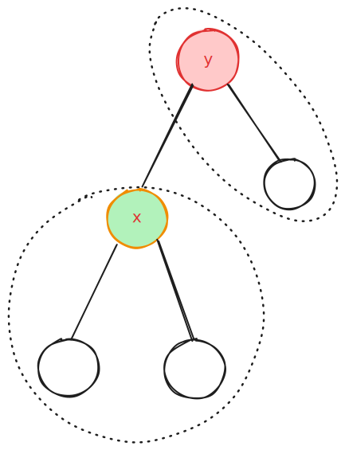

证明

旋转可以调整heap

旋转的本质是改变父子关系,提升孩子,降低父亲


堆的性质

1. 子树的根节点小于孩子节点(小根堆)
2. 子树的根节点小与树上的其它节点(传递性)
   

模式



1. `root(x)` 符合堆
2. `right (x)` 符合堆
3. `x,y`的值不符合,需要交换
4. 通过旋转交换,

我们把`x,y`看成一对(不符),那么这个"对"不停的上调,最终会消失


插入,很容易阿,不停的上调

## 删除

1. 节点的孩子数量(<=1),叶子或链上的点,直接删除,用孩子替代自己
2. 节点有两个孩子


下调点

旋转在堆的性质


子树的根是不符合堆的性质的点,通过旋转,下调根,

则产生了一个新的子树(这个递归)


## demo


```cpp
#include <bits/stdc++.h>
using namespace std;

const int N = 100005;
const int INF = 0x3f3f3f3f;

struct Treap {
    struct Node {
        int ch[2];  // ch[0]是左儿子, ch[1]是右儿子
        int val;    // 数值
        int dat;    // 随机优先级 (大根堆)
        int cnt;    // 副本数
        int size;   // 子树大小
    } t[N];

    int root, tot;
    mt19937 rnd; // 使用更好的随机数生成器

    Treap() { 
        rnd.seed(time(0)); 
        tot = 0; root = 0;
    }

    // --- 基础工具 ---
    int New(int val) {
        t[++tot].val = val;
        t[tot].dat = rnd();
        t[tot].size = t[tot].cnt = 1;
        t[tot].ch[0] = t[tot].ch[1] = 0;
        return tot;
    }

    void pushup(int p) {
        t[p].size = t[t[p].ch[0]].size + t[t[p].ch[1]].size + t[p].cnt;
    }

    // --- 核心：统一旋转 (Rotate) ---
    // d=0: 提升左儿子(右旋); d=1: 提升右儿子(左旋)
    // &p: 传入的是父节点指向当前节点的引用，修改它等同于修改了父节点的指针
    void rotate(int &p, int d) {
        int k = t[p].ch[d];          // 1. 抓住想要提上来的儿子 k (d方向)
        t[p].ch[d] = t[k].ch[d ^ 1]; // 2. 把 k 的内侧儿子(d^1)过继给 p
        t[k].ch[d ^ 1] = p;          // 3. 把 p 变成 k 的内侧儿子
        pushup(p);                   // 4. 先更新旧爹 p (现在它是儿子了)
        pushup(k);                   // 5. 再更新新爹 k
        p = k;                       // 6. 修改“钩子”，现在的根变成 k 了
    }

    // --- 插入 (Insert) ---
    void insert(int &p, int val) {
        if (!p) {
            p = New(val);
            return;
        }
        if (t[p].val == val) {
            t[p].cnt++;
            pushup(p);
            return;
        }
        
        // 这里的 d 计算非常精髓：
        // val < t[p].val  -> d=0 (去左边)
        // val > t[p].val  -> d=1 (去右边)
        int d = (val > t[p].val); 
        
        insert(t[p].ch[d], val);
        
        // 回溯时检查 Heap 性质：如果儿子(d方向)优先级 > 自己，就把儿子旋上来
        if (t[t[p].ch[d]].dat > t[p].dat) rotate(p, d);
        
        pushup(p);
    }

    // --- 删除 (Remove) ---
    void remove(int &p, int val) {
        if (!p) return;
        
        if (t[p].val == val) { // 找到了
            if (t[p].cnt > 1) { 
                t[p].cnt--; 
                pushup(p); 
                return; 
            }
            // 是叶子节点或只有一个孩子：直接用非空孩子顶替，或者变成0
            if (!t[p].ch[0] || !t[p].ch[1]) {
                p = t[p].ch[0] + t[p].ch[1]; 
                return;
            }
            // 两个孩子都在：比较优先级
            // 如果 右孩子优先级 > 左孩子优先级，d=1 (提右边)，否则 d=0 (提左边)
            int d = (t[t[p].ch[1]].dat > t[t[p].ch[0]].dat);
            
            rotate(p, d);         // 把优先级高的儿子旋上来
            remove(t[p].ch[d^1], val); // p 被旋到了内侧(d^1)，继续递归删除
            pushup(p);
        } 
        else { // 没找到，继续递归
            int d = (val > t[p].val);
            remove(t[p].ch[d], val);
            pushup(p);
        }
    }

    // --- 查询操作 (利用 d 简化代码) ---
    
    // 查排名
    int get_rank(int p, int val) {
        if (!p) return 1;
        // 如果 val 小于当前，去左边(0)找
        if (val < t[p].val) return get_rank(t[p].ch[0], val);
        // 如果 val 大于当前，排名 = 左树 + 当前 + 右边递归结果
        if (val > t[p].val) return t[t[p].ch[0]].size + t[p].cnt + get_rank(t[p].ch[1], val);
        // 相等，直接返回左树大小 + 1
        return t[t[p].ch[0]].size + 1;
    }

    // 查数值
    int get_val(int p, int rank) {
        if (!p) return INF;
        if (t[t[p].ch[0]].size >= rank) return get_val(t[p].ch[0], rank);
        if (t[t[p].ch[0]].size + t[p].cnt >= rank) return t[p].val;
        return get_val(t[p].ch[1], rank - t[t[p].ch[0]].size - t[p].cnt);
    }

    // 前驱 (小于val的最大数)
    int get_pre(int val) {
        int ans = -INF, p = root;
        while (p) {
            if (t[p].val < val) {
                ans = t[p].val;  // 可能是答案
                p = t[p].ch[1];  // 去右边找更大的
            } else {
                p = t[p].ch[0];  // 只要去左边找
            }
        }
        return ans;
    }

    // 后继 (大于val的最小数)
    int get_next(int val) {
        int ans = INF, p = root;
        while (p) {
            if (t[p].val > val) {
                ans = t[p].val;  // 可能是答案
                p = t[p].ch[0];  // 去左边找更小的
            } else {
                p = t[p].ch[1];  // 只要去右边找
            }
        }
        return ans;
    }

} treap;

int main() {
    // 测试
    treap.insert(treap.root, 10);
    treap.insert(treap.root, 20);
    treap.insert(treap.root, 10); // 副本
    treap.insert(treap.root, 5);

    cout << "Rank 20: " << treap.get_rank(treap.root, 20) << endl; // 预期 4
    cout << "Val at 1: " << treap.get_val(treap.root, 1) << endl;  // 预期 5
    
    treap.remove(treap.root, 10);
    cout << "After remove 10, Rank 20: " << treap.get_rank(treap.root, 20) << endl; // 预期 3

    return 0;
}
```