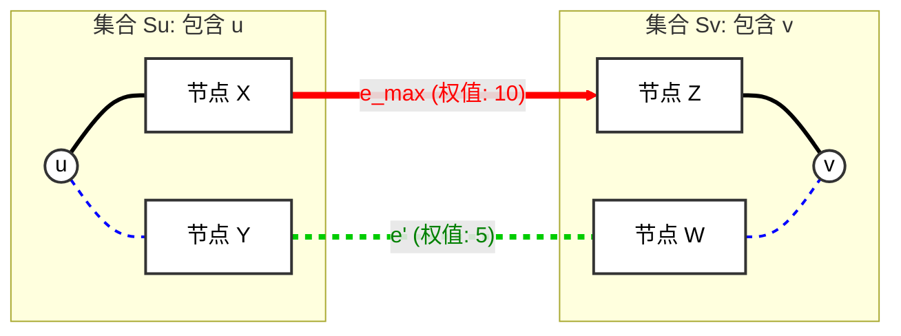

这是图论中一个非常精彩且直观的证明。利用**反证法**（Proof by Contradiction），我们可以清晰地推导出为什么最小生成树（MST）上的路径一定是“瓶颈路”。

### 命题定义

**瓶颈路性质**：在无向连通图 $G$ 中，对于任意两点 $u$ and $v$ ，**最小生成树上**从 $u$ 到 $v$ 的路径 $P_{MST}$ 上的最大边权，一定**小于或等于**图 $G$ 中其它任意一条从 $u$ 到 $v$ 的路径 $P'$ 上的最大边权。

用数学语言描述：
令 $W_{max}(P)$ 表示路径 $P$ 上权值最大的边的权值。
则对于任意路径 $P'$，都有 $W_{max}(P_{MST}) \le W_{max}(P')$。

---

### 证明过程 (反证法)

#### 1. 假设 (Assumption)

假设命题不成立。
即：存在两点 $u,v$ 以及图上的一条非树路径 $P'$，使得这条**非树路径**的“瓶颈”（最大边）比 **MST 路径**的“瓶颈”还要小。

设 $e_{max}$ 是 MST 路径 $P_{MST}$ 上权值最大的边，其权值为 $w(e_{max})$。
设 $w'_{max}$ 是非树路径 $P'$ 上权值最大的边的权值。

**我们的假设是：** $w'_{max} < w(e_{max})$
(意思是：我们可以通过走另一条路 $P'$ 来避免经过像 $e_{max}$ 这么大的边)。

#### 2. 推导 (Derivation)

**步骤 A：断开 MST**
在 MST 中，路径 $P_{MST}$ 是连接 $u$ 和 $v$ 的唯一路径。
如果我们把这条路径上权值最大的边 $e_{max}$ 从 MST 中**删去**：

1. MST 会断裂成两棵子树（两个连通分量），记为 $S_u$（包含 $u$）和 $S_v$（包含 $v$）。
2. 显然，点 $u$ 在集合 $S_u$ 中，点 $v$ 在集合 $S_v$ 中。

**步骤 B：分析替代路径 $P'$**
我们回头看那条假设存在的“更好路径” $P'$。
这条路径也是从 $u$ 走到 $v$。
既然 $u$ 在 $S_u$ 中，而 $v$ 在 $S_v$ 中，那么路径 $P'$ **必然至少有一条边**跨越了这两个集合之间的“割”（Cut）。
也就是说，在 $P'$ 中，一定存在一条边 $e'$，它的一个端点在 $S_u$ 中，另一个端点在 $S_v$ 中。

**步骤 C：权值比较**
根据我们的假设：

1. 路径 $P'$ 上的**所有**边的权值都小于等于 $w'_{max}$。
2. 而假设前提是 $w'_{max} < w(e_{max})$。
3. 因此，这条跨越边 $e'$ 的权值 $w(e') \leqslant  w'_{max}$。
4. 结论：**$w(e') < w(e_{max})$**。

**步骤 D：构造矛盾**
现在我们构造一个新的生成树 $T'$：

1. 取原来的 MST。
2. 删掉边 $e_{max}$。
3. 加入边 $e'$。

由于 $e'$ 连接了被 $e_{max}$ 断开的两个连通分量 $S_u$ 和 $S_v$，所以 $T'$ 依然是一个连通图，且包含 $V-1$ 条边，它是一个合法的生成树。

让我们计算 $T'$ 的总权值 $w(T')$：
$$w(T') = w(MST) - w(e_{max}) + w(e')$$

因为我们在 **步骤 C** 中得出 $w(e') < w(e_{max})$，所以：
$$w(T') < w(MST)$$

#### 3. 结论 (Conclusion)

我们找到了一个生成树 $T'$，它的总权值比**最小生成树 (MST)** 还要小。
这与 MST 的定义（权值之和最小）**矛盾**。

因此，原假设（存在一条路径的瓶颈比 MST 小）不成立。
**证毕：MST 上的路径一定是两点之间最大边权最小的路径。**

---

### 直观总结

想象你要开车从 A 城市到 B 城市，你想避免经过“海拔最高”的路段（瓶颈）。

* MST 就像是规划好的“最优海拔路线”。
* 如果你指着地图说：“看！走这条小路（$P'$）虽然绕远，但它的最高海拔比 MST 那条路低！”
* 证明告诉你：如果真有这么条路，那我当初修 MST 的时候，为什么不选这条小路里的一段来修桥，反而去修了 MST 里那段海拔又高、造价又贵的断路（$e_{max}$）呢？既然我选了 MST，就说明那些所谓“海拔低”的小路，一定无法连通两岸，或者它们其实比 MST 选的边还要高。

