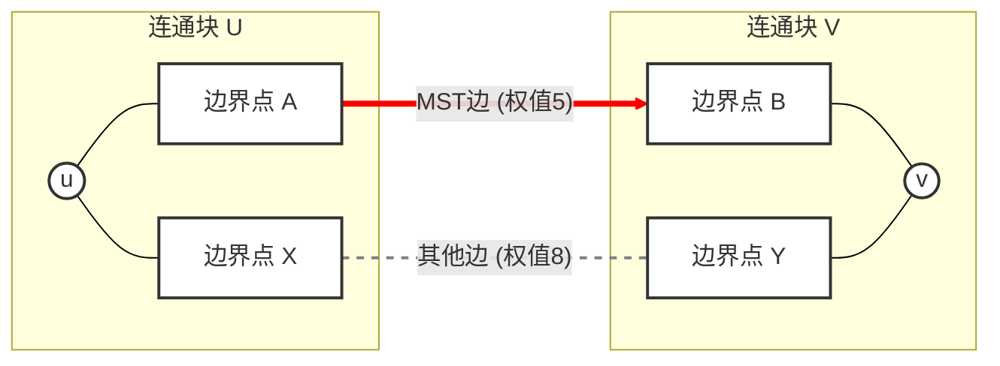

这是一个非常经典且深刻的图论结论。要理解如何从MST的性质推导出这个结论，最直观的方法是借助 **Kruskal算法的执行过程** 或者 **MST的切分性质 (Cut Property)** 来进行逻辑推理。

这里我们采用这两种方式来详细解释。

------

### 核心定义预热

在开始推导前，我们先明确几个核心概念：

1. **路径的瓶颈 (Bottleneck of a path)**：一条路径上权值**最大**的那条边。
2. **目标**：我们要证明，MST中 $u$ 到 $v$ 的路径，其瓶颈边权值，比图中其他任何 $u$ 到 $v$ 的路径的瓶颈边权值都要小（或相等）。这被称为 **“最小化最大值 (Minimax)”** 路径。

------

### 推导方式一：基于 Kruskal 算法的构造过程 (最直观)

Kruskal算法构建MST的核心思想是：**贪心**。它总是优先选择权值最小的边，只要这条边不构成环。

**推导步骤：**

1. **初始状态**：想象图中的每个节点最初都是一个独立的连通分量（孤岛）。我们把所有的边按权值从小到大排序。

2. **算法执行**：Kruskal算法开始按顺序遍历这些边。

   - 当前考虑的边是 $(x, y)$，权值为 $w$。
   - 如果 $x$ 和 $y$ 已经在同一个连通分量里了，这条边会被丢弃（因为会形成环）。
   - 如果 $x$ 和 $y$ 在不同的连通分量里，这条边会被加入MST，这两个分量合并。

3. 关键时刻：

   考虑节点 $u$ 和 $v$。在算法的一开始，它们属于不同的连通分量。

   随着算法进行，较小的边不断被加入，$u$ 所在的连通分量 $C_u$ 在慢慢扩大，$v$ 所在的连通分量 $C_v$ 也在扩大（或者它们暂时还没变）。

   终究会有那么一个决定性的时刻，Kruskal算法选中了一条边 $e_{critical} = (a, b)$，这条边的加入，使得 $u$ 所在的集合 和 $v$ 所在的集合第一次连通了起来。

4. **分析 MST 路径**：

   - 在边 $e_{critical}$ 加入的那一刻，MST中 $u$ 到 $v$ 的路径就形成了。
   - 这条路径由 $e_{critical}$ 以及之前加入的若干条边组成。
   - 由于Kruskal是按权值从小到大加边的，所以之前加入的所有边的权值都 $\le weight(e_{critical})$。
   - 因此，这条 **MST路径的瓶颈正是 $e_{critical}$**。

5. **分析其他任意路径**：

   - 现在考虑原图中任意一条从 $u$ 到 $v$ 的路径 $P_{other}$。

   - 回想一下，在 $e_{critical}$ 被加入之前，$u$ 和 $v$ 是不连通的，它们分别被困在集合 $C_u$ 和 $C_v$ 中。

   - 路径 $P_{other}$ 要想从 $u$ 走到 $v$，它**必然至少有一条边**跨越了 $C_u$ 和 $C_v$ 之间的界限。设这条跨越边为 $e_{cross}$。

   - 为什么 Kruskal 算法在处理 $e_{critical}$ 之前没有选择 $e_{cross}$ 呢？原因只有一个：**$e_{cross}$ 的权值一定大于等于 $e_{critical}$ 的权值**。 (如果它更小，它早就应该被选用来连接两个分量了)。

   - 所以，路径 $P_{other}$ 的瓶颈至少是 $weight(e_{cross})$，也就是说：

     $P_{other}$ 的瓶颈 $\ge weight(e_{cross}) \ge weight(e_{critical})$。

**结论：** MST路径的瓶颈是 $weight(e_{critical})$，而其他任何路径的瓶颈都大于等于这个值。证毕。

------

### 推导方式二：基于 MST 的切分性质 (更严谨)

MST 有一个著名的 **切分性质 (Cut Property)**：

> 对于图中的任意一个切分（将点集分为两个不相交集合 $S$ 和 $V-S$），横跨这个切分的所有边中，权值**最小**的那条边一定属于某个 MST。

我们将利用这个性质的反面来进行证明。

**推导步骤（反证法思路）：**

1. 假设：假设 MST 中从 $u$ 到 $v$ 的路径 $P_{MST}$ 不是瓶颈最小的路径。

   这意味着，原图中存在另一条路径 $P_{better}$，它的瓶颈边权值 严格小于 $P_{MST}$ 的瓶颈边权值。

2. 找到 MST 的瓶颈：

   设 $e_{max} = (x, y)$ 是 MST 路径 $P_{MST}$ 上的瓶颈边（权值最大的边）。

3. 构造切分：

   如果在 MST 中删掉边 $e_{max}$，那么 MST 这棵树就会断裂成两个连通分量。

   必然地，$u$ 在其中一个分量（记为集合 $S_u$），而 $v$ 在另一个分量（记为集合 $S_v$）。

   这是一个将 $u$ 和 $v$ 分隔开的切分。

4. 分析“更好”的路径：

   回头看我们假设的那条路径 $P_{better}$。既然它连接了 $u$ 和 $v$，那么它必然至少含有一条边 $e_{cross}$ 横跨了 $S_u$ 和 $S_v$ 这个切分。

5. **导出矛盾**：

   - 根据我们的假设，$P_{better}$ 的瓶颈严格小于 $P_{MST}$ 的瓶颈。这意味着 $P_{better}$ 上**所有**边的权值都严格小于 $weight(e_{max})$。
   - 所以，$weight(e_{cross}) < weight(e_{max})$。
   - 现在我们看 $e_{max}$。它是连接切分 $S_u$ 和 $S_v$ 的一条边。但是我们发现了一条同样连接这个切分的边 $e_{cross}$，且它的权值比 $e_{max}$ 还小。
   - 根据 **MST 的切分性质**，在连接 $S_u$ 和 $S_v$ 的所有横切边中，$e_{max}$ 应该是权值最小的才对（否则 Kruskal 算法或者 Prim 算法就会选择更小的 $e_{cross}$ 而不是 $e_{max}$ 来连接这两个区域）。
   - 这里出现了矛盾：$e_{max}$ 是 MST 的边，但它却不是切分上最小的边。

6. **结论**：假设不成立。因此，$P_{MST}$ 的瓶颈必定是所有路径中最小的。

### 总结

无论是通过 Kruskal 算法的构造过程来理解，还是利用切分性质进行逻辑推导，核心思想都是一样的：

MST 路径上的瓶颈边，本质上是连接两个尚未连通区域的**“最容易通过的桥梁”**。任何其他路径想要连接这两个区域，要么走同一座桥，要么走一座**“更难通过（权值更大）”**的桥。因此，MST 路径本身就是那条“最大边权最小”的路径。