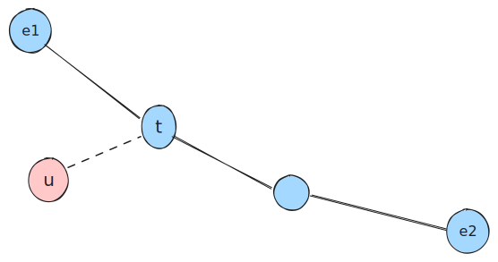

[[TOC]]

## 前置知识

- [树的直径](../diameter_of_tree/index.md)

## 树的中心

$f(u,T)$ 就是距离u点最远点的距离

树的中心的定义，**树的中心 $c$ 就是使得 $f(c, T)$ 最小的那个点**，这个最小的距离值就是树的半径 $\text{rad}(T)$。


## 暴力算法


## 树的中心就是直径的中心.

设

1. 直径的中心为c
2. 任意一点 u ,$u \neq cen$
3. $E =\{e_1,e_2,c\dots, e_i\}$ 表示直径的端点的集合

已知定理1: **树上任意一点u 到达的最远点一定是直径的端点**

根据u的位置,分情况讨论:

情况1: 点u在直径上, 那么显然

$f(u,T) = dis(u,e_i)$, 其中$e_i$是直径的某个端点

$f(u,T) = dis(u,e_i) < dis(c,e_i) = f(c,T)$, 得到:

对于任意的点u, u在直径上, 那么$f(u,T) < f(c,T)$

情况2: 点u不在直径上, 那么显然



先找到u到达直径上的最近点t, 

1. 如果$t = c$, 那么显然$f(u,T) = dis(u,t) +  dis( 
   t,e_i) > dis(c,e_i) = f(c,T)$
2. 如果$t \neq c$, 那么显然, 那么这个$t$就是情况1,
   1. $dis(t,e_i) > dis(c,e_i)$
   2. $f(u,T) = dis(u,t) + dis(t,e_i) > dis(c,e_i) = f(c,T)$


所以, 树的中心一定是直径的中心

## 代码

只要先用两次dfs 找到直径的两个端点, 然后再找到直径的中心即可

```cpp
#include <bits/stdc++.h>
using namespace std;
const int N = 1e5 + 10;
int n;
vector<int> g[N];
int dis[N];
int maxdis, maxid;
void dfs(int u, int fa) {
    if (dis[u] > maxdis) {
        maxdis = dis[u];
        maxid = u;
    }
    for (auto v : g[u]) {
        if (v == fa) continue;
        dis[v] = dis[u] + 1;
        dfs(v, u);
    }
}
int main() {
    cin >> n;
    for (int i = 1; i < n; i++) {
        int u, v;
        cin >> u >> v;
        g[u].push_back(v);
        g[v].push_back(u);
    }
    dfs(1, -1);
    maxdis = 0;
    dfs(maxid, -1);
    int cen = maxid;
    int len = maxdis;
    if (len % 2 == 0) {
        for (int i = 1; i <= len / 2; i++) {
            for (auto v : g[cen]) {
                if (dis[v] == dis[cen] - 1) {
                    cen = v;
                    break;
                }
            }
        }
    } else {
        for (int i = 1; i <= len / 2; i++) {
            for (auto v : g[cen]) {
                if (dis[v] == dis[cen] - 1) {
                    cen = v;
                    break;
                }
            }
        }
    }
    cout << cen << endl;
    return 0;
}
```