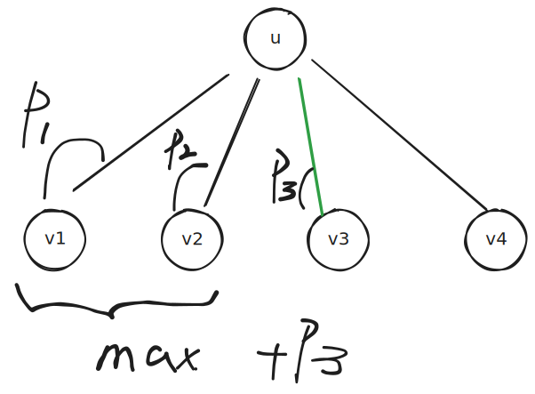

[[TOC]]

## 树的直径定义

给定一棵带权(边)树

- **距离**: 两个点路径上的边权和   
- **树的直径**: 最大距离 

## DP求树的直径

我们认为(假定)树的根为$1$, 

- $tree(i)$ 表示以点 $i$ 为根的子树.  
- $pathLca(i)$ 表示路径上的两个端点的lca为点 $i$ 的路径的集合   

$$
\text{所有路径的集合} = \bigcup_{i=1}^n pathLca(i) 
$$

根据公式

$$
A = B \cup C \to \max(A) = \max(\ \max(B) , \max(C)\ )
$$

那么答案就是

$$
max\_ans = \max_{i=1}^n ( \max( pathLca(i) ) )
$$

于是问题转换成求 $P(i) = \max ( pathLca(i) )$,易想到

- $P(i)$ 表示经过点 $i$ 的最长链,且 $i$ 是链的 $lca$
- $D(i)$ 表示点 $i$ 到叶结点的 最长链
- $x_i$ 表示点 $i$ 的孩子 
- $e(i,x_i)$ 表示边 $(i , x_i)$ 的长度 

$$
D(i) = \max \{ D(x_i) + e(i,x_i) \}
$$

$$
P(i) = \max\{ D(x_i)+ e(i,x_i) +  D(y_i)  + e(i,y_i) \} , x_i < y_i
$$

- 设$Dt(i,x_i) = D(x_i) + e(i,x_i)$

那么这个问题就变成的[集合最大二值和问题](../../math/集合.md)




于是我们得到代码如下: 


```cpp
int ans;

template<typename T>
void upd(T& v,T t) { if( v < t) v = t; } 

void dfs_dp(int u,int fa) {
    
    int pathlca = 0;
    for(int i = e.h[u];i != -1; i = e[i].next)
    {
        int v = e[i].v;
        if( v == fa) continue;
        dfs_dp(v, u);
        int dt = d[v] + e[i].w; //得到 u到达 v 子树上的最远点
        upd(pathlca,d[u] + dt); // 得到 分类 dt 的结尾的最值,更新 pathlca
        upd(d[u],dt); // 更新d[u]
    }
    upd(ans,pathlca);
}
```


## 参考

- 树的直径 题目单 https://www.luogu.com.cn/training/505787#problems