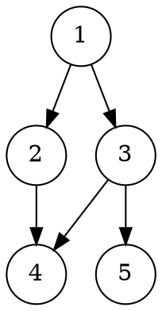
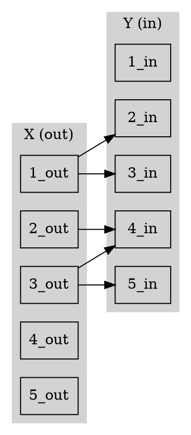
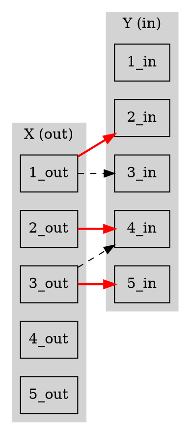
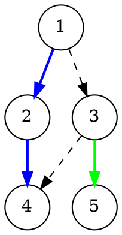

好的，我们来系统地学习一下这个非常重要的算法知识点：**DAG 的最小路径覆盖**。

这个定理叫做 **Dilworth 定理** 在图论中的一个特例，它将一个图论问题巧妙地转化为了一个网络流（或二分图匹配）问题。

我们将按照你要求的顺序，一步步拆解这个知识点。

---

### 1. 从定义开始讲解

在理解公式之前，我们必须先弄清楚几个基本概念。

#### 1.1 有向无环图 (Directed Acyclic Graph, DAG)
一个没有有向环的图。也就是说，你从任何一个节点出发，沿着边的方向走，永远无法回到这个节点。

**例子:** 任务的依赖关系（编译代码 A 之前必须先编译 B）、课程的先修关系（学微积分前要先学高数）等都可以抽象为 DAG。

#### 1.2 路径覆盖 (Path Cover)
在 DAG 中，一个“路径覆盖”是指用一些**顶点不相交**的简单路径去覆盖图中的所有顶点。每个顶点必须且只能属于一条路径。

*   **路径**: `v1 -> v2 -> ... -> vk`。
*   **顶点不相交**: 任意两条路径都没有公共的顶点。
*   **覆盖所有顶点**: 图中的每个点都必须在某一条路径上。

**重要:** 一个孤立的顶点自身也可以算作一条路径（长度为 0）。

#### 1.3 最小路径覆盖 (Minimum Path Cover)
在所有可能的路径覆盖方案中，使用路径数量最少的那一种方案，其路径数就是“最小路径覆盖数”。

我们的目标就是求这个最小值。

**例子:**
假设我们有 4 个任务，依赖关系是 `1->2`, `3->4`。

一种路径覆盖是：`{1}, {2}, {3}, {4}`，共 4 条路径。
另一种更好的路径覆盖是：`{1->2}, {3->4}`，共 2 条路径。这是此图的**最小路径覆盖**。

---

### 2. 核心思想：转化为二分图最大匹配

直接在原图上寻找最小路径覆盖是非常困难的。大神们发现了一个绝妙的转化方法。

#### 2.1 如何构建二分图？—— “拆点法”

对于一个包含 `N` 个节点的 DAG，我们可以构建一个包含 `2N` 个节点的二分图：

1.  **拆分节点**: 将原图中的每个节点 `v` 拆分成两个节点：`v_out` 和 `v_in`。
2.  **构建两部分**:
    *   所有 `v_out` 节点组成二分图的左半部分 `X`。
    *   所有 `v_in` 节点组成二分图的右半部分 `Y`。
3.  **连接边**: 如果原 DAG 中存在一条边 `u -> v`，那么就在二分图中连接一条从左到右的边 `u_out -> v_in`。

#### 2.2 为什么这样转化？—— 匹配与路径的对应关系

这是最关键的理解部分。

*   **初始状态**: 没有任何匹配时，我们有 `N` 个节点，可以看作是 `N` 条独立的、长度为 0 的路径（每个节点自成一条路径）。此时路径覆盖数是 `N`。

*   **匹配的意义**: 在二分图中找到一个匹配 `u_out -> v_in` 意味着什么？
    *   它对应于原 DAG 中的一条边 `u -> v`。
    *   这个 "匹配" 动作，可以理解为将原本以 `u` 结尾的路径和以 `v` 开头的路径**合并**成了一条更长的路径。
    *   例如，原来是两条路径 `{..., u}` 和 `{v, ...}`，匹配后，它们被合并成了 `{..., u -> v, ...}`。
    *   **每成功匹配一次，路径的总数就减少 1。**

*   **目标**: 为了让最终的路径数最少（最小路径覆盖），我们就需要尽可能多地合并路径。这意味着我们需要找到尽可能多的匹配。

*   **结论**: 找到的匹配数越多，路径总数就越少。当我们找到**最大匹配 (Maximum Matching)** 时，我们就得到了**最小路径覆盖**。

所以，最终的公式诞生了：

**最小路径覆盖数 = 初始路径数 - 最大合并次数**
**最小路径覆盖数 = DAG 的节点数 - 相应二分图的最大匹配数**

---

### 3. 带有例题和 Graphviz 绘图

我们来看一个具体的例子。

**问题**: 求下面这个 DAG 的最小路径覆盖。

**Graphviz 源码 (DAG):**

**图形展示:**

#### 步骤 1: 构建二分图 (拆点)

*   原图节点数 `N = 5`。
*   左半部分 `X = {1_out, 2_out, 3_out, 4_out, 5_out}`。
*   右半部分 `Y = {1_in, 2_in, 3_in, 4_in, 5_in}`。
*   根据原图边 `u->v` 添加二分图边 `u_out -> v_in`。

**Graphviz 源码 (Bipartite Graph):**

#### 步骤 2: 求二分图的最大匹配

我们可以使用匈牙利算法或者基于网络流的 Dinic 算法来求解。这里我们手动寻找（通过寻找增广路）。

1.  匹配 `1_out -> 2_in`。
2.  匹配 `3_out -> 5_in`。
3.  现在看 `2_out`，它可以连接到 `4_in`。匹配 `2_out -> 4_in`。

此时，一个最大匹配方案是 `{(1_out, 2_in), (3_out, 5_in), (2_out, 4_in)}`。
**最大匹配数 = 3**。

**Graphviz 源码 (Maximum Matching):**

**图形展示 (红色为匹配边):**
%22%3B%20style%3Dfilled%3B%20color%3Dlightgrey%3B%20%221_out%22%2C%20%222_out%22%2C%20%223_out%22%2C%20%224_out%22%2C%20%225_out%22%3B%20%7D%0A%20%20%20%20subgraph%20cluster_Y%20%7B%20label%3D%22Y%20(in)%22%3B%20style%3Dfilled%3B%20color%3Dlightgrey%3B%20%221_in%22%2C%20%222_in%22%2C%20%223_in%22%2C%20%224_in%22%2C%20%225_in%22%3B%20%7D%0A%20%20%20%20%0A%20%20%20%20%2F%2F%20Matched%20edges%0A%20%20%20%20%221_out%22%20-%3E%20%222_in%22%20%5Bcolor%3Dred%2C%20penwidth%3D2%5D%3B%0A%20%20%20%20%222_out%22%20-%3E%20%224_in%22%20%5Bcolor%3Dred%2C%20penwidth%3D2%5D%3B%0A%20%20%20%20%223_out%22%20-%3E%20%225_in%22%20%5Bcolor%3Dred%2C%20penwidth%3D2%5D%3B%0A%20%20%20%20%0A%20%20%20%20%2F%2F%20Unmatched%20edges%0A%20%20%20%20%221_out%22%20-%3E%20%223_in%22%20%5Bstyle%3Ddashed%5D%3B%0A%20%20%20%20%223_out%22%20-%3E%20%224_in%22%20%5Bstyle%3Ddashed%5D%3B%0A%7D)

#### 步骤 3: 应用公式

*   DAG 节点数 `N = 5`。
*   最大匹配数 `M = 3`。
*   最小路径覆盖数 = `N - M = 5 - 3 = 2`。

所以，我们只需要 2 条路径就可以覆盖所有 5 个节点。

#### 步骤 4: 还原路径 (验证)

如何从匹配结果找到这两条路径？
*   匹配 `1_out -> 2_in` 对应路径 `1 -> 2`。
*   匹配 `2_out -> 4_in` 对应路径 `2 -> 4`。
*   匹配 `3_out -> 5_in` 对应路径 `3 -> 5`。

将它们连接起来：
*   从 `1` 出发，`1->2` (因为`1_out`匹配了`2_in`)，然后从 `2` 出发，`2->4` (因为`2_out`匹配了`4_in`)。`4` 后面没有了。形成路径 `1 -> 2 -> 4`。
*   `3` 出发，`3->5` (因为`3_out`匹配了`5_in`)。`5` 后面没有了。形成路径 `3 -> 5`。
*   所有节点 `1, 2, 3, 4, 5` 都被覆盖了。

最终的最小路径覆盖方案是 **`{1 -> 2 -> 4, 3 -> 5}`**，共 2 条路径。结果正确！

**Graphviz 源码 (Final Path Cover):**

**图形展示 (不同颜色的边代表不同的路径):**

---

### 4. 在算法竞赛中如何考查

最小路径覆盖在算法竞赛中是一个经典且重要的模型，通常不会直接告诉你去求它。你需要从题目描述中抽象出这个模型。

#### 考查形式

1.  **模板题 / 直接应用**:
    *   题目直接给出一个 DAG，要求计算最少需要多少条不相交的路径来覆盖所有点。
    *   例如 POJ 1422 "Air Raid", POJ 3020 "Antenna Placement"。

2.  **建模与转化 (最常见)**:
    *   题目的核心是**“一个元素只能用一次”**和**“存在传递性的依赖关系”**。
    *   **关键词**: "任务序列", "工作流", "机器人路径", "一次性", "不重复", "A必须在B之前"。
    *   **典型场景**:
        *   **任务调度**: 有 `N` 个任务，一些任务有先决条件。一个工人可以按顺序完成一系列任务 `T1 -> T2 -> T3...`。问最少需要多少个工人才能完成所有任务？
            *   **分析**: 每个工人对应一条路径。工人最少 <=> 路径最少。这是一个标准的最小路径覆盖问题。
        *   **放置物品**: 在一个网格中放置物品。一个物品可以“激活”或“传递能量”给另一个位置的物品，但一个物品只能被激活一次，也只能激活一次。问最少需要多少个初始能量源？
            *   **分析**: 每个初始能量源对应一条路径的起点。源头最少 <=> 路径最少。

#### 解题步骤

1.  **识别模型**: 读懂题意，判断问题是否可以转化为：在一个有向无环图上，寻找最少数量的、顶点不相交的路径来覆盖所有顶点。
2.  **建立图论模型**:
    *   确定图的**节点**代表什么（任务、位置等）。
    *   确定图的**边**代表什么（依赖关系、激活关系等）。
    *   确认这个图是 **DAG**。如果题目数据量不大，可以用 `Floyd-Warshall` 算法求出所有点对的可达关系（传递闭包），这在建图时很有用。`A->B` 且 `B->C`，则建图时也需要 `A->C` 的关系。
3.  **应用公式**:
    *   根据 DAG 构建二分图（拆点法）。
    *   在二分图上运行最大匹配算法（通常用匈牙利算法的 DFS 实现，因为它简单且对于竞赛常见的数据范围足够快）。
    *   最终答案为 `节点数 - 最大匹配数`。

#### 一个重要的变种：可相交路径覆盖

如果题目允许路径**可以共享顶点**（即一个任务可以被多个工人执行，或一个节点可以属于多条路径），问题会变得简单。

*   **解法**: 先对原 DAG 做一次 **传递闭包**。也就是说，如果 `u` 能到达 `v`，就在新图中连一条边 `u->v`。然后在这个新图上求最小路径覆盖。
*   **原理**: 传递闭包 `u->v` 意味着存在一条 `u` 到 `v` 的路径。在新图中直接连边，相当于把这条路径“压缩”成了一步。在压缩后的图上求不相交路径覆盖，就等价于在原图上求可相交路径覆盖。

**总结一下，掌握这个知识点需要：**
1.  理解基本定义。
2.  掌握“拆点”建图法。
3.  理解“匹配”与“路径合并”的对应关系。
4.  会写二分图最大匹配的板子（匈牙利算法）。
5.  能从题目描述中识别出这个模型。