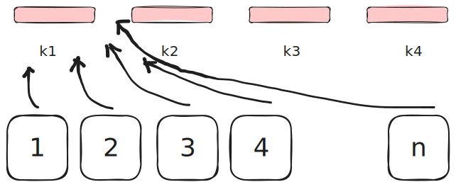
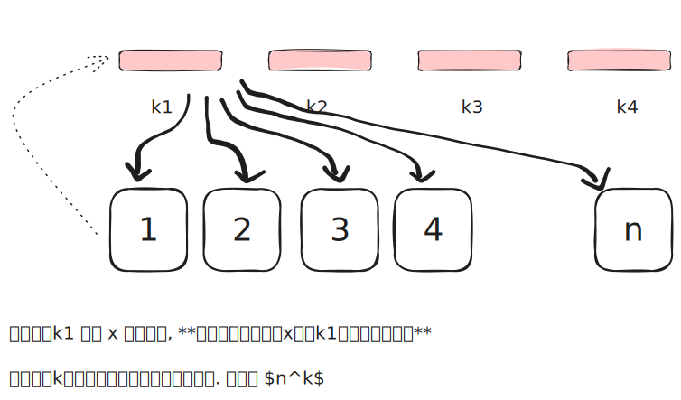
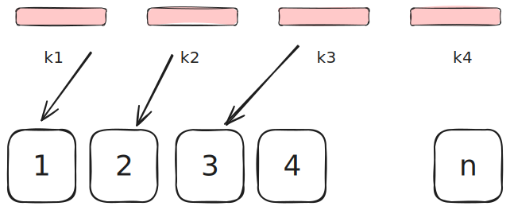

[[TOC]]


## 最重要总结:

- $k$ 个球
- $n$ 个盒子(互相不一样),编号 $1,2,3, \cdots, n$


| | 球不可重复放到同一个盒子 |  球可重复放到同一个盒子 |
|--|:---:|:---:|
|有区别的球| $\frac{n!}{(n-k)!}$ | $n^k$ |
|无区别的球 | $\binom{n}{k}$ |$\binom{n+k-1}{k}$ |

## 第一章 计数的基本知识

1. 集合的定义
2. 集合的基或大小
3. 定理(1) 分类加法原理
4. 定理(2) 分步乘法原理
5. 子集的集合: 幂集
6. 集合的子集数量

书没有讲的内容的补充:

1. 分类加法原理的的集合表示与证明
  1. 如果一个集合的元素是由若干个互不相交的集合的元素组成的, 那么集合的大小就是各个子集的大小的和
2. 分步乘法原理的集合证明
  1. 如何一个集合的元素是可分步构造得到的, 那么集合的大小就是各个步骤的大小的乘积
3. 幂集的定义
4. 子集数量的证明


课后练习

例11 :TODO

## 第二章 排列组合

四种基本类型的问题一:  有重排序

1. 开张日: 共有 $n$ 种口味的冰淇淋, 取 $k$ 勺冰淇淋的,顺序有区别, 问共有多少种方案?
  

1. 把 $k$ 有区别的球放到 $n$ 有区别的盒子中, 每个盒子放任意多个球, 问共有多少种方案?
  

!!! abstract 总结
发现了吗: 
1. 从 $n$ 盒子里面取 $k$ 次球
2. 把 $k$ 球放到 $n$ 个盒子里面

方案的表示法是一样的,方案数也是一样的: $n^k$
!!!


四种基本类型的问题二:  无重排序

1. 从 $n$ 盒子里面取 $k$ 次球, 每个盒子一个球,球的顺序不同方案不同,问共有多少种方案?
  

1. 把 $k$ 个有区别的球放到 $n$ 有区别的盒子中, 每个盒子只能放一个球, 问共有多少种方案?


$$
P(n,k) = \frac{n!}{(n-k)!}
$$


四种基本类型的问题三:  组合

1. 把 $k$ 无区别的球放到 $n$ 有区别的盒子中, 每个盒子最多放一个, 问共有多少种方案?
2. 有$n$个盒子中每个盒子中有一个没有编号球, 每个盒子取放一个球 ,不考虑顺序, 问共有多少种方案?

$$
\binom{n}{k} = \frac{n!}{k!(n-k)!} \text{ 读作:  n选k}
$$


证明: 

1. 每个球上都有编号, 编号为 $1,2,3, \cdots, k$
1. 有一个人,叫做小A,只取`1 2 3`,如果考虑顺序:
  ```
    1. 1 2 3
    2. 1 3 2
    3. 2 1 3
    4. 2 3 1
    5. 3 1 2
    6. 3 2 1
    共 $3!$ 种方案
  ```
2. 小$A$ 把取到的球给 小$B$,小B 把球打乱,因为他不考虑顺序,所以对于小$B$来说, 这些是一种方案

于是得到公式

$$
\binom{n}{k} \cdot k! = \frac{n!}{(n-k)!} \\
\binom{n}{k} = \frac{n!}{k!(n-k)!}
$$

- $n$个元素的集合A,其中含有 $k$ 个元素的子集的个数为 $\binom{n}{k}$
- 组合是一组不同对象的子集,不考虑顺序
- 组合数的递推关系
- 组合数的性质
  - $\binom{n}{k} = \binom{n}{n-k}$
  - $\binom{n}{k} = \binom{n-1}{k} + \binom{n-1}{k-1}$
- 同样的方式: 思考圆排列 
- 一种DP问题: 走格子 


## 第三章 星星,杠杠和多项式

四种基本类型的问题四:  

1. 共有$k$个无区别的球, 每个盒子可以放任意多个球,每个盒子至少放一个球,$n \leqslant k$, 问共有多少种方案?
2. 共有$k$个无区别的球, 每个盒子可以放任意多个球, 问共有多少种方案?
  1. $x + y + z = k$

把 $k$ 无区别的球放到 $n$ 有区别的盒子中, 每个盒子放任意多个球, 问共有多少种方案?


## 多项式系数 


> **例 18** 假定有三种口味（香草味、巧克力味和草莓味）的冰淇淋，我们必须用 $v$ 勺香草味的、$c$ 勺巧克力味的、$s$ 勺草莓味的. 设总勺数为 $k$ (所以 $v + c + s = k$). 根据这些限制有多少种可能的蛋筒？

---

### 2. 如何思考这个问题

这个问题属于组合数学中的**多重集排列 (Permutations of Multiset)** 问题。我们可以通过以下步骤来拆解思路：

#### 第一步：理解“蛋筒”的物理含义
在数学题目中，"蛋筒" (Ice cream cone) 通常隐含着**顺序 (Order)** 的概念。
* 如果是放在“碗”里，通常顺序不重要（只是混合在一起）。
* 如果是“蛋筒”，冰淇淋球是**垂直堆叠**的。最下面的球、中间的球和最上面的球，位置是不同的。
* 因此，这是一个**排列 (Permutation)** 问题，而不是简单的组合问题。

#### 第二步：理解限制条件
题目中说“我们必须用 $v$ 勺香草、$c$ 勺巧克力、$s$ 勺草莓”。
这意味着：
* 我们要排列的元素总数是确定的：$k$ 个球。
* 但这 $k$ 个球里，有重复的元素。所有的香草球都是一样的，所有的巧克力球都是一样的，等等。

#### 第三步：建立数学模型
试想我们把这 $k$ 个冰淇淋球排成一列（从蛋筒底部到顶部）：
* 我们有 $k$ 个位置。
* 我们需要往这些位置里填入 $v$ 个 $V$ (Vanilla)，$c$ 个 $C$ (Chocolate)，$s$ 个 $S$ (Strawberry)。

这就像是在问：**“如果不区分同一种口味的球，有多少种不同的排列方式？”**

#### 第四步：推导公式 (不尽相异元素全排列)
1.  如果 $k$ 个球每一个都完全不同（比如上面贴了编号 1 到 $k$），那么排列方式有 $k!$ ( $k$ 的阶乘) 种。
2.  但是，因为 $v$ 个香草球是完全一样的，我们在第一步中把它们当成了不同的球来算，所以算多了。我们需要除以 $v!$ 来消除香草球内部顺序的重复。
3.  同理，我们要除以 $c!$ 来消除巧克力球的重复。
4.  同理，我们要除以 $s!$ 来消除草莓球的重复。

### 3. 最终答案

根据上述思考，可能的蛋筒种类数是**多项式系数 (Multinomial Coefficient)**：

$$\frac{k!}{v! \cdot c! \cdot s!}$$

或者用组合数的写法表示，可以理解为：
1.  先从 $k$ 个位置中选 $v$ 个放香草： $\binom{k}{v}$
2.  再从剩下的 $k-v$ 个位置中选 $c$ 个放巧克力： $\binom{k-v}{c}$
3.  剩下的位置自动放草莓： $\binom{s}{s} = 1$

$$\binom{k}{v} \times \binom{k-v}{c} = \frac{k!}{v!(k-v)!} \times \frac{(k-v)!}{c!s!} = \frac{k!}{v!c!s!}$$

---


这是一个非常好的问题！将具体问题抽象成**“球放盒子” (Balls and Bins/Boxes)** 模型是组合数学的核心思维。

针对这个“冰淇淋蛋筒”问题，有两种主要的转换视角。取决于你把什么看作“球”，什么看作“盒子”，这两种视角都能得出正确答案，但思维路径不同。

### 视角一：位置是球，口味是盒子（最符合多项式系数定义的模型）

这是组合数学中处理“分组”问题时最标准的模型。

* **球 (Balls)**：蛋筒上的 $k$ 个**位置**（第1层、第2层、……第 $k$ 层）。
    * 注意：因为位置有高低之分，所以这 $k$ 个球是**有区别的 (Distinguishable)**，就像球上标了号 $1, 2, ..., k$。
* **盒子 (Boxes)**：3种**口味**（香草盒、巧克力盒、草莓盒）。
    * 盒子也是**有区别的**。
* **规则/限制**：
    * 我们必须把 $v$ 个球放入香草盒。
    * 我们必须把 $c$ 个球放入巧克力盒。
    * 我们必须把 $s$ 个球放入草莓盒。
    * (每个球必须且只能进一个盒子)。

**思考逻辑：**
拿着写有“第1层”的球，你决定把它扔进“香草”盒，意味着第1层是香草味。
这个问题就变成了：**把 $k$ 个不同的球，分装到 3 个不同的盒子里，且指定每个盒子的球数，有多少种分法？**

**公式：**
这就是典型的**多项式系数**模型：
$$\binom{k}{v, c, s} = \frac{k!}{v! \cdot c! \cdot s!}$$

推导方法：分步选择法

这里是用“分步取球”逻辑的最简证明：

**核心思路：分步占位**

1.  **先选香草：** 从 $k$ 个不同球中，选出 $v$ 个放入香草盒。
    * 方法数：$\binom{k}{v}$
2.  **再选巧克力：** 从剩下的 $k-v$ 个球中，选出 $c$ 个放入巧克力盒。
    * 方法数：$\binom{k-v}{c}$
3.  **最后草莓：** 剩下的 $s$ 个球（$k-v-c=s$）只能放入草莓盒。
    * 方法数：$\binom{s}{s} = 1$

**计算推导：**

根据乘法原理，总数等于各步相乘：

$$
\begin{aligned}
\text{总数} &= \binom{k}{v} \times \binom{k-v}{c} \\
&= \frac{k!}{v! \cdot \cancel{(k-v)!}} \times \frac{\cancel{(k-v)!}}{c! \cdot (k-v-c)!} \\
&= \frac{k!}{v! \cdot c! \cdot s!} \quad \text{(注: } k-v-c = s \text{)}
\end{aligned}
$$

---
**得证。**

需要我用**全排列除法**（先全排再除以重复项）的视角再证明一次吗？这通常能提供另一种直觉。

---

### 视角二：口味是球，位置是盒子（更符合物理直觉的模型）

这个模型更像我们实际制作冰淇淋的过程。

* **盒子 (Boxes)**：蛋筒上的 $k$ 个**位置**。
    * 盒子是**有区别的**（有顺序）。
    * 限制：每个盒子**只能装 1 个球**。
* **球 (Balls)**：冰淇淋球本身。
    * 我们有 $v$ 个香草球（彼此**无区别**，Indistinguishable）。
    * 我们有 $c$ 个巧克力球（彼此**无区别**）。
    * 我们有 $s$ 个草莓球（彼此**无区别**）。

**思考逻辑：**
这个问题变成了：**如果不区分同颜色的球，将这些球填入 $k$ 个有编号的坑位中，有多少种填法？**

**计算步骤（分步占位）：**
1.  面对 $k$ 个空盒子，先要把 $v$ 个香草球放进去。因为香草球都一样，我们只需要选择 $v$ 个盒子。
    * 方法数：$\binom{k}{v}$
2.  还剩下 $k-v$ 个空盒子，要把 $c$ 个巧克力球放进去。
    * 方法数：$\binom{k-v}{c}$
3.  最后剩下 $s$ 个盒子，放入 $s$ 个草莓球。
    * 方法数：$\binom{s}{s} = 1$

**结果验证：**
$$\binom{k}{v} \times \binom{k-v}{c} = \frac{k!}{v!(k-v)!} \times \frac{(k-v)!}{c!s!} = \frac{k!}{v!c!s!}$$

---

### 总结：哪种模型更好？

* **视角一（位置即球）**：适合从**“集合划分”**的角度理解。如果你想的是“怎么把这 $k$ 个位置分配给不同的口味”，用这个。
* **视角二（口味即球）**：适合从**“填空/占位”**的角度理解。如果你想的是“手里拿着一堆香草球，我要把它们塞到哪几层去”，用这个。

对于这道题，**视角一**通常被认为是更高级的抽象，因为它直接对应了多项式定理的定义。