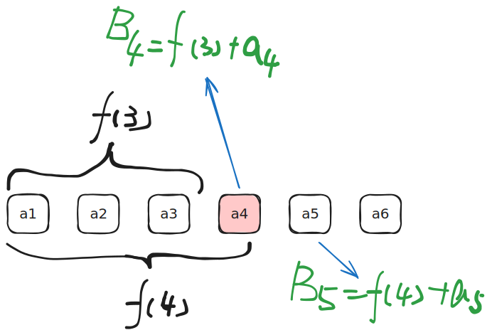

[[TOC]]


## 最值

$$
\max(A \cup B) = \max(\max(A) , \max(B))
$$


$$
\min(A \cup B) = \min(\min(A) , \min(B))
$$

## 最大二值和

问题: 求集合 $A$ 中两个元素的和的最大值


解法一: 找出集合的最大值和次最大值, 然后相加

@include-code(./code/max_sum_of_two_of_set_1.cpp, cpp)


解法二:  




- $A = \{ a_1,a_2 ,\cdots , a_n \}$
- $A' = \{ (a_j,a_i) \mid i < j, a_j \in A ,a_i \in A \}$ 集合 : 表示任意两个元素的有序配对组成的元组集合
- $B_i = \{ (a_j,a_i) \mid j < i , a_j \in A ,a_i \in A \}$ 集合 : 它表示第i个元素 $a_i$ 和前面的所有元素$a_j$( $j<i$ ), 组成的二元元组组成的集合.

$\max(A')$ 表示集合中元组的两个值的和的最大值

$$
A' = \bigcup_{i=1}^n B_i 
$$

于是得到

$$
\max (A') = \max_{i=1}^n( \max(B_i))
$$

- 设: $f(i) = \max(a_1,a_2 , \cdots ,a_i)$

$$
\begin{aligned}
\max(B_i) &= \max(a_1,a_2,\cdots,a_{i-1} ) + a_i \\
&=  f(i-1) + a_i
\end{aligned}
$$

容易想到$f(i) = \max(f(i-1),a_i)$

如果我们用代码表示上面的计算过程,那么得到一个 $O(n)$ 的代码如如下:

```cpp
int a[maxn];
int B[maxn]
int f = a[1];
int ans;

for(int i =2;i<=n;i++) {
    B[i] = f + a[i];
    ans = max(ans,B[i]);
    f = max(f,a[i]);
}
```

总结,用到的思想

- 集合最值与子集最值的关系
- 组合数学,集合不重不漏的分类
- 滑动窗口
