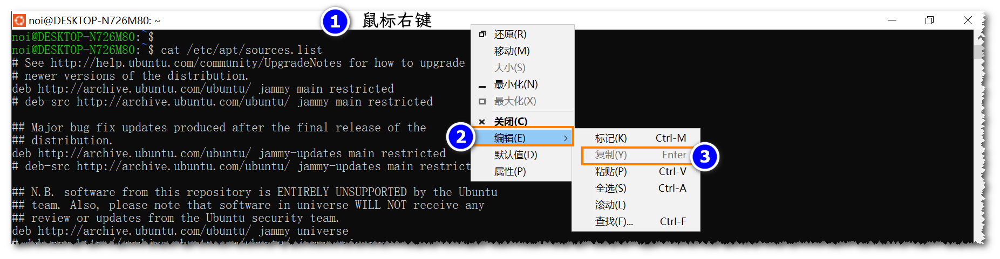
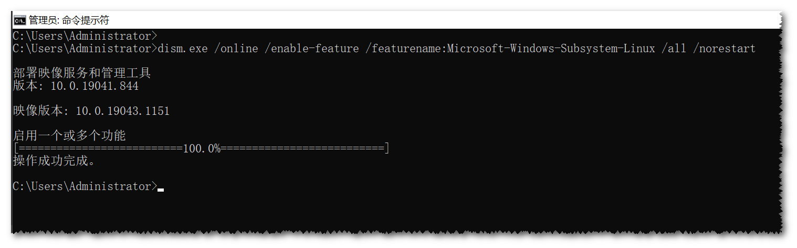
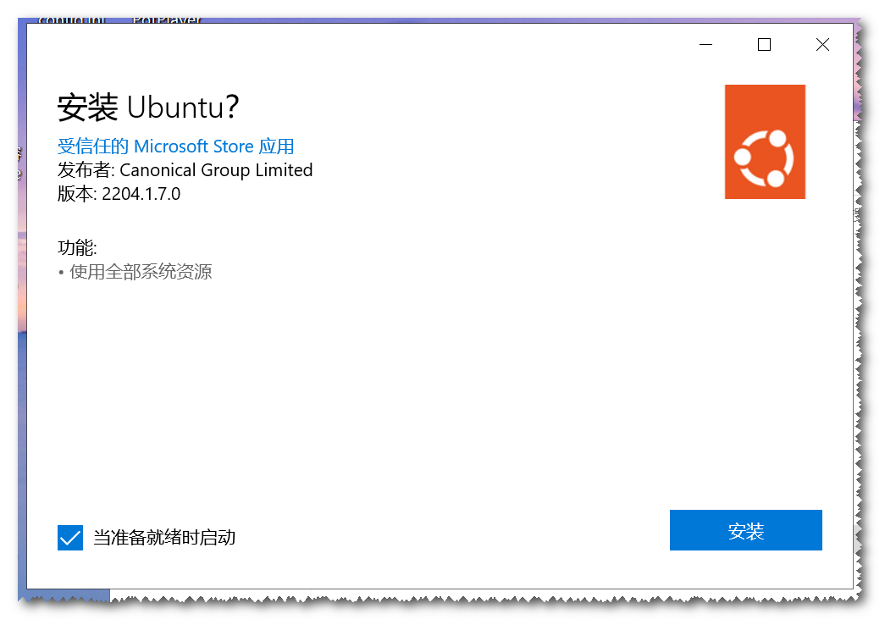
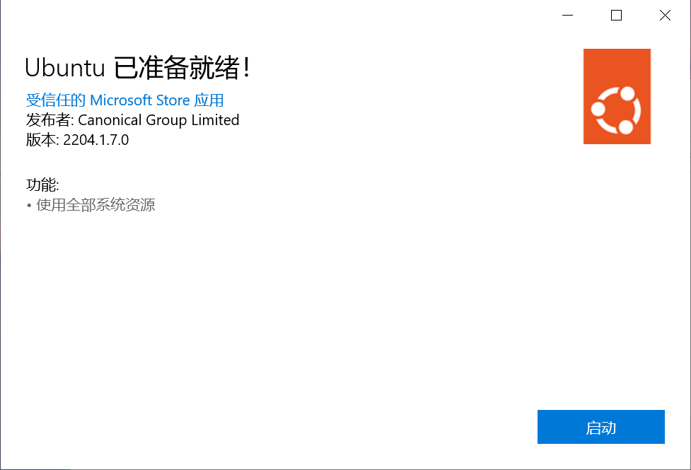
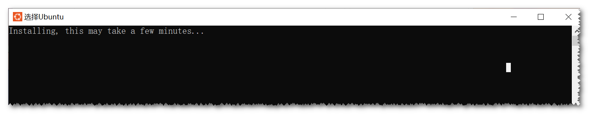
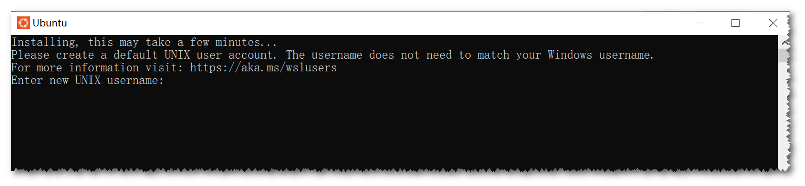
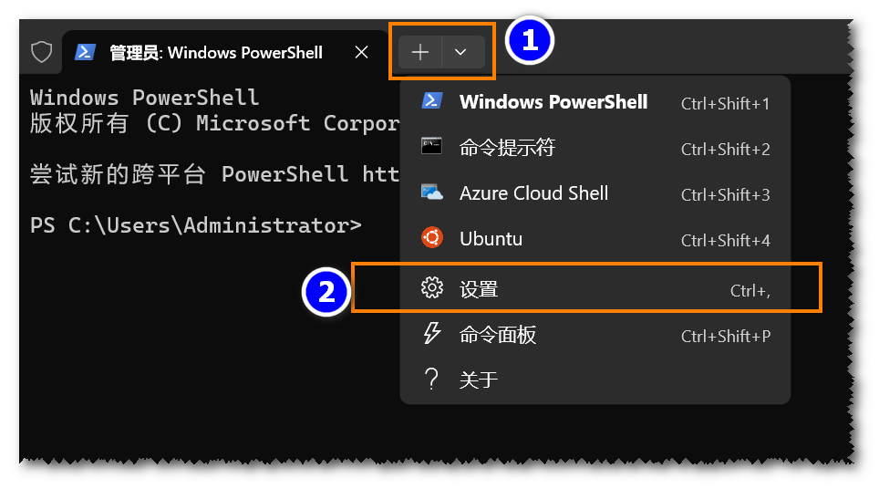
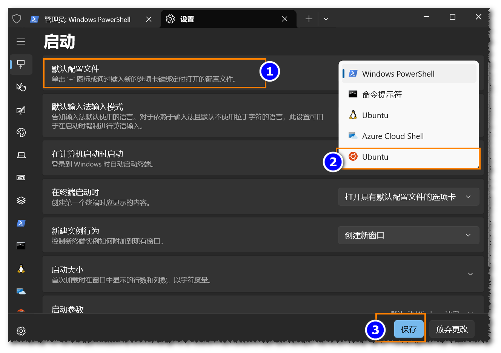

[[TOC]]

## 什么是 wsl

Windows Subsystem for Linux（简称WSL），Windows下的Linux子系统，是一个在Windows 10上能够运行原生Linux二进制可执行文件（ELF格式）的兼容层。它是由微软与Canonical公司合作开发，其目标是使纯正的Ubuntu、Debian等映像能下载和解压到用户的本地计算机，并且映像内的工具和实用工具能在此子系统上原生运行。

如果使用Windows 10 2004以上，可以通过WSL 2来窗口化运行桌面应用，也不需要另外安装其他的服务器。
微软官方文档：https://docs.microsoft.com/zh-cn/windows/wsl/


wsl有两种,分别是wsl1 wsl2.

WSL 2 并不是 WSL 1 的升级版本，因此安装 WSL 2 不需要先安装 WSL 1！

Windows 的 WSL (Windows Subsystem for Linux) 有两个版本:WSL1 和 WSL2,它们各有优缺点,适用于不同的使用场景。

1. WSL1:
   - 优点:
     - 集成度高,与 Windows 系统更加紧密集成。
     - 启动和运行速度较快。
     - 对于轻量级的 Linux 工作负载来说,性能较好。
   - 缺点:
     - 对于 I/O 密集型的工作负载,如编译、打包等,性能相对较差。
     - 不支持完整的 Linux 内核,某些功能可能受限。
     - 不支持 Docker 等基于 Linux 内核的容器技术。

2. WSL2:
   - 优点:
     - 使用完整的 Linux 内核,支持更广泛的 Linux 功能和应用。
     - 对于 I/O 密集型工作负载,如编译、打包等,性能更好。
     - 支持 Docker 等基于 Linux 内核的容器技术。
   - 缺点:
     - 启动和运行速度相对较慢,需要额外的资源消耗。
     - 与 Windows 系统的集成度略低于 WSL1。

总的来说:

- 如果您主要从事轻量级的 Linux 工作,如脚本编写、Web 开发等,WSL1 可能是更好的选择,因为它启动更快,性能更好。
- 如果您需要更强大的 Linux 功能,如编译、容器化等,或者需要更好的 I/O 性能,WSL2 会是更合适的选择。
- 如果您无法确定具体需求,建议尝试使用 WSL2,因为它提供了更完整的 Linux 功能支持。

具体选择哪个版本,需要根据您的实际使用场景和需求进行权衡。如果您有任何其他问题,欢迎随时询问。

我们只是用来写简单的代码,不可能写复杂的大型代码,也不会用到docker,所以这里选择wsl1

## step0. 准备

要求: 必须运行 Windows 10 版本 2004 及更高版本（内部版本 19041 及更高版本）或 Windows 11 才能使用以下命令。 如果使用的是更早的版本，请参阅[手动安装](https://learn.microsoft.com/zh-cn/windows/wsl/install-manual)

配置组件

### step1：启动 WSL 功能

请以PowerShell（管理员）运行所有指令,注意下面的命令都可以**复制**到命令行里执行



① 开启Windows Subsystem for Linux

```bash
dism.exe /online /enable-feature /featurename:Microsoft-Windows-Subsystem-Linux /all /norestart
```




② 开启虚拟机特性(可选,这一步可以不用开,如果后面装wsl系统失败,可以尝试一下这个命令)

```bash
dism.exe /online /enable-feature /featurename:VirtualMachinePlatform /all /norestart
```


现在可以重新启动计算机,然后进行下一步.

## step2. 下载

因为wsl的下载,需要访问`raw.githubusercontent.com`.为了能解决国内的网路问题, 这里使用最简单的方式,就是手动安装


下载我已经准备好的ubuntu.appx

打开网址: https://d.roj.ac.cn/14-软件/window/Ubuntu_2404.0.5.0_x64.appx

下载这个`Ubuntu_2404.5.0_x64.appx`,后有两种情况

1. 有图标,这个时候可以可以直接双击安装
2. 没有图标,这个时候需要以管理员身份打开`PowerShell`进行安装,方法如下
    1. 把`Ubuntu_2404.5.0_x64.appx`移动C盘根目录下
    2. 在`PowerShell`输入命令
       ```sh
       Add-AppxPackage -Path "C:\Ubuntu_2404.5.0_x64.appx"
       ```






3. 安装完后windows菜单就会多出`Ubuntu_2404` 这个图标,打开后,wsl会进行初始化,然后等待就行.


### step3. 创建用用户名

初始化完成后,WSL会要求我们用户名与密码,这里参考[官方的教程](https://learn.microsoft.com/zh-cn/windows/wsl/setup/environment#set-up-your-linux-username-and-password)

按照 `noilinux 2.0`的习惯,这里我设置

- 用户名 `noi`
- 密码: `1234`

当然也可以按你喜欢的来设置



### step4. wsl 系统下安装必要的软件

为了加快我们安装软件的速度,我们这里把ubuntu的软件源改成国内的源,这里使用[ubuntu  镜像站使用帮助  清华大学开源软件镜像站  Tsinghua Open Source Mirror](https://mirrors.tuna.tsinghua.edu.cn/help/ubuntu/)

修改源,把下面的命令直接复制到wsl的终端里执行


```bash
sudo bash
cat << EOF > /etc/apt/sources.list.d/ubuntu.sources
Types: deb
URIs: https://mirrors.tuna.tsinghua.edu.cn/ubuntu
Suites: noble noble-updates noble-backports
Components: main restricted universe multiverse
Signed-By: /usr/share/keyrings/ubuntu-archive-keyring.gpg
EOF
exit
```

更新源

```bash
sudo apt update
```

安装需要的软件

```bash
sudo apt install -y wget curl g++ gdb make cmake cgdb ca-certificates fzf
```


### setup5. 安装 Window Terminal

Window Terminal是微软开发的新的一代windows的终端


最简单的方式,还是安装我为你准备的安装版本

1. https://d.roj.ac.cn/14-软件/window 下找到`Microsoft.WindowsTerminal_1.21.3231.0_x64.zip`,解压到合适位置,打开`wt.exe`
2. 使用giotproxy下载: https://ghp.ci/https://github.com/microsoft/terminal/releases/download/v1.21.3231.0/Microsoft.WindowsTerminal_1.21.3231.0_x64.zip
3. 你也可以去github自行下载最新的版本: https://github.com/microsoft/terminal/releases/ ,但是网络的问题依然存在.

打开 Windows Terminal 后将ubuntu 24.04 设为默认的启动项目





### setup6. 安装并配置vscode

参考[官方的教程](https://learn.microsoft.com/zh-cn/windows/wsl/tutorials/wsl-vscode)

下载完成vscode后,需要安装的插件有

- wsl插件
- c++插件

## 编写代码

建议把代码放在 WSL 的 Linux 文件系统中，例如：

```text
~/code/
```

不要长期在 `/mnt/c/...` 下编译大量 C++ 文件，性能和文件权限都更容易出问题。

使用 VS Code 时，可以通过 Remote WSL 插件直接打开 Linux 目录。

## 如何传递文件

直接使用vscode对应的文件上右键选择download


## 问题1 wsl 2 error 0x800701bc错误

有的时候,需要更新wsl才成功安装子系统

```
wsl 2 error 0x800701bc错误
```

这是因为你正在使用wsl2 系统,且需要更新

```bash
wsl --upadate
```

可以更新,但是国内可能太慢了

需要去 https://github.com/microsoft/WSL/releases/ 安装最新的 最新的wsl2更新包


## 参考

- [官方教程](https://learn.microsoft.com/zh-cn/windows/wsl/install)
- [WSL 安装与使用  EESΛST Docs](https://docs.eesast.com/docs/tools/wsl)
- [how-to-install-appx-or-appxbundle-software-on-windows-10](https://www.howtogeek.com/285410/how-to-install-appx-or-appxbundle-software-on-windows-10/#first-enable-sideloading)
- [Windows 10 安装配置WSL2（ubuntu20.04）教程 超详细_win10安装wsl2-CSDN博客](https://blog.csdn.net/m0_51233386/article/details/127961763)
