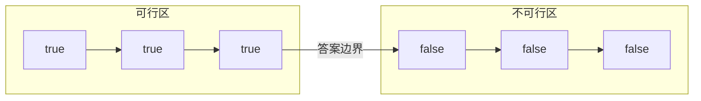

[[TOC]]

## 一句话算法

倍增跳跃从大步到小步试探：能跳就跳，不能跳就把步长减半。

## 问题模型

给定一个线性位置区间 $[0,n]$，有一个判断函数 `check(pos)`，并且它具有二分性（答案左侧全真、右侧全假）：



要求找到最后一个满足 `check(pos) == true` 的位置。

如果从左到右一步一步走，最坏需要 $O(n)$。倍增跳跃从最大的 $2^k$ 步开始尝试，每次把步长减半，只需要 $O(\log n)$。

## 核心直觉

先明确几个基本概念：

- **步长**：$2^k$，即 $1, 2, 4, 8, 16\dots$，从大到小递减。
- **跳跃**：从当前安全位置 `pos` 向右移动一个步长 `step`，到达 `pos + step`。

步长越大，一次跳得越远（节点排成一行，下方线段表示一次跳跃覆盖的跨度）：

```text
      +-----+   +-------+   +-------+   +-------+
      | pos |   | pos+1 |   | pos+2 |   | pos+4 |
      +-----+   +-------+   +-------+   +-------+

2^0=1  |-------------|
2^1=2  |-------------------------|
2^2=4  |-------------------------------------|
```

把答案想成一条路上的"最后一个安全位置"。我们从已知的安全位置出发，先尝试跳最大步长 $2^k$：能安全落地就跳过去，否则减半步长试更小的步。大的步长负责快速接近答案，小的步长精确补齐。

**模拟**：假设 `check` 在 `p..p+5` 为真、`p+6` 起为假，答案应为 `p+5`。从 `p` 出发，步长从大到小依次尝试，跳跃直接画在位置轴上：

```text
            safe (p..p+5)                                 |     unsafe
            +---+ +-----+ +-----+ +-----+ +-----+ +-----+ | +-----+ +-----+ +-----+ +-----+
            | p | | p+1 | | p+2 | | p+3 | | p+4 | | p+5 | | | p+6 | | p+7 | | p+8 | | p+9 |
            +---+ +-----+ +-----+ +-----+ +-----+ +-----+ | +-----+ +-----+ +-----+ +-----+

step=8      [p] ---------------------------------------------------------------^ [p+8]  skip (unsafe)
step=4      [p] -----------------------------^ [p+4]      jump
step=2                                     [p+4] -------------^ [p+6]  skip (unsafe)
step=1                                     [p+4] ----^ [p+5]  jump
```

大步 4 直接探到 `p+4`（安全），步长 2 试探 `p+6`（已落入不安全区，拒绝），步长 1 试探 `p+5`（安全，收下）——答案距离 5 正好被拆成二进制 `4+1`。

这和二进制表示是同一个思想：答案到起点的距离可以拆成若干个不同的 $2$ 的幂。

!!! info 本质：答案距离的二进制分解
倍增跳跃的本质等价于把答案到起点的距离拆成二进制。如上例，距离 5 的二进制是 `101`：

1. 最大步长 4（$2^2$）对应最高位的 1 → 试跳成功，相当于去掉最高位，剩余 `01`
2. 剩余距离变成递归的子问题，步长依次减半（2、1），逐个去掉剩余的 1
!!!

## 算法步骤

1. 令 `pos = start`，保证 `check(start)` 为真。
2. 找到不超过 `n` 的最大 $2$ 的幂，记为 `step`。
3. 当 `step > 0`：
   - 若 `pos + step <= n` 且 `check(pos + step)` 为真，则 `pos += step`。
   - 否则不跳。
   - `step >>= 1`。
4. 返回 `pos`。

## 算法证明

**核心不变量**：每一轮结束后，`pos` 仍然是一个可行位置，并且答案一定在 `pos` 右侧不超过剩余步长组合的范围内。

1. **能跳则跳**

   若 `check(pos + step)` 为真，说明答案至少可以到 `pos + step`，把 `pos` 更新过去不会越过答案。

2. **不能跳则不跳**

   若 `check(pos + step)` 为假，由二分性可知，所有更靠右的位置也是假。答案不可能达到 `pos + step`，所以不能跳。

3. **步长减半**

   从大到小尝试 $2^k,2^{k-1},\dots,1$，等价于决定答案距离的每一个二进制位是否应该为 `1`。

4. **结束**

   最后 `step=1` 也尝试完毕。如果 `pos+1` 不可行或越界，那么 `pos` 就是最后一个可行位置。

因此算法正确。

## 复杂度分析

- 时间复杂度：$O(\log n)$。
- 空间复杂度：$O(1)$。

`check` 的复杂度如果不是 $O(1)$，总复杂度应乘上单次 `check` 的复杂度。

## 代码实现

@include-code(/code/base/binary_jump.cpp, cpp)

## 测试用例

输入：

```text
20 13
```

输出：

```text
13
```

解释：示例中的 `check(pos)` 是 `pos <= limit`，所以最后一个可行位置就是 `13`。

## 应用分类详解

倍增跳跃的本质是：在单调可行空间里，用二进制步长从左向右拼出最后一个可行位置。它常常是二分查找、ST 表、树上倍增、函数跳跃的共同底层思想。

### 一、单调位置上的最后可行点

**典型模式：** 位置越靠右越难满足条件，需要找最后一个满足条件的位置。

**识别信号：** 题面出现“最大的位置”“最后一个不超过”“在线回答”“不能回头”。

**核心建模：** `check(pos)` 表示位置 `pos` 是否可行，然后从大步到小步试探。

| 应用场景 | 经典题目 | 核心思路 |
|---|---|---|
| 前缀和上找位置 | [[problem: acwing,109]] | 判断前缀和是否不超过给定值 |
| 最后可达点 | [[problem: luogu,P4155]] | 先确定可行性，再用倍增跳到边界 |

### 二、树上倍增

**典型模式：** 在树上向上跳很多步，或查询两个点的最近公共祖先。

**识别信号：** 出现“第 $k$ 个祖先”“LCA”“向上跳 $2^i$ 层”。

**核心建模：** 预处理 `up[u][i]` 表示从 `u` 向上跳 $2^i$ 步到哪里。

| 应用场景 | 经典题目 | 核心思路 |
|---|---|---|
| LCA | [[problem: luogu,P3379]] | 用二进制拆深度差，再同步上跳 |
| 第 k 祖先 | [LeetCode 1483](https://leetcode.cn/problems/kth-ancestor-of-a-tree-node/) | 把 $k$ 拆成二进制 |

### 三、静态区间信息查询

**典型模式：** 区间信息可以由长度为 $2^i$ 的块合并得到。

**识别信号：** 出现“静态数组”“区间最值”“多次查询”“不可修改”。

**核心建模：** ST 表预处理 `f[i][j]` 表示从 `i` 开始长度为 $2^j$ 的区间信息。

| 应用场景 | 经典题目 | 核心思路 |
|---|---|---|
| RMQ | [[problem: luogu,P3865]] | 查询时用两个 $2^k$ 区间覆盖 |
| 区间最大值 | [[problem: acwing,1273]] | 静态区间最值适合 ST 表 |

### 四、函数重复跳跃

**典型模式：** 每个状态有唯一后继，要求走很多步后的状态。

**识别信号：** 出现“每个点一条出边”“传送 $k$ 次”“函数图”。

**核心建模：** 预处理 `next[u][i]` 表示从 `u` 连续走 $2^i$ 步后到达哪里。

| 应用场景 | 经典题目 | 核心思路 |
|---|---|---|
| 函数图跳跃 | [AtCoder ABC167 D](https://atcoder.jp/contests/abc167/tasks/abc167_d) | 二进制拆步数 |
| 基环树跳跃 | [[problem: luogu,P5903]] | 唯一后继图上倍增 |
| 带权链跳跃 | [[problem: luogu,P7167]] | 单调栈建链 + 倍增跳段 + 容量前缀和 |

## 经典例题

### 1. [[problem: luogu,P3379]]

树上倍增 LCA 模板题。先把深度较大的点跳到同一深度，再从大到小同步跳。

### 2. [[problem: luogu,P3865]]

ST 表模板题。倍增思想用于预处理所有 $2^k$ 长度的区间信息。

### 3. [AtCoder ABC167 D](https://atcoder.jp/contests/abc167/tasks/abc167_d)

每个点只有一个后继，要走 $K$ 步。可以用倍增，也可以利用环；倍增写法最统一。

### 4. [[problem: luogu,P7167]]

圆盘喷泉。每个圆盘的溢出去向唯一（下方第一个直径更大的圆盘），与水量无关，于是喷泉变成若干条汇入水池的链。用单调栈建链，倍增表同时维护 `up`（跳 $2^k$ 步到哪）和 `sum`（这 $2^k$ 步的容量和），查询时从大到小枚举 $k$、能整段跳就跳。是"唯一后继 + 带权段跳"的典型，注意本题权值在点上（容量），边界判断是 `C[cur] >= need` 时停下。

## 参考

- 旧版文章：`Rbook_ejs_old/book/base/binary_jump/index.md`
- 本书相关：`book/pages/base/sparse_table/index.md`
