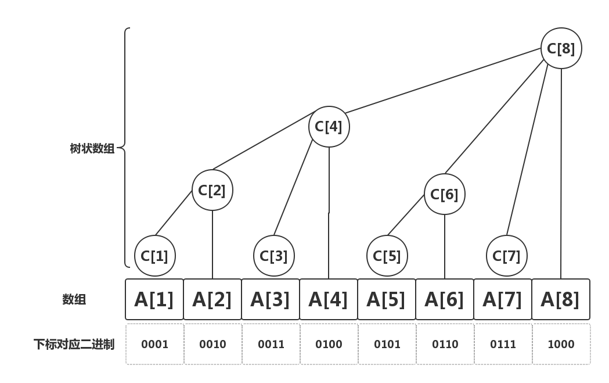
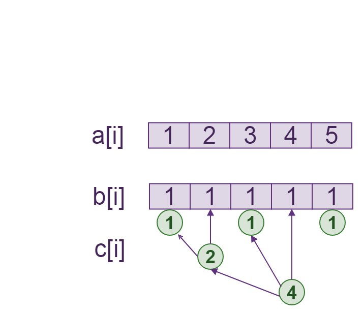
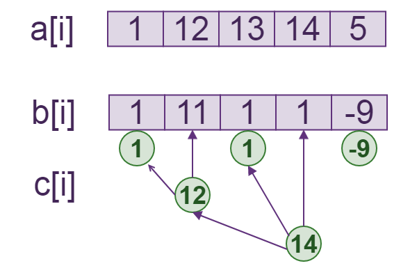
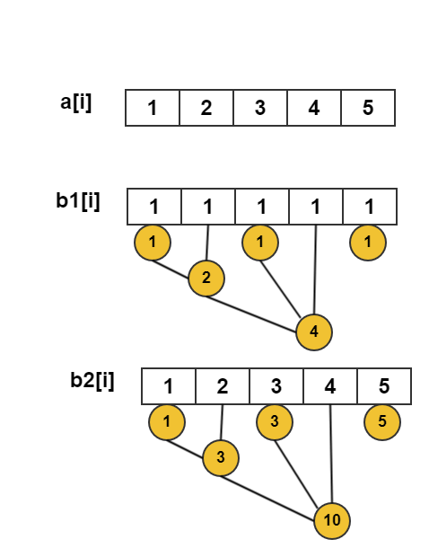
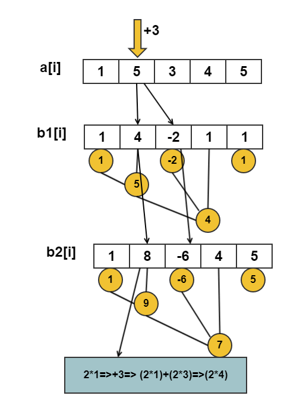
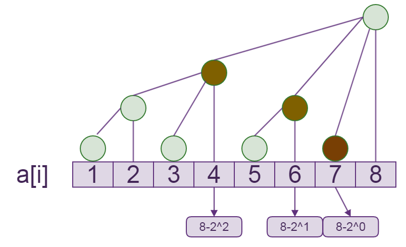

[[TOC]]

## 一句话算法

树状数组把前缀和拆成若干个二进制长度的块，每次只跳过或更新这些关键块。

## 问题模型

给定一个长度为 $n$ 的数组，需要动态维护前缀信息。

最基本的问题是：

1. 单点修改：`a[x] += k`。
2. 区间查询：求 `a[l] + ... + a[r]`。

如果每次查询都重新扫区间，复杂度是 $O(n)$；树状数组可以把修改和查询都做到 $O(\log n)$。

## 核心直觉

普通前缀和适合静态数组，但一旦修改 `a[x]`，所有 `sum[x..n]` 都要跟着变。

树状数组的做法是：不让一个位置影响所有后缀前缀和，而是让它只影响少数几个“二进制块”。

节点 `i` 维护的区间是：

$$
[i-\operatorname{lowbit}(i)+1,\ i]
$$

其中：

```cpp
lowbit(x) = x & -x
```

例如 `i=12`，二进制为 `1100`，`lowbit(12)=4`，所以节点 `12` 维护区间 `[9,12]`。

每个节点维护一个 lowbit 长度的块，1..8 的区间分配如下：

```text
下标:  1  2  3  4  5  6  7  8
        +--+--+--+--+--+--+--+--+
        |  |  |  |  |  |  |  |  |
        +--+--+--+--+--+--+--+--+
node 1: |--|
node 2: |-----|
node 3:       |--|
node 4: |-----------|
node 5:             |--|
node 6:             |-----|
node 7:                   |--|
node 8: |-----------------------|
```

每个 `node i` 的块长都是 `lowbit(i)`，从 `i-lowbit(i)+1` 开始到 `i` 结束。块和块之间互相嵌套，不是并排——这是后面"更新要沿 `p += lowbit(p)` 向上跳"的原因。

树状数组的整体结构如下：



### `lowbit` 为什么能找到块长

计算 `lowbit(i)`：

```cpp
lowbit(i) = i & -i
```

整数在计算机中用补码表示。`-i` 会保留 `i` 最低位的 `1` 所对应的补码特征，`i & -i` 最终只留下这一位。例如：

```text
 4 = 00000100
-4 = 11111100
4 & -4 = 00000100 = 4
```

因此 `lowbit(i)` 正好等于节点 `i` 所维护区间的长度。

### 前缀查询的具体拆分

例如查询前缀 `1..12`：

```text
tree[12] = a[9] + a[10] + a[11] + a[12]   (lowbit(12)=4)
12 - lowbit(12) = 8
tree[8]  = a[1] + ... + a[8]               (lowbit(8)=8)
8 - lowbit(8) = 0
```

所以：`sum(1..12) = tree[12] + tree[8]`。查询过程每次减去当前下标的最低位 `1`，把前缀拆成互不重叠的二进制块。

## 为什么 `p + lowbit(p)` 是下一个更新位置

当修改 `a[p]` 时，需要更新所有覆盖 `p` 的树状数组节点。

节点 `p` 当前覆盖长度是 `lowbit(p)`。执行：

```cpp
p += lowbit(p)
```

相当于把当前这块二进制区间向上合并到更大的区间。中间那些下标虽然比 `p` 大，但它们的 `lowbit` 太小，维护区间的左端点仍然在 `p` 右侧，因此覆盖不到 `p`。

所以 `p + lowbit(p)` 是第一个能继续覆盖原位置的节点。

**例子**：修改 `a[3]`，需要沿 `3 → 4 → 8` 更新（低 bit 进位，和上图嵌套关系一致）：

```text
修改 a[3] 需要更新的节点：

下标:  1  2  3  4  5  6  7  8
        +--+--+--+--+--+--+--+--+
        |  |  |  |  |  |  |  |  |
        +--+--+--+--+--+--+--+--+
node 3:       |--|                 (lowbit(3)=1)
node 4: |-----------|             (lowbit(4)=4)
node 8: |-----------------------|  (lowbit(8)=8)

路径:  3 --+1--> 4 --+4--> 8 --+8--> 16(>n, stop)
```

`3 → 4 → 8` 正是"把含下标 3 的最小块逐层向上合并"：3 的块太小，跳到 4 才覆盖到 3；4 的块还是不够大，跳到 8 覆盖到 3 的节点变少，最终 8 的块覆盖 1..8 全部。

## 算法步骤

### 单点修改

要执行 `a[p] += v`：

1. 更新当前节点 `tree[p] += v`。
2. 跳到下一个覆盖 `p` 的节点：`p += lowbit(p)`。
3. 直到 `p > n`。

### 前缀查询

要查询 `a[1] + ... + a[p]`：

1. 加上当前块 `tree[p]`。
2. 跳到当前块左侧的下一个块：`p -= lowbit(p)`。
3. 直到 `p == 0`。

区间和由前缀和相减：

$$
sum(l,r)=sum(r)-sum(l-1)
$$

**例子**：查询 `sum(1..7)`，合并路径 `7 → 6 → 4 → 0`（每次减去 lowbit）：

```text
查询 sum(1..7) 需要合并的节点：

下标:  1  2  3  4  5  6  7  8
        +--+--+--+--+--+--+--+--+
        |  |  |  |  |  |  |  |  |
        +--+--+--+--+--+--+--+--+
node 7:                   |--|   (lowbit(7)=1)
node 6:             |-----|      (lowbit(6)=2)
node 4: |-----------|            (lowbit(4)=4)

路径:  7 --1--> 6 --2--> 4 --4--> 0(stop)
```

三个块 `[7,7] + [5,6] + [1,4]` 互不重叠，正好拼成 `[1,7]`——前缀和正确性的直观体现。

## 算法证明

**核心不变量**：`tree[i]` 始终维护区间 `[i-lowbit(i)+1, i]` 的和。

单点修改 `a[p] += v` 时，只有覆盖 `p` 的块需要增加 `v`。循环 `p += lowbit(p)` 正好枚举所有覆盖原位置的块，因此修改后不变量仍成立。

前缀查询时，`tree[p]` 覆盖的是以 `p` 结尾的一段。减去 `lowbit(p)` 后，下一次查询的是这段左边的前缀。所有被选中的块互不重叠，合起来刚好是 `[1,p]`，所以得到正确前缀和。

## 复杂度分析

每次跳转都会去掉或进位一个二进制低位。

- 单点修改：$O(\log n)$。
- 前缀查询：$O(\log n)$。
- 区间查询：$O(\log n)$。
- 双 BIT 区间修改、区间查询：$O(\log n)$。
- 空间复杂度：$O(n)$。

## 代码实现

### 单点修改，区间查询

这份模板对应 Luogu P3374 一类题目。

@include-code(/code/data-struture/BIT/bit.cpp, cpp)

### 区间修改，单点查询

区间加可以转成差分数组上的单点修改：

$$
a[l..r] += k
\Longleftrightarrow
diff[l] += k,\ diff[r+1] -= k
$$

查询 `a[x]` 时，求差分数组前缀和即可。

@include-code(/code/data-struture/BIT/bit_区间修改_单点查询.cpp, cpp)

区间 `[l,r]` 加上 `v` 时，只需要修改差分数组的两个边界：`diff[l] += v`、`diff[r+1] -= v`。



修改边界后，任意位置的原数组值都可以通过差分前缀和恢复：



### 区间修改，区间查询

如果既要区间修改，又要查询区间和，需要维护两个树状数组。

设：

- `b[i] = a[i] - a[i-1]`；
- `bit1` 维护 `b[i]`；
- `bit2` 维护 `i * b[i]`。

由差分数组可得前缀和公式：

$$
\sum_{i=1}^{x}a[i]
= (x+1)\sum_{i=1}^{x}b[i]
- \sum_{i=1}^{x}i\cdot b[i]
$$

因此：

```cpp
prefix(x) = (x + 1) * query(bit1, x) - query(bit2, x);
range_sum(l, r) = prefix(r) - prefix(l - 1);
```

区间 `[l,r]` 加上 `v` 时：

```cpp
add(bit1, l, v);
add(bit1, r + 1, -v);
add(bit2, l, 1LL * l * v);
add(bit2, r + 1, -1LL * (r + 1) * v);
```

这两个 BIT 分别保存差分值和带下标的差分值：





完整模板：

@include-code(/code/data-struture/BIT/bit_区间修改_区间查询.cpp, cpp)

### 特殊变体：树状数组维护区间最值

树状数组也可以维护区间 `min`/`max`，但它不是普通前缀和 BIT 的直接替代品。

节点仍然维护：

$$
tree[i] = op(a[i-\operatorname{lowbit}(i)+1..i])
$$

查询区间 `[l,r]` 时，从右端点 `r` 向左：

1. 如果节点 `r` 管辖的完整区间仍在 `[l,r]` 内，就取 `tree[r]`，然后令 `r -= lowbit(r)`；
2. 如果完整区间越过了 `l`，只能取单点 `a[r]`，然后令 `r--`。

这种变体通常适合尾部插入或满足特定单调更新条件的场景，不能不加限制地支持任意修改后的区间最值。



特别注意：最值运算不可逆，所以不能像区间和那样使用 `query(r) - query(l-1)`。如果需要一般的静态区间最值，应优先考虑 ST 表；如果需要任意修改，应考虑线段树。

## 测试用例

单点修改、区间查询：

```text
5 5
1 2 3 4 5
2 1 5
1 3 2
2 2 4
1 5 -1
2 4 5
```

输出：

```text
15
11
8
```

区间修改、单点查询：

```text
5 4
1 2 3 4 5
2 3
1 2 4 10
2 3
2 5
```

输出：

```text
3
13
5
```

区间修改、区间查询：

```text
5 4
1 2 3 4 5
2 1 5
1 2 4 10
2 2 4
```

输出：

```text
15
39
```

## 应用分类详解

树状数组的本质是动态维护前缀信息。只要操作能拆成“前缀查询”和“单点影响若干前缀块”，就应该考虑树状数组。

### 一、动态区间和

**典型模式：** 数组会修改，还要反复查询区间和。

**识别信号：** 出现“单点修改”“区间求和”“多次询问”。

**核心建模：** 用树状数组维护动态前缀和，区间和用两个前缀相减。

| 应用场景 | 经典题目 | 核心思路 |
|---|---|---|
| 单点修改区间查询 | [[problem: luogu,P3374]] | `sum(r)-sum(l-1)` |
| 区间修改单点查询 | [[problem: luogu,P3368]] | 在差分数组上做 BIT |
| 区间修改区间查询 | 区间加法模板 | 两个 BIT 维护 `b[i]` 与 `i*b[i]` |

### 二、逆序对与排名统计

**典型模式：** 逐个插入元素，询问已经出现过多少个比它小或比它大。

**识别信号：** 出现“逆序对”“排名”“前面有多少个数小于/大于当前数”。

**核心建模：** 下标表示值域，树状数组维护每个值出现次数。

### 三、离线二维偏序

**典型模式：** 点有两个维度，要求统计满足 `x <= X` 且 `y <= Y` 的数量。

**识别信号：** 出现“二维点计数”“离线排序”“一个维度排序，另一个维度查询”。

**核心建模：** 按一个维度排序扫描，用树状数组维护另一个维度。

### 四、作为其他算法的计数组件

**典型模式：** 主算法需要快速维护前缀计数、前缀最大值或出现次数。

**识别信号：** 出现“整体二分”“CDQ 分治”“扫描线 + 计数”。

**核心建模：** 树状数组负责动态统计，主算法负责决定加入和删除哪些贡献。

### 五、特殊区间最值

**典型模式：** 数据主要从数组尾部加入，或更新满足单调条件，同时需要查询区间最值。

**识别信号：** 出现“尾插入”“前缀/区间最大值”“不能使用普通前缀差分”。

**核心建模：** 每个节点维护一个 `lowbit` 长度的区间最值；查询时从右端点向左选择完整块，必要时退化为单点查询。这是 BIT 的特殊变体，不是普通求和 BIT 的通用替代品。

## 经典例题

### 1. [[problem: luogu,P3374]]

树状数组模板题。练习单点修改和区间求和。

### 2. [[problem: luogu,P3368]]

区间修改、单点查询模板题。重点是把原数组转成差分数组。

### 3. [[problem: luogu,P1908]]

逆序对。把数值离散化后，用树状数组统计已经出现过的更大元素数量。

## 参考

- 本书差分章节：`base/differential/index.md`
