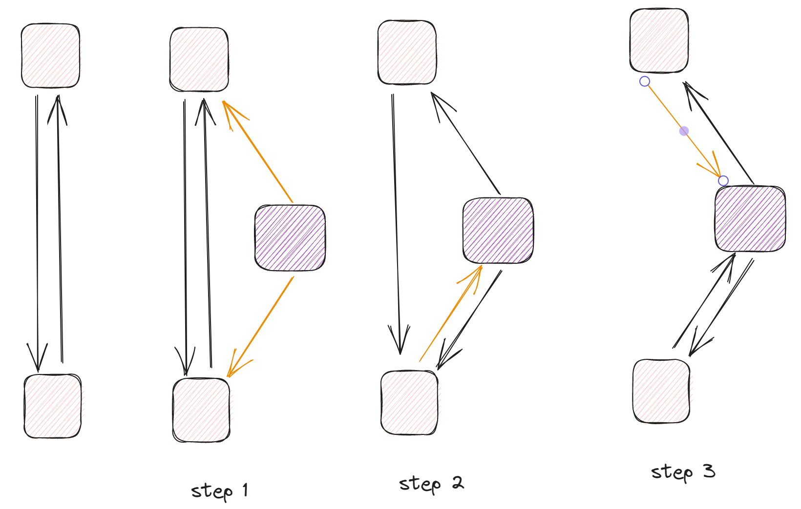
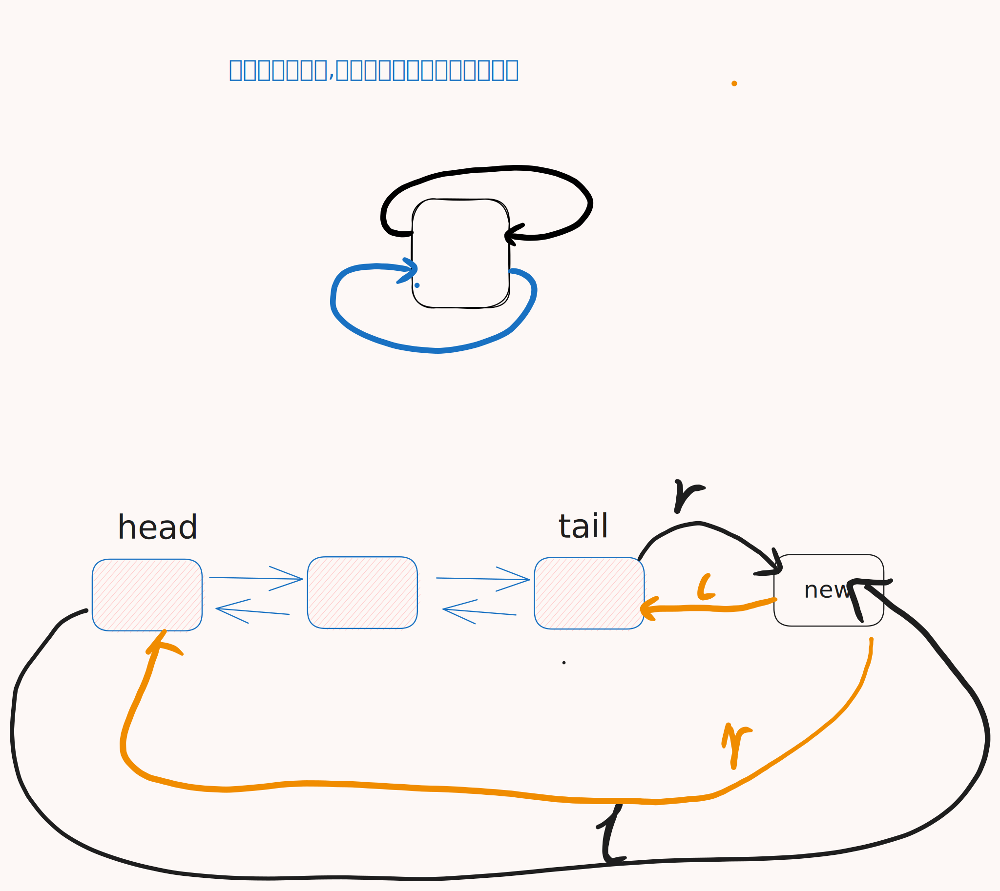

[[TOC]]

## 一句话算法

DLX 把 0/1 矩阵里的 `1` 串成十字链表，搜索时快速删除和恢复候选行，从而解决精确覆盖问题。

## 问题模型

!!! definition "精确覆盖"
给定一个只含 `0/1` 的矩阵，选择若干行，使得每一列恰好被一个 `1` 覆盖。
!!!

形式化地说，设选择的行集合为 $S$，对任意列 $c$，要求：

$$
\sum_{r \in S} a_{r,c}=1
$$

这类问题直接 DFS 会频繁扫描矩阵。DLX 的价值在于：当我们选择某一行后，可以快速删除所有与它冲突的行；回溯时又能按相反顺序恢复原状。

## 核心直觉

把每个 `1` 看成一个节点。每个节点同时属于一行和一列：

- 横向链表：串起同一行的所有 `1`。
- 纵向链表：串起同一列的所有 `1`。
- 第 `0` 行是列头链表，用来表示还有哪些列没被覆盖。





选择某一行时，这一行覆盖了若干列。精确覆盖要求这些列不能再被其他行覆盖，所以要把这些列以及相关候选行临时移出矩阵。因为所有节点都是双向链表，删除只需要改指针，恢复时按相反方向把指针接回去。

## 算法步骤

1. 建立列头节点 `0..m`，其中 `0` 是总表头。
2. 对矩阵中每个 `1` 建立节点，并同时接入所在行、所在列。
3. DFS 时如果列头链表为空，说明所有列都被覆盖，找到答案。
4. 选择当前 `1` 最少的一列 `c`，这是最重要的剪枝。
5. 枚举列 `c` 中的每一行 `r`，尝试把 `r` 放入答案。
6. 删除 `r` 覆盖的所有列，以及这些列中会冲突的其他行。
7. 递归搜索；失败后按相反顺序恢复。

伪代码如下：

```text
dfs():
    if 没有未覆盖列:
        return true

    c = 当前 1 最少的未覆盖列
    cover(c)
    for 每个能覆盖 c 的行 r:
        选择 r
        for r 中每个其他列 j:
            cover(j)
        if dfs():
            return true
        for r 中每个其他列 j，反向枚举:
            uncover(j)
        撤销 r
    uncover(c)
    return false
```

## 算法证明

**关键不变量：** DFS 的任意时刻，列头链表中剩下的列，正好是还没有被当前答案覆盖的列；矩阵中保留的行，正好是不会与当前答案冲突的候选行。

1. **初始化：** 没有选择任何行，所有列都未覆盖，所有行都是候选行，不变量成立。
2. **选择一行：** 假设选中行 `r`。`r` 中每个 `1` 对应的列都会被覆盖一次，因此这些列必须从未覆盖列中删除。
3. **删除冲突：** 对于被 `r` 覆盖的任意列，其他含有这一列 `1` 的行如果再被选择，就会让这一列被覆盖两次，所以这些行必须被排除。
4. **恢复：** 回溯时按删除的反方向恢复链表，所有指针回到进入分支前的状态，不变量继续成立。
5. **终止：** 如果没有未覆盖列，当前答案覆盖了所有列；由于每一步都删除了冲突行，所以每列不会被覆盖超过一次，因此每列恰好覆盖一次。

## 复杂度分析

设矩阵有 $n$ 行、$m$ 列、$K$ 个 `1`。

- 建图时间复杂度：$O(K)$。
- 空间复杂度：$O(K+m+n)$。
- 搜索最坏情况仍然是指数级，因为精确覆盖本质上是组合搜索问题。
- DLX 的优势不是改变最坏复杂度，而是用链表删除恢复和“选最少候选列”剪枝显著降低常数和搜索树规模。

## 代码实现

下面模板读入一个 `n * m` 的 `0/1` 矩阵，输出一组可行行号；如果不存在答案，输出 `No Solution!`。

@include-code(/code/data-struture/dlx/exact_cover.cpp, cpp)

## 测试用例

输入：

```text
3 3
1 0 0
0 1 0
0 0 1
```

输出：

```text
1 2 3
```

这个矩阵中每一行只覆盖一列，所以选择三行即可精确覆盖全部三列。

再看一个无解用例：

```text
2 2
1 0
1 0
```

第 `2` 列没有任何 `1`，因此无论怎么选行都无法覆盖它，输出：

```text
No Solution!
```

## 应用分类详解

DLX 的本质是精确覆盖搜索：每个约束必须被满足一次，而且只能满足一次。

### 一、标准精确覆盖

**典型模式：** 题目可以建成若干候选方案，每个方案覆盖一些约束，要求选择一批方案让所有约束恰好出现一次。
**识别信号：** 题面出现“每个位置恰好一次”“每个元素恰好使用一次”“不能重复也不能遗漏”。
**核心建模：** 行表示候选方案，列表示约束，`1` 表示这个方案满足这个约束。

| 应用场景 | 经典题目 | 核心思路 |
|---------|---------|---------|
| 精确覆盖模板 | [AcWing 1067 精确覆盖问题](https://www.acwing.com/problem/content/1069/) | 直接把矩阵输入 DLX，选择行覆盖所有列 |
| 拼图覆盖 | [[problem: luogu,P4929]] | 候选摆法是行，格子占用是列 |

### 二、数独类约束覆盖

**典型模式：** 每个格子填一个数，并且行、列、宫内数字都不能重复。
**识别信号：** 约束数量固定且都是“恰好一个”。
**核心建模：** 一个候选行表示“在某个格子填某个数字”，列表示四类约束：格子被填、行内数字、列内数字、宫内数字。

| 应用场景 | 经典题目 | 核心思路 |
|---------|---------|---------|
| 数独求解 | [POJ 3074 Sudoku](http://poj.org/problem?id=3074) | 每个候选填法覆盖 4 个约束 |
| 变形数独 | [[problem: luogu,P1784]] | 在普通数独约束上增加题目附加限制 |

### 三、排列与放置问题

**典型模式：** 若干对象放到若干位置，每个对象和每个位置都只能使用一次。
**识别信号：** 题面同时限制“对象唯一”和“位置唯一”，普通 DFS 分支很大。
**核心建模：** 候选行表示一次放置，列表示对象是否使用、位置是否占用、附加冲突是否出现。

| 应用场景 | 经典题目 | 核心思路 |
|---------|---------|---------|
| N 皇后变体 | [[problem: luogu,P1219]] | 行列对角线都可转成约束列 |
| 多米诺/骨牌覆盖 | [[problem: luogu,P1282]] | 每个摆放方案覆盖对应格子约束 |

## 经典例题

1. [AcWing 1067 精确覆盖问题](https://www.acwing.com/problem/content/1069/)
   标准模板题。重点练习 `cover`、`uncover` 和选择最少候选列的剪枝。

2. [POJ 3074 Sudoku](http://poj.org/problem?id=3074)
   数独是 DLX 最经典的应用。难点不在 DLX 本身，而在把每个候选填法映射到 4 类约束列。

3. [[problem: luogu,P1784]]
   数独类建模题。适合练习如何从“格子、行、列、宫”四类限制中建立精确覆盖矩阵。

## 参考

- [AcWing 1067. 精确覆盖问题 DLX - itdef - 博客园](https://www.cnblogs.com/itdef/p/14108020.html)
- [166. 数独 dancing links 方法 - itdef - 博客园](https://www.cnblogs.com/itdef/p/11337878.html)
