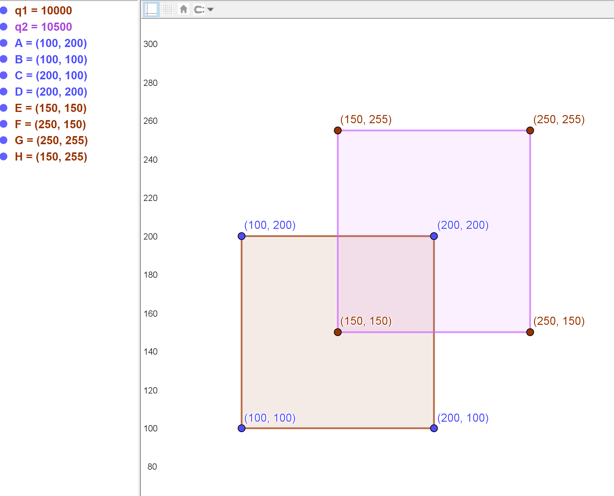

[[TOC]]

## 一句话算法

扫描线把矩形面积拆成一层一层的横条：线段树维护当前横向被覆盖长度，相邻两条水平边之间的高度乘这个长度就是新增面积。

## 问题模型

给出 $n$ 个轴对齐矩形，每个矩形由左下角 $(x_1,y_1)$ 和右上角 $(x_2,y_2)$ 描述，要求所有矩形的并集面积。

直接枚举平面格子不可行，因为坐标可能很大。我们只关心矩形的上下边，因为只有扫描线经过这些边时，当前被覆盖的横向区间才会改变。



## 核心直觉

从下往上移动一条水平扫描线：

- 遇到矩形下边：这个矩形的横向区间开始贡献覆盖，覆盖次数 `+1`。
- 遇到矩形上边：这个矩形的横向区间停止贡献覆盖，覆盖次数 `-1`。
- 两条相邻事件边之间，横向覆盖长度不变。

于是每一层面积都是：

$$
\text{当前覆盖横长} \times \text{下一条边的高度差}
$$

线段树维护的不是“区间和”，而是“当前覆盖次数大于 $0$ 的总长度”。

## 算法步骤

1. 对每个矩形生成两条事件边：
   - 下边：`[x1, x2)` 在高度 `y1` 加一。
   - 上边：`[x1, x2)` 在高度 `y2` 减一。
2. 收集所有 `x1, x2` 做离散化。
3. 线段树的每个叶子不表示一个点，而表示相邻两个离散化端点之间的一段。
4. 按 `y` 从小到大处理事件。
5. 每次先用上一层横向覆盖长度乘高度差累加答案，再把当前事件更新进线段树。
6. 线段树根节点始终保存当前横向被覆盖的总长度。

## 离散化的关键

离散化时最容易错的一点是：矩形覆盖的是区间段，不是端点。

假设离散化端点为：

```text
x:       1      4      5      7
leaf:    [1,4)  [4,5)  [5,7)
index:      1      2      3
```

所以原区间 `[l,r)` 对应的叶子下标是：

$$
d(l), d(r)-1
$$

其中 $d(x)$ 表示坐标 `x` 在离散化端点数组中的 1-based 编号。

!!! note "为什么不用 pushdown"
我们只需要查询整棵树的根节点，不会向下查询某个局部区间。每次更新后只要沿递归路径重新 `pull`，根节点就是正确的当前覆盖长度。
!!!

## 算法证明

**关键不变量：** 处理完高度不超过当前事件的所有边后，线段树根节点保存当前扫描线处被至少一个矩形覆盖的横向总长度。

1. **叶子正确：** 每个叶子表示一个真实坐标段 `[x_i,x_{i+1})`。如果覆盖次数大于 `0`，整段被覆盖；否则它是否被覆盖只可能来自子段，但叶子没有子段，所以长度为 `0`。
2. **内部节点正确：** 若 `cover[p] > 0`，说明这个节点代表的整段被某些矩形完整覆盖，长度就是右端点减左端点。若 `cover[p] == 0`，它的覆盖长度只能来自两个儿子的并集，因此等于左右儿子覆盖长度之和。
3. **事件正确：** 下边让区间覆盖次数加一，上边让区间覆盖次数减一，正好模拟扫描线穿过矩形边界时的覆盖变化。
4. **面积正确：** 两个相邻事件高度之间没有新的边，覆盖长度不变，所以该层面积等于固定横长乘高度差。累加所有层就是并集面积。

## 复杂度分析

设矩形数量为 $n$。

- 事件数量为 $2n$。
- 离散化和排序复杂度为 $O(n\log n)$。
- 每个事件更新一次线段树，复杂度为 $O(\log n)$。
- 总时间复杂度为 $O(n\log n)$。
- 空间复杂度为 $O(n)$。

## 代码实现

下面是正式竞赛模板，适用于坐标较大的矩形面积并。

@include-code(/code/data-struture/segment_tree/scanline_area_discrete.cpp, cpp)

无离散化版本只适合坐标范围很小的入门理解，用来观察 `cover` 如何决定当前覆盖长度。

@include-code(/code/data-struture/segment_tree/scanline_area_plain.cpp, cpp)

## 测试用例

输入：

```text
2
1 1 3 3
2 2 4 4
```

输出：

```text
7
```

两个 $2 \times 2$ 的矩形面积和为 `8`，重叠部分是一个 $1 \times 1$ 的正方形，所以并集面积为 `7`。

## 应用分类详解

扫描线的本质是：把二维覆盖问题按某个坐标排序，转成一系列一维动态覆盖问题。

### 一、矩形面积并

**典型模式：** 多个轴对齐矩形，求并集面积。
**识别信号：** 坐标大、矩形多、要求去重面积。
**核心建模：** 扫描 `y`，线段树维护当前被覆盖的 `x` 总长度。

| 应用场景 | 经典题目 | 核心思路 |
|---------|---------|---------|
| 面积并模板 | [[problem: luogu,P5490]] | 离散化 x 坐标，事件边按 y 排序 |

### 二、矩形周长并

**典型模式：** 求多个矩形并集轮廓长度。
**识别信号：** 题目问“周长”“轮廓线”，需要统计覆盖长度变化。
**核心建模：** 分别扫描横向和纵向，统计覆盖长度变化量。

| 应用场景 | 经典题目 | 核心思路 |
|---------|---------|---------|
| 周长并 | [[problem: luogu,P1856]] | 每条边贡献的是覆盖长度变化，而不是覆盖长度乘高度 |

### 三、二维离线覆盖统计

**典型模式：** 一维不断增删区间，另一维按事件排序。
**识别信号：** 操作可以按坐标排序，查询只依赖当前活跃集合。
**核心建模：** 扫描线维护活跃对象，线段树或树状数组回答一维信息。

| 应用场景 | 经典题目 | 核心思路 |
|---------|---------|---------|
| 区间活跃统计 | [[problem: luogu,P2163]] | 一维排序，另一维用数据结构维护 |

## 经典例题

1. [[problem: luogu,P5490]]
   矩形面积并模板题。重点是理解叶子表示的是坐标段 `[x_i,x_{i+1})`。

2. [[problem: luogu,P1856]]
   矩形周长并。和面积并相比，需要维护覆盖段数、左右端点是否被覆盖等信息。

3. [HDU 1542 Atlantis](https://acm.hdu.edu.cn/showproblem.php?pid=1542)
   浮点坐标版本的矩形面积并，离散化坐标仍然适用。

## 参考

- [oi-wiki scanning](https://oi-wiki.org/geometry/scanning)
