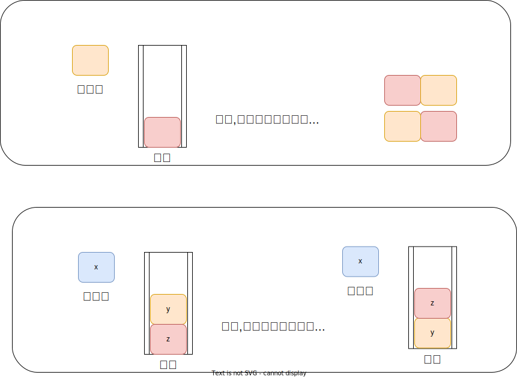

[[TOC]]

## 一句话算法

出栈序列计数就是数合法的 `push/pop` 操作序列：任意前缀里 `pop` 不能比 `push` 多。

## 问题模型

有输入序列 `1,2,...,n`，每个数必须先入栈，再从栈顶出栈。问一共能得到多少种不同的输出序列。

以 `n = 3` 为例，答案是 `5`。

这个问题也可以看成长度为 `2n` 的操作序列：

- `push`：把下一个等待元素压入栈；
- `pop`：从栈顶弹出一个元素，放到输出序列末尾。

合法操作序列必须满足两个条件：

1. 一共有 `n` 次 `push` 和 `n` 次 `pop`。
2. 任意前缀中，`pop` 次数不能超过 `push` 次数。

第二条就是“栈不能空弹”。

## 核心直觉

先不要关心栈里具体是哪些数，只看数量。

一个状态只需要两个数字：

- `i`：还有多少个数等待入栈；
- `j`：栈里现在有多少个数。

为什么不用记录具体序列？因为输入顺序固定为 `1,2,...,n`，栈顶元素由历史操作唯一决定。对于“后面还能产生多少种输出序列”这个问题，只要 `i` 和 `j` 相同，后续操作树的形状就相同。



每个状态最多有两条路：

1. 如果 `i > 0`，可以继续入栈，变成 `(i - 1, j + 1)`。
2. 如果 `j > 0`，可以出栈，变成 `(i, j - 1)`。

## 算法步骤

定义 `f(i, j)` 表示：

> 还有 `i` 个数等待入栈，栈内有 `j` 个数时，后续能形成多少种输出序列。

转移：

$$
f(i,j)=
\begin{cases}
1, & i=0 \\
f(i-1,j+1), & i>0,\ j=0 \\
f(i-1,j+1)+f(i,j-1), & i>0,\ j>0
\end{cases}
$$

解释：

- `i = 0` 时，所有数都已经入过栈，剩下只能一路弹出，所以只有 `1` 种。
- `j = 0` 时，栈空，不能出栈，只能入栈。
- `i > 0` 且 `j > 0` 时，既可以入栈，也可以出栈。

答案是 `f(n, 0)`。

## 算法证明

**关键不变量：** `f(i, j)` 表示从当前状态出发的合法完成方案数。

1. 当 `i = 0` 时，没有新元素可以入栈，栈内元素只能依次弹出，后续方案唯一。
2. 当 `i > 0` 时，如果选择入栈，等待数量减少 `1`，栈内数量增加 `1`，状态变为 `(i-1,j+1)`。
3. 当 `j > 0` 时，如果选择出栈，等待数量不变，栈内数量减少 `1`，状态变为 `(i,j-1)`。
4. 入栈和出栈是当前状态下仅有的两类合法操作，且两类操作的第一步不同，因此方案集合互不相交。

所以把可走分支的方案数相加，正好得到当前状态的方案数。

## 复杂度分析

状态数量不超过 `(n+1)(n+1)`。

- 时间复杂度：$O(n^2)$。
- 空间复杂度：$O(n^2)$，用于记忆化数组和递归栈。

对于 `n <= 18`，答案为第 `n` 个 Catalan 数，`long long` 足够保存。

## 代码实现

@include-code(/code/base/enumerate/stack_output_count.cpp, cpp)

## 测试用例

输入：

```text
3
```

输出：

```text
5
```

## 应用分类详解

出栈序列计数的本质是：统计一类“前缀永远不越界”的操作序列。

### 一、栈合法操作序列

**典型模式：** 有 `n` 次入栈和 `n` 次出栈，要求不能空栈出栈。

**识别信号：** 题面出现“入栈出栈顺序”“输出序列数量”“栈操作可能方案”。

**核心建模：** `push` 看作 `+1`，`pop` 看作 `-1`，合法条件是任意前缀和不小于 `0`。

| 应用场景 | 经典题目 | 核心思路 |
|---|---|---|
| 出栈序列数量 | [[problem: luogu,P1044]] | 用 `f(i,j)` 统计后续合法操作 |
| 合法括号序列 | Catalan 数基础模型 | 左括号对应 `push`，右括号对应 `pop` |

### 二、Catalan 数模型

**典型模式：** 方案数满足“不能越过对角线”“先开后关”“先入后出”。

**识别信号：** 合法括号、出栈序列、网格路径不越界、二叉树形态数量。

**核心建模：** 这些问题都可以转成前缀和非负的 `+1/-1` 序列。

| 应用场景 | 经典题目 | 核心思路 |
|---|---|---|
| 括号匹配方案 | 合法括号序列 | 每个前缀左括号不少于右括号 |
| 不越界路径 | 从左下到右上且不越过对角线 | 横纵步数对应入栈出栈 |
| 二叉树计数 | 不同二叉树结构数 | 左右子树划分得到 Catalan 递推 |

## 经典例题

- [[problem: luogu,P1044]] 栈：本页模板题，`n <= 18`，记忆化 DP 足够。
- 合法括号序列计数：与出栈操作序列完全同构。
- 网格路径不越界计数：把 `push/pop` 分别看成两种移动方向。

## 参考

- 本书相关章节：[Catalan 数](../../math/combinatorics/catalan_number/index.md)
