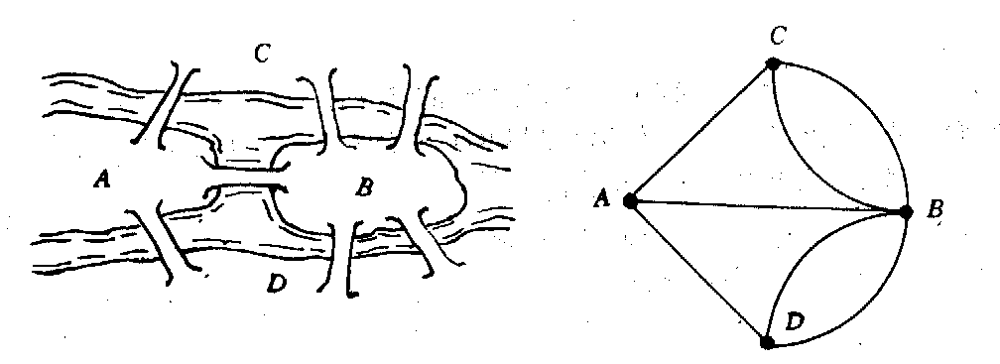

[[TOC]]

## 一句话算法

欧拉路是一笔走完所有边的路径；先用连通性和度数判定是否存在，再用 Hierholzer 算法“走到无路可走再回溯收路”，就能线性构造答案。

## 问题模型

给定一张图，要求找出一条路径，使得：

- 每条边恰好经过一次。
- 顶点可以重复经过。
- 如果起点和终点相同，称为欧拉回路。
- 如果起点和终点可以不同，称为欧拉路。

欧拉路问题起源于柯尼斯堡七桥问题：能不能从某处出发，每座桥恰好走一次？



本文讨论两类竞赛中最常用的模型：

- 无向图欧拉路/回路。
- 有向图欧拉路/回路。

### 无向图存在条件

忽略度数为 $0$ 的孤立点后，所有有边的顶点必须连通。

在此基础上：

- 奇度顶点个数为 $0$：存在欧拉回路。
- 奇度顶点个数为 $2$：存在欧拉路，起点和终点就是这两个奇度顶点。
- 其他情况：不存在欧拉路。

### 有向图存在条件

忽略入度和出度都为 $0$ 的孤立点后，所有有边的顶点在弱连通意义下连通。也就是把有向边当成无向边后连通。

在此基础上：

- 所有点满足 $in(v)=out(v)$：存在有向欧拉回路。
- 恰有一个点满足 $out(s)=in(s)+1$，恰有一个点满足 $in(t)=out(t)+1$，其他点满足 $in(v)=out(v)$：存在从 $s$ 到 $t$ 的有向欧拉路。
- 其他情况：不存在有向欧拉路。

## 核心直觉

欧拉路的关键不是“能不能乱走”，而是“每条边只能用一次，最后还能把所有边接成一条连续路径”。

Hierholzer 算法的直觉是：图里的欧拉回路可以看成很多小环套在一起。普通 DFS 如果进门就记录路径，可能先走完一个小环，然后主干上的边还没有接进去。Hierholzer 反过来做：**走边时先不急着输出，等一个点已经没有未走的边时，再把它放进答案。**

这个“回溯时加入答案”的动作，本质是在把最里面的小环先收好，再一层一层拼回主路径。

可以把它理解成：

- 前序记录：边走边写，遇到分叉时容易把后面的环插不回去。
- 后序记录：先把分叉里的边全部走完，回溯时自然完成拼接。

因此 Hierholzer 的答案通常是逆序产生的，最后 `reverse` 一次即可。

## 算法步骤

无向图：

1. 建邻接表，每条无向边分两次加入邻接表，但共享同一个边编号 `id`。
2. 统计每个点的度数，找一个有边的点作为连通性检查起点。
3. 忽略孤立点检查连通性。
4. 统计奇度顶点个数：
   - 若为 $2$，从任意一个奇度点出发。
   - 若为 $0$，从任意有边的点出发。
   - 否则无解。
5. 用栈模拟 Hierholzer：
   - 当前点还有未使用边，就标记这条边并走到下一点。
   - 当前点没有未使用边，就把它加入 `path` 并弹栈。
6. 若最终 `path.size() != m+1`，说明没有覆盖所有边，无解。
7. 反转 `path`，得到欧拉路或欧拉回路的顶点序列。

有向图：

1. 建有向邻接表，同时建一张弱连通检查用的无向图。
2. 统计每个点的入度 `indeg` 和出度 `outdeg`。
3. 忽略孤立点检查弱连通性。
4. 根据入度、出度差确定起点：
   - 回路：所有点入度等于出度，从任意有边点出发。
   - 路径：从唯一满足 `outdeg = indeg + 1` 的点出发。
5. 后续 Hierholzer 过程与无向图相同，只是边只沿原方向走。

## 算法证明

先证明判定条件。

无向图中，一条欧拉路经过中间点时，每进入一次就必须离开一次，所以中间点贡献成对的边，度数为偶数。只有起点和终点可以多一次“离开”或“进入”，所以最多有两个奇度点。若是回路，起点也会回到自身，所有点度数都为偶数。

有向图同理：中间点每进入一次就必须离开一次，所以 $in(v)=out(v)$。路径起点多一次离开，终点多一次进入，因此起点满足 $out=in+1$，终点满足 $in=out+1$。

再证明构造正确。

Hierholzer 始终维护一个不变量：已经标记使用的边不会再被使用，当前栈表示一条由已使用边组成的连续行走轨迹。

当一个顶点没有未使用边时，把它放入答案是安全的，因为以后不可能再从这个点接出新的未使用边；它在最终欧拉路中的后续部分已经确定。回溯不断重复这个过程，相当于先完成局部小环，再把小环接回主路径。

若图满足存在条件，所有有边顶点在同一个连通块中，并且度数平衡保证路径不会在错误的位置提前断掉。算法每次恰好消耗一条未使用边，所以最终若得到 $m+1$ 个顶点，就对应恰好使用了全部 $m$ 条边的一条欧拉路。

## 复杂度分析

设顶点数为 $n$，边数为 $m$。

- 建图时间复杂度：$O(n+m)$。
- 连通性检查时间复杂度：$O(n+m)$。
- Hierholzer 构造中，每条边只会被跳过或使用常数次，总时间复杂度为 $O(n+m)$。
- 空间复杂度为 $O(n+m)$。

## 代码实现

### 无向图模板

@include-code(/code/graph/euler_path_undirected.cpp, cpp)

### 有向图模板

@include-code(/code/graph/euler_path_directed.cpp, cpp)

## 测试用例

无向图欧拉路：

```txt
输入:
5 6
1 2
2 3
3 4
4 2
3 5
5 1

一种合法输出:
2 1 5 3 4 2 3
```

解释：输出不唯一，只要相邻顶点之间对应输入中的一条未使用边，并且 $6$ 条边都恰好用一次即可。

有向图欧拉回路：

```txt
输入:
5 6
1 2
2 3
3 1
3 4
4 5
5 3

一种合法输出:
1 2 3 4 5 3 1
```

不可行用例：

```txt
输入:
4 2
1 2
3 4

输出:
NO
```

解释：忽略孤立点后，有边顶点不在同一个连通块中。

## 应用分类详解

欧拉路的本质是：**每条边恰好使用一次的路径构造问题。**

### 一、一笔画与边覆盖

- **典型模式：** 题目要求每条边、每条路、每张牌或每个连接关系恰好使用一次。
- **识别信号：** 出现“一笔画”“每条边恰好一次”“输出经过边的顺序”。
- **核心建模：** 把对象之间的连接关系建成边，用度数判定和 Hierholzer 构造路径。

| 应用场景 | 经典题目 | 核心思路 |
|---------|---------|---------|
| 无向一笔画 | [[problem: luogu,P1341]] | 字符当顶点，相邻字符关系当边 |
| 字典序路径 | [[problem: luogu,P2731]] | 邻接表排序后做 Hierholzer |
| 有向欧拉回路 | [[problem: luogu,P6066]] | 按出边方向构造完整边序列 |

### 二、字符串拼接与 De Bruijn 图

- **典型模式：** 给出很多长度相同或相邻重叠的片段，要求拼成一个序列。
- **识别信号：** 片段之间通过前缀、后缀相接，每个片段必须使用一次。
- **核心建模：** 把长度 $k-1$ 的前缀和后缀当顶点，把一个长度 $k$ 的片段当有向边。

| 应用场景 | 经典题目 | 核心思路 |
|---------|---------|---------|
| 单词接龙 | [[problem: luogu,P1127]] | 单词首尾字符建边，找字典序欧拉路 |
| DNA 片段拼接 | De Bruijn 图模型 | k-mer 作为边，前后缀作为顶点 |
| 邮票/门牌序列 | 常见构造题 | 每个片段必须恰好使用一次 |

### 三、边必须重复覆盖的扩展

- **典型模式：** 要求每条边至少经过一次，并且总代价最小。
- **识别信号：** 出现“巡检所有道路”“邮递员路线”“允许重复走边”。
- **核心建模：** 如果图本来不是欧拉图，就需要补边或复制路径，让奇度点配对后变成欧拉回路。

| 应用场景 | 经典题目 | 核心思路 |
|---------|---------|---------|
| 中国邮递员问题 | 邮差巡路模型 | 奇度点之间做最小代价配对 |
| 边覆盖巡检 | [[problem: luogu,P6628]] | 把必须重复的部分转成欧拉化后的走法 |
| 路网巡回 | 工程巡检模型 | 先补足度数条件，再输出欧拉回路 |

## 经典例题

1. [[problem: luogu,P1341]] 无序字母对
   每个字母是顶点，每个字母对是无向边。题目要求输出一条使用所有字母对的序列，本质就是无向欧拉路。

2. [[problem: luogu,P2731]] Riding the Fences
   模板型无向欧拉路题。额外要求字典序尽量小，需要对邻接表排序，并从合适的最小起点开始。

3. [[problem: luogu,P1127]] 词链
   单词看成从首字母到尾字母的一条有向边。每个单词必须用一次，因此需要判断有向欧拉路，并处理字典序。

4. [[problem: luogu,P6066]] Watchcow
   有向欧拉回路模型。重点是理解每条有向边只能按方向使用一次。

5. [[problem: luogu,P6628]] 丁香之路
   欧拉路的扩展题。不是简单套模板，而是要先把重复经过边的需求转成欧拉化后的图。

## 字典序最小路径

如果题目要求字典序最小，常见处理方式是：

1. 邻接表按终点编号排序。
2. 若用递归或栈后序生成答案，要注意答案会反转。
3. 根据实现选择升序取边后反转答案，或降序存边用 `pop_back()` 取最小边。
4. 起点也要按判定条件选择最小可行点：有两个奇度点时取较小的奇度点；欧拉回路时取最小的有边点。

字典序问题的细节和“答案是后序产生的”强相关。调试时不要只看取边顺序，还要看最后是否做了 `reverse`。
