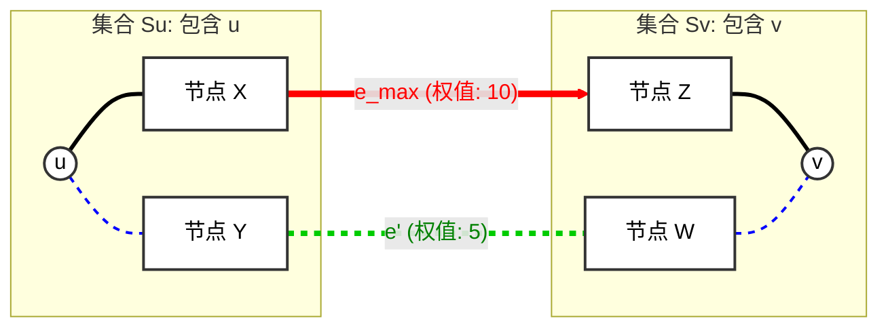

[[TOC]]

本文回答一个问题：最小生成树只要求整棵树的边权和最小，为什么它还能让任意两点之间路径上的最大边权最小？

算法背景见：[最小生成树](./index.md)。这里仅展开瓶颈路性质的证明，不需要知道 MST 是由哪一种算法构造的。

## 要证明什么

设 $G=(V,E)$ 是无向连通带权图，$T$ 是其中任意一棵最小生成树，$u,v$ 是两个不同顶点。树上连接它们的唯一路径记为 $P_T$。

路径的瓶颈值，是路径上最大的边权：

$$
B(P)=\max_{e\in P}w(e).
$$

**最小瓶颈路**是使这个值尽量小的路径。我们要证明：对于原图中任意一条 $u$ 到 $v$ 的路径 $P$，都有

$$
B(P_T)\leqslant B(P).
$$

因为 $P_T$ 本身也是原图中的一条路径，这个不等式就说明它达到了最小瓶颈值。结论不要求边权互不相同，也不要求 MST 唯一。

## 先抓住直觉：删边后，另一条路也得过河

从 $P_T$ 中挑一条最大权边 $e$。删去它，树断成两部分，$u$ 和 $v$ 分别在两侧。

把这两个部分想成河的两岸：任何从 $u$ 走到 $v$ 的路径，都必须从一岸走到另一岸，至少经过一条跨越两侧的边。

如果整条替代路径的边都比 $e$ 轻，那么其中那条“过河”的边也比 $e$ 轻。用它接回两部分，就能降低整棵生成树的总权值。

因此，真正需要比较的不是两条路径的总长度，而是**一条被删的树边与一条替代的跨越边**。

## 详细证明

### 1. 假设存在瓶颈更小的路径

从 $P_T$ 上任取一条最大权边 $e$，于是

$$
w(e)=B(P_T).
$$

假设存在另一条 $u$ 到 $v$ 的路径 $P'$，满足

$$
B(P')<B(P_T)=w(e).
$$

这意味着 $P'$ 上的每一条边都比 $e$ 轻。

### 2. 删去树边，得到两部分

从 $T$ 中删去 $e$，得到两个连通分量，分别记为 $S_u$ 和 $S_v$。

为什么 $u,v$ 一定分属两侧？因为 $e$ 位于树上连接它们的唯一路径中。如果删去 $e$ 后它们还连通，就说明树里原本存在另一条 $u$ 到 $v$ 的路径，与树上路径唯一矛盾。

所以，$u\in S_u$，$v\in S_v$；这两个集合覆盖所有顶点。

### 3. 替代路径必有一条跨越边

沿着 $P'$ 从 $u$ 出发。起点在 $S_u$，终点在 $S_v$，因此它必然至少一次从 $S_u$ 走到 $S_v$。

取其中一条跨越边 $e'$。它是 $P'$ 上的边，所以

$$
w(e')\leqslant B(P')<w(e).
$$

注意：$P'$ 可以与树路径共用部分边，不需要整条路径都由非树边组成。我们只需要其中一条跨越这次切分的边。

### 4. 换边，构造更轻的生成树

构造

$$
T'=T-e+e'.
$$

删去 $e$ 后，两部分各自都是树；$e'$ 恰好连接这两个部分。因此加回 $e'$ 后，全图重新连通，而且不会形成环，$T'$ 是一棵合法的生成树。

它的总权值满足

$$
w(T')=w(T)-w(e)+w(e')<w(T).
$$

这与 $T$ 已经是最小生成树矛盾。因此，不存在瓶颈值严格小于 $B(P_T)$ 的路径，命题得证。

## 为什么不怕同权边和多棵 MST

反证时假设的是“严格更小”。如果替代路径的瓶颈与树路径相同，就不会构造出总权值严格更小的生成树，也不会产生矛盾；两条路径都可以是最小瓶颈路。

证明只使用了 $T$ 的最优性，没有使用它的构造方式或唯一性。因此，不同 MST 上的 $u$ 到 $v$ 路径可能不同，但路径的最大边权都等于同一个最小瓶颈值。

## 记住这条证明链

**删最大边 → 两点分到两侧 → 更好的路径必有更轻的跨越边 → 换边后生成树更轻 → 矛盾。**

这条推理把“两点路径是否最优”转成了“整棵生成树能否通过换边变得更轻”。

下面的图是假设存在更好路径时的局部示意：被删的树边权值为 10，假设路径中的跨越边权值为 5。如果真有这样的跨越边，原来的树就不可能是 MST，因为换边能降低总权值。

