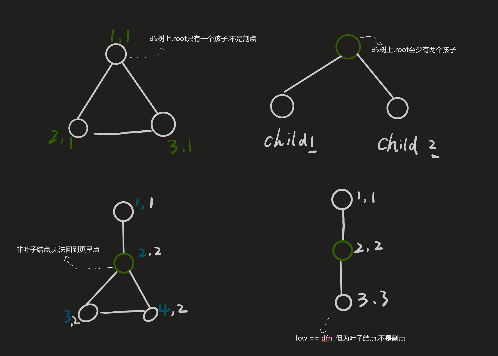
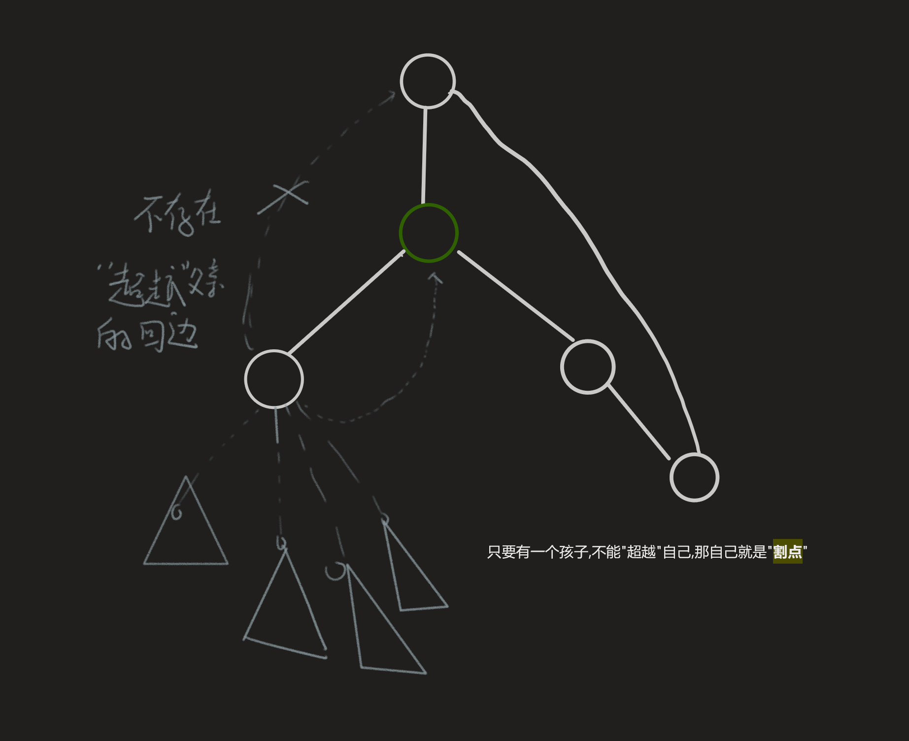

[[TOC]]

## 一句话算法

Tarjan 割点用 `low[v] >= dfn[u]` 判断：如果子树 `v` 不能绕过 `u` 回到更早的祖先，那么 `u` 就是这棵子树和外界的关口。

## 问题模型

给定一个无向图。若删除某个点 `u` 以及与它相连的所有边后，图的连通块数量增加，则 `u` 是割点。

割点描述的是无向图中的“关节点”：某些子图只能通过它和外部相连。

## 核心直觉

在 DFS 树上看一个点 `u`：

- `dfn[u]` 表示 `u` 第几次被 DFS 访问。
- `low[u]` 表示从 `u` 的子树出发，最多能通过一条返祖边回到的最早节点编号。

如果 `u` 的某个孩子 `v` 满足：

$$
low[v] \ge dfn[u]
$$

说明 `v` 的整棵子树无法绕过 `u` 回到 `u` 的祖先。删除 `u` 后，`v` 子树就会和外界断开，所以 `u` 是割点。





## 算法步骤

1. DFS 遍历无向图，记录每个点的 `dfn` 和 `low`。
2. 遇到树边 `u -> v`：
   - 递归处理 `v`。
   - 用 `low[v]` 更新 `low[u]`。
   - 如果 `u` 不是 DFS 根，且 `low[v] >= dfn[u]`，则 `u` 是割点。
3. 遇到返祖边 `u -> v`：
   - 用 `dfn[v]` 更新 `low[u]`。
4. 对 DFS 根单独判断：
   - 如果根有两个及以上 DFS 树儿子，则根是割点。

## 算法证明

**关键不变量：** `low[u]` 是 `u` 的 DFS 子树能到达的最早祖先的 `dfn`。

1. **树边更新：** 如果 `u` 的孩子 `v` 的子树能回到某个更早祖先，那么 `u` 也能通过 `v` 子树到达它，所以用 `low[v]` 更新 `low[u]`。
2. **返祖边更新：** 如果 `u` 直接连到祖先 `v`，那么 `u` 的子树能到达 `dfn[v]`。
3. **非根割点：** 若存在孩子 `v` 满足 `low[v] >= dfn[u]`，则 `v` 子树不能回到 `u` 的祖先。删除 `u` 后，`v` 子树和外界断开，所以 `u` 是割点。
4. **根割点：** DFS 根没有祖先。只有当它有至少两个 DFS 子树时，删除根才会让这些子树彼此断开。

## 复杂度分析

每个点访问一次，每条无向边被检查两次。

- 时间复杂度：$O(n+m)$。
- 空间复杂度：$O(n+m)$。

## 代码实现


- `dfn` 是 `Depth First Number` 的缩写，意为深度优先搜索序列编号。

@include-code(/code/graph/cut_node.cpp, cpp)

## 测试用例

输入：

```text
5 4
1 2
2 3
3 4
3 5
```

这个图中 `2` 和 `3` 是割点。模板本身是结构体代码，实际题目中通常调用 `solve()` 后读取 `get_cuts()`。

## 应用分类详解

割点的本质是判断无向图中哪些点是连通性的必经关口。

### 一、网络脆弱点

**典型模式：** 删除某个点后，网络是否断开。
**识别信号：** 题面问“关键城市”“通信站”“关节点”。
**核心建模：** 点是网络节点，边是连接关系，割点就是单点故障位置。

| 应用场景 | 经典题目 | 核心思路 |
|---------|---------|---------|
| 割点模板 | [[problem: luogu,P3388]] | Tarjan 求所有割点 |

### 二、点双连通分量前置

**典型模式：** 需要把无向图按点双连通块分解。
**识别信号：** 题目涉及“任意两点至少两条点不相交路径”。
**核心建模：** 割点可能属于多个点双，非割点只属于一个点双。

| 应用场景 | 经典题目 | 核心思路 |
|---------|---------|---------|
| 点双连通分量 | [[problem: luogu,P8435]] | 用割点分割点双连通块 |

## 经典例题

1. [[problem: luogu,P3388]]
   割点模板题。重点是根节点必须单独判断。

2. [[problem: luogu,P8435]]
   点双连通分量模板题。理解割点为什么能属于多个点双。

3. [UVA 10199 Tourist Guide](https://onlinejudge.org/external/101/10199.pdf)
   经典割点应用，把城市网络中的关键点输出出来。
