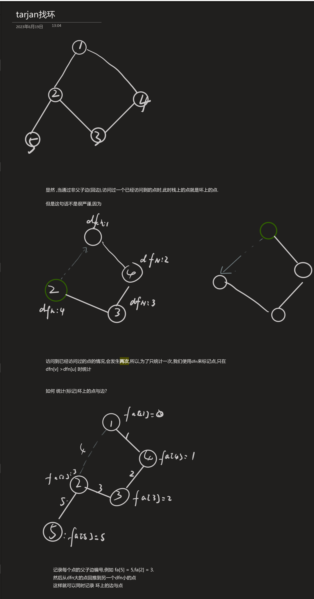

[[TOC]]

## 一句话算法

基环树找环可以不用复杂 DFS：不断删掉叶子，最后剩下的点就是环。

## 问题模型

这里讨论最常见的无向基环树找环：

- 图是无向图。
- 每个连通块最多一个环。
- 目标是找出所有在环上的点。

如果是普通无向图，可能有很多环，问题会变成环检测、最小环、点双/边双等不同模型，不能只靠一个基环树模板解决。

## 核心直觉

环上的点至少有两条环边，所以它不会在删叶子的过程中先变成孤立树枝。环外挂着的是树，树一定有叶子。把叶子一层层剥掉，树枝会被全部删完，环会留下。



## 算法步骤

1. 统计所有点的度数。
2. 把度数不超过 `1` 的点入队。
3. 每次删除一个队首点，并让它的邻点度数减一。
4. 如果邻点度数变成 `1`，继续入队。
5. 队列清空后，没被删除的点就是环上点。

## 算法证明

**关键不变量：** 每次被删除的点都不在环上。

1. 度数小于 `2` 的点不可能在环上。
2. 删除一个非环点，只会让环外树枝继续变短，不会删除真正的环边。
3. 新出现的度数为 `1` 的点仍然是环外树枝的叶子。
4. 所有环外树枝都会被逐层删除，剩下的只能是环上点。

## 复杂度分析

每个点最多入队一次，每条边最多被检查两次。

- 时间复杂度：$O(n+m)$。
- 空间复杂度：$O(n+m)$。

## 代码实现

@include-code(/code/graph/pseudotree_cycle_nodes.cpp, cpp)

## 测试用例

输入：

```text
6 6
1 2
2 3
3 1
3 4
4 5
4 6
```

输出：

```text
1 2 3
```

## 应用分类详解

### 一、基环树找环

**典型模式：** 点数和边数相等，图连通，只有一个环。
**识别信号：** 题面明确说“基环树”“环套树”，或者每个连通块边数等于点数。
**核心建模：** 删叶子得到环点，再处理挂在环上的树。

| 应用场景 | 经典题目 | 核心思路 |
|---------|---------|---------|
| 基环树 DP | [[problem: luogu,P2607]] | 找环后环外树 DP，环上分类讨论 |
| 基环树直径 | [[problem: luogu,P4381]] | 找环后合并树深和环距离 |

### 二、普通图找环

**典型模式：** 图中可能有很多环，只需要判断是否存在环。
**识别信号：** 题目不保证基环树，边数可能远大于点数。
**核心建模：** 无向图可以用 DFS 父边判断，或者用并查集逐边加边检测成环。

| 应用场景 | 经典题目 | 核心思路 |
|---------|---------|---------|
| 并查集判环 | [[problem: luogu,P3367]] | 加边时两个端点已连通则形成环 |

## 经典例题

1. [[problem: luogu,P2607]]
   基环树 DP 入门，先找环再处理环外树。

2. [[problem: luogu,P4381]]
   基环树直径，找环是后续环上计算的前置步骤。

3. [[problem: luogu,P5022]]
   基环树断边枚举，必须先知道环上的候选边。
