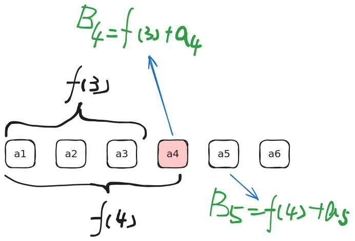

[[TOC]]

## 一句话算法

集合最值问题常用“不重不漏分类”：把大集合拆成若干子集，整体最值就是这些子集最值的最值。

## 问题模型

本文讨论两个基础模型：

1. 集合整体平移后，最大值如何变化。
2. 在集合中选两个不同元素，使它们的和最大。

这些模型看起来简单，但它们是枚举优化、动态规划转移和滑动窗口最值的基础。

## 核心直觉

如果一个集合整体加上同一个数 $y$：

$$
A' = \{ a_i + y \mid a_i \in A \}
$$

那么最大值也只会整体平移：

$$
\max(A') = \max(A) + y
$$

如果一个集合被拆成两个子集：

$$
A = B \cup C
$$

那么：

$$
\max(A) = \max(\max(B),\max(C))
$$

这就是“分类求最值”的基本规则。

## 最大两数和

问题：给定数组 $a_1,a_2,\cdots,a_n$，选择两个不同下标 $i,j$，最大化：

$$
a_i+a_j
$$

## 算法步骤

### 方法一：维护最大值和次大值

1. 初始化最大值 `first` 和次大值 `second`。
2. 从左到右扫描每个元素 `x`。
3. 如果 `x > first`，则原最大值变成次大值，`x` 成为新的最大值。
4. 否则如果 `x > second`，则 `x` 成为新的次大值。
5. 扫描结束后，答案是 `first + second`。

### 方法二：按右端点分类

1. 把要选的两个下标写成 `j < i`，枚举右端点 `i`。
2. 维护 `prefix_max = max(a[1..i-1])`。
3. 对当前右端点 `i`，最优配对和是 `prefix_max + a[i]`。
4. 用它更新全局答案。
5. 再用 `a[i]` 更新 `prefix_max`，进入下一轮。

## 代码实现

### 解法一：维护最大值和次大值

最大两数和一定来自最大元素和次大元素。扫描数组时维护当前最大值 `first` 和次大值 `second` 即可。

@include-code(/code/math/set/max_pair_sum_top2.cpp, cpp)

### 解法二：按右端点分类

把所有二元组按第二个下标分类：

$$
B_i = \{(a_j,a_i) \mid j<i\}
$$

所有可选二元组的集合是：

$$
A' = \bigcup_{i=2}^{n} B_i
$$

于是整体最值为：

$$
\max(A') = \max_{i=2}^{n} \max(B_i)
$$

对固定的 $i$：

$$
\max(B_i)=\max(a_1,a_2,\cdots,a_{i-1}) + a_i
$$

设：

$$
f(i)=\max(a_1,a_2,\cdots,a_i)
$$

则扫描时只需要维护前缀最大值 `f`。



@include-code(/code/math/set/max_pair_sum_prefix.cpp, cpp)

## 算法证明

### 最大值和次大值证明

任意两个数的和都不可能超过“最大值 + 次大值”。因为其中较大的那个数至多是最大值，另一个数至多是次大值。选择最大值和次大值可以达到这个上界，所以答案正确。

### 前缀最大值证明

**关键不变量：** 扫描到位置 `i` 时，`prefix_max` 等于 `a[1..i-1]` 的最大值。

1. 若选择的第二个元素是 `a[i]`，第一个元素只能来自 `a[1..i-1]`。
2. 为了让和最大，第一个元素应取 `prefix_max`。
3. 枚举所有 `i=2..n`，每一对合法下标都会被分到唯一的右端点分类里。
4. 对所有分类取最大值，就得到全局最大两数和。

## 复杂度分析

两种方法都只扫描一次数组。

- 时间复杂度：$O(n)$。
- 空间复杂度：$O(1)$，不计输入数组。

## 测试用例

输入：

```text
5
1 9 3 8 2
```

输出：

```text
17
```

最大值是 `9`，次大值是 `8`，答案为 `17`。

## 应用分类详解

集合最值的本质是把候选空间拆成若干容易维护的小集合。

### 一、最大/次大维护

**典型模式：** 只需要选出最大的若干个元素。
**识别信号：** 题目问“两数最大和”“前三大”“最大值和次大值”。
**核心建模：** 扫描时维护前 k 大元素。

| 应用场景 | 经典题目 | 核心思路 |
|---------|---------|---------|
| 最大两数和 | 本文模型 | 维护最大值和次大值 |
| 选择 k 个最大元素 | [[problem: luogu,P1090]] | 可转为堆或排序维护候选最值 |

### 二、按一个维度分类枚举

**典型模式：** 选择两个下标，要求满足先后关系或距离限制。
**识别信号：** 题面出现 $i<j$、固定右端点、从前面选一个最优对象。
**核心建模：** 枚举右端点，维护左侧候选集合最值。

| 应用场景 | 经典题目 | 核心思路 |
|---------|---------|---------|
| 前缀最大配对 | 本文模型 | 枚举右端点，维护左侧最大值 |
| 股票最大收益 | [[problem: leetcode,121]] | 枚举卖出日，维护历史最低买入价 |

### 三、窗口内最值

**典型模式：** 候选集合是滑动窗口，不是整个前缀。
**识别信号：** 题面限制两个元素距离不超过或不少于某个值。
**核心建模：** 用单调队列维护窗口最值。

| 应用场景 | 经典题目 | 核心思路 |
|---------|---------|---------|
| 滑动窗口最大值 | [[problem: luogu,P1886]] | 单调队列维护当前窗口最大值 |

## 经典例题

1. [[problem: luogu,P1886]]
   滑动窗口最值模板题。它是“集合变成窗口”后的最值维护。

2. [[problem: leetcode,121]]
   买卖股票的最佳时机。枚举右端点，维护左侧最小值。

3. 本文最大两数和模型
   适合理解“不重不漏分类”和“前缀最值”之间的关系。
