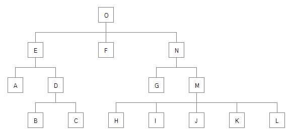
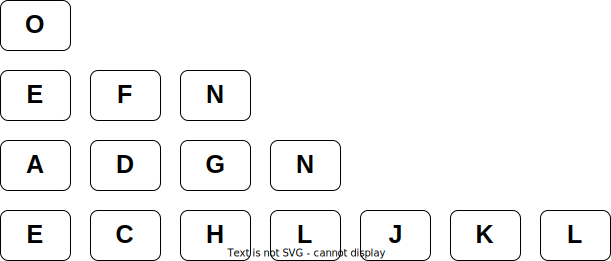
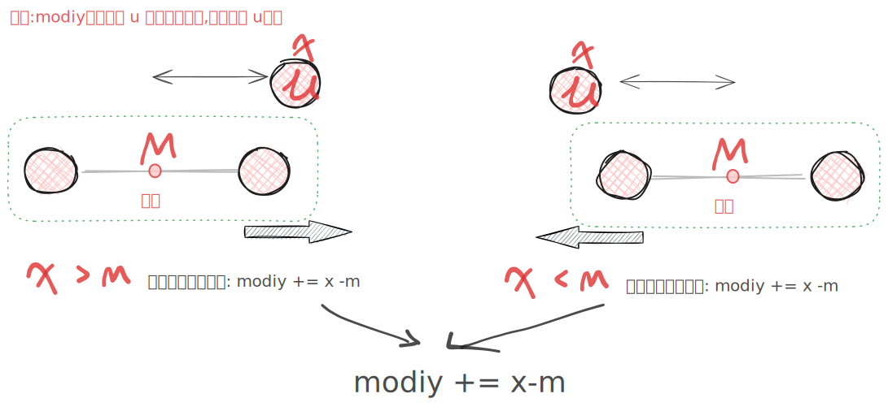
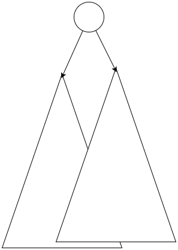

## 背景

一直想学习,相关的树布局算法,方便我可视化我的算法.加快我学习的速度

在我查找资料的过程中,似乎比较好的算法是: Reingold-Tilford Algorithm.但是比较简单,容易实现的是[John Q. Walker II 的算法][1]


## 前期准备

为了方便显示绘制树之后的效果,我这里使用了[wibbecanvas-cpp An implementation of the JavaScript canvas API in C++](https://github.com/wibbe/canvas-cpp) 这个库

这里的代码呢，我先使用js代码来描述.

::: colorfulbox

核心思想:

其实 jq_worker 算法本质上是: 按照后序遍历的方式,不停的去调整每一个点的位置.

1. 父节点在所有子节点的中间
2. 邻居节点不能重叠.

:::

这里给出几个简单封装的API

- 绘制结点 draw_node()
- 绘制结点的边线

## 问题描述

有一个图如下:



显然每个结点的$y$坐标,很容易确定,就是所有树的层数,现在比较难确定的就是$x$的坐标,但是可以想到$x$的值与

1. 左边的结点的$x$值
2. 所有孩子的结点的$x$值形成的宽度(要放在中间位置)

## 开始

按下面的步骤来对树上的每个结点进行操作.

第一步,先序遍历整个树,如果$u$没有$adjacent\; node$,则$u.x = 0$,否则$u.x = adj.x + 1$

定义每个结点的属性如下

```cpp
node {
    int depth; // 深度
    float x,y;
    float preliminary; //初步的x的坐标
    float modify; // ! 后代结点的修正值
    node left_neighbor; // 左邻居
    node children[]; //孩子
    node father;
}
```

为什么节点要需要有一个值 modify ?

想一下，如果你需要让整个指数向右偏移5,最简单的办法就是修改这个字符上的所有点, 还有一种方法就是修改这个子树的根节点的`modify`,那么后代上的每一个节点的`real_x = root.modify + preliminary` .所以`modify`表示的意思是把以 x 的后代的所有节点都要移动`modify`(不包括x 自己本身)

算法分为两步
1. 得到每个结点的`preliminary`,`modify`
2.  通过递归的方式得到每个结点的 real_x


## step 1

这一步比较简单，我们要得到结点一些值 `preliminary`,`left_neighbor`,`depth`,`father`,并对每个节点进行初始的摆放,按层级向左对齐,那么这时我们会得到一个类似这样的图



## step 2

按后根遍历的顺序,去调整数.(这里应该有一个动画,显示是如何一步一步调整每个节点位置的,但是我这里懒得去做了)

显然认识到,**父亲结点应该在所有的孩子结点的中间点**,为了后面的方便计算,我们给结点添加一个属性$mod$,他的意思是`modify`,表示结点在$x$的基础上应该偏移的值.显然这个$mod = x-childMiddleValue$
.如果$mod > 0$表示,所有的孩子应该都向右偏移




$mod$的值是告诉所有的孩子结点,需要移动的值,应该从上到下去设置


然后我们采用中序遍利的方式,依次去修改每个点,当某一个点 x 的左子树已经完美的布局之后,现在布局 x 的右子树,如果我们能保证x 的右子树本身布局是完美的. 但是此时可能出现一种情况，即 x 的右子数和 x 左子数有重叠.

那么这个时候我们就需要函数

- `get_level_left_most(u,dep)`得到节点 u,dep层,最左边节点的元素,的位置
- `get_level_right_most(u,dep)`得到节点 u,dep层,最右边节点的元素,的位置

此时,可以想到,两个相邻的子树,可能会有冲突(重叠的)的情况,如何保证当前结点的子树,不会和左边相邻的子树冲突呢?

简单的想法是,一层一层的检查当前子树的最左侧结点$l$,是否和$left\; adjacent$相



至少这两点有关


核心思想:

从左边开始,
保证所有的子树都是不重的,layout合理的,然后根据left adjacent 和 孩子来决定自己的位置?

若mod是负值,应该怎么移动所有的孩子呢?


最后,遍历所有的结点,计算最终的$x$值

该算法对于生成界面节点元素要求如下：

1. Nodes at the same level of the tree should lie along a straight line, and the straight lines defining the levels should be parallel.（相同深度节点应排成一条直线，且直线间相互平行）

2. A parent should be centered over its offspring.（父节点在所有子节点上方中心位置）

3. A tree and its mirror image should produce drawings that are refiections of one another（不翻译了，意会一下，和我们常见的树形图差不多）

## apportion 子树重叠调整


如"figure 2"图所示,在后序遍历完两个子树后,子树可能重叠. 这个时候需要调用apportion函数:使两个子树不重叠

因为子树上窄下宽,很容易想到: **从上到下一层一层调整: 如果重叠,使得右边的子树右移**

其中用到了巧妙的函数

- `get_left_most_node(u,dep)` : `u`点`dep`深度的最左点
- `real_pos_by_ancestor(v,dep)` : `v`点向上走`dep`步后算出的真是位置

具体参考代码

## 算法实现

> 旧版交互演示：`/canvas/jq_walker_tree_layout/index.html`


```js
function random_int(l,r) {
    return Math.floor(Math.random() * (r - l + 1)) + l;
}
class node_with_layout_info {
    constructor(idx) {
        this.x = 0; // 最终的x坐标
        this.y = 0; // 最终的y坐标
        this.dep = 0;
        this.prelim = 0; // 临时x坐标,初步坐标
        this.mod = 0;
        this.fa
        this._idx = idx;
        this.fa = 0;
        this.left_neighbor = 0;
        this.child = [];
    }
    get pos() {
        return [this.x,this.y];
    }

    get idx() {
        return this._idx;
    }

    get is_leaf() {
        return this.child.length == 0 || this.child.reduce( (a,s)=> a+s,0) == 0;
    }

    // 判断当前节点是否有左邻居
    get has_left_neighbor() {
        return this.left_neighbor != 0;
    }
}


class binary_tree_node  extends node_with_layout_info {
    constructor(idx) {
        super(idx);
        this.child = [0,0];
    }

    // 判断当前节点是否为根节点
    get isRoot() {
        return this.fa == 0;
    }

    get lson() {
        return this.child[0];
    }

    get rson() {
        return this.child[1];
    }


    // 判断当前节点是否有左子节点
    get has_lson() {
        return this.child[0] != 0;
    }

    // 判断当前节点是否有右子节点
    get has_rson() {
        return this.child[1] != 0;
    }

    get has_lrson(){
        return this.has_lson && this.has_rson;
    }

    get is_leaf() {
        return !this.has_lson && !this.has_rson;
    }
}

class normal_tree {

    constructor(tree_size) {
        this._tree_size = tree_size
        this.nodes = []

        // 上一次记录的深度为dep节点的编号
        this.pre_node_at_dep = Array.from({length: tree_size+1}, () => 0) // 初始化为0,表示没有

        this.Root = 1;

        this.xTopAdjustment = 1; // 整个树偏离x的值
        this.yTopAdjustment = -1;// 整个树偏离y的值
        this.levelSeparation = 2;
        this.SlibingSeparation = 2; //兄弟结点之间的间隔
        this.SubtreeSeparation = 2; //子树之间的间隔

        /**
         * 随机生成的树的数据
         * 类似如下:
         * 1 2
         * 1 3
         *  */
        this._raw_data = this.random_tree(); // 生成随机树数据


        this.init_tree_nodes(); //根据 _raw_data 生成树初始化树的结点
    }

    get size() {
        return this._tree_size
    }
    get raw_data() {
        return this._raw_data
    }

    get tree_nodes_array() {
        return this.nodes
    }

    // 生成树初始化树的结点
    init_tree_nodes() {
        this.nodes = []
        for(let i = 0;i<=this.size;i++) {
            this.nodes.push(new node_with_layout_info(i));
        }

        // 父亲孩子表示法
        for(let [fa,ch] of this.raw_data) {
            this.nodes[fa].child.push(ch);
            this.nodes[ch].fa = fa;
        }
    }

    //随机数生成,数据类似如下:
    // 1 2
    // 1 3
    random_tree() {
        let data = []
        for(let i =2;i<=this.size ;i++) {
            let fa =  random_int(1,i-1);
            data.push([fa,i])
        }
        return data;
    }


    //dfs 遍历整个树,得到一些树上的信息,
    // 主要是每个节点的位置的dep和左邻居
    init_dfs_tree_info(u,dep) {
        // console.log(u,dep)
        this.nodes[u].dep = dep

        //左邻居
        this.nodes[u].left_neighbor = this.pre_node_at_dep[dep];
        this.pre_node_at_dep[dep] = u;

        for(let ch of this.nodes[u].child) {
            if( ch == 0) continue
            this.init_dfs_tree_info(ch,dep+1);

        }
    }

    // 得到每个点的prelim,与mod
    // 核心思想:
    // 1. 每个点都向左靠拢
    // 2. 根据子树的根与孩子的中间值,来调整孩子,使得单独的子树是美的
    // 3. 使得当前子树与左边的相邻子树不重叠 apportion(u)
    first_walk(u) {
        debugger;
        // 叶子节点,边界条件
        if( this.nodes[u].is_leaf) { //是叶子结点
            this.nodes[u].mod = 0;
            // this.nodes[u].prelim = 0;
            // 和左边的相邻结点加上间隔
            if( this.nodes[u].has_left_neighbor) {
                let v = this.nodes[u].left_neighbor;
                this.nodes[u].prelim = this.nodes[v].prelim + this.SlibingSeparation;
            }
            return
        }

        //非叶子结点,后序遍历
        for(let i = 0 ;i < this.nodes[u].child.length ;i++ )
        {
            let v = this.nodes[u].child[i]
            if( v == 0) continue;
            this.first_walk(v);
        }

        // 2. 根据子树的根与孩子的中间值,来调整孩子,使得单独的子树是美的
        let mid = this.calc_mid_with_child(u);

        //先向左靠拢
        if( this.nodes[u].has_left_neighbor) {
            let neighbor = this.nodes[u].left_neighbor
            this.nodes[u].prelim = this.nodes[neighbor].prelim + this.SlibingSeparation;
        }
        else { //没有左邻居,使当前结点的prelim 变成孩子的中间位置
            this.nodes[u].prelim  = mid;
        }

        //调整子树的位置,使得子树变成父亲的中间
        this.nodes[u].mod = this.nodes[u].prelim - mid;

        // 3. 使得当前子树与左边的相邻子树不重叠 apportion(u)
        this.apportion(u);
    }

    //通过孩子计算mid的值
    calc_mid_with_child(u) {
        let first_child_prelim = 0;
        let last_child_prelim = 0;
        let first = true;
        for(let ch of this.nodes[u].child) {
            if( ch == 0) continue
            if(first) {
                first = false;
                last_child_prelim = first_child_prelim = this.nodes[ch].prelim;
            }
            else {
                last_child_prelim = this.nodes[ch].prelim;
            }
        }
        return (first_child_prelim + last_child_prelim)/2
    }

    //得到从结点u开始向下走dep层后最左边的结点
    // 0 表示没有
    //    root
    //  /   |  \
    // a    b   c
    //  核心思想: 定位首元(线性代数)
    get_left_most_node(u,dep) {
        if( dep == 0) return u;
        for( let i = 0 ;i< this.nodes[u].child.length ;i++)
        {
            let v = this.nodes[u].child[i];
            if( v == 0) continue;
            let ans = this.get_left_most_node(v,dep-1);
            if( ans != 0 ) return ans;
        }
        return 0;
    }

    // 从当前结点u向上走at_dep个结点后能达到祖先,ancestor
    // 求出从ancestor 开始到达这个结点 调整加起的值 再加u.prelim 得到的真的值
    real_pos_by_ancestor(u,dep) {
        let modSum = 0;
        let t = u;
        if( dep == 0) return this.nodes[u].prelim;

        //求出祖先的mod的和
        do {
            dep--;
            t = this.nodes[t].fa;
            modSum += this.nodes[t].mod;
        }while( dep != 0);

        //被祖先调整的值
        return this.nodes[u].prelim + modSum;
    }

    // 3. 使得当前以u为根的子树与左边的相邻子树不重叠 apportion(u)
    // 方法: 一层一层的调整
    apportion(u) {
        let compare_dep = 1;
        while(1) {
            let left_most = this.get_left_most_node(u,compare_dep);
            if( left_most == 0) break;
            let neightbor = this.nodes[left_most].left_neighbor;
            if( neightbor == 0) break;

            let left_most_pos = this.real_pos_by_ancestor(left_most,compare_dep);
            let right_most_pos = this.real_pos_by_ancestor(neightbor,compare_dep);

            let move_dis = 0;

            // 两者之间的差 不符合要求
            if( left_most_pos - right_most_pos < this.SlibingSeparation ) {
                move_dis = right_most_pos +  this.SubtreeSeparation - left_most_pos;
            }
            // 为什么u的prelim 也要移动呢?
            // 因为mod只要影响子树的位置,自己(u)也要移动
            this.nodes[u].prelim += move_dis;
            this.nodes[u].mod += move_dis;

            compare_dep++;
        }
    }

    // 很简单: 计算每个位置真实的值(x,y)
    second_walk(u,modSum) {
        this.nodes[u].y = this.nodes[u].dep * this.levelSeparation + this.yTopAdjustment;

        // console.log(u,this.nodes[u].prelim,modSum,this.xTopAdjustment)
        this.nodes[u].x = this.nodes[u].prelim + modSum + this.xTopAdjustment;
        // console.log(u,this.nodes[u])

        for( let i = 0 ;i< this.nodes[u].child.length ;i++){
            let v = this.nodes[u].child[i];
            if (v == 0) continue;
            this.second_walk(v,modSum + this.nodes[u].mod);
        }
    }

    /**
     * @desc 使用jq_walker算法 生成二进制树的布局
     */
    jq_walker() {
        //深度从1开始
        this.init_dfs_tree_info(this.Root,1);
        this.first_walk(this.Root);
        this.second_walk(this.Root,0);
    }

}

class binary_tree extends normal_tree {
    constructor(tree_size) {
        super(tree_size)
    }

    //生成随机二树数的数据
    random_tree() {
        let data = []
        let _map = Array.from({length:this.size+1} , () => [0,0])
        for(let i = 2;i<=this.size;i++) {
            while(1) {
                let ch = random_int(0,1); //生成左孩子还是右孩子
                let fa = random_int(1,i-1);
                // console.log('random_tree', i, _map,ch,fa);
                if( _map[fa][ch] == 0 ) {
                    _map[fa][ch] = i;
                    data.push([fa,i,ch])
                    break;
                }
            }
        }
        return data
    }

    init_tree_nodes() {
        this.nodes = []
        for(let i = 0 ;i<=this.size;i++){
            let node = new binary_tree_node(i)
            this.nodes.push(node);
        }

        for(let [fa,ch,son] of this.raw_data) {
            this.nodes[fa].child[son] = ch;
            this.nodes[ch].fa = fa;
        }
    }

    //通过孩子计算mid的值
    calc_mid_with_child(u) {
        let mid = 0;
        if( this.nodes[u].has_lrson) { //同时有左右孩子
            let l  = this.nodes[u].lson
            let r  = this.nodes[u].rson
            mid = (this.nodes[l].prelim + this.nodes[r].prelim)/2
        }
        else if( this.nodes[u].has_lson) {
            let l  = this.nodes[u].lson
            mid = this.nodes[l].prelim + this.SlibingSeparation / 2;
        }
        else if( this.nodes[u].has_rson){ //只有右孩子
            let r  = this.nodes[u].rson
            mid = this.nodes[r].prelim - this.SlibingSeparation / 2;
        }
        return mid;
    }

}


// console.log(new binary_tree(4).raw_data)
// let t = new binary_tree(5);
// console.log(t.raw_data)
// t.jq_walker();


//绘制一个树
//tree_nodes_array:由 nodes_with_layout_info数组 绘制
// 不要忘记使用完了 调用pg.remove()
function draw_tree(tree_nodes_array) {

    let r = 50;
    let rate = 50;
    let left_mod = 0 //左便宜

    console.log(tree_nodes_array)
    function get_pos(u) {
        let [x,y] = tree_nodes_array[u].pos
        // console.log(u,x,y)
        return [x*rate + left_mod,y*rate]
    }

    //得到最大深度的值,与右结点位置
    let max_X,max_Y
    let min_X
    for(let i = 1 ;i < tree_nodes_array.length;i++) {
        let [x,y] = get_pos(i)
        if( !max_X || max_X  < x) max_X = x
        if( !min_X || min_X  > x) min_X = x
        if( !max_Y || max_Y  < y) max_Y = y
    }
    max_X += r;
    max_Y += r;

    // 有时候会有一个些值为负值,这个时候需要整体向右便宜一下
    if(min_X < 2*r) {
        left_mod = 2*r - min_X;
        max_X += left_mod
    }
    // console.log('max')
    // console.log(max_X,max_Y)

    let pg = createGraphics(max_X,max_Y);
    pg.textAlign(CENTER,CENTER);

    function draw_node(u) {
        let [x,y] = get_pos(u);
        pg.circle(x,y,r);
        pg.text(u+'',x,y);
        //绘制文字
    }

    function draw_line(u,fa) {
        if( fa != 0) {
            let [x1,y1] = get_pos(fa);
            let [x2,y2] = get_pos(u);
            pg.line(x1,y1,x2,y2);
        }

        if(tree_nodes_array[u].child) {
            for(let ch of tree_nodes_array[u].child) {
                if( ch == 0) continue;
                draw_line(ch,u)
            }
        }
    }
    //draw Root
    draw_line(1,0);

    for(let i = 1 ;i < tree_nodes_array.length;i++) {
        draw_node(i);
    }
    // console.log(pg)
    return pg
}
```

## 资料

- [A Node-Positioning Algorithm for General Trees (1989, John Q. Walker II)][1]
- https://github.com/woodybriggs/TreeLayoutJS
- http://www.pennelynn.com/Documents/CUJ/HTML/91HTML/19910056.HTM
- https://rachel53461.wordpress.com/2014/04/20/algorithm-for-drawing-trees/


[1]: http://www.cs.unc.edu/techreports/89-034.pdf "A Node-Positioning Algorithm for General Trees (1989, John Q. Walker II)"
