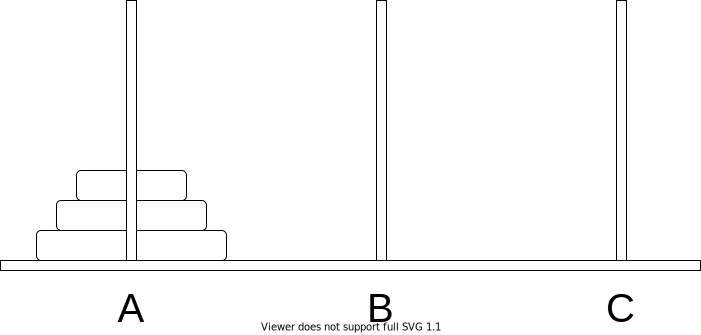

[[TOC]]

## 一句话算法

汉诺塔先把上面 `n-1` 个盘子挪开，再移动最大盘，最后把 `n-1` 个盘子挪回来。

## 问题模型

有三根柱子 `A`、`B`、`C`，`A` 上有 `n` 个盘子，小盘在大盘上面。要求把所有盘子从 `A` 移到 `C`。

规则：

1. 一次只能移动一个盘子。
2. 大盘不能放在小盘上面。
3. 可以借助任意柱子暂存盘子。



## 核心直觉

要移动最大的第 `n` 个盘子，必须先把它上面的 `n-1` 个盘子全部移走。

所以把 `n` 个盘子从 `A` 移到 `C` 可以拆成三步：

1. 把 `n-1` 个盘子从 `A` 移到 `B`，借助 `C`。
2. 把最大盘从 `A` 移到 `C`。
3. 把 `n-1` 个盘子从 `B` 移到 `C`，借助 `A`。

这三步里，第 1 步和第 3 步仍然是汉诺塔问题，只是盘子数量少了一个。

## 算法步骤

定义 `hanoi(n, from, mid, to)`：把 `n` 个盘子从 `from` 移到 `to`，借助 `mid`。

1. 如果 `n == 0`，没有盘子需要移动，返回。
2. 递归移动 `n-1` 个盘子：`from -> mid`，借助 `to`。
3. 输出最大盘移动：`from -> to`。
4. 递归移动 `n-1` 个盘子：`mid -> to`，借助 `from`。

## 算法证明

**合法性：**

第 1 步完成后，最大盘上方没有盘子，可以安全从 `from` 移到 `to`。第 3 步移动的是原来上方的 `n-1` 个小盘，它们都小于最大盘，所以放到 `to` 上不会违反规则。

**完整性：**

第 1 步移走上方 `n-1` 个盘子，第 2 步移动最大盘，第 3 步把 `n-1` 个盘子放到最大盘上方。最终所有盘子都在目标柱。

**递归终止：**

每次递归把 `n` 变成 `n-1`，最终到达 `n == 0`。

因此算法正确。

## 复杂度分析

设移动次数为 $T(n)$：

$$
T(n)=2T(n-1)+1,\quad T(0)=0
$$

解得：

$$
T(n)=2^n-1
$$

- 时间复杂度：$O(2^n)$。
- 空间复杂度：$O(n)$，递归栈深度为 `n`。

## 代码实现

@include-code(/code/base/recursion/hanoi.cpp, cpp)

## 测试用例

输入：

```text
2
```

输出：

```text
A->B
A->C
B->C
3
```

最后一行 `3` 表示总移动次数。

## 应用分类详解

汉诺塔的本质是“先解决阻挡目标的小问题，再解决当前最大问题”。

### 一、递归分治模型

**典型模式：** 处理当前最大对象之前，必须先把一批小对象转移到临时位置。

**识别信号：** 三步结构、临时空间、规模变成 `n-1`。

**核心建模：** 当前问题拆成两个同类子问题和一次当前操作。

### 二、递归复杂度分析

**典型模式：** 递推式形如 `T(n)=2T(n-1)+1`。

**识别信号：** 每层递归产生两个规模少 1 的子问题。

**核心建模：** 展开递推，得到指数级复杂度。

## 经典例题

- 汉诺塔输出移动步骤：标准递归入门题。
- 汉诺塔移动次数：只需要输出 $2^n-1$。
- 多柱汉诺塔：递归结构仍在，但子问题划分更复杂。

## 参考

- 本书相关章节：[递归的前进与回溯](../print_to_n/index.md)
