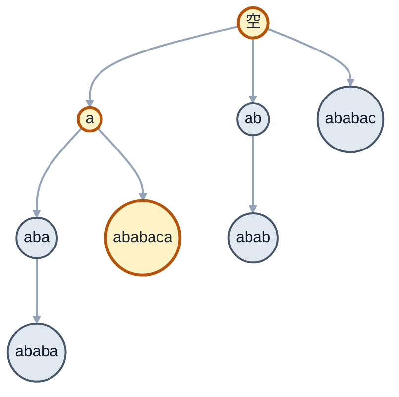

[[TOC]]

## 一句话算法

失配时文本不回头，只把“已经匹配的前缀长度”缩短到下一个仍可能成立的长度。

## 问题模型

给定文本串 `T` 和模式串 `P`，找出 `P` 在 `T` 中出现的所有起始位置，包括重叠匹配。

本文只使用一套逻辑下标：

- `T` 的字符位置是 `1..n`；
- `P` 的字符位置是 `1..m`；
- 匹配位置也按 1 下标输出；
- `pi[i]` 表示前缀 `P(1..i)` 的最长相等真前后缀长度。

C++ 字符串的物理存储仍从 0 开始。我们只在代码开头做一次映射：

```cpp
auto P = [&](int i) -> char { return pattern[i - 1]; };
auto T = [&](int i) -> char { return text[i - 1]; };
```

从此以后，算法只使用 `P(i)`、`T(i)`。短小 lambda 在竞赛常用的 `-O2` 下通常会被内联；这里采用它的主要原因是统一心智模型，而不是依赖某项性能承诺。

## 核心直觉

### 暴力匹配真正慢在哪里？

暴力匹配一旦失配，会移动模式串起点，并重新读取一部分已经比较过的文本字符。真正的浪费不是“比较失败”，而是**文本指针回头**。

KMP 给自己定下一个目标：

> 文本位置 `i` 只向右移动；失配时，只改变模式串已经匹配的长度 `j`。

### 失配时，我们已经知道什么？

处理 `T(i)` 之前，若已经匹配了 `j` 个字符，就有：

$$
T(i-j..i-1)=P(1..j)
$$

因此，下一次要比较的模式串字符不是需要额外记忆的公式，而是紧跟在这段前缀后面的字符：

$$
P(j+1)
$$

### 哪些字符可以保留下来？

若 `T(i)` 与 `P(j+1)` 失配，已经匹配的 `P(1..j)` 不能全部保留。但它末尾若有一段等于自身前缀，这一段仍与文本末尾对齐，可以继续使用。

这段最长可保留长度就是 `pi[j]`，所以失配时：

```cpp
j = pi[j];
```

!!! note 三个记忆锚点
只记住：

1. `j` 是已经匹配的长度；
2. 下一个字符是 `P(j + 1)`；
3. 失配时回退到 `j = pi[j]`。
!!!

构造 `pi` 和搜索文本都会原样复用这三个规则。

## `pi` 数组

### border 的定义

一个字符串的 **border** 是既为前缀又为后缀、但不等于整个字符串的子串。

例如 `"ababa"` 的 border 有：

- `"a"`，长度 1；
- `"aba"`，长度 3。

最长 border 长度是 3，所以 `pi[5] = 3`。

本文的贯穿示例为：

```text
位置: 1 2 3 4 5 6 7
P:    a b a b a c a
```

逐个前缀观察：

| `i` | `P(1..i)` | 最长 border | `pi[i]` |
|---:|:---|:---|---:|
| 1 | `a` | 空串 | 0 |
| 2 | `ab` | 空串 | 0 |
| 3 | `aba` | `a` | 1 |
| 4 | `abab` | `ab` | 2 |
| 5 | `ababa` | `aba` | 3 |
| 6 | `ababac` | 空串 | 0 |
| 7 | `ababaca` | `a` | 1 |

为了让“长度”可以直接作为数组下标，代码保留 `pi[0] = 0`：

$$
pi=[0,0,0,1,2,3,0,1]
$$

## 构造 `pi`

### 为什么可以让模式串匹配自己？

计算 `pi[i]` 时，`pi[i-1]` 已经求出。令：

```text
j = pi[i - 1]
```

这表示 `P(1..i-1)` 的末尾已有 `j` 个字符等于 `P(1..j)`。现在只需判断新字符 `P(i)` 能否接在这个 border 后面，也就是比较：

```text
P(i) 与 P(j + 1)
```

能接上，`j++`；不能接上，就沿 border 链回退到 `pi[j]`，继续尝试更短的 border。

### 算法步骤

对 `i = 2..m`：

1. 令 `j = pi[i-1]`；
2. 当 `j > 0` 且 `P(i) != P(j+1)` 时，令 `j = pi[j]`；
3. 若 `P(i) == P(j+1)`，令 `j++`；
4. 记录 `pi[i] = j`。

### 关键回退：计算 `pi[6]`

此时 `P(6) = 'c'`，初始 `j = pi[5] = 3`：

```text
P(6) = 'c', P(j+1) = P(4) = 'b'  -> 失配，j = pi[3] = 1
P(6) = 'c', P(j+1) = P(2) = 'b'  -> 失配，j = pi[1] = 0
P(6) = 'c', P(1) = 'a'           -> 仍不相等
```

所以 `pi[6] = 0`。这次回退已经展示完整规则，其余位置只是在重复同一状态转移：

| `i` | `P(i)` | 初始 `j` | 回退过程 | `pi[i]` |
|---:|:---:|---:|:---|---:|
| 2 | `b` | 0 | 无 | 0 |
| 3 | `a` | 0 | 匹配后 `j=1` | 1 |
| 4 | `b` | 1 | 匹配后 `j=2` | 2 |
| 5 | `a` | 2 | 匹配后 `j=3` | 3 |
| 6 | `c` | 3 | `3 -> 1 -> 0` | 0 |
| 7 | `a` | 0 | 匹配后 `j=1` | 1 |

## 搜索文本

求好 `pi` 后，扫描文本 `T`。处理每个 `T(i)` 时仍只使用同一转移：

```cpp
while (j > 0 && T(i) != P(j + 1)) j = pi[j];
if (T(i) == P(j + 1)) j++;
```

当 `j == m` 时，模式串完整匹配，1 下标起点为：

$$
i-m+1
$$

记录答案后不能把 `j` 清零。令 `j = pi[j]`，保留完整模式串末尾仍可作为下一次匹配开头的 border，才能找到重叠匹配。

### 贯穿示例

```text
位置: 1 2 3 4 5 6 7 8 9 10 11
T:    a b a b a b a c a b  a
P:    a b a b a c a
```

状态变化如下：

| `i` | `T(i)` | 处理前 `j` | 发生的动作 | 处理后 `j` |
|---:|:---:|---:|:---|---:|
| 1 | `a` | 0 | 与 `P(1)` 匹配 | 1 |
| 2 | `b` | 1 | 与 `P(2)` 匹配 | 2 |
| 3 | `a` | 2 | 与 `P(3)` 匹配 | 3 |
| 4 | `b` | 3 | 与 `P(4)` 匹配 | 4 |
| 5 | `a` | 4 | 与 `P(5)` 匹配 | 5 |
| 6 | `b` | 5 | `P(6)` 失配，`5 -> 3`，再与 `P(4)` 匹配 | 4 |
| 7 | `a` | 4 | 与 `P(5)` 匹配 | 5 |
| 8 | `c` | 5 | 与 `P(6)` 匹配 | 6 |
| 9 | `a` | 6 | 完整匹配，起点为 `9-7+1=3`；再回退到 `pi[7]=1` | 1 |
| 10 | `b` | 1 | 与 `P(2)` 匹配 | 2 |
| 11 | `a` | 2 | 与 `P(3)` 匹配 | 3 |

最终答案是位置 `3`。

## 算法步骤

### 预处理模式串

1. 建立 `P(i)` 的 1 下标视图；
2. 令 `pi[0] = pi[1] = 0`；
3. 从 `i=2` 开始，用统一状态转移求出每个 `pi[i]`。

### 匹配文本串

1. 建立 `T(i)`、`P(i)` 的 1 下标视图；
2. 从左到右扫描 `T(i)`；
3. 失配时沿 `pi` 链缩短 `j`，相等时令 `j++`；
4. `j==m` 时记录 `i-m+1`，再回退到 `pi[j]`。

## 代码模板

下面是可复用的 KMP 模板。`build_prefix_function` 返回大小为 `m+1` 的 `pi`，`kmp_match` 返回所有 1 下标匹配位置。

@include-code(/code/string/kmp.cpp, cpp)

## 代码实现

完整程序读入 `text pattern`，输出所有 1 下标匹配位置；没有匹配时输出 `-1`。

@include-code(./code/kmp_solution.cpp, cpp)

## 复杂度分析

构造 `pi` 时，`i` 只向右移动；每次进入 `while`，`j` 都严格减小。`j` 的总增加次数为 $O(m)$，所以总回退次数也是 $O(m)$。

搜索文本同理：文本位置 `i` 共移动 $n$ 次，`j` 的总增加与总回退次数均为 $O(n)$。

- 构造 `pi`：$O(m)$ 时间、$O(m)$ 空间；
- 搜索文本：$O(n)$ 时间；
- 总时间：$O(n+m)$；
- 除答案外的额外空间：$O(m)$。

## 测试用例

### 普通匹配

输入：

```text
abababacaba ababaca
```

输出：

```text
3
```

### 重叠匹配

输入：

```text
abababa aba
```

输出：

```text
1 3 5
```

### 没有匹配

输入：

```text
abc d
```

输出：

```text
-1
```

## 进阶理解与应用

前面的主线已经足够实现 KMP。下面从证明和结构两个角度解释它为什么正确，以及 `pi` 还能解决哪些问题。

### 回退为什么正确？

**核心直觉：** 已匹配文本的末尾等于 `P(1..j)`。把这个前缀替换成它自己的最长 border，不会改变已经对齐的字符，只是丢弃不可能继续的部分。

令 `L = pi[j]`。由定义：

$$
P(1..L)=P(j-L+1..j)
$$

失配前已经知道：

$$
T(i-j..i-1)=P(1..j)
$$

取两边最后 `L` 个字符：

$$
T(i-L..i-1)=P(j-L+1..j)=P(1..L)
$$

所以令 `j=L` 后，“文本末尾等于模式串前缀”的不变量仍然成立，可以继续比较同一个 `T(i)` 与新的 `P(j+1)`。

`L` 已是 `P(1..j)` 的最长 border。若存在更大的可保留长度，它也会成为更长的 border，与 `L=pi[j]` 矛盾。因此第一次回退已经是当前最大的可能状态；若仍失配，再沿 `pi` 链尝试更短状态即可。

构造 `pi` 时，只是把文本换成模式串自身，维护的是完全相同的不变量，因此同一状态转移也正确。

### 失配树

把每个前缀长度看成一个节点，节点 `k` 的父节点是 `pi[k]`。失配时执行 `j=pi[j]`，就是沿父边向上走。

对 `P="ababaca"`：



高亮路径 `"ababaca" -> "a" -> 空串` 是完整模式串的 border 链。AC 自动机把这种单模式串失配边推广到了 Trie 上。

### 最短循环节

设字符串长度为 `n`，最长 border 长度为 `pi[n]`，候选循环节长度为：

$$
L=n-pi[n]
$$

若 `pi[n] > 0` 且 `n % L == 0`，整个字符串由长度为 `L` 的短串重复组成，`L` 就是最短循环节长度。

### 两个字符串的最大重叠

要求 `A` 的后缀与 `B` 的前缀的最大相等长度，可以构造：

```cpp
string joined = B + "#" + A;
vector<int> pi = build_prefix_function(joined);
int overlap = pi[(int)joined.size()];
```

分隔符 `#` 不在原字符集中，使 border 无法跨过分隔符错误延伸。最终 `pi[joined.size()]` 就是 `A` 后缀与 `B` 前缀的最大重叠长度。

## 学习自检

1. 为什么 `j` 表示长度后，下一个字符自然是 `P(j+1)`？
2. 为什么失配时可以保留 `pi[j]` 个字符？
3. 构造 `pi` 为什么与搜索文本使用完全相同的状态转移？
4. 完整匹配后为什么仍要令 `j=pi[j]`？
5. 手算 `P="aabaaab"` 的 `pi[1..7]`。

!!! success 答案
1. `P(1..j)` 已经匹配，紧随其后的逻辑位置就是 `j+1`。
2. `pi[j]` 对应的前缀等于已匹配区域的后缀，仍与文本末尾对齐。
3. 构造时把 `P(2..m)` 当作待扫描文本，状态含义没有变化。
4. 完整模式串的 border 可能成为下一次重叠匹配的开头。
5. `pi[1..7] = [0,1,0,1,2,2,3]`。
!!!

## 应用分类详解

KMP 的本质是在扫描过程中维护“当前文本后缀等于模式串前缀”的最长长度。看到单模式串匹配、border、周期或失配跳转时，都可以考虑 `pi`。

### 一、单模式串匹配

**典型模式：** 在长文本中寻找一个模式串的所有出现位置，允许重叠。

**识别信号：** “出现次数”“所有起点”“文本不允许反复扫描”。

**核心建模：** `j` 保存当前文本后缀与模式串前缀的最大匹配长度。

| 应用场景 | 经典题目 | 核心思路 |
|---|---|---|
| KMP 模板 | [[problem: luogu,P3375]] [题解](https://pcs2.roj.ac.cn/problems/luogu/P3375) | 输出匹配位置，并构造完整 `pi` 数组 |
| 第一次出现位置 | [LeetCode 28](https://leetcode.cn/problems/find-the-index-of-the-first-occurrence-in-a-string/) | 找到第一次完整匹配即可返回 |

### 二、border 枚举与统计

**典型模式：** 研究一个串中同时作为前缀和后缀的子串。

**识别信号：** “最长公共前后缀”“所有 border”“前后缀出现次数”。

**核心建模：** 从 `n` 开始反复执行 `j=pi[j]`，得到全部 border 长度。

| 应用场景 | 经典题目 | 核心思路 |
|---|---|---|
| border 枚举 | [[problem: luogu,P3435]] [题解](https://pcs2.roj.ac.cn/problems/luogu/P3435) | 沿 `pi` 父链不断缩短前缀 |
| border 计数 | [Codeforces 432D](https://codeforces.com/problemset/problem/432/D) | 枚举 border 并统计它在串中的出现次数 |

### 三、循环节与重叠

**典型模式：** 判断字符串是否由短串重复，或让两个字符串尽量重叠。

**识别信号：** “最短周期”“重复字符串”“前缀与另一个串的后缀相等”。

**核心建模：** 用整串最长 border 得到错开距离 `n-pi[n]`；双串关系则用分隔符压成一个串的 border。

| 应用场景 | 经典题目 | 核心思路 |
|---|---|---|
| 最短循环节 | [POJ 1961](http://poj.org/problem?id=1961) | 用 `n-pi[n]` 判断周期 |
| 重复子串模式 | [LeetCode 459](https://leetcode.cn/problems/repeated-substring-pattern/) | 检查候选周期能否整除串长 |
| 多串最短拼接 | [[problem: codeforces,25E]] [题解](https://pcs2.roj.ac.cn/problems/codeforces/25E) | 计算不同拼接顺序中的最大重叠 |

### 四、失配自动机的前置

**典型模式：** 从一个状态跳到“仍可能匹配”的更短状态。

**识别信号：** “fail 指针”“多模式串”“Trie 上的失配边”。

**核心建模：** KMP 的 `pi` 是单模式串上的失配父边，AC 自动机把它推广到多模式串。

| 应用场景 | 经典题目 | 核心思路 |
|---|---|---|
| AC 自动机入门 | [[problem: luogu,P3808]] [题解](https://pcs2.roj.ac.cn/problems/luogu/P3808) | 在 Trie 上为每个节点建立 fail 指针 |

## 经典例题

### 1. [[problem: luogu,P3375]] [题解](https://pcs2.roj.ac.cn/problems/luogu/P3375)

KMP 模板题。主循环直接使用本文的三个记忆锚点；按题目要求额外输出 `pi[1..m]` 即可。

### 2. [Codeforces 432D](https://codeforces.com/problemset/problem/432/D)

要求找出所有既是前缀又是后缀的字符串，并统计出现次数。先沿 `pi` 链枚举 border，再累计每个前缀的出现次数。

### 3. [LeetCode 459](https://leetcode.cn/problems/repeated-substring-pattern/)

判断字符串能否由某个短串重复得到。用 `n-pi[n]` 得到候选周期，再检查它是否整除 `n`。

## 参考

- 旧版文章：`Rbook_ejs_old/book/string/kmp/index.md`
- [Knuth-Morris-Pratt algorithm - Wikipedia](https://en.wikipedia.org/wiki/Knuth%E2%80%93Morris%E2%80%93Pratt_algorithm)
