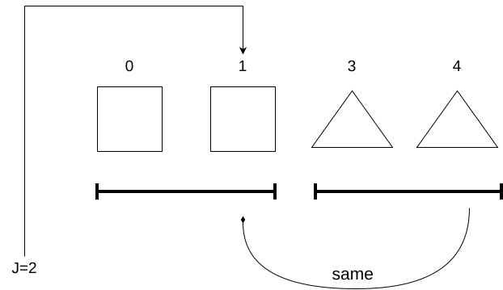

[[TOC]]

## 一句话算法

KMP 在失配时不回头重比主串，而是利用模式串自己的相同前后缀，直接跳到下一个可能匹配长度。

## 问题模型

KMP 用来解决一个基本问题：在文本串 `T` 中查找模式串 `P`，并且不在失配后重复扫描已经比较过的文本字符。

本文统一使用以下约定：

- 文本串为 `T`，长度为 $n$。
- 模式串为 `P`，长度为 $m$。
- 字符串下标从 0 开始。
- `pi[i]` 表示 `P[0..i]` 的最长相等真前后缀的**长度**。
- `pi[0] = 0`。这个数组也常叫前缀函数（prefix function），在很多教材中被称为 `next` 数组，本文统一使用 `pi`。

!!! note "先记住 j 的双重含义"
`j` 表示“已经匹配的模式串前缀长度”，因此下一个要比较的模式串字符恰好是 `P[j]`。
!!!

!!! note "本文的统一约定"
全文采用 `pi[0] = 0`，数组元素直接存储最长相等真前后缀的长度。
!!!

## 1. 为什么需要 KMP？（抓住主要矛盾）

在理解 KMP 之前，我们先看看**暴力匹配**（Brute Force）是怎么做的，以及它为什么慢。

```cpp
// 暴力匹配的坏情况：发生失配时
if (T[i] != P[j]) {
    i = i - j + 1; // 灾难：文本串指针 i 疯狂回退！
    j = 0;         // 模式串从头开始
}
```

暴力匹配在失配时，会移动模式串起点，并重新比较一部分**已经比较过的文本字符**。
KMP 的最高指导原则（极限思维）是：**文本指针 `i` 永远单调递增，绝不回退；失配时，只移动模式串指针 `j`。**

考虑已经匹配了 `abab`，但下一个字符失配的场景：

```text
T[0..] = a b a b a b ...
P      = a b a b c
                 ↑
             T[4] 与 P[4] 失配
```

为了不让文本指针回退去重新扫描，我们观察已经匹配的 `abab`。它有一个重要性质：它的后缀 `ab` 与前缀 `ab` 相等。因此不需要把模式串完全清空，可以保留这两个字符：

```text
已匹配区域 P[0..3] = a b a b
最长相等前后缀     =     a b
回退后继续比较：T[4] 与 P[2]
```

用指针描述这个过程：
- 失配前已经匹配 `j = 4` 个字符。
- 已匹配部分是 `P[0..3] = "abab"`。
- `"abab"` 的最长相等真前后缀长度是 2。
- 所以令 `j = pi[3] = 2`，继续用同一个文本字符 `T[4]` 与 `P[2]` 比较。

这就是 KMP 的关键：`pi` 数组告诉我们，失配后最多可以保留多少个已经匹配的字符。

## 2. `pi` 数组的定义与手算

对于字符串 `P[0..i]`：

- **真前缀**：从第一个字符开始，但不能等于整个字符串。
- **真后缀**：到最后一个字符结束，但不能等于整个字符串。
- `pi[i]`：最长相等真前缀与真后缀的长度；不存在时为 0。

例如字符串 `"abab"`：
- 真前缀：`"a"`、`"ab"`、`"aba"`。
- 真后缀：`"b"`、`"ab"`、`"bab"`。
- 最长相等真前后缀是 `"ab"`，长度为 2。

所以对于模式串 `P = "abab"`，有 `pi[3] = 2`。

### 手算 `pi` 数组

取模式串：

```text
下标 i:  0 1 2 3 4 5 6 7 8
字符 P:  a b a b c a b a b
```

逐个考察前缀：

| `i` | `P[0..i]` | 最长相等真前后缀 | `pi[i]` |
|---:|:---|:---|---:|
| 0 | `a` | 空串 | 0 |
| 1 | `ab` | 空串 | 0 |
| 2 | `aba` | `a` | 1 |
| 3 | `abab` | `ab` | 2 |
| 4 | `ababc` | 空串 | 0 |
| 5 | `ababca` | `a` | 1 |
| 6 | `ababcab` | `ab` | 2 |
| 7 | `ababcaba` | `aba` | 3 |
| 8 | `ababcabab` | `abab` | 4 |

最终得到：
$$
pi = [0,0,1,2,0,1,2,3,4]
$$

!!! note "`pi[i]` 存的是长度"
如果 `pi[i] = j`，说明 `P[0..j-1]` 与 `P[i-j+1..i]` 相等。因为 `j` 是长度，所以这段前缀后面的第一个字符下标正好也是 `j`。
!!!

## 3. 上帝视角：完整 KMP 搜索

在讲解代码如何神奇地构造 `pi` 数组之前，我们**先假设 `pi` 数组已经求好了**（正如我们在上一节手算出的结果）。
有了 `pi` 数组，文本串 `T` 和模式串 `P` 就可以用极度优雅的逻辑进行匹配。因为“两串不同字符的匹配”是最符合人类直觉的。

下面的程序返回模式串在文本串中的**所有起始下标**，包括重叠匹配。

### 3.1 搜索循环维护的不变量

处理 `text[i]` 之前，`j` 表示已经匹配的模式串前缀长度：

$$
T[i-j..i-1] = P[0..j-1]
$$

当 `j = 0` 时，等式两边都表示空串。因此下一个需要比较的字符是 `text[i]` 和 `pattern[j]`。

搜索循环分为四步：

1. 如果当前字符失配并且 `j > 0`，令 `j = pi[j-1]`，**注意这里并没有改变 `i` 的值**。这实现了我们的核心目标。
2. 如果当前字符相等，令 `j++`。
3. 如果 `j == m`，说明完整匹配一次，起点为 `i-m+1`。
4. 记录答案后令 `j = pi[m-1]`，保留可能参与下一次匹配的后缀。

### 3.2 为什么匹配成功后还要回退？

考虑：
```text
text    = abababa
pattern = aba
pi      = [0, 0, 1]
```

扫描过程如下：

| `i` | `text[i]` | 处理前的 `j` | 结果 |
|---:|:---:|---:|:---|
| 0 | `a` | 0 | 匹配，`j=1` |
| 1 | `b` | 1 | 匹配，`j=2` |
| 2 | `a` | 2 | 完整匹配，起点 0；回退到 `j=1` |
| 3 | `b` | 1 | 匹配，`j=2` |
| 4 | `a` | 2 | 完整匹配，起点 2；回退到 `j=1` |
| 5 | `b` | 1 | 匹配，`j=2` |
| 6 | `a` | 2 | 完整匹配，起点 4；回退到 `j=1` |

答案是 `[0, 2, 4]`。三次匹配彼此重叠；如果每次匹配后都把 `j` 清零，就会漏掉后两次匹配。匹配成功后回退到 `j = pi[m-1]`，说明保留了上一次匹配的最长后缀，让它可以无缝参与下一轮匹配。

### 3.3 逐行模拟：`text = "abababa"` 搜索 `pattern = "aba"`

代入搜索循环，`pi = [0, 0, 1]`。字符串如下：

```text
下标:   0   1   2   3   4   5   6
T:      a   b   a   b   a   b   a
P:      a   b   a
pi:     0   0   1
```

#### 初始化
`j = 0`，`positions = []`。

#### i=0, text[0]='a', j=0
模式串起始位置 = `i - j = 0`。比较 `P[0]='a'` vs `T[0]='a'`。
```text
T: a   b   a   b   a   b   a
P: a   b   a
   ↑
   j=0
```
- `while`: `j = 0 > 0`? 否，跳过
- `if`: `'a' == 'a'` ✓，`++j` → `j = 1`
- `j == m`? 1 ≠ 3
```text
j = 1, positions = []
```

#### i=1, text[1]='b', j=1
模式串起始位置 = `1 - 1 = 0`。比较 `P[1]='b'` vs `T[1]='b'`。
```text
T: a   b   a   b   a   b   a
P: a   b   a
        ↑
        j=1
```
- `while`: `j = 1 > 0` 且 `'b' != 'b'`? 相等，跳过
- `if`: ✓，`++j` → `j = 2`
- `j == m`? 2 ≠ 3
```text
j = 2, positions = []
```

#### i=2, text[2]='a', j=2
模式串起始 = `2 - 2 = 0`。比较 `P[2]='a'` vs `T[2]='a'`。
```text
T: a   b   a   b   a   b   a
P: a   b   a
            ↑
            j=2
```
- `while`: 相等，跳过
- `if`: ✓，`++j` → `j = 3`
- `j == m`? 3 == 3 ✓ → **完整匹配，起点 0**
```text
positions.push_back(0);
j = pi[2] = 1;   // 保留后缀 'a' 可能参与下一次匹配
```
> 匹配成功后回退到 `j = 1` 而不是 0：已匹配的 `"aba"` 的后缀 `"a"` 长度为 1，可能与下一个字符一起构成新的匹配。
```text
j = 1, positions = [0]
```

#### i=3, text[3]='b', j=1
模式串起始 = `3 - 1 = 2`。P 从 T[2] 对齐，比较 `P[1]='b'` vs `T[3]='b'`。
```text
T: a   b   a   b   a   b   a
P:         a   b   a
                ↑
                j=1
```
- `while`: 相等，跳过
- `if`: ✓，`++j` → `j = 2`
- `j == m`? 2 ≠ 3
```text
j = 2, positions = [0]
```

#### i=4, text[4]='a', j=2
模式串起始 = `4 - 2 = 2`。比较 `P[2]='a'` vs `T[4]='a'`。
```text
T: a   b   a   b   a   b   a
P:         a   b   a
                    ↑
                    j=2
```
- `while`: 相等，跳过
- `if`: ✓，`++j` → `j = 3`
- `j == m`? 3 == 3 ✓ → **完整匹配，起点 2**
```text
positions.push_back(2);
j = pi[2] = 1;
```
```text
j = 1, positions = [0, 2]
```

#### i=5, text[5]='b', j=1
模式串起始 = `5 - 1 = 4`。比较 `P[1]='b'` vs `T[5]='b'`。
```text
T: a   b   a   b   a   b   a
P:                 a   b   a
                        ↑
                        j=1
```
- `while`: 相等，跳过
- `if`: ✓，`++j` → `j = 2`
- `j == m`? 2 ≠ 3
```text
j = 2, positions = [0, 2]
```

#### i=6, text[6]='a', j=2
模式串起始 = `6 - 2 = 4`。比较 `P[2]='a'` vs `T[6]='a'`。
```text
T: a   b   a   b   a   b   a
P:                 a   b   a
                            ↑
                            j=2
```
- `while`: 相等，跳过
- `if`: ✓，`++j` → `j = 3`
- `j == m`? 3 == 3 ✓ → **完整匹配，起点 4**
```text
positions.push_back(4);
j = pi[2] = 1;
```
循环结束（`i = 6` 已到文本末尾）。

#### ✅ 最终结果
三次匹配的起点分别是 0、2、4。观察 P 在图中的位置变化：每轮 P 起始于 `T[i-j]`，`j` 是"已匹配的前缀长度"，所以 P 随着匹配成功而不断向右"滑动"。

---

## 4. 捅破窗户纸：如何构造 `pi` 数组？

既然你已经掌握了如何用 `P` 借助 `pi` 去搜索 `T`。那么 `pi` 数组究竟是用什么神秘算法求出来的？

一句话本质：**求 `pi` 数组的过程，本质上就是用模式串 `P` 自己去匹配模式串 `P` 的过程。**

- 我们可以把 `P` 错开一位，让主串 `T` 变成 `P[1...m-1]`。
- 模式串依然是 `P[0...m-1]`。
- 每当匹配成功，当前匹配的长度就是我们要的 `pi[i]`。

### 4.1 逐行模拟：用 `"ababcabab"` 跑一遍构造过程

把 `pattern = "ababcabab"` 代入代码，逐步观察 `i`、`j` 和 `pi` 的变化。

```text
下标:  0   1   2   3   4   5   6   7   8
字符:  a   b   a   b   c   a   b   a   b
```

#### 初始化
`vector<int> pi(m, 0)` 全零初始化。`pi[0] = 0`，`j = 0`。
```text
pi = [0,  ?,  ?,  ?,  ?,  ?,  ?,  ?,  ?]
```

#### i=1, pattern[1]='b'
比较 `pattern[j]=pattern[0]='a'`  vs  `pattern[1]='b'`
```text
下标: 0   1   2   3   4   5   6   7   8
字符: a   b   a   b   c   a   b   a   b
     ↑   ↑
     j   i
```
- `while`: `j = 0 > 0`? 否，跳过
- `if`: `'b' != 'a'`，不进入
- `pi[1] = j = 0`
```text
j = 0
pi = [0,  0,  ?,  ?,  ?,  ?,  ?,  ?,  ?]
```

#### i=2, pattern[2]='a'
比较 `pattern[j]=pattern[0]='a'`  vs  `pattern[2]='a'`
```text
下标: 0   1   2   3   4   5   6   7   8
字符: a   b   a   b   c   a   b   a   b
     ↑       ↑
     j       i
```
- `while`: `j = 0 > 0`? 否，跳过
- `if`: `'a' == 'a'` ✓，`++j` → `j = 1`
- `pi[2] = j = 1`
```text
j = 1
pi = [0,  0,  1,  ?,  ?,  ?,  ?,  ?,  ?]
```

#### i=3, pattern[3]='b'
比较 `pattern[j]=pattern[1]='b'`  vs  `pattern[3]='b'`
```text
下标: 0   1   2   3   4   5   6   7   8
字符: a   b   a   b   c   a   b   a   b
         ↑       ↑
         j       i
```
- `while`: `j = 1 > 0` 且 `'b' != 'b'`? 相等，跳过
- `if`: `'b' == 'b'` ✓，`++j` → `j = 2`
- `pi[3] = j = 2`
```text
j = 2
pi = [0,  0,  1,  2,  ?,  ?,  ?,  ?,  ?]
```

#### i=4, pattern[4]='c' ← 回退发生！
比较 `pattern[j]=pattern[2]='a'`  vs  `pattern[4]='c'`
```text
下标: 0   1   2   3   4   5   6   7   8
字符: a   b   a   b   c   a   b   a   b
             ↑       ↑
             j       i
```
- `while` 第一轮: `j = 2 > 0` 且 `'c' != 'a'` → **回退！**
  ```cpp
  j = pi[j - 1] = pi[1] = 0
  ```
  > `pi[1] = 0`：子串 `"ab"` 的最长相等前后缀长度为 0，退到空前缀状态重新比较。

- `while` 第二轮: `j = 0 > 0`? 否，退出
- `if`: `'c' != 'a'`，不进入
- `pi[4] = j = 0`
```text
j = 0
pi = [0,  0,  1,  2,  0,  ?,  ?,  ?,  ?]
```

#### i=5, pattern[5]='a'
比较 `pattern[j]=pattern[0]='a'`  vs  `pattern[5]='a'`
```text
下标: 0   1   2   3   4   5   6   7   8
字符: a   b   a   b   c   a   b   a   b
     ↑                   ↑
     j                   i
```
- `while`: `j = 0 > 0`? 否，跳过
- `if`: `'a' == 'a'` ✓，`++j` → `j = 1`
- `pi[5] = j = 1`
```text
j = 1
pi = [0,  0,  1,  2,  0,  1,  ?,  ?,  ?]
```

#### i=6, pattern[6]='b'
比较 `pattern[j]=pattern[1]='b'`  vs  `pattern[6]='b'`
```text
下标: 0   1   2   3   4   5   6   7   8
字符: a   b   a   b   c   a   b   a   b
         ↑                   ↑
         j                   i
```
- `while`: `j = 1 > 0`，相等 → 跳过
- `if`: `'b' == 'b'` ✓，`++j` → `j = 2`
- `pi[6] = j = 2`
```text
j = 2
pi = [0,  0,  1,  2,  0,  1,  2,  ?,  ?]
```

#### i=7, pattern[7]='a'
比较 `pattern[j]=pattern[2]='a'`  vs  `pattern[7]='a'`
```text
下标: 0   1   2   3   4   5   6   7   8
字符: a   b   a   b   c   a   b   a   b
             ↑                   ↑
             j                   i
```
- `while`: `j = 2 > 0`，相等 → 跳过
- `if`: `'a' == 'a'` ✓，`++j` → `j = 3`
- `pi[7] = j = 3`
```text
j = 3
pi = [0,  0,  1,  2,  0,  1,  2,  3,  ?]
```

#### i=8, pattern[8]='b'
比较 `pattern[j]=pattern[3]='b'`  vs  `pattern[8]='b'`
```text
下标: 0   1   2   3   4   5   6   7   8
字符: a   b   a   b   c   a   b   a   b
                 ↑                   ↑
                 j                   i
```
- `while`: `j = 3 > 0`，相等 → 跳过
- `if`: `'b' == 'b'` ✓，`++j` → `j = 4`
- `pi[8] = j = 4`
```text
j = 4
pi = [0,  0,  1,  2,  0,  1,  2,  3,  4`
```

#### ✅ 最终结果
```text
pi = [0,  0,  1,  2,  0,  1,  2,  3,  4]
```
与手算结果完全一致。

#### 图示总结：`j` 的移动轨迹


```text
i 扫描方向 →
i:   0     1     2     3     4     5     6     7     8
P:   a     b     a     b     c     a     b     a     b

j (已匹配长度):
     0  →  0  →  1  →  2  →  0  →  1  →  2  →  3  →  4
          ▲            │
          │   回退      │
          └──pi[1]=0───┘
        i=4: 'c'≠'a'，j 从 2 退到 0 从头开始

pi[i]:
     0     0     1     2     0     1     2     3     4
```

### 4.2 为什么构造过程是线性的？

一次 `i` 循环中，`while` 可能执行多次，但总复杂度仍是 $O(m)$：
- `i` 只从左到右移动，共移动 $m-1$ 次。
- 每次匹配成功，`j` 最多增加 1。
- 每次执行回退，`j` 都严格减小。
- `j` 不会小于 0，所以全部回退次数不会超过此前增加次数的总量。

因此，不能简单理解成“每个字符最多回退一次”；正确理由是 `j` 的总增加次数和总回退次数都是线性的。

## 5. 深入理解回退：为什么是 `pi[j-1]` 与失配树

发生失配时，`pattern[j]` 是尚未匹配成功的字符，已经匹配成功的区间是：
$$
P[0..j-1]
$$

我们要复用的是这段已匹配字符串自身的最长相等真前后缀，所以必须查询：
```cpp
pi[j - 1]
```
而不是 `pi[j]`。

令 `L = pi[j-1]`。根据定义：
$$
P[0..L-1] = P[j-L..j-1]
$$

右边正好是已匹配区域末尾的 `L` 个字符。因此回退到 `j = L` 后，前 `L` 个模式串字符仍然与文本末尾相等，不需要重新比较。

!!! note "竞赛思维映射：失配树（Fail Tree）"
`while (j > 0 && pattern[i] != pattern[j]) j = pi[j - 1];`
这行不断回退的代码，如果用树的视角来看会非常直观。

`pi` 数组不仅仅是一个数组，你可以把它看作是模式串各个前缀之间连的一条条“边”。`j = pi[j-1]` 本质上是在**一棵树上不断向着“父节点”跳跃**，直到找到一个合法的父节点使得字符可以接上。
这个将 `pi` 视为树上指针的思想（失配树/状态机），是后续进阶学习 **AC 自动机（Fail 指针）** 和 **回文树** 的绝对基础！

!!!

## 6. 复杂度和边界情况

设文本串长度为 $n$，模式串长度为 $m$：

- 构造 `pi`：$O(m)$ 时间，$O(m)$ 额外空间。
- 搜索文本：$O(n)$ 时间。
- 总时间复杂度：$O(n+m)$。
- 总额外空间：$O(m)$，如果要保存所有答案，还需要计算答案数组本身的空间。

代码还处理了以下边界：
- `pattern` 为空：本文约定返回空数组。
- `pattern` 比 `text` 长：自然返回空数组。
- 存在重叠匹配：匹配成功后回退到 `pi[m-1]`，不会遗漏。

## 7. 回退正确性的严格证明

这一节用于回答“为什么可以跳过中间位置”。第一次学习时，可以先掌握前六节，再回来阅读证明。

### 7.1 前置约定
设当前已经匹配 `j > 0` 个字符，文本指针位于 `i`，则：
$$
T[i-j..i-1] = P[0..j-1] \quad 	ext{(1)}
$$

当前字符发生失配：$T[i] 
eq P[j]$
令：$L = pi[j-1]$

### 7.2 长度 `L` 的状态可以直接保留
由 `pi` 的定义：
$$
P[0..L-1] = P[j-L..j-1] \quad 	ext{(2)}
$$
由式 (1)，截取已匹配文本的最后 `L` 个字符：
$$
T[i-L..i-1] = P[j-L..j-1] \quad 	ext{(3)}
$$
联立式 (2) 和式 (3)：
$$
T[i-L..i-1] = P[0..L-1] \quad 	ext{(4)}
$$
所以令 `j = L` 后，长度为 `L` 的模式串前缀仍然与文本末尾相等，不需要重新比较。

### 7.3 不存在更大的候选长度
假设存在另一个长度 `L'`，满足：$L < L' < j$，并且它也可以作为回退后的匹配状态：
$$
T[i-L'..i-1] = P[0..L'-1] \quad 	ext{(5)}
$$
由式 (1) 截取最后 `L'` 个字符：
$$
T[i-L'..i-1] = P[j-L'..j-1] \quad 	ext{(6)}
$$
联立式 (5) 和式 (6)：
$$
P[0..L'-1] = P[j-L'..j-1]
$$
这说明 `L'` 也是 `P[0..j-1]` 的相等真前后缀长度。但 `L = pi[j-1]` 已经是最长长度，与 `L' > L` 矛盾。

因此，不存在比 `L` 更大的候选回退长度。

## 8. 0 下标与 1 下标

本文的模式串字符下标为 `0..m-1`。如果某本教材把字符位置写成 `1..m`，同一组“最长相等真前后缀长度”数值不会改变，只是数组下标整体右移一位：

| 含义 | 第1个字符 | 第2个字符 | 第3个字符 | ... |
|:---|---:|---:|---:|---:|
| 0 下标位置 | `pi[0]` | `pi[1]` | `pi[2]` | ... |
| 1 下标位置 | `pi[1]` | `pi[2]` | `pi[3]` | ... |

不要只看打印出来的数列，要先确认数组元素究竟对应哪个字符串前缀。

## 9. 竞赛实战扩展：求解最短循环节

KMP 中的 `pi` 数组不仅仅用来匹配字符串，它在算法竞赛中有一个极高频的进阶运用：**求一个字符串的最短循环节**。

**结论：**
对于长度为 $n$ 的字符串 $S$，如果它存在循环节，那么：
1. 最小循环节的长度必定为 `len = n - pi[n-1]`。
2. 成立的条件是：`n % (n - pi[n-1]) == 0` 且 `pi[n-1] > 0`。

**为什么？**
如果 $S$ 的最长公共前后缀长度是 `pi[n-1]`，那么把字符串错开 `n - pi[n-1]` 的长度后，前后两部分必然重叠并且完全相等。这就强迫这整个字符串都是由长度为 `n - pi[n-1]` 的子串重复循环组成的。
这也是 `pi` 数组背后“极限复用”思想的巅峰展现。

## 10. 竞赛实战扩展：双串重叠用分隔符压成一个 border

`pi` 数组还有一类极高频用法：**求两个串之间的最大重叠**——`A` 的后缀与 `B` 的前缀相等部分的最大长度。它是"拼接两个字符串，使重叠尽量多"类题目的核心子问题（如 [[problem: codeforces,25E]]）。

**人话：** KMP 的 border 只认识"一个串自己的前缀等于后缀"。现在 `A` 的后缀要对 `B` 的前缀，是两个串，一步跨不过去。解法是把两个串的关系压成一个串的性质：

```cpp
string t = B + "#" + A;
vector<int> pi = build_prefix_function(t);
// pi.back() 就是 A 的后缀与 B 的前缀的最大重叠长度
```

**为什么 `#` 是关键？** 字符集里没有 `#`，所以拼接串 `B#A` 的任何 border 都不可能跨过 `#`——一旦跨过，`#` 就要等于某个普通字符，矛盾。因此 border 完全落在 `B` 的前缀与 `A` 的后缀之间，整串最长 border 长度恰好就是最大重叠 $k$。

**边界注意：** 如果 `B` 已经被 `A` 包含（`A` 中存在子串 `B`），重叠 $k$ 会达到 `|B|`，此时直接取 `A` 即可，无需再拼接；合并结果 = `A + B.substr(k)`，只接上不重叠的部分。

复杂度 $O(|A| + |B|)$，与两个串的总长线性相关。

## 11. 学习自检

1. 暴力匹配慢在哪里？KMP 为了解决这个问题，做出的最大妥协/设计是什么？
2. 求 `pi` 数组的本质是什么？
3. 为什么查询的是 `pi[j-1]`，而不是 `pi[j]`？
4. 为什么构造 `pi` 和搜索文本都要使用 `while` 回退？它在树形结构里可以被理解成什么操作？
5. 手算 `pattern = "aabaaab"` 的 `pi` 数组。

!!! success "展开查看答案"
1. 慢在文本指针 `i` 的回退。KMP 的设计是：保证 `i` 永不回退，代价是提前用预处理数组 `pi` 算好失配时 `j` 应该跳跃到哪里。
2. 就是模式串 `P` 用自己的后缀去匹配自己的前缀（自己搜索自己）。
3. 已匹配区域是 `pattern[0..j-1]`，发生失配时尚未匹配成功的字符是 `pattern[j]`。我们要复用的是之前已经成功匹配的区域，所以查 `pi[j-1]`。
4. 一次回退后仍可能失配，需要继续尝试更短的相等前后缀。本质上是在“失配树”上不断向父节点跳跃。
5. `pi = [0, 1, 0, 1, 2, 2, 3]`。
!!!


## 代码实现

@include-code(/code/string/kmp.cpp, cpp)

## 记忆核心点

核心点2: 

```cpp
// 记忆核心点1 ------+
//                   |
//                   v
while (j > 0 && pattern[i] != pattern[j])  
{
    j = pi[j - 1]; // <- 核心点2
}
```

核心点1: `j`表示前置长度,从 `0` 开始的下标的第`j+1` 个元素的下标就是`j`,所以: `pattern[i] != pattern[j]`

```text
Index:      0       1            j-1     j
        +-------+-------+     +-------+-------+
    P:  |  P[0] |  P[1] | ... | P[j-1]|  P[j] | ...
        +-------+-------+     +-------+-------+
        \_____________________________/   ^
             Matched prefix (len = j)     |
                                    Next char to compare (index = j)
```


核心点2: 为什么回退到 `pi[j-1]`？
- `P[j]` 失配，已成功匹配的是前 `j` 个字符 `P[0..j-1]`，结尾下标为 `j-1`。
- 查 `pi[j-1]` 得到已匹配部分的最长前后缀长度 $L$，新已匹配长度即为 $L$。
- 下一个要比较的字符下标自然就是 $L$（即 `j = pi[j-1]`）。

核心点2 图示:



```text
Matched string: P[0 ... j-1] (end index = j-1)
Border length : L = pi[j-1]

+-----------------------+------------------------------+
|  P[0 ... L-1] (Prefix)| ...  P[j-L ... j-1] (Suffix) |
+-----------------------+------------------------------+
        ||                         ||
   New Prefix                  Matched Suffix

  ==> j_new = L = pi[j-1]
```

## 测试用例

输入：

```text
abababaca aba
```

输出：

```text
0 2 4
```

解释：KMP 会找到包括重叠情况在内的所有出现位置。

## 应用分类详解

KMP 的本质是：在一个串中维护“当前后缀等于模式串前缀”的最长长度。只要题目需要在线性时间处理字符串匹配、边界、循环节，就应该想到 KMP 或前缀函数。

### 一、单模式串匹配

**典型模式：** 给一个文本串和一个模式串，找所有出现位置。

**识别信号：** 出现“模式串在文本串中出现几次”“所有起始位置”“允许重叠”。

**核心建模：** 用 `pi` 记录模式串失配后应该保留的匹配长度。

| 应用场景 | 经典题目 | 核心思路 |
|---|---|---|
| KMP 模板 | [[problem: luogu,P3375]] | 输出所有匹配位置和 next 数组 |
| 第一次出现位置 | [LeetCode 28](https://leetcode.cn/problems/find-the-index-of-the-first-occurrence-in-a-string/) | KMP 可保证线性复杂度 |

### 二、字符串 border 问题

**典型模式：** 研究一个字符串的相等前缀和后缀。

**识别信号：** 出现“既是前缀又是后缀”“最长公共前后缀”“border”。

**核心建模：** `pi[n-1]` 就是整个字符串的最长 border 长度，继续沿 `pi[x-1]` 可以枚举所有 border。

| 应用场景 | 经典题目 | 核心思路 |
|---|---|---|
| 枚举所有 border | [[problem: luogu,P3435]] | 沿前缀函数不断回退 |
| 前后缀统计 | [Codeforces 432D](https://codeforces.com/problemset/problem/432/D) | border 枚举加出现次数统计 |

### 三、循环节与周期

**典型模式：** 判断一个字符串是否由某个短串重复得到。

**识别信号：** 出现“最小循环节”“周期”“重复字符串”。

**核心建模：** 设 $L = n - pi[n-1]$。如果 $n mod L = 0$，则 $L$ 是最小循环节长度。

| 应用场景 | 经典题目 | 核心思路 |
|---|---|---|
| 最小循环节 | [POJ 1961](http://poj.org/problem?id=1961) | 用 `n - pi[n-1]` 判断周期 |
| 重复子串模式 | [LeetCode 459](https://leetcode.cn/problems/repeated-substring-pattern/) | 前缀函数判断是否存在整周期 |

### 四、作为自动机和多算法前置

**典型模式：** 需要理解 AC 自动机、字符串自动机、最小表示法中的“失配跳转”。

**识别信号：** 出现“fail 指针”“失配边”“排除不可能答案”。

**核心建模：** KMP 的 `pi` 是单模式串上的失配跳转，AC 自动机把这个思想推广到 Trie 上。

| 应用场景 | 经典题目 | 核心思路 |
|---|---|---|
| AC 自动机入门 | [[problem: luogu,P3808]] | 多模式串上的 fail 指针 |
| 最小表示法理解 | 本书最小表示法章节 | 失配后批量排除候选起点 |


## 经典例题

### 1. [[problem: luogu,P3375]]

KMP 模板题。要求输出匹配位置和 `next` 数组，适合检查前缀函数实现是否正确。

### 2. [Codeforces 432D](https://codeforces.com/problemset/problem/432/D)

要求找出所有既是前缀又是后缀的字符串，并统计出现次数。核心是沿 `pi` 链枚举 border。

### 3. [LeetCode 459](https://leetcode.cn/problems/repeated-substring-pattern/)

判断字符串能否由某个子串重复得到。用 `n - pi[n-1]` 得到候选周期长度。

## 参考

- 旧版文章：`Rbook_ejs_old/book/string/kmp/index.md`
- [Knuth-Morris-Pratt algorithm - Wikipedia](https://en.wikipedia.org/wiki/Knuth%E2%80%93Morris%E2%80%93Pratt_algorithm)
