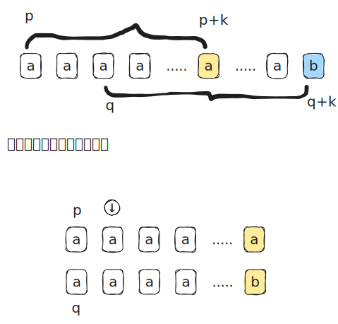

[[TOC]]


> 环形字符串最小表示法

## 循环同构

定义

## 暴力

暴力解法的思想很简单：枚举所有可能的起始位置（从 0 到 n-1），然后两两比较，找出字典序最小的那个作为答案。

本质思想$\min B =\min( \min (B \setminus c) ,\{c\} )$ 

```cpp
#include <iostream>
#include <string>
#include <vector>
#include <algorithm>

// 暴力解法 (for-loop version)
// s: 传入的字符串
// 返回值: 最小表示法的起始位置（0-indexed）
int get_min_representation_brute_force(const std::string& s) {
    int n = s.length();
    if (n == 0) return 0;

    int min_pos = 0; // 假设最小表示法的起始位置是0

    // 挑战者,遍历所有可能的起始位置 i (从1到n-1)
    // 这里用到的是集合思想: min_pos 表示 $s1,..si-1$字符串的最小值 
    for (int i = 1; i < n; ++i) {
        // 将从 i 开始的字符串与当前已知的最小字符串（从 min_pos 开始）进行比较
        for (int k = 0; k < n; ++k) {
            char char_i = s[(i + k) % n];
            char char_min = s[(min_pos + k) % n];
            
            if (char_i < char_min) {
                // 找到了一个更小的表示，更新 min_pos
                min_pos = i;
                break; // 结束与旧 min_pos 的比较，i+1 继续
            }
            if (char_i > char_min) {
                // 当前从 i 开始的字符串更大，不是最小表示，直接跳出比较
                break;
            }
            // 如果字符相等，继续比较下一个字符
        }
    }
    return min_pos;
}
```

显然这个代码在`aaa...aab`下面比较次数比较多,退化成$O(n^2)$

## 优化暴力



核心思想: 和KMP思想一样,在于前缀相同时的处理:**排除不可能答案**

> 经过我一天的思考: min_pos 代表的意思扫过的位置中**可能的最优值的位置**,而不是**一定是最优值的位置**
> 如果min_pos 不是扫过位置中的最优位置,那么全局最优位置一定在未扫位置中(我们不可能排除全局最优位置),  min_pos 在未来一定会变成全局最优位置


- p 表示扫过位置的中的**可能最小位置**
- q 表示正在比较的位置
- 那么$[1,q-1]$表示扫过的位置
- $S_i[j]$ 从d第i个位置,后面第j个位置的字符
- $S_i$ 表示以位置$i$起始的子串
- $k$ 表示 从p,q开始比较第一不同的位置
  - $S_pi = S_qi , \text{当} i \in [0,k-1]$ 
  - $S_pk \neq S_qk$


分情况讨论:

1. $S_p[k] < S_q[k]$
    1. 那么这个时候$S_p$ 是较优秀的
    2. 无论重叠还是不重叠,$S_{q+\delta} , \delta \in [1,k]$都有对应的$S_{p + \delta}$ 比它们更优秀
    3. 略过这些不可能的最优的值,$q = q+k+1$,此时全局最优值,可能是$S_p$,要么在$q = q+k+1$后面
    4. 

### 情况二: 

$S_p[k] > S_q[k]$

1. 那么这个时候$S_q$是较优秀的
3. $S_q$应用变成后选最优(扫过位置的可能最优值)

重叠时候,$S_{p+\delta} , \delta \in [1,k]$都有对应的$S_{q + \delta}$ 比它们更优秀,略过$q = p+k+1$

不重叠: 那么$p+k < q$, 此时略过的位置都没有达到$q$,相当与没有略过([1,q]都是扫过的位置,)那么新的位置应该是$q = q+1$


那么综上$q = \max( q+1, p+k+1)$


疑问: 重叠的时候, $q \in [p,p+k]$, $S_q$不一定是 略过位置$[p,p+k]$ 中最优的,但可能是最优的.

1. 如果$s_q$ 是最优的,那么就选$s_q$
2. 如果$s_q$不是最优的,这个$[p,p+k]$都不可能是全局最优值,随便选一个作为可能最优
3. 如果$s_q$是前面扫过最优的,只有可能$[q,p+k]$比$S_q$优秀


TODO : 一个可能的数据如下

```
这是一个非常关键的逻辑转折点。

直接回答你的结论：
**该命题是错误的。** 在区间 $[q+1, p+k]$ 中的串 $S_x$，**不一定** 大于 $S_q$，也不一定大于 $S_p$。实际上，它甚至可能比 $S_q$ 和 $S_p$ 都要小！

**但是**，这并不影响算法的正确性。因为我们跳过 $x$，并不是因为 $x$ 比 $p$ 或 $q$ 差，而是因为我们找到了一个**比 $x$ 更强**的 $y$。

---

### 1. 反例证明：为什么 $S_x > S_q$ 是错的？

我们来构造一个具体的反例。
设字符串为整数序列（方便比较）：`2, 1, 2, 1, 2, 1, 2, 0`
索引：`0 1 2 3 4 5 6 7`

假设算法运行到了以下状态（这是真实可达的状态）：
* **$p = 1$**: 对应子串 `1, 2, 1, 2, 1, 2, 0...`
* **$q = 3$**: 对应子串 `1, 2, 1, 2, 0...`

开始比较：
* $k=0$: `1` vs `1` (相等)
* $k=1$: `2` vs `2` (相等)
* $k=2$: `1` vs `1` (相等)
* $k=3$: `2` vs `2` (相等)
* $k=4$: $S[1+4]=2$ vs $S[3+4]=0$。
    * **$2 > 0$，触发 Case B**。

此时状态：
* $p = 1$
* $q = 3$
* $k = 4$
* $p+k = 5$
* 你的质疑区间 $[q+1, p+k]$ 是 $[4, 5]$。

**让我们看看区间里的 $x=5$：**
* **$S_5$** (从索引 5 开始): `1, 2, 0...`
* **$S_q$** (从索引 3 开始): `1, 2, 1...`

显然：**$S_5 < S_q$**。
($S_5$ 第三位是 0， $S_q$ 第三位是 1)

**结论：**
你试图证明的 "$[q+1, p+k]$ 里的串都大于 $S_q$" 是**不成立的**。在这个例子里，被跳过的 $S_5$ 明明比 $S_q$ 还要小（更优秀）。

---

### 2. 既然 $S_x$ 可能比 $S_q$ 小，为什么敢跳过它？

既然 $S_5$ 比 $S_q$ 还小，如果直接跳过 $[4, 5]$，会不会把 $S_5$ 这个“潜在冠军”给漏掉了？

**答案是：不会。**

因为我们跳过 $S_5$，**不是因为它输给了 $S_q$**，而是因为它输给了 **$S_7$**。

我们回看之前的**淘汰引理**：
$$S_{p+\delta} > S_{q+\delta}$$

对于 $x=5$：
* 它是 $p$ 的偏移：$x = p + 4$ (即 $\delta=4$)。
* 根据引理，它一定输给 $q$ 的对应偏移：$y = q + 4 = 3 + 4 = 7$。
* 所以：**$S_5 > S_7$**。

验证一下：
* $S_5$: `1, 2, 0...`
* $S_7$: `0...`
* 确实，$S_5 > S_7$。

**算法逻辑的真相：**
1.  虽然 $S_5$ 比当前的擂主 $S_q$ 更小（看起来很有威胁）。
2.  但是我们通过数学推导发现，在 $S_5$ 的后面，一定藏着一个比 $S_5$ 更小的 $S_7$。
3.  既然 $S_7$ 比 $S_5$ 小，那 **$S_5$ 就不可能是全场最小**。
4.  所以，哪怕 $S_5$ 此时此刻看起来很强，我们也可以放心地把它踢出局，去检查后面的 $S_7$（或者更后面的位置）。

### 3. 总结图解

你之前的理解：
>  因为 $x$ 在 $p$ 和 $q$ 的“势力范围”重叠区，所以 $x$ 必须比 $q$ 差。 (**这是错的**)

正确的理解：
>  $x$ 是 $p$ 的影子，$y$ 是 $q$ 的影子。
>  因为真身 $p$ 输给了真身 $q$，所以影子 $x$ 必然输给影子 $y$。
>  $$S_x > S_y$$
>  只要 $x$ 输给了世界上的任何一个人（这里是 $y$），$x$ 就失去了拿冠军的资格。

所以，证明 $[q+1, p+k]$ 里的串大于 $S_q$ **既是不可能的，也是不需要的**。我们只需要证明它们**不是最小**即可。
```


如果$S_i,S_j$的前 $k$ 个位置字符一样

$$
S(i,i+k-1) = S(j,j+k-1)
$$

但是第$k+1$个位置不一样,假定$S[i+k] < S[j+k]$

则$S_{j+p}, 0 \leqslant p \leqslant k$,都不可能是答案. 因为$S_{i+p} < S_{j+p}$一定.

那么此时排除不可能答案: $j \to j = j+k+1$

## 代码实现

下面是根据上述思想实现的C++代码。函数 `get_min_` 接收一个字符串，返回其最小表示法的起始下标。


@include-code(/code/string/minimal-string.cpp, cpp)


## 参考

- https://oi-wiki.org/string/minimal-string/


## 题目

- luogu 10476
- acwing 136
- [luogu P13270 【模板】最小表示法](https://www.luogu.com.cn/problem/P13270)

-这个题目告诉我们,不是循环的串,也可以求最小自串 https://leetcode.cn/problems/last-substring-in-lexicographical-order/description/