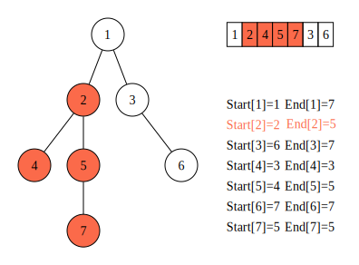
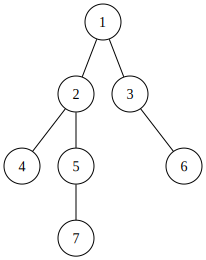

[[TOC]]






]

## dfs序性质


!!! abstract 性质1: 子树连续区间
任意的子树点必然在dfs序上的一个连续区间内:

$u$的子树的对应的区间就是: $[in(u),out(u)]$

!!!

!!! abstract 性质2: isChild
$v$ 是否是 $u$的孩子: 

如果 v 是 u 的子结点，那么: $in(u) \leqslant in(v) \land out(v) \leqslant end(u)$, 可以利用这个性质来判断结点的关系.

!!!


## 欧拉序性质

lca包含

## 题目表

https://www.cnblogs.com/cjcf/p/18555953

https://www.luogu.com.cn/training/230844#information

## 应用


### 点修改, 子树查询

由性质1, 一个节点和它的子树在一个连续的区间中. 所以这题可以转化为: 点修改, 区间查询. 用树状数组或线段树即可.

- [[problem: poj,3321]
- Luogu P5057

### 树链修改, 单点查询


1. 树上差分: 链值修改,单点求值,转成子树求和.
2. 子树求和: 利用dfs序的性质, 转成区间求和.

> 将一条树链上的所有点的权值加, 可分为以下步骤:
> 1.  x 到根节点的链上所有节点权值加 v.
> 2.  y 到根节点的链上所有节点权值加 v.
> 3.  `lca(x, y)` 到根节点的链上所有节点权值减 v.
> 4.  `fa[lca(x, y)]` 到根节点的链上所有节点权值减 v.
> 
> 即: 节点 x 到根节点链上所有节点的权值加减 v. 修改节点 u 权值, 当且仅当 u 是 v 的祖先节点时, u 对 v 的值有贡献. 所以节点u的权值根等于节点到u节点的链上所有节点和问题. 这就是点修改, 区间和查询问题.
> 
> 修改操作:
> 
> ```cpp
> update(in[x], v);
> update(in[y], v);
> update(in[lca(x, y)], -v);
> update(in[fa(lca(x, y))], -v)
> ```
> 查询操作: `pre_sum(out[x]) - pre_sum(in[x] - 1)`
> 

对应的题目: Luogu P3258 [JLOI2014] 松鼠的新家

### 树链修改, 子树和查询

修改操作和数组定义同上题.

考虑 u 的子节点 v 对 u 的贡献:

可得到 u 的子树和为:

因此需要两个树状数组或线段树来维护 和 的区间和.

### 单点更新, 树链和查询


!!! info 核心

点对子树的贡献

!!!

相当于把第二种情况反过来, 所以将 定义为差分前缀和, 即的权值等于 dfs 中 的区间和.

修改操作:

<table><tbody><tr><td class="gutter"><pre><span class="line">1</span><br><span class="line">2</span><br></pre></td><td class="code"><pre><span class="line">update(l[x], v);</span><br><span class="line">update(r[x] + 1, -v)</span><br></pre><div class="copy-btn">Copy</div></td></tr></tbody></table>

查询操作:

<table><tbody><tr><td class="gutter"><pre><span class="line">1</span><br></pre></td><td class="code"><pre><span class="line">sum(l[x]) + sum(l[y]) - sum(l[lca(x, y)]) - sum(l[fa(lca(x, y))])</span><br></pre><div class="copy-btn">Copy</div></td></tr></tbody></table>

### 其他

-   子树修改, 单点查询: 区间修改, 单点查询.
-   子树修改, 子树和查询: 区间修改, 区间查询
-   子树修改, 树链查询: 定义 为根节点到y节点的链上所有节点和, 查询和修改操作类似可推.

## 参考

[dfs 序七个经典问题 - 洛谷专栏](https://www.luogu.com/article/lpoq32gr)