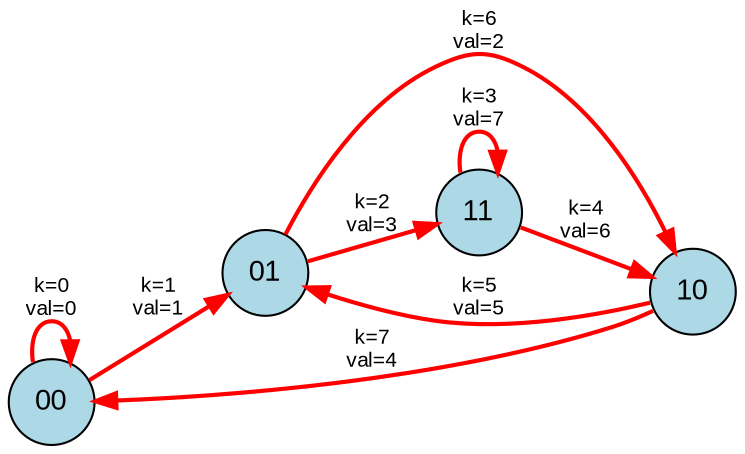

[[TOC]]


这是一道关于 **De Bruijn 序列 (德布鲁因序列)** 的经典构造题目。

> 这个题目 本质 和: poj 1780 code 是一个题目

### 题目核心解析

1. 问题本质：寻找字典序最小的 De Bruijn 序列

题目中定义的 "Ouroboros number"（衔尾蛇数）实际上就是 De Bruijn 序列 $B(2, n)$。

- **定义**：一个长度为 $2^n$ 的二进制串，当首尾相连时，包含了所有可能的长度为 $n$ 的二进制子串（从 $0$ 到 $2^n-1$）各恰好一次。
- **目标**：题目要求找到**字典序最小**的那个 Ouroboros number，并输出该序列中第 $k$ 个长度为 $n$ 的子串对应的十进制数值。
- 图论模型：De Bruijn 图

这个问题可以通过在 De Bruijn 图 上寻找 欧拉回路 (Eulerian Circuit) 来解决。

- **节点 (States)**：所有长度为 $n-1$ 的二进制串。共有 $2^{n-1}$ 个节点。
- **边 (Edges)**：每个节点 $u$ 有两条出边，分别代表在当前 $n-1$ 位后面添加 `0` 或 `1`。
  - 添加 `0`：形成的新 $n$ 位数是 `(u << 1) | 0`。这条边指向的新节点是该 $n$ 位数的后 $n-1$ 位。
  - 添加 `1`：形成的新 $n$ 位数是 `(u << 1) | 1`。指向对应的新节点。
- **欧拉回路**：因为每个节点的入度和出度都是 2，且图是强连通的，所以一定存在欧拉回路。这条回路经过每条边恰好一次，而每条边就对应一个唯一的 $n$ 位二进制数。回路上的边序列就是我们要找的答案。
- 字典序最小策略

为了得到字典序最小的序列（即让二进制串看起来尽可能小），我们需要使用 Hierholzer 算法（DFS 后序入栈）来寻找欧拉回路，并应用贪心策略：

- **贪心**：在 DFS 遍历时，对于每个节点，**总是优先尝试走 '0' 的边，然后再尝试走 '1' 的边**。
- **Hierholzer 特性**：该算法是在回溯（离开节点）时将边加入栈中。因此，得到的路径是**逆序**的。
- **结果**：当我们优先遍历 '0' 边时，'0' 边会比 '1' 边更晚进入栈底（或者说在递归树更深层被处理），这意味着在**逆序**输出时，'0' 边会排在前面。这正好满足字典序最小的要求。

**4. 算法流程**

1. **建图**：隐式建图。节点状态为 `0` 到 `2^(n-1) - 1`。
2. **DFS**：从节点 `0` 开始。
   - 尝试边 `0`（对应数值 `(u << 1) | 0`）。如果未访问，递归，回溯时记录该数值。
   - 尝试边 `1`（对应数值 `(u << 1) | 1`）。如果未访问，递归，回溯时记录该数值。
3. **记录**：使用一个栈或数组记录路径。
4. **输出**：由于 Hierholzer 算法记录的是逆序路径，我们需要从数组的末尾开始索引。题目求第 $k$ 个数，即为路径数组 `path[path.size() - 1 - k]`。

------

### 代码 


```cpp
/**
 * Author by Rainboy
 * Problem: POJ 1793 / OpenJ_Bailian 1392 Ouroboros Snake
 * Analysis: 
 * 1. 这是一个构造字典序最小的 De Bruijn 序列的问题。
 * 2. 模型：在 n-1 位的 De Bruijn 图上寻找欧拉回路。
 * 3. 策略：Hierholzer 算法 (DFS) + 贪心 (优先走 0 边)。
 * 4. 注意：DFS 后序记录的是逆序路径，输出时需要倒着取。
 */

#include <iostream>
#include <vector>
#include <algorithm>
#include <cstring>
#include <cmath>

using namespace std;

// 最大 N=15, 2^15 = 32768。
// 边的总数是 2^N。我们需要标记边是否被访问。
// 边的数值范围是 0 到 2^N - 1。
const int MAX_EDGES = 1 << 16; 

int n, k;
bool visited[MAX_EDGES]; // 记录边的数值是否已存在于序列中
vector<int> path;        // 存储欧拉回路的边序列
int node_mask;           // 用于取后 n-1 位

// Hierholzer 算法寻找欧拉回路
// u: 当前节点 (n-1 位)
void dfs(int u) {
    // 贪心策略：优先尝试添加 0，再尝试添加 1
    // 这样在逆序输出时，0 会排在前面，保证字典序最小
    for (int i = 0; i <= 1; ++i) {
        // 构造边的数值 (n 位)
        // 左移一位腾出位置，加上当前的 bit (0 或 1)
        int edge_val = (u << 1) | i;
        
        if (!visited[edge_val]) {
            visited[edge_val] = true;
            
            // 下一个节点是 edge_val 的后 n-1 位
            int v = edge_val & node_mask;
            
            dfs(v);
            
            // 回溯时记录路径 (Hierholzer 核心)
            path.push_back(edge_val);
        }
    }
}

void solve() {
    // 0 0 结束输入
    // 注意题目输入可能会有 n k 在一行，以 0 0 结尾
    while (cin >> n >> k && (n != 0 || k != 0)) {
        // 初始化
        memset(visited, 0, sizeof(visited));
        path.clear();
        
        // n-1 位的掩码。例如 n=3, mask=11(bin)=3
        // 用于从 n 位的边数值中提取后 n-1 位作为下一个节点
        node_mask = (1 << (n - 1)) - 1;
        
        // 从节点 0 (全是0的状态) 开始 DFS
        dfs(0);
        
        // Hierholzer 算法生成的 path 是逆序的。
        // path.back() 是第一个数，path[0] 是最后一个数。
        // 第 k 个数 (0-indexed) 对应的就是倒数第 k+1 个元素。
        int ans = path[path.size() - 1 - k];
        
        cout << ans << endl;
    }
}

int main() {
    // 优化 IO
    ios::sync_with_stdio(false);
    cin.tie(0);
    solve();
    return 0;
}
```

### 代码细节解释

1. **`node_mask`**: 对于 De Bruijn 图，如果当前状态是 $b_1 b_2 \dots b_{n-1}$，添加一个位 $x$ 后，新状态应该是 $b_2 \dots b_{n-1} x$。在位运算中，这等价于 `((u << 1) | x) & mask`，其中 mask 是 $n-1$ 个 1。
2. **贪心顺序**: `for (int i = 0; i <= 1; ++i)` 确保了我们总是先走值较小的边。虽然这些边被压入栈底（`path` 的前面），但在最终的欧拉路径中，栈底元素对应路径的末尾？**不**，Hierholzer 算法回溯时入栈，最后回溯到起点的边最后入栈（在 `path` 的末尾/Top）。因此 `path` 的末尾是路径的起点。由于我们希望起点尽可能小，而递归越深的边在 `path` 中越靠前（栈底），递归越浅的边在 `path` 越靠后（栈顶）。这里利用贪心让较小的边进入更“浅”的递归层级或正确的拓扑序中，从而保证整体序列最小。
3. **索引计算**: `path.size() - 1 - k`。因为 `path` 存储的是 `[Last Edge, ..., Second Edge, First Edge]`。所以第 `0` 个数是 `path.back()`，第 `k` 个数就是从后往前数第 `k` 个。

## 难点


这道题（**POJ 1793 / OpenJ_Bailian 1392 Ouroboros Snake**）是一道**极具代表性**的图论构造题。

如果要给它定一个难度评级，我认为它属于：[提高+/省选-] (蓝题/紫题)。

在 Codeforces 分数体系中，大概对应 1700 - 1900 分段。

------

### 具体维度的评价

#### 1. 思维难度：⭐⭐⭐⭐ (4.5/5)

这是这道题最难的地方。如果你没听说过 **De Bruijn 序列（德布鲁因序列）**，很难在考场上凭空想出“欧拉回路”这个解法。

- **模型转化门槛高**：
  - 直觉上，要在 $2^n$ 个数中找顺序，很容易想到搜索（DFS/回溯）或者哈密顿回路。
  - 但哈密顿回路是 NP-Hard 的，效率极低。
  - **破局点**在于将问题转化为：**$n$ 位二进制数是“边”，$n-1$ 位二进制数是“节点”**。这个“降维打击”的建模思想非常抽象，是这道题的分水岭。
- **字典序处理**：
  - 即使想到了欧拉回路，如何保证“字典序最小”也是个坑。
  - 需要深刻理解 Hierholzer 算法是“逆序记录”的特性，从而在贪心（优先走0）和输出（倒序）之间做好配合。

#### 2. 代码实现难度：⭐⭐ (2/5)

一旦你突破了思维壁垒，代码其实非常短，甚至比“John's Trip”还短。

- 核心代码只有 15 行左右的 DFS。
- 没有复杂的指针操作，没有大模拟，只有简洁的位运算。
- 属于典型的 **“一行代码十行逻辑”**。

#### 3. 坑点指数：⭐⭐⭐ (3/5)

- **位运算细节**：需要搞清楚节点掩码是 `(1 << (n-1)) - 1`，而不是 `n`。
- **方向感**：DFS 到底是正序还是逆序？输出要不要反转？这很容易把人绕晕。

------

### 与其他题目的横向对比

为了帮你建立坐标系，我们把它和你之前做的题目对比：

| **题目**                 | **类型**           | **难度** | **核心差异**                                        |
| ------------------------ | ------------------ | -------- | --------------------------------------------------- |
| **POJ 1300 Door Man**    | 欧拉路径判定       | ⭐⭐       | 显式图，只问 Yes/No，不需要构造具体路径，思维简单。 |
| **POJ 1041 John's Trip** | 欧拉回路构造       | ⭐⭐⭐      | 显式图，求字典序最小。难点在于 Hierholzer 的理解。  |
| **POJ 1793 Ouroboros**   | **De Bruijn 构造** | ⭐⭐⭐⭐     | **隐式图**。难点在于**自己构建出节点和边的关系**。  |

### 总结

这道题是 **“知识点型”** 题目。

- **不会做很正常**：如果你不知道 De Bruijn 图的构造方法，这题几乎是无解的。
- **学会了就是秒杀**：一旦掌握了这个模型（$N$ 维序列 $\rightarrow$ $N-1$ 维节点的欧拉回路），它就变成了一个 5 分钟能写完的模板题。

它的教育意义：

教会我们图论中的一种高级建模技巧 —— 将“状态”视为节点，将“转移/操作”视为边。在这里，数字本身变成了边，而数字的前缀/后缀变成了节点。这种思想在后续的 AC 自动机 和 字符串图论题 中会反复出现。


## 例子


这个问题可以转化为在 **De Bruijn 图**中寻找一条特定的**欧拉回路**。

对于 $n=3$：

1.  **节点 (Nodes)**：是长度为 $n-1=2$ 的二进制串，共有 $2^2=4$ 个节点：`00`, `01`, `10`, `11`。
2.  **边 (Edges)**：每条边代表一个长度为 $n=3$ 的二进制串。从节点 $u$ 转移到节点 $v$，如果 $v$ 是由 $u$ 去掉首位并在末尾添加一个比特位得到的。
3.  **最小衔尾蛇数**：通过贪心策略（优先尝试添加 `1`，如果不成再添加 `0`，这种策略在逆向构建欧拉路径时能得到字典序最小的序列）生成的序列为 `00011101`。

以下是 $n=3$ 对应的 De Bruijn 图及解的路径：

### Graphviz 可视化



### 路径与解的对应关系表 ($n=3$)

生成的最小衔尾蛇二进制串为：`0 0 0 1 1 1 0 1` (循环)

| $k$   | 路径节点转移    | 对应的 $n$ 位二进制 | 十进制值 $o(3,k)$ |
| :---- | :-------------- | :------------------ | :---------------- |
| **0** | `00` $\to$ `00` | `000`               | **0**             |
| **1** | `00` $\to$ `01` | `001`               | **1**             |
| **2** | `01` $\to$ `11` | `011`               | **3**             |
| **3** | `11` $\to$ `11` | `111`               | **7**             |
| **4** | `11` $\to$ `10` | `110`               | **6**             |
| **5** | `10` $\to$ `01` | `101`               | **5**             |
| **6** | `01` $\to$ `10` | `010`               | **2**             |
| **7** | `10` $\to$ `00` | `100`               | **4**             |

### 图形说明

1.  **节点**：代表当前状态（前 $n-1$ 位）。
2.  **有向边**：代表一次“吞噬与生长”的过程。例如从 `01` 到 `11` 的边，表示在 `01` 后面补 `1` 变成 `011`，然后滑窗取后两位变成新状态 `11`。
3.  **红色路径**：构成了最小的衔尾蛇数。我们按照 $k=0$ 到 $k=7$ 的顺序遍历这些边，每条边恰好经过一次（欧拉回路）。
4.  **解的含义**：题目要求的 $o(n,k)$ 就是第 $k$ 步所经过的这条“边”所代表的 $n$ 位二进制数的数值。

