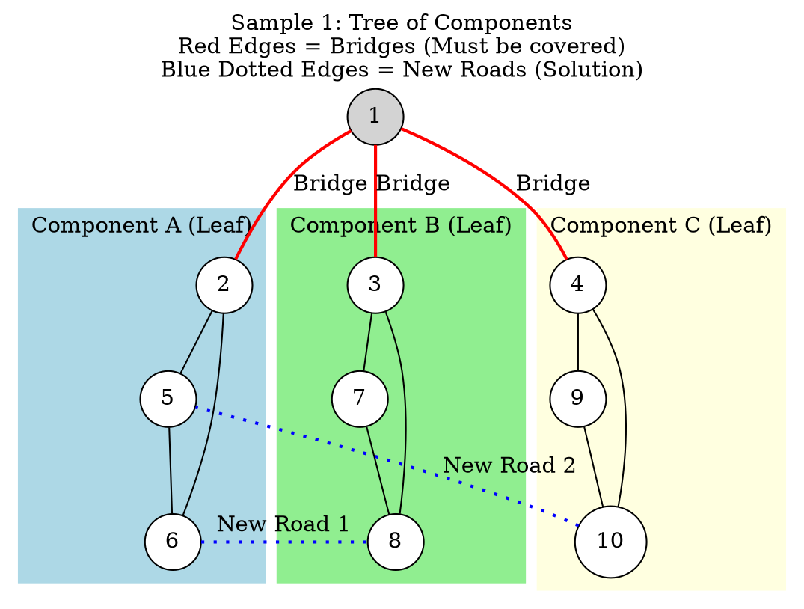

[[TOC]]

## 样例解释

在这个图中，我们有3个叶子分量（Cluster 1, 2, 3）。我们需要添加2条边来消除所有的桥。一种可行的方案是连接 Cluster 1 和 Cluster 2，以及 Cluster 3 和 Cluster 1。

## 解释

1.  **Sample 1 图解**:
    *   你可以清楚地看到图被红色的**桥**分成了四个部分：中心节点1，以及三个彩色的“岛屿”（分量）。
    *   在缩点后的树结构中，三个彩色岛屿就是**叶子节点**。
    *   根据算法，我们需要连接叶子节点来形成环，从而消除桥。
    *   蓝色的虚线展示了如果不经过中心节点1，如何在岛屿之间建立新的联系。加上这两条蓝线后，移除红色的任意一条线，你仍然可以通过蓝线到达其他地方。

2.  **Sample 2 图解**:
    *   这是一个简单的三角形环。
    *   移除任意一条边（例如 1-2），你仍然可以通过 1-3-2 到达目的地。
    *   因此答案是 0。

## 解析

这是一个经典的图论问题，属于**边双连通分量（Edge-Biconnected Component, e-BCC）**的范畴。

## 题目大意

给定一个连通的无向图（景点为点，道路为边），目前图是连通的。但是，如果某条边正在施工（相当于删除这条边），图可能会变得不连通。

你需要添加最少数量的新边，使得整个图在删除任意一条边后，仍然保持连通。

用图论术语来说：**给定一个连通图，求至少添加几条边，使其变为边双连通图。**

------

## 核心概念解析

1. 桥 (Bridge)：

   在连通图中，如果删除某条边会导致图的连通分量增加（即图不再连通），则这条边称为“桥”。

   题目要求的目标就是消除所有的桥。

2. 边双连通分量 (e-BCC)：

   极大的不包含桥的子图。在一个边双连通分量内，任意两点之间至少存在两条不重边的路径。

   如果我们把原图中所有的边双连通分量“缩”成一个点，那么原图中的“桥”就会变成连接这些新点的边。

3. 缩点后的结构：

   将原图中的每个边双连通分量缩成一个超级节点后，剩下的边就是原图的桥。因为原图是连通的，所以缩点后的图一定是一棵树（如果没有桥，则是一个孤立点）。

## 解题思路

这个问题可以转化为：**在一个树中，至少添加多少条边，能让这棵树变成一个边双连通图（即没有桥，或者说变成一个包含所有节点的强连通结构）？**

### 步骤 1：找桥并缩点

使用 Tarjan 算法（或类似的 DFS 算法）找出图中所有的桥。

然后，将通过非桥边相连的节点归为一个“连通分量”（缩点）。

### 步骤 2：构建缩点树

缩点后，我们得到了一个树结构。树的节点是原图的边双连通分量，树的边是原图的桥。

### 步骤 3：计算答案

在树中，为了消灭所有的桥（使其变成环的一部分），最好的策略是连接树的叶子节点（度数为1的节点）。

连接两个叶子节点，可以使这两个叶子节点之间的路径上的所有边（桥）都变成环的一部分，从而不再是桥。

假设缩点后的树有 $leaf$ 个叶子节点（度数为 1 的节点）。

每添加一条边，最多可以消除 2 个叶子节点的需求。

因此，最少需要添加的边数为：

$$\lceil \frac{leaf}{2} \rceil = \lfloor \frac{leaf + 1}{2} \rfloor$$

**特例**：如果原图本身就是边双连通的（没有桥），缩点后只有一个节点，此时 $leaf = 0$，答案为 0。

------

## 算法流程

1. **输入图**：构建邻接表。
2. **Tarjan 算法求桥**：
   - 维护 `dfn` (时间戳) 和 `low` (追溯值)。
   - 如果 `low[v] > dfn[u]`，说明边 $(u, v)$ 是桥。
3. **标记分量 (DFS)**：
   - 忽略所有的桥，对图进行 DFS 遍历。
   - 所有能互通的节点属于同一个 ID（缩点后的节点）。
4. **计算度数**：
   - 遍历原图所有的边 $(u, v)$。
   - 如果 $u$ 和 $v$ 属于不同的分量（即 `id[u] != id[v]`），说明这是一条桥，连接了树上的两个节点。
   - 增加这两个分量节点的度数 (`degree[id[u]]++`, `degree[id[v]]++`)。
5. **统计叶子并输出**：
   - 统计度数为 1 的分量个数 $L$。
   - 输出 $(L+1)/2$。

------

## 关键点总结

1. 为什么是 $\frac{leaf+1}{2}$？

   想象一棵树。为了让它没有割边，我们至少要把所有的叶子节点连起来。连接两个叶子节点，可以消除这两个叶子节点的“叶子属性”。如果叶子数是奇数，最后剩一个叶子，随便连一条边即可消除它。

2. 重边处理：

   题目中说到 any pair of tourist attractions will have at most one road directly between them（任意两点间最多一条路），所以不需要处理重边的情况，简化了逻辑。如果允许重边，Tarjan 算法中判断父节点时需要判断边的下标，而不是点的编号。

3. 度数计算：

   代码中遍历了所有边。对于连接两个不同连通分量 $A$ 和 $B$ 的桥 $(u, v)$（$u \in A, v \in B$），在遍历 $u$ 时 degree[A]++，在遍历 $v$ 时 degree[B]++。逻辑是正确的。

## 代码 

@include-code(./1.cpp, cpp)

