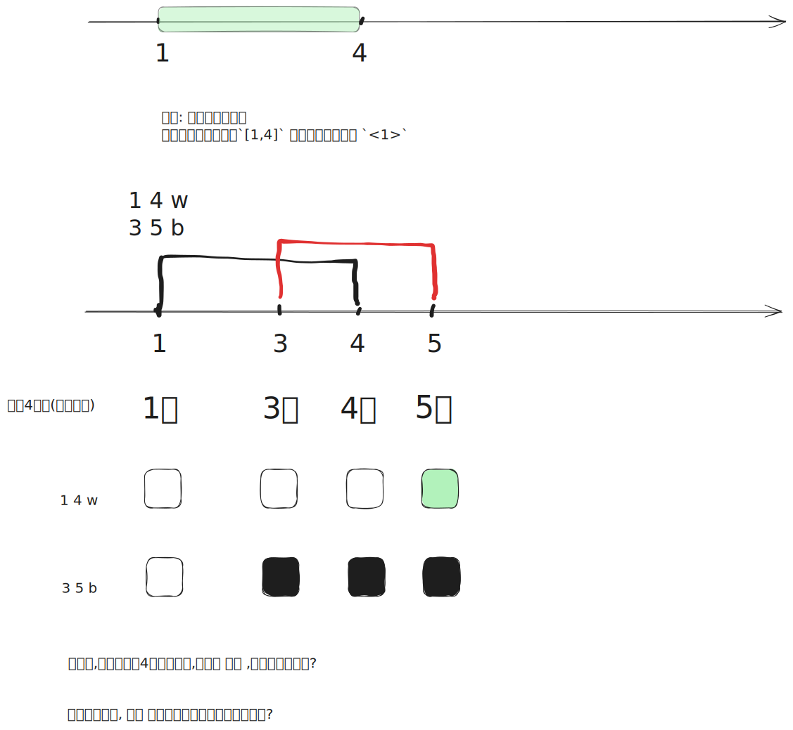

[[TOC]]

这是一道经典的 **线段树 + 离散化 (Segment Tree + Discretization)** 题目。

## 1. 题目核心难点

- **坐标范围极大**：球的编号（坐标）可以达到 $2^{31}-1$（约 20 亿），无法直接开数组模拟。
- **操作次数较少**：$N \le 2000$，这意味着涉及的关键坐标点最多只有 4000 个。
- **区间操作**：涉及区间染色（覆盖），最后询问最长的连续白色区间。

## 2. 解题思路

### 第一步：离散化 (Discretization)

由于坐标很大但关键点很少，我们需要将坐标“压缩”。

对于区间染色问题，有一个经典的离散化技巧：

如果题目给出的操作是闭区间 $[a, b]$，我们在离散化数组中不仅要存入 $a$，还要存入 $b+1$。

为什么是 $b+1$？

我们将数轴离散化为若干个左闭右开的区间 $[X_i, X_{i+1})$。

如果要表示覆盖 $[1, 4]$，在逻辑上等同于覆盖 $[1, 5)$。如果不存 $b+1$，我们就无法精确地表示出“从 $b$ 结束，下一个区间从 $b+1$ 开始”这个分界点。

具体步骤：

1. 读取所有操作 $(a, b, type)$。
2. 将 $a$ 和 $b+1$ 加入一个数组 `X`。
3. 对 `X` 进行排序并去重 (sort + unique)。
4. 此时，两个相邻的离散化点 $X[i]$ 和 $X[i+1]$ 构成了一个基本区间 $[X[i], X[i+1]-1]$，其长度为 $X[i+1] - X[i]$。

#### 第二步：线段树 (Segment Tree)

我们建立一棵线段树来维护离散化后的下标 $0$ 到 $M$（$M$ 是去重后点的数量）。

线段树的每个叶子节点 $i$ 代表实际数轴上的区间 $[X[i], X[i+1]-1]$。

- **维护值**：因为这题只需要最后的结果，我们不需要在节点中维护复杂的“最大连续长度”。只需要维护一个标记 `val`：
  - `-1`：表示该区间颜色不统一（杂色）。
  - `0`：表示全黑。
  - `1`：表示全白。
- **懒惰标记 (Lazy Propagation)**：这是必须的，因为是区间修改。当我们将一个大区间染成白色时，不需要遍历到底，打个标记即可。只有当需要访问子节点时才下传标记 (`pushdown`)。

#### 第三步：统计答案

题目问的是“最终”的最长连续白色序列。

1. 处理完所有 $N$ 次操作。
2. 从左到右遍历离散化后的每一个基本区间 $[X[i], X[i+1]-1]$。
3. 查询该区间的颜色。
   - 如果是**白色**，累加长度到 `current_len`。
   - 如果是**黑色**，结算当前的 `current_len`，尝试更新最大值，并重置 `current_len` 为 0。
4. 注意处理连续两个基本区间都是白色的情况（它们在数轴上是首尾相接的，直接合并即可）。

### 3. 代码模板 (C++)

C++

```
#include <iostream>
#include <vector>
#include <algorithm>
#include <cstring>

using namespace std;

const int MAXN = 2005;
const int MAXM = MAXN * 4; // 离散化后的点最多 2*N，线段树开 4 倍

// 存储原始操作
struct Operation {
    int a, b;
    char type;
} ops[MAXN];

// 离散化数组
vector<int> X;

// 线段树数组，tree[i] 存储颜色的标记
// -1: 杂色/无标记, 0: 黑色, 1: 白色
int tree[MAXM * 4];

// 下传标记
void pushdown(int node) {
    if (tree[node] != -1) {
        tree[node * 2] = tree[node];
        tree[node * 2 + 1] = tree[node];
        tree[node] = -1; // 标记下传后，当前节点设为杂色(或者不处理也行，但这题覆盖逻辑简单)
                         // 其实严格来说，对于覆盖类线段树，父节点有值就意味着子节点全被覆盖
                         // 父节点变为-1只在update在这个节点区间只有部分被覆盖时发生
                         // 但为了方便最后统计，我们这里仅仅利用 pushdown 将颜色推到叶子即可
    }
}

// 区间更新
// L, R 是当前节点覆盖的离散化下标范围
// qL, qR 是查询的离散化下标范围
void update(int node, int L, int R, int qL, int qR, int color) {
    if (qL <= L && R <= qR) {
        tree[node] = color;
        return;
    }
    
    // 如果当前节点有纯色标记，先下传，否则子节点的数据是旧的
    if (tree[node] != -1) {
        tree[node * 2] = tree[node];
        tree[node * 2 + 1] = tree[node];
        tree[node] = -1; // 当前节点不再纯色，因为下面即将只有一部分被修改
    }

    int mid = (L + R) / 2;
    if (qL <= mid) update(node * 2, L, mid, qL, qR, color);
    if (qR > mid) update(node * 2 + 1, mid + 1, R, qL, qR, color);
}

// 这里的查询稍微变通一下：
// 我们不需要标准的 query 函数，而是在最后写一个 dfs 或循环
// 把线段树所有的标记推到叶子节点，得到最终每个区间的颜色数组
int colors[MAXM]; // 存储最终每个基本区间的颜色

void extract_colors(int node, int L, int R) {
    if (L == R) {
        colors[L] = tree[node];
        return;
    }
    // 强制下传标记，确保叶子节点是最新的颜色
    if (tree[node] != -1) {
        tree[node * 2] = tree[node];
        tree[node * 2 + 1] = tree[node];
        tree[node] = -1;
    }
    int mid = (L + R) / 2;
    extract_colors(node * 2, L, mid);
    extract_colors(node * 2 + 1, mid + 1, R);
}

int main() {
    int n;
    while (cin >> n) {
        X.clear();
        // 1. 读取输入并收集离散化点
        for (int i = 0; i < n; i++) {
            cin >> ops[i].a >> ops[i].b >> ops[i].type;
            X.push_back(ops[i].a);
            X.push_back(ops[i].b + 1); // 关键：右端点 + 1
        }
        
        // 2. 离散化处理
        sort(X.begin(), X.end());
        X.erase(unique(X.begin(), X.end()), X.end());
        
        int m = X.size(); // 离散化后点的个数
        
        // 3. 初始化线段树 (0表示黑色)
        // 线段树维护的下标范围是 0 到 m-1 (代表 m-1 个区间)
        // 对应的区间是 [X[i], X[i+1]-1]
        // 注意：数组要清空或者赋初值，这里题目说初始全是黑球
        memset(tree, 0, sizeof(tree)); 

        // 4. 执行操作
        for (int i = 0; i < n; i++) {
            // 二分查找对应的离散化下标
            int l_idx = lower_bound(X.begin(), X.end(), ops[i].a) - X.begin();
            int r_idx = lower_bound(X.begin(), X.end(), ops[i].b + 1) - X.begin();
            
            // 实际上更新的区间下标是 [l_idx, r_idx - 1]
            // r_idx 是 b+1 的位置，我们要染色的区间是到 b 截止，属于下标 r_idx-1 所代表的区间
            int col = (ops[i].type == 'w' ? 1 : 0);
            if (l_idx <= r_idx - 1) {
                update(1, 0, m - 1, l_idx, r_idx - 1, col);
            }
        }

        // 5. 提取最终颜色到 colors 数组
        // 如果只有一个点，也就没有区间，m-1 会导致越界或逻辑错误，加个判断
        if (m > 1) {
            extract_colors(1, 0, m - 1);
        } else {
            // 极端情况
            cout << "Oh, my god" << endl;
            continue;
        }

        // 6. 线性扫描找最长连续白色区间
        int max_len = 0;
        int ans_l = -1, ans_r = -1;
        
        int cur_len = 0;
        int cur_start = -1;
        
        // 遍历所有基本区间
        for (int i = 0; i < m - 1; i++) {
            if (colors[i] == 1) {
                if (cur_start == -1) cur_start = X[i]; // 新的一段开始
                cur_len += (X[i+1] - X[i]); // 累加长度
            } else {
                // 如果遇到黑色，结算上一段
                if (cur_start != -1) {
                    if (cur_len > max_len) {
                        max_len = cur_len;
                        ans_l = cur_start;
                        ans_r = X[i] - 1; // 上一个区间的结束点是 X[i]-1
                    }
                    cur_start = -1;
                    cur_len = 0;
                }
            }
        }
        
        // 循环结束后别忘了检查最后一段
        if (cur_start != -1) {
            if (cur_len > max_len) {
                max_len = cur_len;
                ans_l = cur_start;
                ans_r = X[m - 1] - 1;
            }
        }

        if (ans_l == -1) {
            cout << "Oh, my god" << endl;
        } else {
            cout << ans_l << " " << ans_r << endl;
        }
    }
    return 0;
}
```

### 4. 关键点解析 (Why it works)

1. 区间对应关系：

   离散化后的数组 X 为 [x0, x1, x2, x3...]。

   线段树的叶子节点 i 对应的是实数轴区间 [ X[i], X[i+1]-1 ]。

   例如 X = {1, 5, 8}。

   - 下标 `0` 对应 `[1, 4]` (长度 4)。
   - 下标 `1` 对应 `[5, 7]` (长度 3)。
   - 下标 2 越界，不使用。

     所以线段树只需要覆盖 0 到 X.size() - 2 的范围。

2. 右端点处理：

   代码中 r_idx 查找到的是 b+1 在 X 中的位置。

   例如 1 4 w，离散化点有 1, 5。

   l_idx 指向 1 (index 0)。

   r_idx 指向 5 (index 1)。

   我们要染色的区间是 [1, 4]，这正是下标 0 对应的区间。

   所以 update 的范围是 l_idx 到 r_idx - 1。

3. 合并逻辑：

   在最后扫描时，如果 colors[i] 和 colors[i+1] 都是白色，我们在 else 分支不会触发结算，而是直接在 cur_len 累加长度。这自然地处理了跨越离散化点的连续区间合并问题。

## 思考



怎么解决这个问题?

类比求出第一个白色点所代表的区间的计算方式: $3-1 = 2$

核心思想:  每个点所代表的区间由此点 $i$ 和 它右边的点 $i+1$ 共同觉决定: $\text{get}(i+1) - \text{get}(i)$

比如, 操作 : `1 4 w` 真正应该创建的两个点应该是`1, 5`,代表区间: $[1,5)$

## 操作举例 1

```
1 4 w
3 5 b
```

核心核心理念：

在计算机处理区间时，“左闭右开” $[L, R)$ 是最完美的处理方式。

- 题目说：涂色 $[1, 4]$ （包含1，包含4）。
- 我们大脑转化：涂色从 $1$ 开始，一直涂到 **$5$ 之前** 停止。
- **$b+1$ 的本质就是“停止点”**。

------

### 演示数据

1. `1 4 w` (区间 [1, 4] 染白)
2. `3 5 b` (区间 [3, 5] 染黑)

### 第一步：收集关键点 (为什么要加 1)

我们要切分这个无限长的数轴，需要确定哪些位置是**“状态发生改变”**的界碑。

- **操作 1 (`1 4 w`)**：
  - **$1$**：这是**开始**染白的地方。（放入数组）
  - **$5$** ($4+1$)：这是**停止**染白的地方。从 5 开始就不受这个操作影响了。（放入数组）
- **操作 2 (`3 5 b`)**：
  - **$3$**：这是**开始**染黑的地方。（放入数组）
  - **$6$** ($5+1$)：这是**停止**染黑的地方。（放入数组）

离散化数组 $X$ (排序后)：

[1, 3, 5, 6]

------

### 第二步：切分区间 (最关键的一步)

现在数轴被这 4 个点切成了 3 段。

注意： 线段树的每一个叶子节点，管理的是 $X[i]$ 到 $X[i+1]$ 之间的这段距离。

| **线段树下标 (ID)** | **离散化区间 [L,R)** | **对应的真实球编号** | **说明**                    |
| ------------------- | -------------------- | -------------------- | --------------------------- |
| **0**               | $[1, 3)$             | **1, 2**             | 从 1 开始，到 3 结束(不含3) |
| **1**               | $[3, 5)$             | **3, 4**             | 从 3 开始，到 5 结束(不含5) |
| **2**               | $[5, 6)$             | **5**                | 从 5 开始，到 6 结束(不含6) |

**这就是 $b+1$ 的威力！** 它帮我们把公共部分和独立部分完美切开了。

------

### 第三步：执行操作 (看看会不会出错)

#### 1. 执行 `1 4 w` (白色)

- **逻辑**：涂色范围是 $[1, 4]$，转化为左闭右开是 **$[1, 5)$**。
- **操作**：我们需要覆盖所有在 $1$ 和 $5$ 之间的区间。
- **查找**：
  - $1$ 在 $X$ 数组的下标是 `0`。
  - $5$ 在 $X$ 数组的下标是 `2`。
  - 我们要染色的线段树区间是 `0` 到 `2-1` (即下标 `0` 和 `1`)。
- **结果**：
  - 区间 ID **0** (对应球 1,2) $\rightarrow$ 变 **白**。
  - 区间 ID **1** (对应球 3,4) $\rightarrow$ 变 **白**。

#### 2. 执行 `3 5 b` (黑色)

- **逻辑**：涂色范围是 $[3, 5]$，转化为左闭右开是 **$[3, 6)$**。
- **操作**：我们需要覆盖所有在 $3$ 和 $6$ 之间的区间。
- **查找**：
  - $3$ 在 $X$ 数组的下标是 `1`。
  - $6$ 在 $X$ 数组的下标是 `3`。
  - 我们要染色的线段树区间是 `1` 到 `3-1` (即下标 `1` 和 `2`)。
- **结果**：
  - 区间 ID **1** (对应球 3,4) $\rightarrow$ **被覆盖**，变 **黑**。
  - 区间 ID **2** (对应球 5) $\rightarrow$ 变 **黑**。

------

### 第四步：最终统计

我们来看最后每个格子的颜色：

- **区间 0 (球 1, 2)**：白色 (操作1染的，操作2没碰它)。
- **区间 1 (球 3, 4)**：黑色 (操作1染白，但操作2**覆盖**了它)。
- **区间 2 (球 5)**：黑色 (操作2染的)。

最终连续白色序列：球 1 到 球 2。

答案：1 2。

这与实际逻辑（1-4白，然后3-5黑，剩下1-2白，3-5黑）完全一致！✅

------

### 反例：如果我们不存 $b+1$ 会发生什么？

假设我们只存 1, 4, 3, 5。

排序后 $X$ 数组：[1, 3, 4, 5]。

切分出来的区间是：

1. $[1, 3)$ $\rightarrow$ 球 **1, 2**
2. $[3, 4)$ $\rightarrow$ 球 **3**
3. $[4, 5)$ $\rightarrow$ 球 **4**

请注意，球 5 去哪了？

最后一个区间是 $[4, 5)$，只包含了球 4。球 5 丢失了！

因为我们没有记录“5之后的那个边界”，程序不知道球 5 也是一个需要被独立对待的实体。

这就是为什么要存 $b+1$ 的原因：

如果不加 1，原本的闭区间 $[3, 5]$ 就会变成 $[3, 5)$，导致右端点 $5$ 永远无法被包含进最后的统计区间里。通过存入 $5+1=6$，我们构建了区间 $[5, 6)$，确保了球 $5$ 拥有了自己的“领地”。

## 操作举例 2

数据: 

```
1 4 w
3 5 w
```

我们依然遵循 **“左闭右开 + 右端点加1”** 的黄金法则。

### 第一步：收集关键点 (Key Points)

我们的规则是：把闭区间 $[a, b]$ 转化为左闭右开 $[a, b+1)$。

1. **操作 1 (`1 4 w`)**：
   - 区间变成 $[1, 5)$。
   - 收集点：**$1$** 和 **$5$**。
2. **操作 2 (`3 5 w`)**：
   - 区间变成 $[3, 6)$。
   - 收集点：**$3$** 和 **$6$**。

离散化数组 $X$ (排序去重后)：

[1, 3, 5, 6]

------

### 第二步：切分区间 (Slicing)

数轴被这 4 个点切成了 3 个原子区间。这就是线段树叶子节点所管理的范围。

| **线段树下标 (ID)** | **离散化区间 [L,R)** | **对应的真实球编号** | **长度计算 (R−L)**   |
| ------------------- | -------------------- | -------------------- | -------------------- |
| **0**               | $[1, 3)$             | **1, 2**             | $3 - 1 = \mathbf{2}$ |
| **1**               | $[3, 5)$             | **3, 4**             | $5 - 3 = \mathbf{2}$ |
| **2**               | $[5, 6)$             | **5**                | $6 - 5 = \mathbf{1}$ |

------

### 第三步：执行操作 (Coloring)

现在我们开始“涂色”。

#### 1. 执行 `1 4 w`

- **目标**：覆盖 $[1, 5)$。
- **查找**：
  - $1$ 在数组 $X$ 的下标是 `0`。
  - $5$ 在数组 $X$ 的下标是 `2`。
  - **线段树操作范围**：下标 `0` 到 `2-1` (即 `0` 到 `1`)。
- **效果**：
  - 区间 **0** (球 1-2) $\rightarrow$ 变 **白**。
  - 区间 **1** (球 3-4) $\rightarrow$ 变 **白**。

#### 2. 执行 `3 5 w`

- **目标**：覆盖 $[3, 6)$。
- **查找**：
  - $3$ 在数组 $X$ 的下标是 `1`。
  - $6$ 在数组 $X$ 的下标是 `3`。
  - **线段树操作范围**：下标 `1` 到 `3-1` (即 `1` 到 `2`)。
- **效果**：
  - 区间 **1** (球 3-4) $\rightarrow$ **再次被涂白** (原本就是白，现在还是白，无冲突)。
  - 区间 **2** (球 5) $\rightarrow$ 变 **白**。

------

### 第四步：最终统计 (Merging)

现在我们遍历所有区间，计算结果。

1. **检查区间 0** ($[1, 3)$)：
   - 颜色：**白**。
   - 当前长度：`2`。
   - 序列起点：`1`。
   - 目前覆盖：`1, 2`。
2. **检查区间 1** ($[3, 5)$)：
   - 颜色：**白**。
   - **关键点**：因为它也是白色，且它是紧挨着区间 0 的（区间0结束于3，区间1开始于3），所以我们**不打断**，直接累加。
   - 当前总长度：$2 + 2 = \mathbf{4}$。
   - 目前覆盖：`1, 2, 3, 4`。
3. **检查区间 2** ($[5, 6)$)：
   - 颜色：**白**。
   - **关键点**：依然是白色，且紧挨着区间 1（区间1结束于5，区间2开始于5），继续累加。
   - 当前总长度：$4 + 1 = \mathbf{5}$。
   - 目前覆盖：`1, 2, 3, 4, 5`。

### 第五步：输出结果

- **最大长度**：$5$。
- **起点**：$1$。
- **终点**：起点 + 长度 - 1 = $1 + 5 - 1 = \mathbf{5}$。
- (或者直接看最后一个区间的右边界 $X[3] - 1 = 6 - 1 = 5$)。

**输出**：`1 5`。

------

### 总结这个例子的意义

这个例子完美展示了为什么要把 **区间切碎**：

1. **区间 1 (球 3, 4)** 是一个**公共区域**。
   - 操作 1 染了它。
   - 操作 2 也染了它。
2. 通过离散化，区间 1 变成了一个独立的原子单元。
3. 无论被染多少次，它始终保持白色。
4. 最后统计时，因为它左右两边（区间 0 和 区间 2）也都是白色，程序会自动把它们**串**起来，形成一个完整的长区间 $[1, 5]$。

这就是离散化处理**区间合并**的魔力：**切碎 $\rightarrow$ 染色 $\rightarrow$ 拼合**。