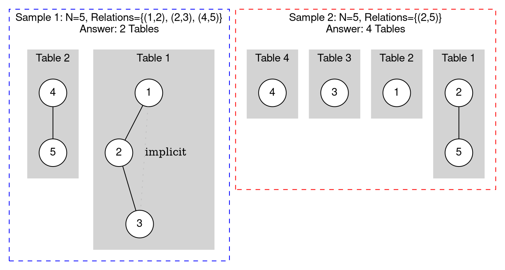

[[TOC]]

## 题目解析

这是杭电 OJ (HDU) 1213 题 "How Many Tables"，也是一个非常经典的**并查集 (Union-Find / DSU)** 或 **图的连通分量 (Connected Components)** 计数问题。

### 题目核心逻辑分析

1.  **关系传递性**：如果 A 认识 B，B 认识 C，那么 A、B、C 属于同一个社交圈，可以坐同一张桌子。这在图论中意味着他们属于同一个**连通分量**。
2.  **孤立点**：如果不认识任何人，自己也需要单独坐一张桌子。
3.  **目标**：求连通分量的个数。即：$总人数 - 合并次数$（如果使用并查集），或者直接统计有多少个独立的集合。

#### 输入数据回顾
*   **Case 1**: 5人, 3个关系 (1-2, 2-3, 4-5) -> 预期输出: 2
*   **Case 2**: 5人, 1个关系 (2-5) -> 预期输出: 4 (2-5一桌，1,3,4各一桌)

#### 图示



### 图形解读

1.  **Sample 1**:
    *   左边的灰色框 (Table 1) 展示了 1, 2, 3 号通过 1-2 和 2-3 连接在一起。
    *   右边的灰色框 (Table 2) 展示了 4, 5 号连接在一起。
    *   总共有 **2** 个灰色块，所以答案是 2。

2.  **Sample 2**:
    *   只有 2 和 5 建立了关系，他们组成 Table 1。
    *   1, 3, 4 号虽然没有任何关系输入，但根据题目规则“所有朋友都不愿意和陌生人同桌”，他们必须各自独自坐一张桌子。
    *   总共有 **4** 个灰色块，所以答案是 4。


这是一个非常经典的**求连通分量个数（Connected Components）**的问题。

### 题目解析

这道题的本质非常直观：

1. **初始状态**：每个人如果不认识其他人，自己就必须坐一张桌子。所以一开始如果有 $N$ 个人，我们就需要 $N$ 张桌子。
2. **合并规则**：题目说“A认识B，且B认识C，那么A、B、C彼此都认识”。这正是**并查集（Union-Find）**的传递性特性。
3. **操作**：每当我们发现两个人（A 和 B）认识时，如果他们原本不在同一个朋友圈（集合）里，我们就把这两个圈子合并成一个大圈子。
4. **结果**：
   - 每成功合并一次两个不同的圈子，需要的桌子数量就会**减 1**。
   - 或者，你可以理解为：最后剩下多少个**集合的根节点**（即 `find(x) == x` 的节点），就需要多少张桌子。

### 样例推导

假设 $N=5$（5个人），初始桌子数 $cnt = 5$：`{1}, {2}, {3}, {4}, {5}`。

1. 输入 `1 2`：
   - 1 和 2 合并。
   - 集合变为 `{1, 2}, {3}, {4}, {5}`。
   - 桌子数 $5 - 1 = 4$。
2. 输入 `2 3`：
   - 2 和 3 合并（因为 1,2 是一起的，所以 1,2,3 现在一起了）。
   - 集合变为 `{1, 2, 3}, {4}, {5}`。
   - 桌子数 $4 - 1 = 3$。
3. 输入 `4 5`：
   - 4 和 5 合并。
   - 集合变为 `{1, 2, 3}, {4, 5}`。
   - 桌子数 $3 - 1 = 2$。

**最终答案：2**

------

### 代码实现

使用之前的**并查集模板**，这道题做起来非常简单。为了方便，我们直接在 `DSU` 结构体外部或者 `merge` 函数中维护“当前剩余集合数量”。


```cpp
#include <iostream>
#include <vector>
#include <numeric>

using namespace std;

// 并查集结构体
struct DSU {
    vector<int> fa;
    int count; // 记录当前连通分量（桌子）的数量

    void init(int n) {
        fa.resize(n + 1);
        std::iota(fa.begin(), fa.end(), 0); // 初始化 0, 1, 2...
        count = n; // 初始时，每个朋友一张桌子，共 n 张
    }

    int find(int x) {
        return x == fa[x] ? x : fa[x] = find(fa[x]); // 路径压缩
    }

    // 合并函数
    void merge(int x, int y) {
        int fx = find(x);
        int fy = find(y);
        
        // 如果两个人在不同的桌子，就把两张桌子拼起来
        if (fx != fy) {
            fa[fx] = fy;
            count--; // 桌子总数减 1
        }
    }
} dsu;

void solve() {
    int N, M;
    cin >> N >> M;

    dsu.init(N);

    for (int i = 0; i < M; i++) {
        int u, v;
        cin >> u >> v;
        dsu.merge(u, v);
    }

    // 输出剩下的桌子数量
    cout << dsu.count << endl;
}

int main() {
    // 优化输入输出
    ios::sync_with_stdio(false);
    cin.tie(0);

    int T;
    cin >> T;
    while (T--) {
        solve();
    }

    return 0;
}
```

### 关键点总结

1. **思维转换**：不要去想“怎么排座位”，而是想“一开始有 $N$ 个集合，每次关系确认就减少集合数量”。
2. **变量维护**：在 DSU 初始化时，`count = N`。在 `merge` 成功（即 `fx != fy`）时，`count--`。最终输出 `count` 即可。这是最快的方法。
3. **另一种统计方法**：如果你不想用 `count` 变量，也可以在处理完所有输入后，遍历 $1 \sim N$，统计有多少个 $i$ 满足 `fa[i] == i`（即有多少个根节点），结果是一样的。

这道题是并查集最基础、最直接的应用场景，用来测试模板非常合适。

