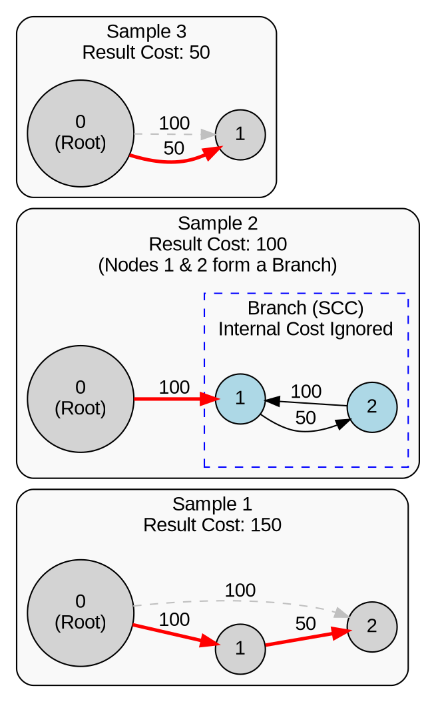

[[TOC]]

## 样例

## 题目解析

这道题是 **HDU 1827 - Ultimate Intelligence**。

这是一道非常经典的图论题目，考察的是 **强连通分量 (SCC) 缩点** 和 **贪心** 思想。

## 1. 题目大意与核心分析

题意：

ALPC 情报网需要传递情报。情报由 kzc_tc (编号为 0) 发出，需要传达给所有人。

- 传递是单向的，从 $X$ 到 $Y$ 有费用 $C$。
- **关键规则**：如果两个人在同一个“分支”（即互相可以直接或间接传递消息，也就是构成强连通分量 SCC），那么他们之间的传递费用可以被忽略（费用为 0）。
- 问：保证所有人都能收到情报的 **最小总费用** 是多少。

**核心考点：**

1. **强连通分量 (SCC)**：题目中“互相可以传递...费用忽略”描述的就是 SCC 的性质。在同一个 SCC 内部，只要有一个人收到了消息，其他人都能免费收到。
2. **DAG 上的贪心**：将图中的 SCC 缩成一个点后，原图变成了一个 **有向无环图 (DAG)**。
3. **最小树形图 (简化版)**：我们需要在一个 DAG 上选择边，使得根节点（SCC 0）能到达所有其他 SCC。

## 2. 算法逻辑解析

因为同一个 SCC 内部通信花费为 0，我们可以把每个 SCC 看作一个**超级节点**。

步骤 1：Tarjan 算法缩点

使用 Tarjan 算法找出所有的 SCC。记录每个点所属的 SCC 编号 (scc_id)。

步骤 2：构建缩点后的图（虚拟构建）

缩点后，我们只关心 SCC 之间的边。

对于原图中的每一条边 $u \to v$ (花费 $w$)：

- 如果 $u$ 和 $v$ 在同一个 SCC ($scc\_id[u] == scc\_id[v]$)：这条边是内部边，费用忽略，跳过。
- 如果不在同一个 SCC ($scc\_id[u] \neq scc\_id[v]$)：这是一条从 SCC A 到 SCC B 的边，费用为 $w$。这意味着只要 SCC A 收到消息，付出 $w$ 的代价，SCC B 就能收到消息。

步骤 3：贪心策略计算最小费用

现在问题变成了：在 DAG 图中，根节点（包含起点 0 的 SCC）已经有消息了，如何以最小代价让其他所有 SCC 都收到消息？

- 对于 DAG 中的每一个非根 SCC 节点，它**必须**至少有一个“入边”来源。

- 为了总费用最小，对于每个 SCC，我们只需要选择**所有指向它的边中费用最小的那一条**即可。

- 为什么不需要复杂的最小树形图算法（如朱-刘算法）？

  朱-刘算法是为了处理带权环的。但这道题里，所有的环（SCC）都被缩成点了，且内部费用为 0。剩下的图是 DAG。在 DAG 上，贪心选择每个点的最小入边，一定不会构成环，且一定最优。

算法总结：

$$Ans = \sum_{i \in All\_SCCs, i \neq Root\_SCC} \min(\text{incoming edge cost to } i)$$

## 3. 代码实现(超时)

> 不知道为什么超时 ,在HDU的机器上面

@include-code(./1.cpp, cpp)

## 代码(AC)

> 这个代码可以AC

@include-code(./ac.cpp, cpp)

## 复杂度分析

1. **时间复杂度**：
   - Tarjan 缩点：$O(N + M)$。
   - 遍历边更新最小花费：$O(M)$。
   - 统计结果：$O(N)$。
   - 总计：**$O(N + M)$**。对于 $N=50000, M=100000$ 来说非常快。
2. **空间复杂度**：
   - 图存储和 Tarjan 辅助数组：$O(N + M)$。

## 易错点提示

1. **起点判断**：虽然题目说要传给所有人，但实际上情报是从 `kzc_tc` (节点0) 开始扩散的。所以 **节点0 所在的 SCC 入度费用视为 0**（或者直接不加入统计）。
2. **重边处理**：两个 SCC 之间可能有多条边，一定要取 `min`。代码中 `min_in_cost[target] = min(...)` 处理了这种情况。
3. **多组数据**：HDU 的题目通常是多组数据，记得初始化（`init_edge` 和 `solver.init`）。

