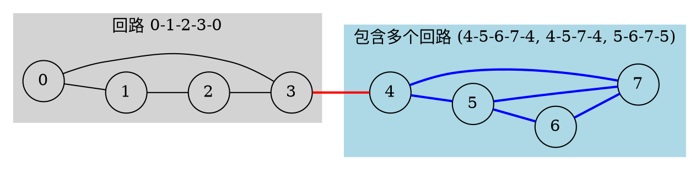

[[TOC]]

todo: 再次读取代码,写一遍代码,读题,理解题目

## 样例解释

回路分析

1. **回路 A**：0–1–2–3–0（4 条边）
2. **回路 B**：4–5–6–7–4（4 条边）
3. **回路 C**：4–5–7–4（3 条边）
4. **回路 D**：5–6–7–5（3 条边）

注意：回路 C 和 D 共享边 5–7 和 7–4（C 有 4–5, 5–7, 7–4；D 有 5–6, 6–7, 7–5）。
实际上，边 7–4 在回路 B 和 C 中都出现。
边 5–7 在回路 C 和 D 中都出现。

---

冲突边判断

一条边如果属于 **至少两个不同的简单回路**（在同一个点双连通分量中，但被多个环共用），则它是冲突的。

- 边 7–4：在回路 B 和 C 中 → 冲突
- 边 5–7：在回路 C 和 D 中 → 冲突
- 边 4–5：在回路 B 和 C 中 → 冲突
- 边 6–7：在回路 B 和 D 中 → 冲突
- 边 5–6：在回路 B 和 D 中 → 冲突

所以冲突边共 5 条：
(4,5), (5,6), (6,7), (7,4), (5,7)

---

不在任何回路中的边

- 边 3–4：它连接了两个不同的点双连通分量（0-1-2-3 和 4-5-6-7），因此不在任何回路中。
所以只有 1 条这样的边。

---

绘制图（Graphviz）

---

**图说明：**
- 红色边（3–4）是 **不在任何回路中** 的边（只有 1 条）。
- 蓝色边是 **冲突边**（5 条）。
- 灰色区域是第一个回路（0-1-2-3-0）。
- 浅蓝色区域是另一个点双连通分量，内部有多个回路，导致多条边被多个回路共用。

## 题目解析：Railway (HDU 3394)

这道题考察的是 **图论中的双连通分量 (Biconnected Components, BCC)** 性质。

### 1. 题目核心含义

题目描述了一个公园，包含 $N$ 个地点和 $M$ 条路（无向边）。

管理者想要沿着这些路修建铁路，并安排从起点回到起点的“观光路线”（即图中的环/回路）。

- "Railway belongs to none tourist route" (不需要建的铁路)：

  这意味着这条边不在任何环中。在图论中，这种边被称为 桥 (Bridge)。

- "Railway belongs to more than one tourist route" (可能会冲突的铁路)：

  这意味着这条边被多个环共用。

- 隐含的第三种情况：

  如果一条边恰好属于一个环，它是安全的，既不需要剔除也不算冲突。

### 2. 算法模型：点双连通分量 (v-BCC)

我们需要使用 **Tarjan 算法** 求出图中所有的 **点双连通分量 (v-BCC)**。

什么是点双连通分量？

在一个无向图中，如果一个子图内的任意两个点之间至少存在两条“点不重复”的路径，这个子图就是一个点双连通分量。

简单来说，点双连通分量是由边组成的极大集合，这些边“纠缠”在一起形成环。

利用 BCC 的性质判断边的情况：

对于每一个求出的 BCC，我们统计其中包含的边数 ($E_{bcc}$) 和 点数 ($V_{bcc}$)。

1. $E_{bcc} < V_{bcc}$：

   这种情况只发生在 $E_{bcc}=1, V_{bcc}=2$ 时。

   说明这个分量只有一条边，且构不成环。这条边就是 桥。

   对应答案：不需要建的铁路 (No need)。

2. $E_{bcc} = V_{bcc}$：

   说明这个分量是一个 简单环（Simple Cycle）。

   其中的所有边都恰好属于这一个环。

   对应答案：既不冲突，也是必须的。

3. $E_{bcc} > V_{bcc}$：

   说明这个分量内部边数多于点数，结构复杂，由多个环互相交织而成。

   在这个分量内的所有边，通常都被视为属于多个环（或者处于冲突区域）。

   对应答案：可能冲突的铁路 (Clash)。

### 3. 算法步骤

1. **初始化**：使用链式前向星存图，准备 Tarjan 所需的 `dfn`, `low` 数组，以及一个用于存储边的栈 `stack`。
2. **Tarjan 遍历**：
   - 遍历每个连通块（防止图不连通）。
   - 在 DFS 过程中，将遍历到的**边**压入栈中。
   - 当发现 `low[v] >= dfn[u]` 时，说明找到了一个 BCC。
3. **处理 BCC**：
   - 从栈中弹出边，直到弹出当前边 $(u, v)$ 为止。这些弹出的边构成了当前的 BCC。
   - 统计这些边涉及的**唯一点**的数量 ($V_{cnt}$) 和**边**的数量 ($E_{cnt}$)。
   - 根据 $E_{cnt}$ 和 $V_{cnt}$ 的关系更新答案：
     - 若 $E_{cnt} < V_{cnt}$：`ans1 += E_{cnt}` (其实就是 +1)
     - 若 $E_{cnt} > V_{cnt}$：`ans2 += E_{cnt}`
4. **输出结果**。

------

## 4. 代码实现

这个代码超时,应该是maxn 开太大了

@include-code(./1.cpp,cpp)

这个代码正确 

@include-code(./right.cpp,cpp)

## 5. 复杂度分析

- **时间复杂度**：$O(N + M)$。Tarjan 算法遍历每个点和边一次。处理 BCC 时，每条边进栈出栈一次，统计点数的操作与边数成正比。
- **空间复杂度**：$O(N + M)$。用于存储图结构和递归栈。

## 6. 易错点

- **重边判断**：题目保证 "no loop and no multiple edges"，所以不需要特殊处理重边。如果题目有重边，逻辑会稍微复杂一些（需要用边 ID 而不是点来判断反向边）。
- **统计点数**：在处理栈弹出的边时，要利用 `visit_token` 或者 `set` 来去重统计点数，因为一条边连接两个点，多条边可能共享顶点。
- **边栈的使用**：Tarjan 求点双（v-BCC）时，栈里面存的是**边**而不是点，这样处理起来最方便，因为点双的定义是边的集合。
