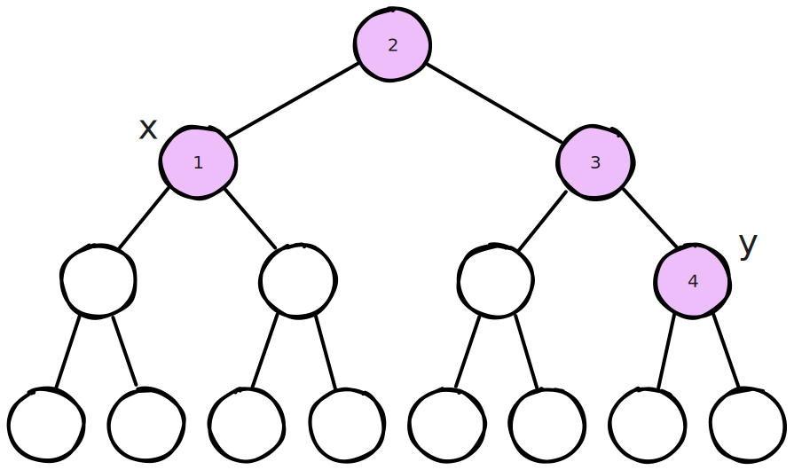

[[TOC]]

## 题目解析


todo: 反复思考这个题目


这是一个经典的树上动态规划（Tree DP）问题，通常结合**最近公共祖先（LCA）**和**数据结构（如树状数组 BIT 或线段树）**来优化求解。

### 1. 题目解析

问题目标：

给定一棵树和 $m$ 条路径，我们需要从中选出尽可能多的路径，使得选出的路径之间互不相交（即没有任何公共顶点）。

分析与思路：

这是一个典型的“最大不相交集合”类问题。在树上，我们可以使用贪心思想配合动态规划来解决。由于树具有递归结构，我们采用**自底向上（后序遍历）**的方式进行处理。

对于树上的任意节点 $u$，以 $u$ 为根的子树中，能选出的最大路径数 $dp[u]$ 取决于两种情况：

1. 不选择任何经过 $u$ 的路径：

   此时，最大路径数等于所有子节点 $v$ 的最大路径数之和。

   

   $$S[u] = \sum_{v \in children(u)} dp[v]$$

   

   在这种情况下，$dp[u] = S[u]$。

2. 选择一条经过 $u$ 的路径：

   假设我们选择了一条路径 $P$，它的最近公共祖先（LCA）是 $u$。

   如果选择了这条路径，我们获得收益 $1$。但是，这条路径会占用从 $u$ 下去的一系列节点。对于路径上经过的每一个节点 $k$（$k \neq u$），我们不能再取 $dp[k]$（因为 $k$ 被占用了），但我们可以取 $k$ 的那些不在路径上的子节点的 $dp$ 值之和。

   利用容斥原理的思想，我们可以推导出一个增量公式。

   对于路径上的任意节点 $k$，原本它贡献给父节点的价值是 $dp[k]$。如果我们让路径穿过 $k$，那么 $k$ 就不能作为一个独立子问题的根了，我们只能获得 $k$ 的所有子节点的 $dp$ 和，即 $S[k]$。

   因此，经过节点 $k$ 造成的“损失”或“变化量”是 $S[k] - dp[k]$。

   注意：$dp[k]$ 肯定大于等于 $S[k]$，所以这个差值是 $\le 0$ 的。

   如果选择以 $u$ 为 LCA 的路径 $(x, y)$，那么 $dp[u]$ 的值将是：

   

   $$dp[u] = \max(S[u], \quad 1 + S[u] + \sum_{k \in Path(x, y), k \neq u} (S[k] - dp[k]))$$

   公式解释：

   - $1$：当前选择的这条路径的贡献。
   - $S[u]$：假设先拿走所有子树的贡献。
   - $\sum (S[k] - dp[k])$：对于路径上的每个节点，我们实际上不能拿整个 $dp[k]$，只能拿 $S[k]$，所以要把多算的 $(dp[k] - S[k])$ 减掉（或者说加上负的差值）。

优化算法：

如果暴力遍历路径上的所有点来计算求和，最坏情况是 $O(N^2)$ 或 $O(N \cdot M)$，会超时。

我们需要快速计算路径上 $(S[k] - dp[k])$ 的和。

可以使用**DFS序（DFS Order）将树拍平成线性序列，并结合树状数组（BIT）**来实现：

1. **区间更新**：当我们计算完节点 $u$ 的 $dp[u]$ 后，我们将差值 $val = S[u] - dp[u]$ 更新到以 $u$ 为根的子树范围 $[in[u], out[u]]$ 中。这意味着，对于任何以 $u$ 的祖先为 LCA 的路径，只要经过 $u$，都会累加这个差值。
2. **单点查询**：对于路径端点 $x$，查询 BIT 中 $x$ 位置的前缀和，其实就代表了从当前子树根节点到 $x$ 这条路径上所有已经处理过的节点的差值之和。

**总流程**：

1. 预处理 LCA 和 DFS 序。
2. 将所有路径归类到它们的 LCA 节点上。
3. 进行后序遍历（DFS）：
   - 先递归处理所有子节点，计算基本和 $S[u]$。
   - 遍历挂在 $u$ 上的所有路径 $(x, y)$。利用 BIT 快速查询路径 $(u \to x)$ 和 $(u \to y)$ 上的差值和。
   - $dp[u] = \max(S[u], 1 + S[u] + \text{Query}(x) + \text{Query}(y))$。
   - 计算差值 $diff = S[u] - dp[u]$，并更新到 BIT 的 $[in[u], out[u]]$ 区间。

### 2. C++ 代码实现

C++

```cpp
#include <iostream>
#include <vector>
#include <algorithm>
#include <cstring>

using namespace std;

const int MAXN = 100005;
const int LOGN = 20;

// 边结构
struct Edge {
    int to;
};

// 变量定义
int n, m;
vector<int> adj[MAXN];
vector<pair<int, int>> paths_at_lca[MAXN]; // 存储以 u 为 LCA 的路径 (u, v)

// LCA 相关
int up[MAXN][LOGN];
int depth[MAXN];
int tin[MAXN], tout[MAXN]; // DFS 序的时间戳
int timer;

// DP 相关
int dp[MAXN];
int S[MAXN]; // S[u] = sum(dp[v]) for v in children(u)

// 树状数组 (BIT) - 支持区间修改，单点查询
// 实际上我们用 BIT 维护差分数组来实现：
// Range Add (subtree), Point Query (sum path from current root to node)
// 这里的 BIT 实现的是：
// update(idx, val): 把 val 加到 idx 位置
// query(idx): 求 1 到 idx 的前缀和
// 结合树的性质：
// 当我们在 node u 处 update_range(in[u], out[u], diff)
// 对于 u 的子树中的点 x，query(in[x]) 就会增加 diff。
// 这正好对应了 "如果路径经过 u，就要加上 u 的 diff"。
long long bit[MAXN];

void bit_add(int idx, int val) {
    for (; idx <= n; idx += idx & -idx)
        bit[idx] += val;
}

void bit_range_add(int l, int r, int val) {
    bit_add(l, val);
    bit_add(r + 1, -val);
}

long long bit_query(int idx) {
    long long sum = 0;
    for (; idx > 0; idx -= idx & -idx)
        sum += bit[idx];
    return sum;
}

// DFS 1: 预处理 LCA 和 DFS 序
void dfs_lca(int u, int p, int d) {
    depth[u] = d;
    up[u][0] = p;
    tin[u] = ++timer;
    for (int i = 1; i < LOGN; i++) {
        up[u][i] = up[up[u][i - 1]][i - 1];
    }
    for (int v : adj[u]) {
        if (v != p) {
            dfs_lca(v, u, d + 1);
        }
    }
    tout[u] = timer;
}

bool is_ancestor(int u, int v) {
    return tin[u] <= tin[v] && tout[u] >= tout[v];
}

int get_lca(int u, int v) {
    if (is_ancestor(u, v)) return u;
    if (is_ancestor(v, u)) return v;
    for (int i = LOGN - 1; i >= 0; i--) {
        if (up[u][i] != 0 && !is_ancestor(up[u][i], v)) {
            u = up[u][i];
        }
    }
    return up[u][0];
}

// DFS 2: 树形 DP
void dfs_solve(int u, int p) {
    S[u] = 0;
    // 1. 递归处理所有子节点
    for (int v : adj[u]) {
        if (v != p) {
            dfs_solve(v, u);
            S[u] += dp[v];
        }
    }

    // 2. 基础情况：不选经过 u 的路径
    dp[u] = S[u];

    // 3. 尝试选择一条以 u 为 LCA 的路径
    for (auto& path : paths_at_lca[u]) {
        int x = path.first;
        int y = path.second;
        
        // 计算路径代价
        // bit_query(tin[x]) 返回的是从当前子树根到 x 路径上所有差值 (S[k]-dp[k]) 的和
        // 因为我们在处理完节点后才更新 BIT，所以 u 本身的差值还没加进去，这正好符合公式 (k != u)
        long long current_val = 1 + S[u] + bit_query(tin[x]) + bit_query(tin[y]);
        
        if (current_val > dp[u]) {
            dp[u] = current_val;
        }
    }

    // 4. 计算 u 的差值，并更新到 BIT
    // 差值通常是负数或0 (S[u] <= dp[u])
    int diff = S[u] - dp[u];
    bit_range_add(tin[u], tout[u], diff);
}

void solve() {
    if (scanf("%d%d", &n, &m) == EOF) return;

    // 清空数据结构
    for (int i = 1; i <= n; i++) {
        adj[i].clear();
        paths_at_lca[i].clear();
        bit[i] = 0; // BIT 实际上需要清空到 n
    }
    
    // 读入树边
    for (int i = 0; i < n - 1; i++) {
        int u, v;
        scanf("%d%d", &u, &v);
        adj[u].push_back(v);
        adj[v].push_back(u);
    }

    // 预处理 LCA
    timer = 0;
    // 假设 1 为根
    dfs_lca(1, 0, 0);

    // 读入路径并存储在 LCA 处
    for (int i = 0; i < m; i++) {
        int u, v;
        scanf("%d%d", &u, &v);
        int lca = get_lca(u, v);
        paths_at_lca[lca].push_back({u, v});
    }

    // DP 求解
    dfs_solve(1, 0);

    printf("%d\n", dp[1]);
}

int main() {
    // 处理多组测试数据
    // 题目没有明确说多少组，通常根据 EOF 或 循环判断
    // 为了适应这种 "输入包括多个测试" 的描述：
    while (cin.peek() != EOF) {
         solve();
         // 吃掉多余空白符，防止死循环
         int c = getchar();
         while (c != EOF && isspace(c)) c = getchar();
         if (c != EOF) ungetc(c, stdin);
         else break;
    }
    return 0;
}
```

### 3. 关键点解释

1. **BIT 的作用**：
   - 我们使用树状数组实现了“子树修改，单点查询”。
   - `bit_range_add(tin[u], tout[u], diff)`：表示节点 $u$ 及其所有子孙节点，在计算路径和时，都要加上 $diff$。这等价于：如果一条路径从下往上穿过了 $u$，那么这条路径就要承受 $S[u] - dp[u]$ 的“惩罚”。
   - `bit_query(tin[x])`：查询节点 $x$ 的值。由于 BIT 的性质，这个查询返回的是 $x$ 以及 $x$ 所有祖先（直到当前处理的子树根节点）所有被添加过的 $diff$ 之和。这正好就是我们需要的路径上所有 $(S[k] - dp[k])$ 的和。
2. **公式中的 $1 + S[u]$**：
   - 选择该路径本身带来 $1$ 的收益。
   - $S[u]$ 是假设不选路径时的基础收益。
   - 加上 BIT 查询结果（负值），就是扣除了路径占用导致的损失后的净收益。
3. **时间复杂度**：
   - LCA 预处理：$O(N \log N)$。
   - LCA 查询：$O(M \log N)$。
   - DFS 过程：每个节点访问一次，每条路径在其 LCA 处被查询一次。BIT 操作是 $O(\log N)$。总复杂度 $O((N + M) \log N)$。
   - 对于 $10^5$ 的数据量，这个复杂度是可以接受的。



这个题目最难的就是在于 DP 方程的建立, 也就是对于 集合的理解

dp[u] 表示求出 以u 为根的子树上的答案(所有 最大不相交集合, 在这个u的子树里面 )
S[u]: 求出所有的u的孩子 v 的 贡献的和(不包含经过结点 u的 路径)
dp[u] - s[u] : 表示 总集合中, 经过结点u的路径

子树v1,v2,..vn 上的节点上的路径不可能相交

对于结点 1 来说: 

- 经过1的点都不能选: 不能选的数量 dp[1] - s[1]

如截图: 经过u的路径 为有颜色的点,

请根据图,想我讲解,这个DP方程是如何得到的(根据集合的理论)


这确实是一个理解 **树形 DP** 和 **集合划分** 的绝佳例子。你提供的图片非常清晰地展示了一条经过根节点（LCA）的路径。

我们将结合你的图片（假设 **Node 2** 是当前的根节点 $u$，粉色的路径是我们要选的那条路径），从集合论和“增量/损失”的角度来推导这个方程。

------

### 1. 定义状态与集合

首先明确定义，不要混淆：

- **全集（我们在寻求的目标）**：在以 $u$（Node 2）为根的子树中，所有可能的**互不相交路径方案**。我们要找的是其中包含路径数量最多的那个方案，即 $dp[u]$。
- **子问题集合**：
  - $dp[v]$：以子节点 $v$ 为根的子树内，最优解的路径数。
  - $S[u] = \sum dp[v]$：这是**所有子节点**的最优解之和。这代表了“**如果不使用节点 $u$**”时的最大基准值。

------

### 2. 集合的划分（决策过程）

对于根节点 $u$（Node 2），我们的决策将解空间划分为了两个**互斥**的集合：

#### 情况 A：不选择任何经过 $u$ 的路径

这是最简单的情况。既然不经过 $u$，那么 $u$ 的各个子树（左边的 Node 1 子树，右边的 Node 3 子树）就是完全独立的。

根据加法原理：

$$\text{方案 A 的值} = S[u] = dp[1] + dp[3] + \dots$$

*这代表了我们的**基准收益**（Base Value）。*

#### 情况 B：选择一条特定的经过 $u$ 的路径（如图中粉色路径）

这是难点所在。假设我们强制选择了图中粉色的这条路径（从 $x$ 到 $y$，经过 1-2-3-4）。

集合的冲突与替换：

当我们选择了粉色路径，这就意味着路径上的点（Node 1, Node 2, Node 3, Node 4）都被占用了。

1. 获得收益：

   首先，因为选择了这条路径，我们的总数 +1。

2. 产生的“损失”（集合的减法）：

   因为 Node 1, 3, 4 被占用了，原本属于子树 1、子树 3 的最优解 $dp[1]$ 和 $dp[3]$ 可能就不再成立了。

   - 比如 $dp[3]$ 可能包含了一条经过 Node 3 的路径。现在 Node 3 被粉色路径占了，那条旧路径就必须扔掉。
   - **所以，我们需要把 $dp[1]$、$dp[3]$、$dp[4]$ 从基准值 $S[u]$ 中剔除（减去）。**

3. 找回的“补集”（集合的加法）：

   虽然 Node 3 被占用了，但是 Node 3 的孩子节点（图中 Node 3 下面白色的节点）并没有被占用！

   - 这些白色节点所在的子树依然可以贡献路径。
   - Node 3 的孩子们的贡献之和是多少？正是 $S[3]$！
   - **所以，虽然我们损失了 $dp[3]$，但我们还能保留 $S[3]$。**

------

### 3. 推导“增量”公式

结合上面的逻辑，我们来看看如果选择粉色路径，总路径数是如何计算的。

我们可以看作是在 **基准值 $S[u]$** 的基础上进行**修补**：

1. **初始假设**：我们先拿到了所有子树的最优解之和 $S[u]$（这包含了 $dp[1]$ 和 $dp[3]$）。
2. **加入路径**：我们加入了粉色路径，**收益 +1**。
3. **处理 Node 3（路径上的点）**：
   - 在 $S[u]$ 里，我们算入了 $dp[3]$。
   - 但因为 Node 3 被占用了，我们不能取 $dp[3]$，只能取 Node 3 的孩子们 $S[3]$。
   - **修正量**：我们需要把 $dp[3]$ 替换成 $S[3]$。
   - **数学表达**：减去 $dp[3]$，加上 $S[3]$。或者写成加上一个负的差值：$+(S[3] - dp[3])$。
4. **处理 Node 1（路径上的点）**：
   - 同理，Node 1 被占用，不能取 $dp[1]$，只能取它的孩子们 $S[1]$。
   - **修正量**：$+(S[1] - dp[1])$。
5. **处理 Node 4（路径上的点）**：
   - 注意，虽然 Node 4 是 Node 3 的孩子，但它也在路径上。
   - 递归地看，对于路径上每一个节点 $k$（除了根 $u$），我们都牺牲了以它为根的“大最优解” $dp[k]$，退而求其次保留了它的“子代最优解” $S[k]$。

------

### 4. 最终方程与图解对照

结合图片，对于根节点 2，如果选择粉色路径（$x \to y$）：

$$\text{新路径方案值} = 1 + S[2] + (S[1] - dp[1]) + (S[3] - dp[3]) + (S[4] - dp[4])$$

**公式解释：**

- **$1$**：粉色这条新路径本身。
- **$S[2]$**：原本 Node 2 的所有子树贡献（假设 Node 1, 3 没被占用）。
- **$(S[k] - dp[k])$**：这是**“占用代价”**。
  - $dp[k]$ 是节点 $k$ 能提供的最大值。
  - $S[k]$ 是如果不选 $k$（只选 $k$ 的儿孙）能提供的最大值。
  - 显然 $S[k] \le dp[k]$。
  - 所以 $(S[k] - dp[k])$ 是一个 $\le 0$ 的数，代表了**为了让路给粉色路径，我们在节点 $k$ 的子树里少算的路径数量**。

### 总结

你提到的困惑点：

> "对于结点 1 来说: 经过1的点都不能选"

更精确的理解是：

如果粉色路径占用了 Node 1，那么原本 $dp[1]$ 中那些依赖 Node 1 的路径就不能选了。但是，**Node 1 下面那两个白色的分支（子树）**里的路径依然可以选。

这部分依然可以选的路径数量就是 $S[1]$。

所以，状态转移方程的核心思想就是：

$$dp[u] = \max \left( S[u], \quad 1 + S[u] + \sum_{k \in \text{路径上的点}, k \neq u} (S[k] - dp[k]) \right)$$

- **左边 $S[u]$**：不选经过 $u$ 的路径。
- **右边**：选某条路径，并在 $S[u]$ 的基础上扣除路径上所有点被占用所带来的“损失”。
