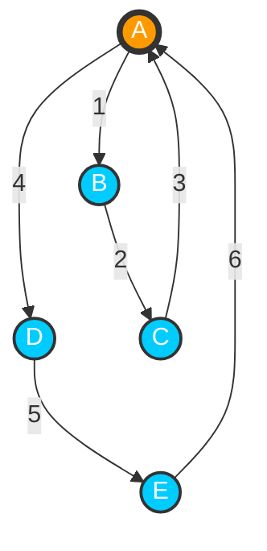

[[TOC]]

## 题目解析

这是一道结合了**图论（欧拉回路/欧拉路径）**和**位运算（异或 XOR）**性质的经典算法题。以下是题目的详细解析。

### 题目核心分析

1. 问题转化

题目要求“恰好经过每条河流一次”，这正是图论中**欧拉路径（Eulerian Path）**的定义。

- 整个行程构成一个节点序列 $P_0 \to P_1 \to \dots \to P_t$。
- 我们需要计算路径上所有节点权值的异或和 $a_{P_0} \oplus a_{P_1} \oplus \dots \oplus a_{P_t}$，并使其最大化。
- 欧拉路径/回路存在的充要条件

对于无向图，存在欧拉路径或回路的条件如下：

1. **连通性**：所有度数大于 0 的节点必须属于同一个连通分量（即所有边必须连通）。
2. **度数限制**：
   - **欧拉回路（起点终点相同）**：所有节点的度数都必须是**偶数**。
   - **欧拉路径（起点终点不同）**：恰好有 **2 个**节点的度数为**奇数**（一个是起点，一个是终点），其余节点度数全为偶数。
   - **其他情况**：不存在满足条件的路径，输出 "Impossible"。

------

### 异或和的计算推导

这是本题最巧妙的地方。直接模拟路径寻找最大值太慢，我们需要利用异或的性质：$x \oplus x = 0$。我们需要确定每个节点的值在最终算式中出现了奇数次还是偶数次。

**节点在路径中出现的次数与度数的关系：**

对于路径中的任意中间节点 $v$（非起点、非终点），每次“进入”该节点必然会“离开”该节点。这意味着每经过它一次，就会消耗它的 2 个度数。

- 如果一个节点度数为 $deg[v]$，它在路径中间被经过了 $deg[v] / 2$ 次（整除）。
- 如果 $deg[v] / 2$ 是偶数，那么 $a_v$ 异或偶数次等于 0（抵消了）。
- 如果 $deg[v] / 2$ 是奇数，那么 $a_v$ 异或奇数次等于 $a_v$（保留）。

特殊情况：起点和终点

起点和终点在序列中会多出现一次（起点的“出发”不消耗“进入”度数，终点的“停止”不消耗“离开”度数）。

- **实际贡献次数** = $(deg[v] / 2) + (\text{如果v是起点或终点则+1，否则+0})$。

我们定义一个基础异或和 (Base XOR)：

$$ans = \bigoplus_{i=1}^{N} ( \text{如果 } (deg[i]/2) \text{ 是奇数，则异或 } a_i )$$

接下来分两种情况讨论：

#### 情况 1：欧拉回路（所有点度数为偶数）

- 此时起点和终点是同一个点，设为 $S$。
- 对于 $S$，它的贡献次数变成了 $(deg[S] / 2) + 1$。
- 相较于基础异或和，只有起点 $S$ 的奇偶性发生了翻转（多异或了一次）。
- **最终结果**：$ans \oplus a_S$。
- **贪心策略**：因为是回路，我们可以从任意一个点出发。为了让结果最大，我们遍历图中所有点，计算 $ans \oplus a_i$，取最大值即可。

#### 情况 2：欧拉路径（恰好 2 个奇度数点）

- 设这两个奇度数点为 $U$和 $V$。路径必须从其中一个开始，到另一个结束。
- 对于起点 $U$，贡献次数为 $(deg[U] / 2) + 1$（翻转）。
- 对于终点 $V$，贡献次数为 $(deg[V] / 2) + 1$（翻转）。
- **最终结果**：$ans \oplus a_U \oplus a_V$。
- **策略**：路径端点固定，结果唯一。

------

### 解题步骤总结

1. **连通性检查**：
   - 使用**并查集 (DSU)**。遍历所有边，合并集合。
   - 统计有多少个并查集根节点（只统计度数 > 0 的节点）。如果根节点数量 > 1，说明图不连通，输出 "Impossible"。
2. **度数统计**：
   - 统计每个节点的度数 $deg[i]$。
   - 统计度数为奇数的节点个数 $cnt$。
3. **计算基础异或和**：
   - 遍历所有节点 $i$，如果 `(deg[i] / 2) % 2 == 1`，则 `ans ^= a[i]`。
4. **分类输出**：
   - **如果 cnt == 0** (欧拉回路)：遍历所有节点 $i$，求 `max(ans ^ a[i])`。
   - **如果 cnt == 2** (欧拉路径)：找到两个奇度数点 $u, v$，输出 `ans ^ a[u] ^ a[v]`。
   - **其他情况**：输出 "Impossible"。

### 复杂度分析

- **时间复杂度**：$O(N + M)$。并查集和度数统计都是线性的。
- **空间复杂度**：$O(N)$，用于存储并查集和度数数组。

## 疑问

>  这个题目 :旅行的幸运数字 , 既然每个点经过的次数是固定的, 那么这个旅行的幸运数字 最终的结果也是固定的,对吗?

这是一个非常好的切入点！你的直觉对了一半。

答案是：**不完全对。结果是否固定，取决于图是“欧拉路径”还是“欧拉回路”。**

我们来拆解一下为什么：

### 1. 为什么你会觉得是“固定的”？

你的逻辑是：

> 每个点的度数是确定的 $\rightarrow$ 每个点被经过的次数是确定的 $\rightarrow$ 异或和应该是确定的。

对于路径中间的点，这个逻辑是完全正确的。

如果一个点 $u$ 作为中间点被经过，它一定是有进有出，贡献度数 2。所以它被“穿过”的次数固定是 $deg[u] / 2$。

但是，变数在于“起点”和“终点”。

起点和终点在异或和中的计算方式，和中间点不一样（因为起点只有出没有进，终点只有进没有出，或者说它们在序列的端点，少了一次抵消）。

------

### 2. 分情况讨论

#### 情况 A：欧拉路径 (存在 2 个奇数度点)

- **固定吗？** **是固定的。**

- 原因：

  在欧拉路径中，起点和终点是锁死的。

  必须是从一个奇数度点 $U$ 出发，到另一个奇数度点 $V$ 结束。你不能选择从偶数度点出发，否则走不完。

- 公式：

  

  $$Result = Base\_XOR \oplus a_U \oplus a_V$$

  

  这里 $Base\_XOR$ 是固定的，$U$ 和 $V$ 也是唯一的。所以结果唯一。

#### 情况 B：欧拉回路 (所有点都是偶数度)

- **固定吗？** **不是固定的！**

- 原因：

  在欧拉回路中，任何一个有度数的点都可以作为起点（也是终点）。

  虽然是个圈，但你从 $A$ 点断开拉成一条线，和从 $B$ 点断开拉成一条线，产生的序列头尾是不一样的。

- 数学解释：

  回路意味着起点 $S$ = 终点 $S$。

  这个点 $S$ 在路径中作为“端点”出现，它的异或贡献会比它作为“纯中间点”多一次（或者说奇偶性翻转）。

  公式：

  

  $$Result = Base\_XOR \oplus a_S$$

  

  这里的 $S$ 可以是图中任意一个点。

  如果 $a_1 = 100, a_2 = 5$，那么：

  - 选 1 号点出发：结果是 $Base \oplus 100$

  - 选 2 号点出发：结果是 $Base \oplus 5$

    这显然不一样。

### 3. 结论

题目为什么要问“最大”幸运数字？

- 如果是**欧拉路径**情况，其实没得选，算出来是多少就是多少。
- 正因为有**欧拉回路**的情况，我们可以**策略性地选择**一个权值 $a_i$ 最大的（或者能让异或结果最大的）点作为起点，从而改变最终的结果。

一句话总结：

中间过程的“路费”是固定的，但**“出发费”和“结束费”**取决于你从哪里上车。如果是回路，我们可以挑一个最划算的站上车。

## 代码 

@include-code(./1.cpp, cpp)

