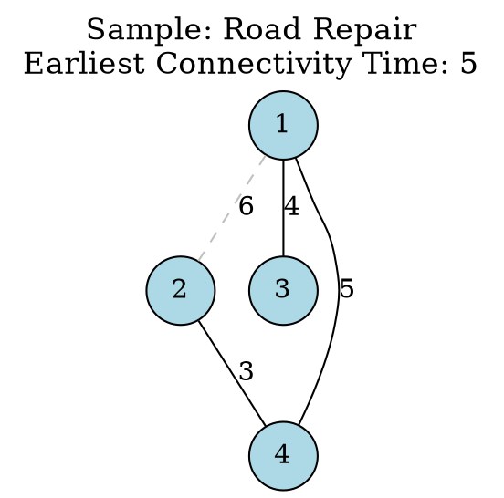

[[TOC]]

## 样例解释

### 解题思路

这个问题可以抽象为：给定一个无向图，每条边有一个修复时间（权重），求最小的时刻 \( t \)，使得所有修复时间 \(\leq t\) 的边能够使图连通。本质上就是找最小生成树中的最大边权（因为要使整个图连通，需要至少一棵生成树，而最早连通时间就是这棵生成树中最后修复的那条边的时间）。我们可以使用并查集，并按照修复时间从小到大依次加入边，直到所有村庄连通。最后加入的边的时间即为答案；如果所有边加入后仍不连通，则输出 \(-1\)。

对于样例输入：
```
4 4
1 2 6
1 3 4
1 4 5
4 2 3
```
边按修复时间排序后为：\((4,2,3)\)、\((1,3,4)\)、\((1,4,5)\)、\((1,2,6)\)。依次加入，当加入 \((1,4,5)\) 后所有村庄连通，因此答案为 \(5\)。

### 样例图形表示

下面的 Graphviz 代码绘制了样例对应的无向图。图中：
- 节点表示村庄（编号 1~4）。
- 边表示公路，边上的标签为修复时间。
- **实线**表示在时间 5 或之前已经修复的公路（即修复时间 \(\leq 5\)），这些边使得所有村庄在时间 5 连通。
- **虚线**表示在时间 5 之后才修复的公路（修复时间 \(> 5\)）。
- 图标题指明了最早连通时间为 5。



## 代码 

@include-code(./1.cpp, cpp)

