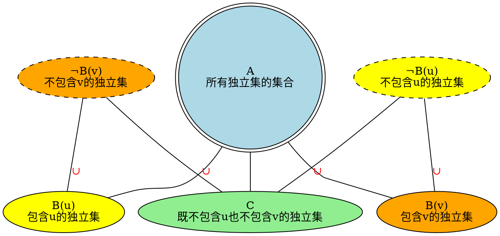
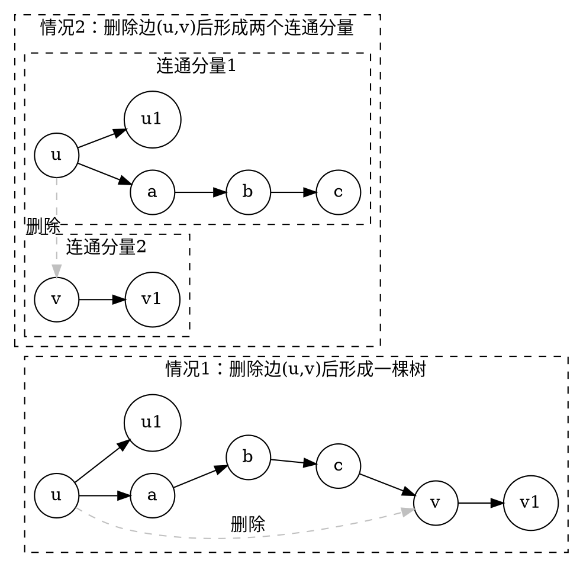
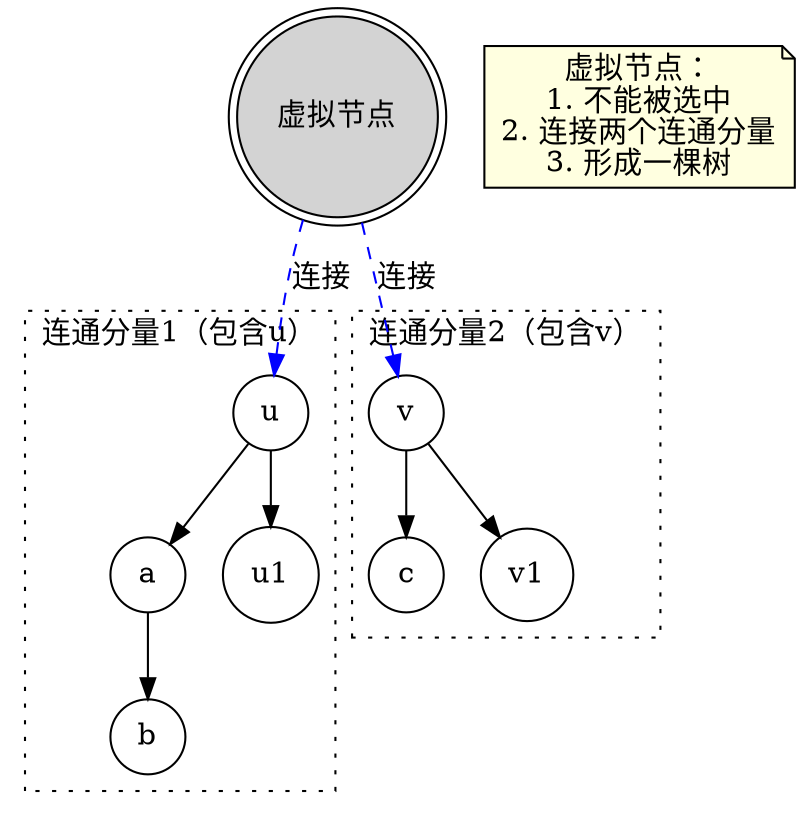
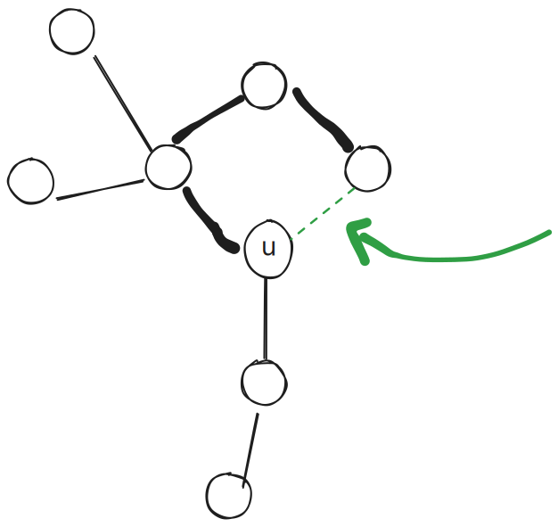

[[TOC]]

## 题目解析

> 基环树上的最大独立集问题 

> 这个题目和 [[problem : luogu,P2607]] 差不多

这个题目的难点不再于代码, 而是人类的大脑不擅长同时思考思考太多的东西(图上的点),现在我来带你一步一步思考:

1. 取环上的任意一条边 $(u,v)$,  显然最最终的答案里面, $u,v$ 两个点不能同时出现
2. 设第 $i$ 合法的 独立集合为 $d_i$
3. 显然 我们可以把所有的独立集组成的集合$A = \{d_1,d_2,\cdots , d_n\}$, 分成,不重不漏的三个集合
   1. $B(u) =\{ d_i | u \in d_i \}$ 含有 $u$ 的独立集 组成的集合
   2. $B(v) = \{d_i | v \in d_i \}$ 含有 $v $ 的独立集 组成的集合
   3. $C = \{d_i | v \notin d_i \land u \notin d_i \}$

4. 显然 $A = B(u) \cup B(v) \cup C$ (我觉得整个题目的核心就在这里!!!,理解这个就能理解整个题目)
5. 进一步的,可以想到(为了减小写代码的量), 根据补集的思想
   1. $\overline {B(u)} = B(v) \cup C = \{d_i | u \notin d_i \}$ ,表示 不含有 $u$ 的集合
   2. $\overline {B(v)} = B(u) \cup C= \{d_i | v \notin d_i \}$,表示 不含有 $v$ 的集合

那么不就得到了 : $A = \overline{B(u)} \cup \overline{B(v)}$

那么 $\max (A) = \max( \max(\overline{B(u)}) ,\max(\overline{B(u)}))$

哪怎么求 $\max(\overline{B(u)})$ 呢? 显然这表示 不选 $u$ 的情况,

可以想到如果 $u$ 删除,那么

1. 变成一个树 , 直接树上DP

2. 图断可能开成 两个连通分量: 

下面的图有点问题: 不是删除边,是删除点
   

这个时候,可以虚拟的点,把两个部分,连接起来,形成一颗树,

这个虚拟的点不能被选中, 那么就是求$dp[u][0]$

> 本质: 最值集合拆分

## 怎么题目虚拟点 ?

最简单的方式,就是删除点$u$在环上的一条边: 这样体现出来的虚拟的思想

## 代码 

@include-code(./1.cpp, cpp)

