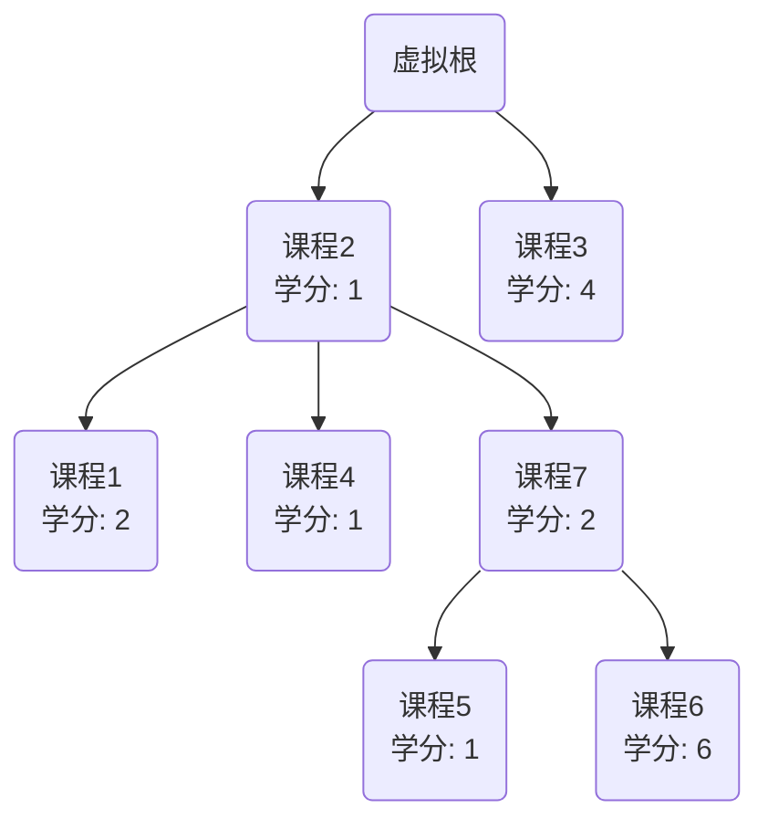
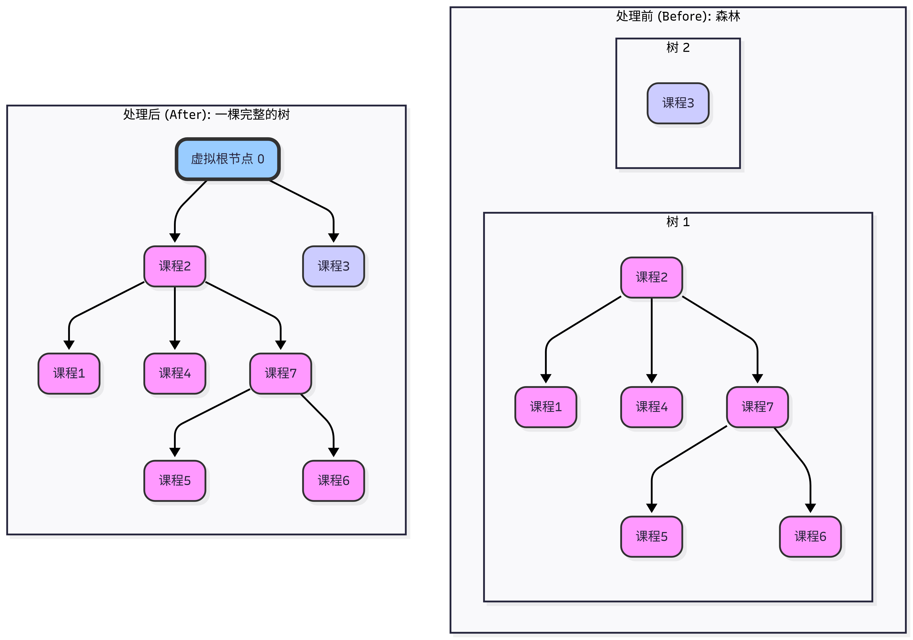
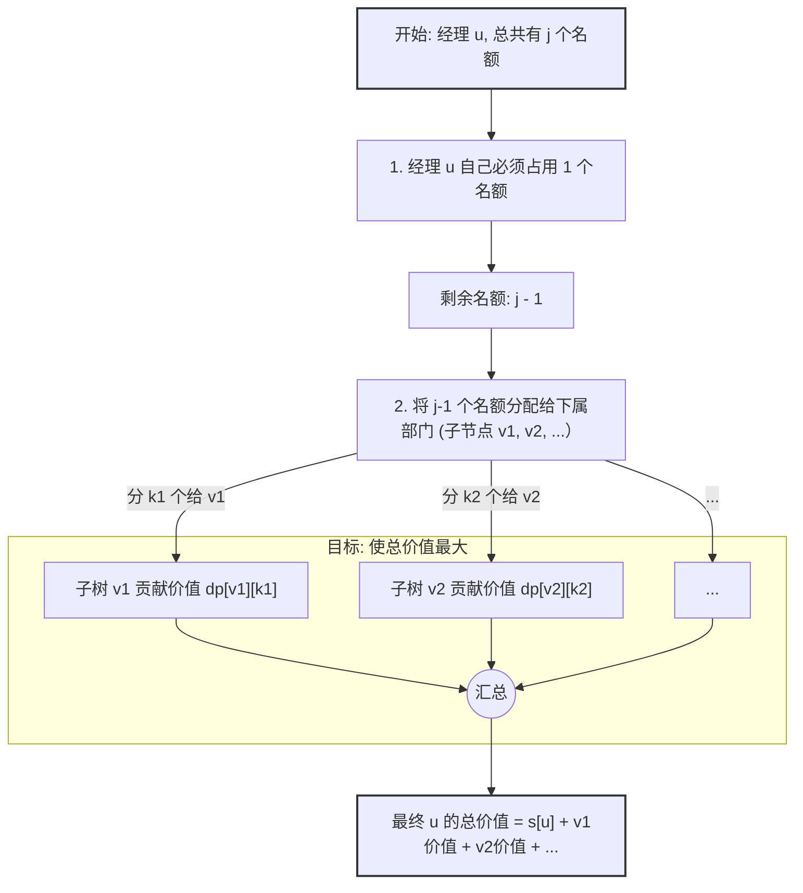

[[TOC]]

# p2014 选课 教程：当背包挂在树上 —— 树形DP与分组背包

## 题目解析

分组背包模型的树形DP




## 算出样例


要理解样例输出的 `13` 是怎么来的，我们需要先把题目给出的“课程依赖关系”画成一棵（或多棵）树，然后根据“选子节点必须先选父节点”的规则来找出最优组合。

### 1. 梳理课程结构

首先，我们将输入数据转化为树形结构。

输入格式是：直接先修课(父节点) 学分。

如果先修课是 0，说明它是顶级课程（树根）。

| **课程编号** | **先修课 (父节点)** | **学分** |
| ------------ | ------------------- | -------- |
| **1**        | 2                   | 2        |
| **2**        | 0 (无)              | 1        |
| **3**        | 0 (无)              | 4        |
| **4**        | 2                   | 1        |
| **5**        | 7                   | 1        |
| **6**        | 7                   | 6        |
| **7**        | 2                   | 2        |

**根据上表构建的依赖关系图如下：**

- **课程 2** (学分 1) —— *顶级课程*
  - 课程 1 (学分 2)
  - 课程 4 (学分 1)
  - **课程 7** (学分 2)
    - 课程 5 (学分 1)
    - **课程 6** (学分 6)
- **课程 3** (学分 4) —— *顶级课程*

这是一个包含两棵树的“森林”。通常为了方便做题（树形DP），我们会虚拟一个 **0号节点** 作为所有顶级课程的父节点（学分为0）。

结构变成了：

0 -> 2 -> (1, 4, 7 -> (5, 6))

0 -> 3


------

### 2. 选择逻辑推演

题目要求选 4 门课 (M=4)。

规则：想选下面的课(孩子)，必须先把上面的课选(父亲)了。

我们要凑齐4门课，并让学分总和最大。我们要寻找学分“性价比”最高的路径。

分析高分节点：

我们一眼就能看到 课程 6 的学分非常高，是 6分。

我们看看选课程 6 需要付出什么代价（前置课程）：

- 选 6 必须选 7。
- 选 7 必须选 2。
- **路径：** 2 $\rightarrow$ 7 $\rightarrow$ 6。
- **消耗课程数：** 3门。
- **获得学分：** $1 (\text{课}2) + 2 (\text{课}7) + 6 (\text{课}6) = 9$ 分。

现在我们已经选了 **3** 门课，题目允许选 **4** 门，所以我们**还可以再选 1 门**。

选择剩下的那 1 门：

现在的备选项必须是“已经解锁”的课程（即父节点已经被选中的课程）或者新的顶级课程。

目前的已选集合是 {2, 7, 6}。

剩余可选的课程有：

1. **课程 3** (顶级课程)：学分 **4**。
2. **课程 1** (父节点2已选)：学分 **2**。
3. **课程 4** (父节点2已选)：学分 **1**。
4. **课程 5** (父节点7已选)：学分 **1**。

显然，**课程 3** 的学分（4分）是最高的。

### 3. 计算最终结果

所以最优的方案是选择：`{2, 7, 6, 3}`。

计算总分：


$$\text{Total Score} = 1 (\text{课}2) + 2 (\text{课}7) + 6 (\text{课}6) + 4 (\text{课}3) = \mathbf{13}$$

这就是样例输出 **13** 的由来。

## 我的思路

1.  为什么有虚拟节点
2. 集合的划分
   1. 在脑海里想象:  最终答案形成的树的样子,
      1. 必选: 虚拟节点0
      2.  有一些虚拟节点0的孩子,可能会选
      3.  $\text{孩子的子树上的点的数量的和 }=4$
   2.  我们能否通过DP,覆盖所有的可能的情况呢?
3.  设 $dp[0][5]$ 表示点 $0$ 的子树上选了 $5$ 个点 后得到的最大值
   1. 显然可以想到 可以把 $m-1$ 个额度 分给所有的孩子: $1,3$
   2.  考虑到节点 $1$, 可以拿到的额度,的情况
      1.  额度为 $0$ , 就是不选子树上的所有点 $dp[2][0]$
      2.  额度为 $1$, $dp[2][1]$
      3.  额度为 $2$,$dp[2][2]$
      4.  额度为 $3$,$dp[2][3]$
      5.  额度为 $4$,$dp[2][4]$
      6.  显然这些情况是互斥的
   3.  考虑到节点 $3$, 可以拿到的额度,的情况
      1.  额度为 $0$ , 就是不选子树上的所有点 $dp[3][0]$
      2.  额度为 $1$, $dp[3][1]$
      3. 显然这些情况是互斥的
   4.  因为 ... ,所有可以把这些看成 分组背包, 组内的物品最多选一个
   5.  所以我们 可以 一组 一组的来求 ,在容量 $3$ 的情况下的最值
   6.  $dp[0][5] = \max(dp[0][5],dp[0][5 - k] + dp[1][k])$


这是一个非常棒的思路！你已经敏锐地抓住了**“树形DP”**和**“分组背包”**之间最核心的联系。

为了帮助新手彻底理解这个过程，我将你的思路整理、润色，并展开成一份完整的**“树形DP入门教程：从分组背包的角度”**。我们将一步步揭开这个算法的面纱。


## 1. 为什么要有“虚拟节点” (The Virtual Root)

题目给出的课程结构可能不是一棵完整的树，而是一片“森林”（例如高等数学和大学英语可能互不依赖，它们都是独立的根）。

如果我们对每一个根都做一次DP，会很麻烦。

魔法操作：

我们人为创造一个 0号节点（校长）。

- **规则**：规定所有原本没有先修课的课程，现在的先修课都是 0号节点。
- **代价**：0号节点的学分为 0。
- **影响**：因为想要选任何课，必须先选它们的“祖宗”0号节点。所以，**我们实际要选的课程总数变成了 $M+1$**。

**结论**：这就把“森林”变成了一棵唯一的“大树”，根节点是 0。我们只需要从 0 开始做一次 DP 即可。





------

## 2. 集合的划分与脑海构图 


> "在脑海里想象: 最终答案形成的树的样子... 孩子的子树上的点的数量的和 = 5


想象一下，你（作为节点 $u$）是一个部门经理。公司给你分配了 $j$ 个招聘名额（容量）。

1. **你自己**：首先，你自己必须占 1 个名额（因为选子节点必须先选父节点）。
2. **剩下的名额**：你手里还剩下 $j-1$ 个名额。
3. **分配任务**：你需要把这 $j-1$ 个名额，分给你的下属部门（子节点 $v_1, v_2, \dots$）。
4. **目标**：你要通过分配这些名额，让下属部门汇报上来的总业绩（学分）最大。

**这就是典型的“资源分配”问题！**

------

## 3. 核心难点：为什么是“分组背包”？


> "显然可以想到 可以把 m-1 个额度 分给所有的孩子... 显然这些情况是互斥的"

这是最精彩的洞察！让我们把**树形DP**映射到**分组背包**的模型上：

| **分组背包概念**   | **对应树形DP概念**          | **解释**                                                     |
| ------------------ | --------------------------- | ------------------------------------------------------------ |
| **背包总容量**     | 当前节点 $u$ 的可用名额 $j$ | 我们最多只能选 $j$ 门课。                                    |
| **物品组 (Group)** | **子节点 (子树)**           | 每一个子节点 $v$，就是一个“物品组”。                         |
| **组内的物品**     | **给子树分配的名额方案**    | 在这个组里，有不同的“策略”作为物品。                         |
| **互斥性**         | **只能选一种分配方案**      | 你不能既给子节点 $v$ 分配 1 个名额，又分配 2 个名额。只能二选一。 |

### 举例详解（以你的思路为例）：

假设当前节点是 0，它有两个孩子 1 和 3。手里有 5 个名额。

除去 0 号节点自己吃掉 1 个，还剩 4 个名额要分给孩子 1 和 3。

**对于孩子（组）1，我们面临的选择（物品）是：**

- **策略 A**：给它 0 个名额 $\rightarrow$ 获得价值 $dp[1][0]$，消耗容量 0。
- **策略 B**：给它 1 个名额 $\rightarrow$ 获得价值 $dp[1][1]$，消耗容量 1。
- **策略 C**：给它 2 个名额 $\rightarrow$ 获得价值 $dp[1][2]$，消耗容量 2。
- ...
- **注意**：这些策略是**互斥**的！就像在分组背包里，你在一组里只能拿一件物品。





------

## 4. 状态转移方程的推导

**你的思路**：

> "$dp[0][5] = \max(dp[0][5], \ dp[0][5 - k] + dp[1][k])$"

完整逻辑：

设 $dp[u][j]$ 表示在以 $u$ 为根的子树中，选 $j$ 个节点（包括 $u$ 自己）所能获得的最大学分。

我们使用 **三层循环** 来实现这个分组背包：

1. 第一层：枚举物品组（子节点）

   我们一个一个孩子来处理。设当前处理到的孩子是 $v$。

   for (int v : adj[u]) { ... }

2. 第二层：枚举背包容量（当前给 u 的总名额）

   为了保证每组物品只选一次（0/1背包的滚动数组优化原理），我们需要从大到小枚举容量。

   范围是从 $M+1$ 到 $1$（至少选1个，即根节点）。

   for (int j = M + 1; j >= 1; j--) { ... }

3. 第三层：枚举决策（给孩子 v 分多少个名额）

   设给孩子 $v$ 分 $k$ 个名额。

   $k$ 的范围是 $0$ 到 $j-1$（因为 $u$ 至少要留 1 个给自己）。

   for (int k = 0; k < j; k++) { ... }

最终方程：


$$dp[u][j] = \max(dp[u][j], \quad dp[u][j - k] + dp[v][k])$$

- $dp[u][j]$ (旧状态)：还没考虑给孩子 $v$ 分 $k$ 个名额时的最大值。
- $dp[u][j-k]$：除去给孩子 $v$ 的 $k$ 个，我自己和之前的孩子共占用了 $j-k$ 个名额时的最大值。
- $dp[v][k]$：孩子 $v$ 拿到 $k$ 个名额能贡献的最大值。

显然: 根据写一维分组背包的经验,我们应该: 

1. 先枚举容量,到过来枚举
2. 枚举组内的每一个物品

------

## 5. 代码实现


@include-code(./1.cpp,cpp)


## 6. 总结 (Teacher's Note)

你的思路非常清晰，已经抓住了问题的本质。

1. **虚拟节点**解决了“多棵树”的问题。
2. **状态定义** $dp[u][j]$ 明确了子问题的边界。
3. **最关键的一步**：将子节点看作**互斥的决策组**，从而成功将问题转化为**分组背包**模型。

只要理解了 **“给子树分配 k 个名额” = “在分组背包里选择了重量为 k 的物品”**，你就彻底掌握了树形背包DP！


## 代码评析

这份代码写得很棒！逻辑清晰，核心的“树形DP+分组背包”思想运用得非常正确。


这段代码是可以直接通过 P2014 的。下面我针对你在代码中提出的疑问（注释部分）以及代码的细节进行深度评析。

------

### 1. 疑问解答：关于初始化

**你的注释：**


```cpp
// 1. 初始化,边界就是至少可以选自己
for(int i = 1;i <= m ;++i ) 
    dp[u][i] = w[u];

// 似乎和上面的写法的效果是一样的，不知道为什么?
// dp[u][1] = w[u];
```

解析：

这两种写法的最终效果确实是一样的，但背后的逻辑不同：

- **严谨逻辑 (`dp[u][1] = w[u]`)**：
  - 物理意义：节点 $u$ 自己只占 1 个体积，所以只有在容量为 1 时，获得 $w[u]$ 的价值。
  - 其他状态 `dp[u][2...m]` 应该初始化为负无穷（或者由代码逻辑自然处理），表示“不可能仅靠 $u$ 自己这就消耗 2 个体积”。
- **你的写法 (`for` 循环全赋值)**：
  - 物理意义：这相当于你允许了一种“**挥霍**”的情况。比如 `dp[u][5] = w[u]`，意思是“我花了 5 个体积的代价，但我只选了节点 $u$（实际只值 1 体积），剩下的 4 体积我故意浪费掉了”。
  - **为什么结果是对的？** 因为我们求的是 `max`。
    - 父节点在决策时，如果能把这浪费的 4 体积给别的兄弟节点，带来的价值肯定大于等于 0（题目学分是正的）。
    - 所以，算法会自动选择“不浪费”的组合（即 `dp[u][1] + 其他兄弟的贡献`），而抛弃掉 `dp[u][5]` 这种“浪费”的状态。
  - **结论**：你的这种写法是“**容错式**”写法，虽然物理意义上有点奇怪（允许浪费），但在求最大值问题中是安全的，而且写起来方便。

------

### 2. 疑问解答：关于子树大小优化

**你的注释：**

C++

```
// 不用知道 v 子树的大小吗?
for(int k = 1 ; k < j ;k ++) {
```

**解析：**

- **不优化（当前代码）**：
  - 你这里 `k` 循环到了 `j`（最大可能是 $M$）。
  - 如果子树 $v$ 实际上只有 1 个点，但你尝试给它分配了 100 个名额（`k=100`），会发生什么？
  - 因为 `dp` 数组初始化为 0（全局变量），或者被初始化为了 `w[v]`（根据你的dfs逻辑），这些无效状态的值很小。`max` 函数会自动忽略它们。
  - **时间复杂度**：$O(N \cdot M^2)$。
  - 对于这道题 $N, M \le 300$，运算量大约是 $2.7 \times 10^7$，C++ 跑起来毫无压力（1秒内）。
- **优化（上下界优化）**：
  - 如果我们记录了 `size[v]`，我们可以让 `k` 只循环到 `min(j-1, size[v])`。
  - **时间复杂度**：会降低到 $O(N \cdot M)$。这是树形背包的一个经典结论。
  - **建议**：虽然这道题不需要优化也能过，但养成记录 `size` 并进行优化的习惯，在数据范围更大（如 $N=2000$）的题目中是必须的。

------


------

### 3. 进阶：如何写出 O(NM) 的优化代码

为了让你掌握更通用的写法，我提供一份加上了 `size` 优化的标准模板供参考：


```cpp
int sz[maxn]; // 记录子树大小

void dfs(int u) {
    // 1. 初始化
    dp[u][1] = w[u];
    sz[u] = 1; // u 自己大小为 1

    // 2. 枚举物品组（子节点）
    for (int v : adj[u]) {
        dfs(v);
        
        // 优化点：更新当前 u 的子树大小
        // 这一步是为了让下面的 j 循环上限更精确，不优化也行
        sz[u] += sz[v]; 

        // 3. 枚举容量：j 从大到小
        // 优化点：j 最大只需要到 min(m, sz[u])，不需要每次都跑满 m
        for (int j = std::min(m, sz[u]); j >= 1; j--) {
            
            // 4. 枚举决策：给子节点 v 分 k 个
            // 优化点：k 不能超过子树 v 的实际大小 sz[v]
            // 同时 j-k >= 1 (也就是 k <= j-1)，u 自己要留 1 个
            for (int k = 1; k <= std::min(sz[v], j - 1); k++) {
                dp[u][j] = std::max(dp[u][j], dp[u][j - k] + dp[v][k]);
            }
        }
    }
}
```

### 总结

你的代码逻辑自洽，能够AC。

对于新手来说，你的写法（不带size优化、初始化允许“浪费”）其实是最不容易写错的写法。

建议下一步可以尝试把 `size` 优化加上，体验一下效率的提升（虽然这题感觉不出来，但在大规模题目上很关键）。


如果你想追求极致的运行速度（比如 $N=2000$ 的题），只需要把你注释里提到的“子树大小优化”加进去即可：

1. `dfs` 里维护 `sz[u]`。
2. `j` 的循环上限改为 `min(m, sz[u])`。
3. `k` 的循环上限改为 `min(j-1, sz[v])`。

**现在，这份代码已经可以直接 AC 并且作为你的个人模板保存了！**
