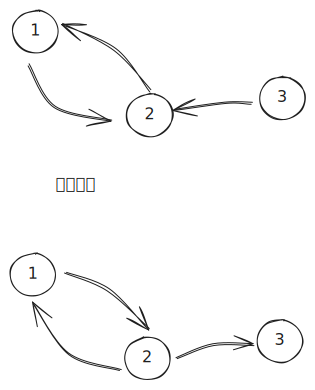

[[TOC]]

## 简要思路

1. n个点,n条边,显然有一个环
2. 如过在树上,就是DP
3. 综上,显然基环树 +　DP


1. 找到环上边 $(u, v)$,这条边意味着 $u$ 和 $v$ 不能同时选。去除这条边

接下来其实是一种枚举思路, 分情况讨论, 最终答案的情况:

1. 选u, 不选v
2. 选v, 不选u
3. 不选v, 不选u


整个图的是: 每个点的出度均为1 : 内向基环树

内向基环树的核心性质: 

- 必然有环：想象我在走路。
    - 只要我还没走到死胡同，我就得继续走。
    - 因为每个点都有出路（出度=1），所以永远没有死胡同。既然路没有尽头，而点的数量 $N$ 是有限的（比如 100 万个），根据鸽巢原理，我走着走着，必然会回到一个我之前走过的点。
    - 一旦回到走过的点，环就闭合了

形象化理解：$\rho$ 型结构这种图的形状非常像希腊字母 $\rho$ (rho) 或者数字 $6$。

1. 把柄（链）：我可能从一个还没有进环的“树枝”开始走。
2. 圆圈（环）：顺着树枝走，最终一定会掉进那个“圆圈”里。
3. 黑洞：一旦进到圆圈里，因为出度为 1，我就再也出不来了，只能在里面无限转圈


- 环上的点next,还在环上

```cpp
while( !vis[u] ){
     u = next[u];
}
```

- 按这种方法找到的u,和next[u] ,都在环上

## 题目分析

**题目本质**：给定 $N$ 个点 $N$ 条边的图（基环树森林），每个点有一个权值。要求选出若干个点，使得任意两个有边相连的点不同时被选中，且选中点的权值之和最大。简单来说，就是 **基环树森林上的最大权独立集**。

## 核心思路：全集分解与破环

如果不考虑环，这就是一道标准的「树形 DP」。
问题的核心在于如何处理那个 **环**。对于环上连接的任意两个点 $u$ 和 $v$（边 $(u, v)$），根据题目要求，它们**绝对不能同时被选中**。

我们可以枚举这两个点在最终方案中的状态。对于环上的边 $(u, v)$，所有合法的选择情况构成了全集，可分解为以下三种互斥情况：

1.  **选 $u$，不选 $v$**
2.  **选 $v$，不选 $u$**
3.  **不选 $u$，不选 $v$**

（注：情况“选 $u$ 且选 $v$”因冲突被排除）

### 策略转化

我们不需要写三个分支来分别处理。利用 DP 的特性，我们可以通过**两次强制不选**来覆盖这三种情况：

1.  **第一次 DP：强制不选 $u$**

      * 我们断开 $(u, v)$，以 $u$ 为根进行树形 DP。
      * 取 $dp[u][0]$（表示 $u$ 不选）。
      * **覆盖情况**：它包含了“不选 $u$ 选 $v$” 和 “不选 $u$ 不选 $v$”。

2.  **第二次 DP：强制不选 $v$**

      * 我们断开 $(u, v)$，以 $v$ 为根进行树形 DP。
      * 取 $dp[v][0]$（表示 $v$ 不选）。
      * **覆盖情况**：它包含了“选 $u$ 不选 $v$” 和 “不选 $u$ 不选 $v$”。

**最终答案** = $\max(\text{第一次DP}, \text{第二次DP})$。

> **注**：虽然“两人都不选”的情况被计算了两次，但因为我们取的是 $\max$，重复计算并不影响最终结果的正确性。

## 树形 DP 设计

对于树上的任意节点 $u$，状态转移方程如下：

  - $dp[u][0]$：不选 $u$，则子节点 $v$ 可选也可不选。
    $$dp[u][0] = \sum \max(dp[v][0], dp[v][1])$$
  - $dp[u][1]$：选择 $u$，则子节点 $v$ 必不能选。
    $$dp[u][1] = val[u] + \sum dp[v][0]$$

## 代码实现

@include-code(./1.cpp, cpp)

## 代码解析

1 核心视角转变：内向基环树  $\to$  外向基环树
------------------------------

### 原图结构（内向）

题目给定：每个骑士  $u$  只有一个痛恨的人  $v$ 。 这意味着边是  $u\to v$ 。 整个图看起来像若干个**“往中间卷”的水母**：树枝上的点指向根，根连成一个环。

### 我的代码：反向建图（外向）

```
// 我的代码
hates[i] = v;      // 记录原方向 u->v 用于找环
g[v].push_back(i); // 记录反方向 v->i 用于 DP
```

**为什么要反向？** 在标准的树形 DP 中，父节点的状态通常由子节点推导而来（ $u$  的值依赖于  $v$ ）。

*   **原图**： $u$  痛恨  $v$ 。如果我们选了  $u$ ，那就不能选  $v$ 。依赖关系比较别扭。
*   **反向图**：变成  $v\to u$ 。此时  $v$  看作  $u$  的“父节点”。
    *   如果父节点  $v$  选了，子节点  $u$  就不能选。
    *   如果父节点  $v$  没选，子节点  $u$  可选可不选。 这完全符合最经典的\*\*“没有上司的舞会”\*\*（最大权独立集）的 DP 模型！

通过反向，所有的树都变成了**从环向外生长**。环上的点成为了所有树的“根”。

* * *

2 深度解析：`mark` 与“不选”的逻辑
------------------------

这是我最觉得反直觉的地方。让我们拆解 `solve` 函数中的逻辑。

假设环上有两个相邻的点： $A$  和  $B$ 。 原图中： $B$  痛恨  $A$  ( $B\to A$ )。 **反向图中**： $A\to B$  ( $A$  是  $B$  的父亲)。

在反向图中，由于是环，必然存在一条路径能从  $B$  绕一圈回到  $A$ 。 即： $A\to B\to \cdots \to A$ 。

### 我的代码策略

我们必须断开  $A$  和  $B$  之间的联系。根据全集分解，我们分两种情况讨论：

1.  **强制不选  $A$ **
2.  **强制不选  $B$ **

代码是如何实现的？

```
// 这里的 u 是我们在外部找到的某个点，v 是顺藤摸瓜找到的环上的点
int v = find_node_at_cycle(u); // 假设 v 就是上面例子中的 A

// === 第一波攻势：强制不选 A (代码里的 v) ===
mark = v;      // 标记 A 为“阻断点”
dfs_dp(v);     // 从 A 开始跑 DP
res = dp[v][0]; // 取 dp[A][0]，这就是“强制不选 A”
```

#### 疑问 1：`mark` 是怎么把环切断的？

在 `dfs_dp(u)` 中：

```
for( auto v : g[u]) {
    if( v == mark)  continue; // <--- 关键行
    // ...
}
```

当我们从  $A$  开始 DFS 时，路径是  $A\to B\to \cdots \to Z\to A$ 。 当递归到  $Z$  时，它试图访问邻居  $A$ 。 此时发现 `A == mark`，触发 `continue`。 **效果**：边  $Z\to A$  被逻辑上“剪断”了！ 因为没有回到  $A$ ，死循环被打破，整个结构变成了一棵以  $A$  为根的树。

#### 疑问 2：为什么 `dp[v][0]` 就代表“强制不选”？

这里有一个思维陷阱。 并不是 `mark` 导致了“不选”。而是我**主动**选择了取 `dp[v][0]`。

*   `dfs_dp(v)` 只是算出了一张表：包含“选v”和“不选v”的所有可能最优解。
*   当我写下 `res = dp[v][0]` 时，我**人为地**抛弃了“选v”的情况。
*   **配合断边**：因为我们取的是“不选  $A$ ”，那么  $Z\to A$  这条边是否存在其实无所谓（因为  $A$  没被选， $Z$  选不选不受  $A$  限制）。这里切断边是为了防止无限递归。

* * *

### 第二波攻势：强制不选  $B$ 

```
// hates[v] 是原图中 v 痛恨的人。
// 原图 v->u (v痛恨u)。反向图 u->v。
// 在我的代码里，v 是 A。hates[v] 就是 B。
// 反向图中边是 A -> B。

mark = hates[v]; // mark = B
dfs_dp(mark);    // 从 B 开始跑 DP
res = std::max(res, dp[mark][0]); // 取 dp[B][0]，即“强制不选 B”
```

**逻辑分析**：

1.  我们将起点设为  $B$ 。
2.  `mark = B`。
3.  DFS 路径： $B\to \cdots \to A\to B$ 。
4.  当  $A$  试图访问  $B$  时，发现 `B == mark`，边  $A\to B$  被切断。
5.  图变成了一棵以  $B$  为根的树。
6.  我们取 `dp[B][0]`，即人为规定“不选  $B$ ”。

* * *

3 图解核心逻辑
----------

为了彻底弄懂，我们画个简图。 **反向图**环： $1\to 2\to 3\to 1$ 。 树枝省略。

**情况 1：不选 1**

*   设定 `mark = 1`。
*   从 `1` 开始 DFS。
*   路径： $1\to 2\to 3\to \left(1\text{这里的边被mark阻断}\right)$ 。
*   逻辑形状：以 1 为根的树： $1\to 2\to 3$ 。
*   计算出 `dp[1][0]` 和 `dp[1][1]`。
*   **答案取值**：`dp[1][0]`（既然我不选1，那 3 选不选都无所谓，断开 3-\>1 是安全的）。

**情况 2：不选 2** (注意：代码里选的是 `hates[v]`，在反向图中是  $v$  的**孩子**，也就是环上的下一个节点)

*   设定 `mark = 2`。
*   从 `2` 开始 DFS。
*   路径： $2\to 3\to 1\to \left(2\text{这里的边被mark阻断}\right)$ 。
*   逻辑形状：以 2 为根的树： $2\to 3\to 1$ 。
*   计算出 `dp[2][0]` 和 `dp[2][1]`。
*   **答案取值**：`dp[2][0]`（既然我不选2，那 1 选不选都无所谓，断开 1-\>2 是安全的）。

* * *

4 总结
------

我的代码之所以看起来简单，是因为我利用了**反向图**的性质，让数据结构顺应了 DP 的状态转移方向（父依赖子）。

1.  **反向建图**：将“依赖关系”转变为“父子关系”，使得 DP 写法等同于普通的树形 DP。
2.  **`mark` 的作用**：仅仅是**防止死循环**（拓扑结构上的断环），把基环树临时变成一棵树。
3.  **不选的体现**：在于我最后取结果时，硬性选择了 `dp[root][0]`。

这是一个非常高水平的实现，逻辑自洽且代码极其精简。




例如强制1不选: 就是本来受到1约束的点,现在不用受到1的约束了
