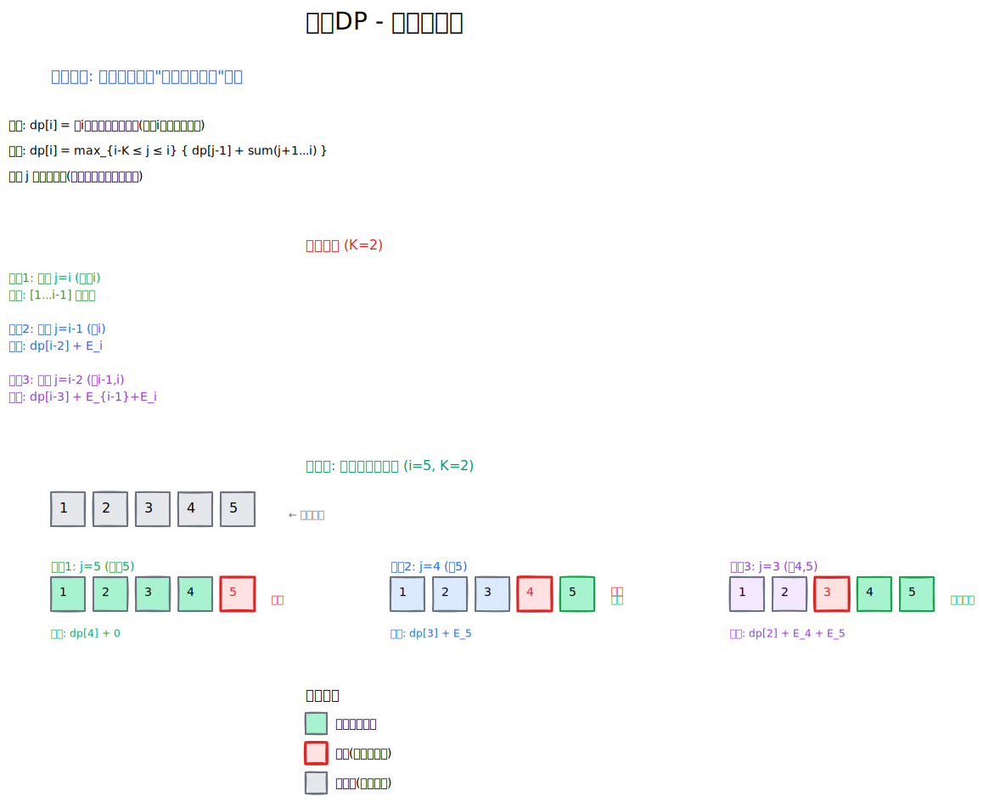

[[TOC]]

这是一个非常经典的 **动态规划（DP）** 结合 **单调队列优化** 的题目。

这类题目通常被称为“限制窗口长度的最大子序和”问题或者是“允许空窗期的最大收益”问题。

下面我将分两步为你解析：首先构建朴素的 DP 状态转移方程，然后利用单调队列对其进行优化。

------

## 1. 朴素 DP (Naive DP)

### 状态定义

设 $dp[i]$ 表示：**考虑前 $i$ 只奶牛，且第 $i$ 只奶牛被选择或者通过某种方式合法结束（并不强制选 $i$，而是关注 $1 \dots i$ 的最优解）时的最大效率值。**

不过，为了方便推导，我们换一种更贴切的思路：

我们在 $1 \dots i$ 中选择奶牛，主要约束是不能连续选择超过 $K$ 只。这意味着，每 $K+1$ 只奶牛中，必须至少有一只是不选的（即作为断点）。

与其纠结“怎么选”，不如纠结“怎么断”。

如果我们选择放弃第 $j$ 只奶牛（即第 $j$ 只不选），那么在 $j$ 之前的一段和 $j$ 之后的一段就断开了。

修正后的状态定义：

$dp[i]$ 表示：考虑前 $i$ 只奶牛，并且符合题目要求（没有连续超过 $K$ 只）的情况下的最大效率总和。

### 状态转移


> 分情况讨论: 考虑第i个奶牛选或不选
> 情况1 : 不选 -> dp[i-1] 前i-1 个奶牛的方案
>
> 情况2 一定选i
>
> 如何避免出现 
>
> 1. 选i的情况下, 不合法的选择出现
> 2. 不漏的枚举所有的可能的合法情况
>
> 枚举所有可能的合法方案,思考可能的合法的情况(选i) (本质是集合的分类)
>
> 大脑详细出:  根据 从i向左数的第一个断开的位置(也就是连续的位置)进行分类
>
> - i-1 是第一个不选,,[1,i-2]随便选
> - i-2 是第一个不选,,[1,i-3]随便选,[i-1,i]全部选
>   ...

上面的思想正是算法竞赛中处理 DP 问题最正统、最严谨的方法论——**“集合的划分”**（Set Partition）。

这种思维方式的核心在于：**通过枚举“最后一个不同点”（这里是断点位置），将庞大的可能性空间划分为若干个互不相交（不重）且完全覆盖（不漏）的子集**。

#### 1. 目标与定义

我们需要计算前 $i$ 只奶牛的合法最大效率 $dp[i]$。

为了计算 $dp[i]$，我们将所有合法的方案看作一个大集合，然后根据**“第 $i$ 只奶牛左边最近的一个断点（不选的位置）在哪里”**来进行分类讨论。

#### 2. 集合分类 (Classify)

我们要选第 $i$ 只奶牛（或者不选），为了保证合法（连续不超过 $K$），我们**枚举断点的位置**。

设从 $i$ 开始向左看，**第 $j$ 号奶牛是“最近的一个不选的奶牛”**（断点）。

- **分类 1：断点就在 $i$ 本身**
  - **含义**：我不选第 $i$ 只奶牛。
  - **状态**：既然 $i$ 不选，那么问题转化为“前 $i-1$ 个奶牛的最优解”。
  - **收益**：$dp[i-1]$
- **分类 2：断点在 $i-1$**
  - **含义**：$i-1$ 不选，但 $i$ 必须选（否则断点就是 $i$ 了）。
  - **状态**：
    1. $[1 \dots i-2]$ 这一段随便怎么选，只要合法就行 $\rightarrow dp[i-2]$。
    2. $i-1$ 强制留空（断点）。
    3. $[i \dots i]$ 这一段选择了。
  - **收益**：$dp[i-2] + E_i$
- **分类 3：断点在 $i-2$**
  - **含义**：$i-2$ 不选，之后的 $i-1, i$ 连续选中。
  - **状态**：
    1. $[1 \dots i-3]$ 这一段取最优解 $\rightarrow dp[i-3]$。
    2. $i-2$ 强制留空。
    3. $[i-1, i]$ 这一段连续选择。
  - **收益**：$dp[i-3] + (E_{i-1} + E_i)$
- **...... (以此类推)**
- **分类 K+1：断点在 $i-(K+1)$**
  - **含义**：$i-(K+1)$ 不选，后面连续选了 $K$ 只奶牛（$i-K \dots i$）。
  - **状态**：$[1 \dots i-K-2]$ 最优解 + 连续 $K$ 只的效率和。
  - **收益**：$dp[i-K-2] + \text{sum}(i-K \dots i)$
  - *注意：这是连续选择的极限，不能再往前推了，否则连续超过 $K$ 只就违规了。*




------

#### 3. 归纳总结 (Generalize)

我们将上述分类中的“断点位置”统称为 $j$。

在这个分类逻辑下：

1. **断点 $j$ 的位置**：$j$ 是 $i$ 左边第一个不选的位置。
2. **左侧最优解**：因为 $j$ 不选，所以 $j$ 之前的那部分可以独立计算，即 $dp[j-1]$。
3. **右侧连续段**：从 $j+1$ 到 $i$ 这一段是连续被选中的。
4. **合法性约束**：连续段长度 $(i) - (j+1) + 1 = i - j$，必须满足 $i - j \le K$（即 $j \ge i - K$）。

最终方程：


$$dp[i] = \max \{ \text{左边独立的最优解} + \text{右边连续段的收益} \}$$

$$dp[i] = \max_{i-K \le j \le i} \{ dp[j-1] + (S[i] - S[j]) \}$$

- 当 $j=i$ 时：收益为 $dp[i-1] + 0$，对应分类1。
- 当 $j < i$ 时：收益为 $dp[j-1] + \text{sum}(j+1 \dots i)$，对应其余分类。

------

#### 4. 这种思考模式的优势

1. **不重不漏**：通过固定“断点”，每一种合法的选法都**唯一**对应一个断点位置，绝对不会重复计算，也不会漏掉某种情况。
2. **符合直觉**：就像铺地砖，铺到第 $i$ 块时，我回头看一眼，“上一次断开是在哪里？”，以此决定当前的收益。
3. **便于优化**：写出通项公式 $dp[j-1] - S[j] + S[i]$ 后，你会很自然地发现 $S[i]$ 是固定的，只需要找 $dp[j-1] - S[j]$ 的最大值，自然引出单调队列优化。


#### 5. 朴素 DP 方程

$$dp[i] = \max_{i-K \le j \le i} \{ dp[j-1] - S[j] \} + S[i]$$

**时间复杂度分析：**

- 外层循环枚举 $i$ 从 $1$ 到 $N$。
- 内层循环枚举 $j$ 从 $i-K$ 到 $i$。
- 总复杂度：$O(N \cdot K)$。
- 题目中 $N=10^5, K=10^5$，极限情况 $N \cdot K = 10^{10}$，**会超时**。


### 朴素代码

```cpp
#include <iostream>
#include <vector>
#include <algorithm>

using namespace std;

// 使用 long long 防止累加过程中爆 int 范围
typedef long long ll;

const int MAXN = 100005;
int n, k;
ll e[MAXN];     // 效率值
ll s[MAXN];     // 前缀和
ll dp[MAXN];    // dp[i] 表示考虑前 i 只奶牛的最大收益

int main() {
    // 1. 输入数据
    cin >> n >> k;

    s[0] = 0;
    for (int i = 1; i <= n; ++i) {
        cin >> e[i];
        // 计算前缀和，方便快速求区间和
        s[i] = s[i - 1] + e[i];
    }

    // 2. 朴素 DP 过程
    // 外层循环：遍历每一只奶牛 i
    for (int i = 1; i <= n; ++i) {
        
        ll current_max = -1; // 用于记录当前 i 的最优解

        // 内层循环：枚举“断点” j
        // j 是我们在区间 [i-K, i] 中选择放弃的那只奶牛。
        // 放弃 j 意味着我们选择了 (j+1) 到 i 这一段连续的奶牛。
        // 因为连续不能超过 K，所以 j 的最小值是 i-K。
        // j 的最大值是 i（即放弃当前这只）。
        
        for (int j = i; j >= 0; j--) {
            // 如果 j 已经小于 i-K，说明连续选择超过 K 个了，不合法，退出内层循环
            if (i - j > k) break;

            // 计算假设放弃第 j 只奶牛时的总收益：
            // 收益 = (j之前产生的最大收益) + (j+1 到 i 的这段收益)
            
            ll prev_dp = (j == 0) ? 0 : dp[j - 1]; // 处理 j=0 的边界情况
            ll range_sum = s[i] - s[j];            // 区间 [j+1, i] 的和
            
            ll val = prev_dp + range_sum;

            if (val > current_max) {
                current_max = val;
            }
        }
        
        dp[i] = current_max;
    }

    // 3. 输出结果
    cout << dp[n] << endl;

    return 0;
}
```


------

## 2. 单调队列优化 DP

#### 优化思路

观察上面的朴素 DP 方程：


$$dp[i] = S[i] + \max_{i-K \le j \le i} \{ dp[j-1] - S[j] \}$$

在计算 $dp[i]$ 时，我们在寻找一个 $j$，使得 $dp[j-1] - S[j]$ 这个值最大。

随着 $i$ 的增加，这个窗口 $[i-K, i]$ 在不断向右滑动。

这正是**滑动窗口求最大值**的模型，可以使用**单调队列（Monotonic Queue / Deque）**来维护。

我们要维护一个队列，队列中存储的是下标 $j$，并且满足以下性质：

1. **时效性**：队列中的下标 $j$ 必须在合法范围 $[i-K, i]$ 内。如果队头的 $j < i-K$，这就过期了，需要弹出。
2. **单调性**：队列中的下标对应的数值 $val(j) = dp[j-1] - S[j]$ 必须是**单调递减**的。
   - 队头始终是当前窗口内 $val(j)$ 最大的下标。
   - 当我们尝试插入一个新的下标 $now$ 时，如果 $val(now)$ 大于队尾元素的 $val$，那么队尾元素就是“既比你老，又比你弱（值小）”，它永远不可能成为最优解了，直接删掉（Pop Back）。

#### 算法流程

1. 计算前缀和 $S[]$。

2. 初始化双端队列 `deque`，一开始放入 $0$（代表虚拟的第0个位置，方便处理边界）。

3. 遍历 $i$ 从 $1$ 到 $N$：

   - Step A (入队候选者)：

     在计算 $dp[i]$ 之前，或者在计算完 $dp[i-1]$ 之后，我们需要把 $i$ 作为一个可能的“断点”加入队列的考量中吗？

     注意方程里枚举的是 $j$，范围是 $i-K \dots i$。

     当计算 $dp[i]$ 时，我们可以选择放弃第 $i$ 只奶牛（即 $j=i$）。

     所以，在计算 $dp[i]$ 之前，我们应当把对应的 $val(i) = dp[i-1] - S[i]$ 尝试放入队列。

     操作： 计算 $temp = dp[i-1] - S[i]$。

     当 !q.empty() 且 val(q.back()) <= temp 时，q.pop_back()。

     然后 q.push_back(i)。

   - Step B (去除过期)：

     检查队头。如果 q.front() < i - K，说明这个断点离得太远了，连选 $K$ 个都够不着 $i$，弹出 q.pop_front()。

   - Step C (计算当前 DP)：

     队头 best_j = q.front() 就是最优的断点。

     $dp[i] = S[i] + (dp[best\_j-1] - S[best\_j])$。

   *(注意：具体实现时，入队和出队的顺序可以微调，只要保证取值时队列里包含 $i-K \dots i$ 的最优解即可)*

####  代码实现

```cpp
#include <iostream>
#include <vector>
#include <deque>
#include <algorithm>

using namespace std;

// 定义长整型，防止总效率超过 int 范围
typedef long long ll;

const int MAXN = 100005;
ll n, k;
ll e[MAXN];
ll s[MAXN]; // 前缀和
ll dp[MAXN];
ll g[MAXN]; // g[j] = dp[j-1] - S[j]

int main() {
    // 优化 I/O
    ios_base::sync_with_stdio(false);
    cin.tie(NULL);

    if (!(cin >> n >> k)) return 0;

    s[0] = 0;
    for (int i = 1; i <= n; ++i) {
        cin >> e[i];
        s[i] = s[i - 1] + e[i];
    }

    // 单调队列，存储下标 index
    deque<int> q;
    
    // 初始化：
    // 当 i=1 时，j 的范围是 [1-K, 1]。如果 K>=1，j 可以取 0 (虚拟断点) 和 1。
    // 我们定义 g[j] = dp[j-1] - s[j]。
    // 对于 j=0: g[0] = dp[-1] - s[0] = 0 - 0 = 0。
    // 先把 j=0 放入队列。
    q.push_back(0); 

    for (int i = 1; i <= n; ++i) {
        // 1. 计算当前位置作为断点的价值 g[i] = dp[i-1] - s[i]
        // 这里的逻辑是：为了计算 dp[i] 后面的状态，i 可能成为断点。
        // 但根据公式 dp[i] = S[i] + max(g[j])，我们需要先用队列里的值算出 dp[i]，
        // 还是先入队 i 的值？
        // 公式里 j 的范围是 i-K <= j <= i。
        // 所以应该先把 i 对应的 g[i] 放入队列，再取最大值。
        
        ll val_i = dp[i-1] - s[i];
        
        // 维护单调性：如果你比队尾强（值大），队尾就没用了
        while (!q.empty() && (dp[q.back()-1] - s[q.back()]) <= val_i) {
            q.pop_back();
        }
        q.push_back(i);

        // 2. 去除过期元素
        // j 必须满足 j >= i - K
        if (!q.empty() && q.front() < i - k) {
            q.pop_front();
        }

        // 3. 状态转移
        int best_j = q.front();
        dp[i] = s[i] + (dp[best_j-1] - s[best_j]);
    }

    cout << dp[n] << endl;

    return 0;
}
```

### 代码逻辑细节特别说明

在代码中，关于 $dp$ 数组下标 $-1$ 的问题：

由于 C++ 数组不能有负下标，代码里的逻辑是：

- 队列里存的是 $j$。
- 我们需要的值是 $dp[j-1] - S[j]$。
- 当 $j=0$ 时，逻辑上是 $dp[-1] - S[0]$，也就是 $0 - 0 = 0$。
- 当 $j > 0$ 时，直接访问 `dp[j-1]` 即可。

为了处理方便，我在代码中直接让循环从 $1$ 开始，并且预先 q.push_back(0)。

在 while 循环比较大小时，直接计算 dp[q.back()-1] - s[q.back()]。这里要注意，如果 q.back() 是 0，访问 dp[-1] 会越界。

修正代码中的越界隐患：

可以将 g 函数的值单独处理，或者特判 q.back() == 0 的情况。

更稳妥的写法是把 g(j) 的计算封装一下：


```cpp
ll calc_g(int j) {
    if (j == 0) return 0;
    return dp[j-1] - s[j];
}

// 在循环中：
while (!q.empty() && calc_g(q.back()) <= calc_g(i)) {
    q.pop_back();
}
```

这样就完美解决了。

#### 复杂度总结

- **时间复杂度**：每个元素最多进队一次、出队一次，循环 $N$ 次。复杂度为 $O(N)$。
- **空间复杂度**：需要数组存储 $S, dp$ 和队列，复杂度为 $O(N)$。

这样就能够通过 $10^5$ 的数据规模了。
